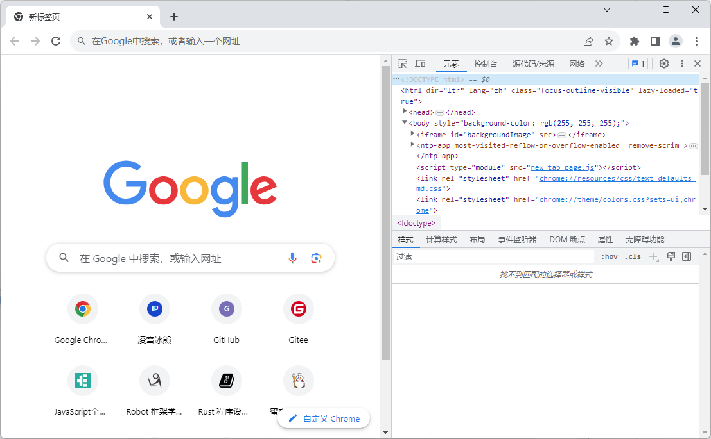
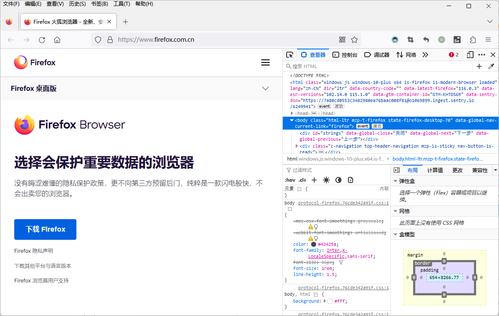
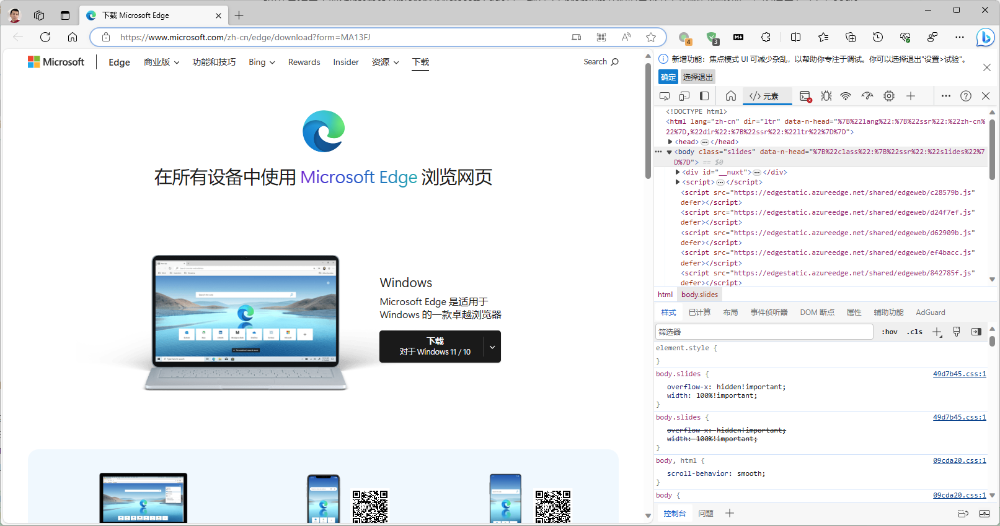
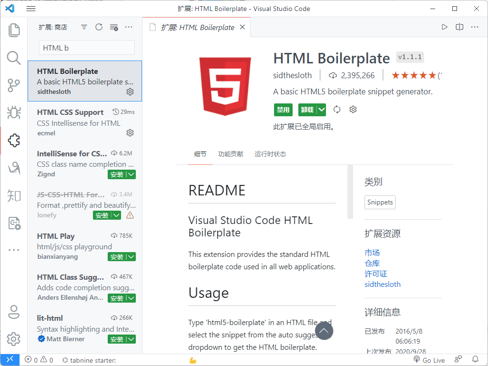
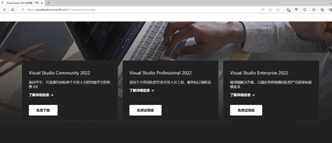
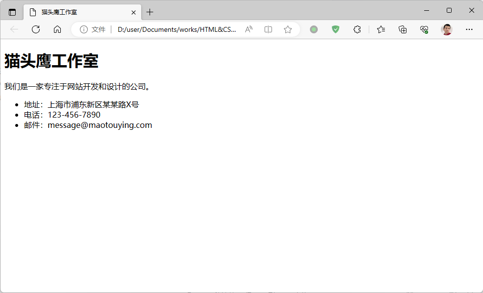
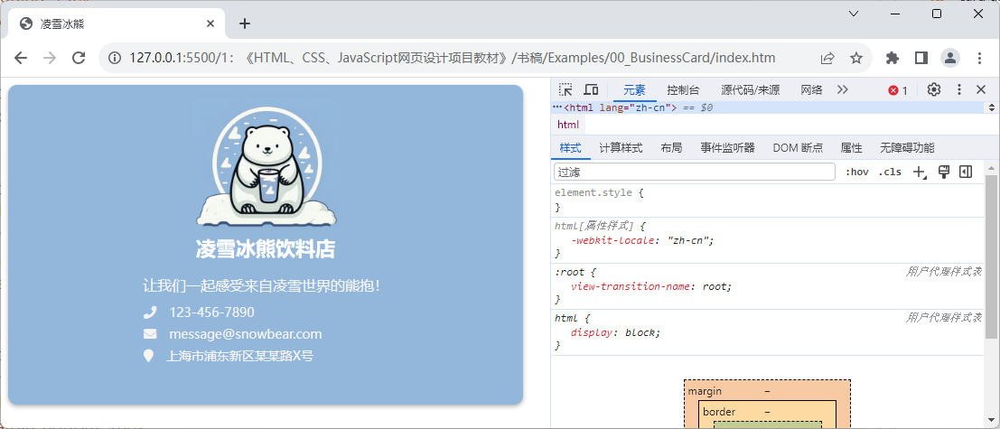
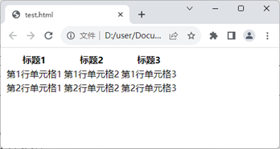
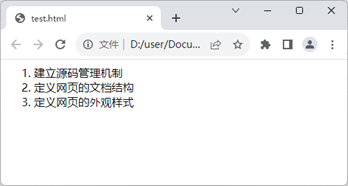

# 项目1 企业的线上名片设计

“线上名片”项目在网页设计领域中属于卡片式页面的设计项目，此类项目主要用于为企业或个人提供可被搜索引擎查找到的联络方式。它一方面可清楚地展示企业或个人的基本信息和联系方式，方便客户将其快速保存到通讯录中，另一方面也可以方便地展示企业的Logo、简介、主营产品等信息，而不再需要像过往一样，必须要制作繁琐的宣传画册才能高效地完成商务社交，并达到提高企业能见度与知名度的目的了。

## 【学习目标】

在本章，笔者将会带领读者创建一个用于推广新创企业的“线上名片”项目。该演示项目的目标是让读者初步了解网页设计工作所需要执行的基本步骤，以及执行这些操作步骤所需的基本技术。总而言之，在阅读完本章之后，我们希望读者能够：

- 了解在网页设计工作中需要用到的基础技术；
- 构建好进行网页设计工作所需要的软件环境；
- 掌握构建网页设计项目所需执行的基本步骤；

## 【学习场景描述】

现在，假设你是一名刚进入职场的网页设计师，接到的第一个项目是为一家名为“凌雪冰熊”的新创饮料店设计一个网页版的线上名片。在这家饮料店创立之初，创业者要做的事是千头万绪，不知从何开始，他在这一时期虽有宣传的急迫需求，但通常既无时间也无资金来创建一个完整且专业的主页型网站来展示自己的企业，在这种情况下，先花十几分钟设计一个只包含简单信息的网页，然后将它作为企业的线上名片发布在互联网上也不失为是一种权宜之计。况且，这样做也可以为将来正式的主页预备服务器、URL等资源。

## 【任务书】

- 项目名：凌雪冰熊饮料店的线上名片。
- 委托方：凌雪冰熊饮料店
- 项目资料：
  - 地址信息：上海浦东新区某某路X号
  - 电话号码：123-456-7890
  - 电子邮件：`message@snowbear.com`
  - 企业图标：如图1-1所示。  
      
    图1-1：凌雪冰熊的Logo
- 项目要求：设计一个能用于推广新创工作室的网页，该网页应符合以下要求。
  - 网页中需包含该咖啡屋的Logo、地址、电子邮件与电话号码等基本信息；
  - 网页的外观需要有现实世界中名片的基本形态，即它应该有一个矩形边框；
- 时间要求：在1个工作日内完成；

## 【任务拆解】

整个网页设计项目可以划分为以下三个小任务：

- 创建一个网页设计项目，并根据委托方提供的资料安排好项目的目录结构；
- 编写一个HTML文档，以便定义好网页网页的结构及其要呈现的信息元素；
- 设计网页的外观样式，让网页以类似于现实世界中名片的形态呈现给用户；

## 【工作准备】

HTML和CSS是开发者们在网页设计工作中必然会用到的计算机标记语言，前者用于定义网页的内容结构，后者则用于定义网页的外观样式。笔者认为在具体实施本章项目的工作之前，读者应有必要先初步了解一下这两门语言以及它们各自所采用的标准版本，并配置好开展网页设计项目的工作环境。当然了，如果读者认为自己已经掌握了这部份知识，可自行跳过本节内容，直接进入本章项目的【工作实施与交付】环节。

### 知识点1：HTML基础

HTML（即Hyper Text Markup Language，通常被译为“超文本标记语言”）是一门用于描述网页的文档结构及其内容的标记语言，因此网页也通常被称作HTML文档。该标记语言的主要作用是网页描述成一个树状的数据结构，以便于网页浏览器可以将其解析成可被JavaScript、VBScript等网页脚本语言识别的对象模型，这样人们就可以用编写代码的方式来对网页进行操作了。在这本书中，所有项目中都将按照HTML5的标准来定义网页的文档结构及其要显示的内容。该标准赋予了HTML在面对富媒体、富应用以及富内容时强大的描述能力，这将有助于我们设计出信息量更为丰富的网页。

正如之前所说，HTML是一种计算机标记语言，这意味着我们学习HTML的主要任务就是学会如何使用一系列带尖括号的语法标记。而为了让读者之后能更顺畅地开始学习这些语法标记，我们需要先介绍一些相关的基本概念。下面来看一段用于演示HTML标记用法的伪代码：

```xml
<tag name="example">
    需要使用tag标记定义的内容
</tag>
```

在上述伪代码中，我们定义了一个名为“tag”的元素，和`</tag>`是用于创建该元素的标记，`<tag>`被称为开始标记，`</tag>`被称为结束标记，而`name`所定义的则是该元素的属性，它们之间的关系具体如下。

- **标记**：标记是HTML中最基本的语法单元，它由一系列用尖括号包围的关键字（例如上面的`tag`，这些关键字通常被称为“标记名”）组成，它们的作用是定义HTML文档的基本结构及其要显示的内容。
- **元素**：元素是构成HTML文档的基本组成部分，它通常情况下由一个开始标记和一个结束标记组成（少数元素也可使用单一标记来定义），这对标记之间的内容通常将作为HTML文档的一部分显示在浏览器上。
- **属性**：属性是HTML元素的重要部分，它通常出现在被定义元素的开始标记中，并被放置在标记名之后，如果存在多个属性则以空格分隔，其作用是告诉浏览器如何解析当前标记所定义的元素。

在掌握了以上三个基本概念以及它们间的关系之后，接下来就可以开始学习在网页设计工作中常用的HTML标记及其作用了。本书将会根据各章要实施的项目来为读者讲解这些标记的具体使用方法，以下是本章项目将会用到的HTML标记及其作用。

- **`<!DOCTYPE>`**标记：该标记会被放置在被定义文档的第一行，以便用于指定该文档的类型。例如，如果我们要定义的是一个基于HTML 5标准的网页文档，那么该标记就应该是`<!DOCTYPE html>`。
- `<html>`标记：该标记是用于定义网页文档的总标记。这意味着，所有网页的定义代码都必须从一个`<html>`开始，并以一个`</html>`标记结束，其他所有的HTML标记都必须被放在这两个标记之间。
- `<head>`标记：该标记是用于定义网页头部信息的总标记。换而言之，网页文档中所有与头部信息相关的定义代码都必须从一个`<head>`开始，并以一个`</head>`标记结束，其他用于描述具体头信息的HTML标记都必须被放在这两个标记之间。在HTML的语义中，头部信息中主要提供了网页文档的元数据、外链文件、内嵌代码等信息。虽然这些信息通常不会在网页中直接显示，但由于它们可被Google之类搜索引擎，与网页浏览器相关的应用程序读取并进行相关的解析和渲染，所以我们经常会通过定义头部的方式来提高网页的可访问性、可读性以及可发现性。
- `<body>`标记：该标记是用于定义网页主体内容的总标记。换而言之，网页中所有与可显示内容相关的定义代码都必须从一个`<body>`开始，并以一个`</body>`标记结束，其他需要被显示在网页浏览器中的，用于表示文字、图片、用户界面元素的、与具体内容信息的HTML标记都必须被放在这两个标记之间。
- `<meta>`标记：该标记用于定义网页的具体元数据，例如我们可以用该标签将当前网页所使用的字符集定义为`UTF-8`。
- `<title>`标记：该标记用于定义网页文档的标题，该信息通常会显示在浏览器的标题栏中。
- `<link>`标记：该标记用于定义网页文档所要链接的外部信息，例如我们可以用该标签将要使用的外部CSS样式文件链接到该网页文档中。
- `<div>`标记：该标记的作用是在网页中定义一个块状显示元素，这是网页设计中会用到的、最基本的布局工具，例如在本章项目的代码中，读者将会看到一个`id="card"`的块状元素，它的作用是在网页中显示一张名片应有的卡片形态。
- `<h1>`标记：该标记的作用是在网页中定义一级标题元素。例如在本章项目的代码中，读者将会看到我们用该标签在网页中显示了“凌雪冰熊咖啡屋”的字样。
- `<p>`标记：该标记的作用是在网页中定义一个文本段落元素。例如在本章项目的代码中，读者将会看到我们用该标签在网页中对“凌雪冰熊咖啡屋”做了简介。
- `<ul>`与`<li>`标记：这两个标记的作用是在网页中定义一个无序列表元素。例如在本章项目的代码中，读者将会看到我们用该标签在网页中显示了“凌雪冰熊咖啡屋”的地址、电话号码和电子邮件信息。

### 知识点2：CSS基础

CSS（即Cascading Style Sheets，通常被译为“层叠样式表”）是一门专用于定义网页外观样式的计算机标记语言。人们可以使用这门语言对网页中出现的图片、文本、按钮等元素进行像素级别的精确控制。在这本书中，所有项目都将按照CSS 3这一最新标准来定义网页的外观样式。该标准新增了圆角效果、渐变效果、图形化边界、文字阴影、透明度设置、多背景图设置、可定制字体、媒体查询、多列布局以及弹性盒模型布局等诸多更为丰富的新样式特性，这将有助于我们设计出更为丰富多彩的网页。

CSS语言及其相关技术对网页设计工作的最大贡献之一，就是让设计师们得以将网页中的内容与它要呈现的方式分开。毕竟，在CSS语言出现前，设计师们在使用HTML定义网页的结构和内容时还必须要指定它们的呈现外观，如今很少用到的`<font>`、`<b>`、`<i>`等HTML标记就是那时候的产物。这些标记主要用于设置字体的颜色、背景色、大小、字形以及排列方式等。例如在HTML语法中，`<h2>`标记用于定义二级标题，它在级别上比一级标题低，比三级标题高，这些都属于是文档结构上的定义。但假如设计师要更改二级标题的颜色、字形、大小的话，在没有CSS语言的时代，他就得要使用`<font>`这样的标记了，光靠`<h2>`是不够的，因为后者只是一个用于表示文档结构的标记。例如，如果读者想让二级标题使用白底红字的斜体字，就需要这样写：

```html
<h2><font color="red" bgcolor="white"><i>二级标题</i></font></h2>
```

上面这种样式设置的方法最大的问题是，它只对当前设置的页面元素有效，因此相同的样式可能需要在同一网页中的每个二级标题元素上反复设置。考虑到同一网页中通常都会设有多个二级标题，这样做几乎一定会大大增加HTML代码的冗余度，从而导致整个网页文档变得非常臃肿和混乱，难以维护。因为如果以后想更改二级标题的样式，就必须在网页文档中找到所有用到`<h2>`+`<font>`标记的地方，然后逐一修改。

在CSS语言出现后，这些问题就迎刃而解了，因为这门标记语言及其相关的技术主张将文档的结构内容与外观样式分而治之，从而让设计师们在使用HTML时可以专注于文档结构的定义，而外观样式则专门使用CSS语言来定义。例如对于上面这个例子来说，设计师们如今只需要使用HTML的`<h2>`标记定义网页的二级标题元素，而该元素的外观样式则用CSS来定义，这样一来，上面的HTML代码就可以被简化成这样：

```html
<h2>二级标题</h2>
```

然后，设计师们只需要在对应的CSS文件中将二级标题的样式设置为白底红字的斜体字，具体代码如下：

```css
h2 {
    color: red; 
    background: white; 
    font-style: italic;
}
```

对于上述代码中使用的具体语法，本章稍后会做具体介绍。在这里，读者暂时只需要理解：由于CSS语言的出现，我们实现了HTML/XML文档的内容结构与其外观样式的解耦合。从此之后，HTML就只负责定义网页的结构与内容，则CSS负责定义网页的外观样式，包括颜色、字形、大小以及面向不同显示设备的自适应能力等。

除此之外，CSS语言的“层叠”特性还赋予了它非常灵活的使用方式。CSS代码既可以被保存为一个独立的文件，也可以被内嵌在特定的HTML文档内，网页浏览器会自行根据CSS提供的一套优先判定方法来决定网页最终的外观样式。甚至，设计师们还可以选择先针对同一份HTML/XML文档定义多份CSS代码，然后让网页浏览器根据动态脚本的设定来决定网页要使用的样式。这样一来，设计师们就可以为不同的显示设备设计不同的CSS代码了，例如，他们可以让HTML文档在计算机屏幕上的显示与其在打印机中的输出效果略有不同，以便让它在不同的设备中都能有更好的显示方式。总而言之，CSS语言赋予了设计师们更强大的设计能力。

当然了，在计算机世界中，没有任何一项技术是完美的。CSS语言虽然在网页设计工作中起着至关重要的作用，但它也存在一些缺点。下面就带读者来简单了解一下CSS语言的主要缺点。

- **语法繁琐且极易出错**：CSS的语法相对复杂，需要对各种选择器、样式属性和值的组合使用进行熟悉。编写CSS代码时，一个小错误可能导致整个样式表无法正常工作。这需要网页设计师们具备良好的CSS知识和经验，以确保代码的正确性。
- **浏览器兼容存在差异**：不同的网页浏览器对CSS的解析和渲染存在差异，这可能导致网页在各种浏览器上的显示效果不一致。为了提高代码的兼容性，网页设计师们通常需要编写特定的CSS代码，这大大增加了网页设计工作的复杂性。
- **文件加载速度较慢**：当浏览器加载一个网页时，会同时加载该网页所使用的所有CSS样式表文件。如果网页中使用的CSS文件过多或文件体积较大，会导致网页加载速度变慢，影响用户体验。这需要开发人员优化CSS代码，减少文件大小和数量，以提高网页加载速度。
- **全局作用域**：CSS样式表中的样式规则是全局生效的，这意味着一个样式规则可以影响到网页中的所有元素。这种全局作用域可能导致样式冲突和难以维护的问题。为了避免这些问题，网页设计师们需要使用命名约定和选择器的层级关系来管理样式。

尽管CSS语言存在上述缺点，但它仍然是网页设计工作中不可或缺的工具。通过学习CSS语言，读者就可以创建出具有吸引力、可维护的网页，并提供良好的用户体验。下面，就请读者跟随本书来具体了解一下CSS这门标记语言的基本语法吧。

根据CSS 3标准所指定的语言规范，一段完整的样式表代码通常由一系列样式规则组成，而每个样式规则的定义通常由选择器、属性名称和属性值三个语法单元，以及在必要时才会添加的代码注释组成，其具体形式大致如下：

```css
[选择器1] {
    [属性名称1]: [属性值1];
    [属性名称]2: [属性值2];
    [属性名称3]: [属性值3];
    /* 注释：同一样式规则语句中可设置多个样式属性 */    .
    [属性名称n]: [属性值n];
}
[选择器2] {
    [属性名称1]: [属性值1];
    [属性名称]2: [属性值2];
    [属性名称3]: [属性值3];
    [属性名称n]: [属性值n];
}
/* 注释：同一CSS文件中可包含多条样式规则语句 */
[选择器n] {
    [属性名称1]: [属性值1];
    [属性名称]2: [属性值2];
    [属性名称3]: [属性值3];
    [属性名称n]: [属性值n];
}
```

下面，让我们来详细介绍一下上述基本语法中使用到的语法单元及其各自的编写方式。

- **选择器**：作为样式规则语句的第一部分，`[选择器]`的主要作用是在HTML元素与CSS样式规则之间建立匹配关系，以便对指定的HTML元素应用该选择器后面所定义的外观样式。而根据选择HTML元素的方式，CSS的`[选择器]`可被划分成几个不同的种类。只有切实地了解了这些不同种类的选择器，读者才能更容易正确地使用它们。接下来，本书先来为读者介绍两种在本章项目中会用到的选择器。

  - *基于标记名的选择器*：这种CSS选择器通常被称为*元素选择器*，主要用于匹配其关联HTML文档中的所有指定名称的标记，它的语法是最简单的，只需直接指定要匹配的标记名称即可。譬如，下面是一些元素选择器的简单示例。

    ```css
    h1 { /* 匹配文档中所有的一级标题元素 */
        color: blue;
    }
    div { /* 匹配文档中所有块状元素 */
        color: blue;
    }
    p { /* 匹配文档中所有段落元素 */
        color: blue;
    }
    ```

  - *基于id属性值的选择器*：这种CSS选择器通常被称为*ID选择器*，主要用于匹配其关联HTML文档中的所有指定了特定`id`属性值的标记，语法格式为：`#ID属性值`。譬如，下面是一些ID选择器的使用简单示例。

    ```css
    #card { /* 匹配文档中所有 id=“card” 的元素 */
        color: blue;
    }
    #user { /* 匹配文档中所有 id=“user” 的元素 */
        color: blue;
    }
    ```

    - **基于`class`属性的选择器**：这种CSS选择器通常被称为*类选择器*，主要用于匹配其关联HTML文档中的所有设置了特定`class`属性值的标记，语法格式为：`.类名`。譬如，下面是一些类选择器的简单示例。

    ```css
    .box { /* 匹配文档中所有 class=“box” 的元素 */
        color: blue;
    }
    .video { /* 匹配文档中所有 class=“video” 的元素 */
        color: blue;
    }
    ```

    需要特别说明的是，基于类选择器建立的CSS样式规则通常也被称之为**样式类**。由于目前市面上主流的第三方网页设计工具（例如本章项目中将要使用的FontAwesome图标库，以及后续章节中将要介绍的Bootstrap框架等）基本上都是基于样式类来实现的。因此，类选择器无疑将是读者在网页设计工作中最常用到的CSS选择器之一。

- **属性名称**：在之前提到的CSS语法规则中，`[选择器]`以外的部分都可被称为“样式属性”，这部分通常由一对大括号包裹住的、一系列格式为`[属性名称]:[属性值]`的语句构成。其中，`[属性名称]`的作用是指定想要设置的样式属性。在CSS代码中，一段样式规则可设置的样式属性取决于其`[选择器]`单元所匹配的HTML元素，例如，对于本章项目中会使用到的`<div>`、`<p>`这一类HTML元素来说，设计师们可以设置的常见样式属性主要包括：
  - `height`：设置页面元素的垂直高度；
  - `width`：设置页面元素的水平宽度；
  - `margin`：设置页面元素的外边距；
  - `padding`：设置页面元素的内边距；
  - `font-size`：设置页面元素中文本的字体大小；
  - `border`：设置页面元素的边框；
  - `color`：设置页面元素中文本的字体颜色；
  - `background-color`：设置页面元素的背景颜色；

- **属性值**：`[属性值]`的作用是为`[属性名称]`所指定的样式项目设置具体的值，它的取值类型和范围取决于它要设置的`[属性名称]`，例如：
  - 对于`height`、`margin`之类的、与尺寸问题相关的`[属性名称]`，它的取值就是以`px`、`em`或`%`为单位的数字；
  - 对于`background-color`这种与颜色相关的`[属性名称]`，它的取值就是Hex、RGB之类的颜色编码，或者CSS预定义的颜色名称；
  - 对于`background-image`这种与多媒体文件相关的`[属性名称]`，它的取值就是用于表示该文件所在位置的字符串；

- **代码注释**：在CSS代码中，用于进行代码注释的语法单元通常以`/*`开始，以`*/`结束。它主要用于*在某段CSS代码的作用隐晦不明时*对其进行文字说明，以便增强代码的可读性，并不会被网页浏览器渲染。例如，在下面这段作用于`<div>`元素的CSS代码中，笔者就以注释的方式对其所设置的样式属性做了相应的说明。
  
     ```css
    div {
        /* 设置被匹配标签所在元素的高度 */
        height: 600px;
        /* 设置被匹配标签所在元素的背景色 */
        background-color: rgb(164, 205, 223);
        /* 设置被匹配标签所在元素的内边距 */
        padding: 10px 15vw;
        /* 设置被匹配标签所在元素的字体大小 */
        font-size: 18ox;
    }
    ```

以上就是CSS的基本语法，读者可以利用这套语法来创建一系列样式规则，以便完成对HTML元素的外观设计。当然了，关于特定HTML元素具体可设置哪些样式属性，本书将会在后续章节的项目中做分门别类的介绍与演示，读者在这里暂时只需要了解它们在CSS语法中的基本位置即可。

### 知识点3：配置工作环境

#### 安装网页浏览器

网页浏览器是开发者们用来调试网页，并确认其设计效果的必要工具，因此选择一款能根据最新的技术标准对网页进行准确渲染的浏览器是非常重要的。而根据目前市场上各种浏览器对上述三门计算机语言的支持情况，开发者们通常都会选择将Google Chrome或Mozilla Firefox设置为自己的常用网页浏览器，因为它们不仅装备了对HTML5、CSS3和ES6提供了良好支持的网页解析引擎，而且都自带了功能非常齐全的网页调试环境。例如，对于Google Chrome浏览器，读者只需通过搜索引擎找到它的官方网站，然后在根据自己所在的操作系统平台来下载并安装它之后，我们就可以打开该浏览器并通过在其主菜单中依次单击「更多工具」→「开发者工具」菜单项来打开网页的调试环境了，具体如图1-2中所示。



图1-2：Google Chrome的开发者工具

另外，Mozilla Firefox也是一款对开发者非常友好的网页浏览器，它在Windows、macOS以及各种Linux发行版上也都有相应的版本，读者也只需要根据自身所在的操作系统平台到Mozilla Firefox的官方网站上去下载并安装它即可。在安装完成之后，我们同样也可以通过在该浏览器的主菜单中依次单击「工具」→「Web开发者」→「查看器」菜单项来打开其网页调试环境了，如图1-3中所示。



图1-3：Mozilla Firefox的开发者工具

当然，如果读者打算在Windows或macOS系统中使用它们自带的网页浏览器，也是可以找到类似的工具的。例如在Windows10/11系统中,最近用于取代Internet Explorer的Microsoft Edge是一款基于Chromium开源项目来开发的网页浏览器，它的使用方式与Google Chrome浏览器是大同小异的，读者也只需要在它的主菜单中依次单击「更多工具」→「开发人员工具」菜单项就可以打开其网页调试环境了，如图1-4中所示。



图1-4：Microsoft Edge的开发人员工具

关于在如何在浏览器中使用这些浏览器的网页调试环境，本书将会在后续的项目演示中做具体介绍，在这里，读者暂时只需知道如何搭建并启动自己将来需要使用的这个调试环境即可。

#### 配置项目管理工具

虽然从纯理论的角度上来说，如果想开展网页设计类项目的开发工作，人们通常只需要使用与Windows系统中“记事本”相似的纯文本编辑器就够了。但在实际的生产实践中，人们为了在工作过程中获得更好的编码体验，并能方便地使用各种强大的调试工具和源码管理工具，通常还是会选择使用一款专用的管理工具来完成项目的开发工作，下面来介绍一下配置项目管理工具的两种常见方案。

##### 代码编辑器方案

在这本书中，笔者会更倾向于选择用Visual Studio Code代码编辑器（以下简称VS Code编辑器）来管理所有的项目，这是一款微软公司于2015年推出的现代化代码编辑器。下面就让我们来简单介绍一下这款编辑器的安装方法，以及如何将其打造成一款可用于网页设计类项目的工作环境吧。首先，这款编辑器的安装步骤非常简单，读者可以过搜索引擎找到它的官方网站，其官方下载页面如图1-5中所示。


图1-5：VS Code的官方下载页面

由于这款编辑器在Windows、macOS以及各种Linux发行版上均可使用（这也是本书选择它作为主编辑器的原因之一），所以读者接下来需要根据自己所在的操作系统来下载相应的安装包。待下载完成之后，我们就可以打开安装包来启动它的图形化安装向导了。在安装的开始阶段，安装向导会要求用户设置一些选项，例如选择程序的安装目录，是否添加相应的环境变量（如果读者想从命令行终端中启动 VS Code 编辑器，就需要激活这个选项）等，大多数时候只需采用默认选项，直接一路点击「Next」就可以完成安装了。接下来的任务就是要将其打造成一款可用于开展网页设计工作的项目工具。

VS Code编辑器的最强大之处在于它有一个非常完善的插件生态系统，我们可以通过安装插件的方式将其打造成面向不同计算机语言与开发框架的集成开发环境。在VS Code编辑器中安装插件的方式非常简单，只需要打开该编辑器的主界面，然后在其左侧纵向排列的图标按钮中找到「扩展」按钮并单击它，或直接在键盘上敲击快捷键「Ctrl + Shift + X」，就会看到如图1-6所示的插件安装界面：



图1-6：VS Code的插件安装界面

根据网页设计项目的工作需要，本书在这里会推荐读者安装以下插件。

- Emmet：该插件允许设计师们用一套简单易学且便捷的缩写语法来编写HTML代码。
- HTML Boilerplate：该插件可根据设计师们编写的HTML代码自动生成一些常见代码片段。
- Auto Rename Tag：该插件可在设计师们修改某个HTML元素的开始标记时自动修改对应的结束标记。
- HTML CSS Support：该插件可在设计师们编写CSS代码时提供代码的自动补全功能。
- JavaScript Snippet Pack：该插件可在设计师们编写JavaScript代码时提供代码的自动补全功能。
- JavaScript (ES6) Code Snippet：该插件可在设计师们编写符合ES6标准的代码时提供代码的自动补全功能。
- ESlint：该插件用于自动检测JavaScript代码中存在的语法问题与格式问题。
- Path Intellisense：该插件用于在设计师们编写文件路径时提供路径的自动补全功能。
- View In Browser：该插件可用于快速启动系统默认的网页浏览器，以便即时查看当前正在编写的HTML文档。
- Live Server：该插件可用于在当前计算机上快速构建一个简单的网页服务器，并自动将当前项目部署到该服务器上。
- vscode-icons：该插件用于为不同类型的文件加上不同的图标，以方便文件管理。
- GitLens：该插件用于查看git对项目源码的提交记录。当然了，如果读者对git这款版本控制工具不熟悉，建议可先通过查看git的官方文档，或者阅读本书附录A中的内容来初步了解git的安装方法与基本使用技巧。

需要特别强调的是，VS Code编辑器的插件浩若繁星，读者也可以根据自己的喜好来安装其他功能类似的插件，只要这些插件后面的项目实践需求即可。除此之外，Atom与sublime Text这两款代码编辑器也有着类似的插件生态系统和使用方式，如果读者喜欢的话，也可以选择基于它们来打造属于自己的项目开发环境。

##### 集成开发环境方案

如果读者更习惯使用传统的集成开发环境（英文缩写为IDE），JetBrains公司旗下的WebStorm无疑也是一个不错的选择，它在Windows、macOS以及各种Linux发行版上均可做到所有的功能都是开箱即用，无需进行多余的配置，已经被广大的开发者誉为是“最智能的集成开发环境”。WebStorm的安装方法非常简单，我们在浏览器中打开它的官方下载页面之后，就会看到如图1-7所示的内容。


图1-7：WebStorm的官方下载页面

同样地，大家在这里需要根据自己所在的操作系统来下载相应的安装包，待下载完成之后就可以打开安装包来启动它的图形化安装向导了。在安装的开始阶段，安装向导会要求用户设置一些选项，例如选择程序的安装目录，是否添加相应的环境变量、关联的文件类型等，大多数时候只需采用默认选项，直接一路点击「Next」就可以完成安装了。当然了，令人遗憾的是，WebStorm并非是一款免费的软件，考虑到业界面临的当前形势，笔者在这里还是会强烈建议大家尽量选择免费的开源软件。

当然了，类似的集成开发环境还有微软公司旗下的Visual Studio，它的Community版倒是一款完全免费的IDE软件。如果读者确定自己只在Windows系统下进行项目开发，安装Visual Studio Community也是一个很好的选择，至少用它来开发这本书中涉及到的所有项目应该肯定是够用的 ，它的官方下载页面如图1-8所示。



图1-8：Visual Studio的官方下载页面

## 【工作实施和交付】

### 第1步：创建一个网页设计项目

在本书中，我们会将所有项目的源码存放在一个名为`Examples`的目录中（读者自行可以在计算机中任意自己喜欢的位置上创建这一目录），并使用git版本控制工具来进行源码管理，使用git管理项目源码的操作非常简单，具体步骤如下。

1. 先使用Powershell或Bash Shell这类命令行终端环境打开`Examples`目录，并通过执行`mkdir 01_BusinessCard`命令来创建本章项目的根目录。

2. 继续在命令行终端环境中使用`cd 01_BusinessCard`进入到本章项目的根目录下，并分别通过执行`mkdir img`和`mkdir styles`这两个命令为本章项目创建两个子目录，这两个子目录分别用于存放图片素材和CSS样式表文件。

3. 然后使用VS Code编辑器打开这个刚刚创建的`01_BusinessCard`项目，并执行以下文件操作：
   1. 在项目的根目录下创建一个名为`index.htm`的空文件。
   2. 在项目的`styles`子目录下创建一个名为`main.css`的空文件。
   3. 将项目委托方提供的图标文件复制到项目的`img`子目录下，并将该图标文件重命名为`logo.png`。

   如此一来，整个项目的目录结构如下。

    ```bash
    01_BusinessCard
    ├── index.htm
    ├── img
    │    └── logo.png
    └── styles
          └── main.css
    ```

4. 最后回到之前的命令行终端环境中，并在项目的根目录中通过执行以下命令来完成本章项目的第一次版本控制操作。

    ```bash
    git init
    git add .
    git commit -m "项目1：创建线上名片项目"
    ```

### 第2步：定义网页的文档结构

在这一步骤中，网页设计师的主要任务是使用HTML标记将网页的文档结构及其要显示的内容描述出来，为此读者需要执行如下操作。

1. 先使用VS Code编辑器打开`01_BusinessCard`项目，然后在项目的根目录下找到之前创建的`index.htm`文件，并在其中输入如下代码。

    ```html
    <!DOCTYPE html>
    <html lang="zh-cn">
        <head>
            <meta charset="UTF-8">
            <title>凌雪冰熊</title>
        </head>
        <body>
            <div id="card">
                <h1>凌雪冰熊饮料店</h1> 
                <p>让我们一起感受来自凌雪世界的熊抱！</p>
                <ul>
                    <li>电话：123-456-7890</li>
                    <li>电邮：message@snowbear.com</li>
                    <li>地址：上海市浦东新区某某路X号</li>
                </ul>
            </div>
        </body>
    </html>
    ```

2. 在保存上述代码之后，使用网页浏览器打开`index.htm`文件查看当前网页设计的结果，其外观在Google Chrome浏览器中的效果如图1-9所示。

    

    图1-9：网页的文档结构及其内容

3. 最后回到之前的命令行终端环境中，并在项目的根目录中通过执行以下命令来完成本章项目的第二次版本控制操作。

    ```bash
    git add .
    git commit -m "项目1：定义网页的文档结构"

### 第3步：定义网页的外观样式

相信读者此刻心中会有一个疑问：图1-8中的网页看上去无论如何都不像是一张的名片，它充其量只是显示了一些名片中应有的基本信息啊！没错，所以我们现在需要做的就是为该网页设置一些外观样式，以便让它看起来真的像一张名片。为此，读者需要继续以下操作。

1. 先使用VS Code编辑器打开`01_BusinessCard`项目，并在项目的`styles`目录下找到之前创建的、名为`main.css`的空文件，并在其中输入如下代码。

    ```css
    #card {
        width: 540px;
        height: 324px;
        background-color: rgb(164, 205, 223);
        border-radius: 10px;
        box-shadow: 0 2px 5px rgba(0, 0, 0, 0.3);
        padding: 15px;
        text-align: center;
    }

    #card img {
        width: 30%;
    }

    #card h1 {
        color:  white;
        font-size: 22px;
        padding: 0px;;
        margin: 0px;
    }

    #card p {
        font-size: 16px;
        color: white;
        margin-bottom: 10px;
    }

    #card ul {
        text-align: left;
        list-style: none;
        padding: 0 25%;
        margin: 0;
    }

    #card ul li {
        font-size: 14px;
        color: white;
        margin-bottom: 5px;
    }

    #card ul li i {
        margin-right: 10px;
    }
    ```

2. 继续在VS Code编辑器中重新打开之前的`index.htm`文件，并将其代码修改如下。

    ```html
    <!DOCTYPE html>
    <html lang="zh-cn">
        <head>
            <meta charset="UTF-8">
            <title>凌雪冰熊</title>
            <!-- 引入本地定义的 main.css 样式文件 -->
            <link rel="stylesheet" href="./styles/main.css">
            <-- 从网络引入FontAwesome这个第三方图标库 -->
            <link rel="stylesheet"
                href="https://use.fontawesome.com/releases/v5.11.2/css/all.css">
        </head>
        <body>
            <div id="card">
                <!-- 使用  标记插入工作室的图标文件 -->
                
                <h1>凌雪冰熊饮料店</h1> 
                <p>让我们一起感受来自凌雪世界的熊抱！</p>
                <ul>
                    <!-- 使用 <i> 标记的 class 属性插入来自FontAwesome库的图标 -->
                    <li><i class="fa fa-phone"></i> 123-456-7890</li>
                    <li><i class="fa fa-envelope"></i> message@snowbear.com</li>
                    <li><i class="fa fa-map-marker"></i> 上海市浦东新区某某路X号</li>
                </ul>
            </div>
        </body>
    </html>
    ```

3. 在保存上述代码之后，使用网页浏览器打开`index.htm`文件查看当前网页设计的结果，其外观在Google Chrome浏览器中的效果如图1-10所示。

    

    图1-10：网页的外观样式

4. 最后，读者需要回到之前的命令行终端环境中，并在本章项目的根目录中完成第三次的版本控制操作。

    ```bash
    git add .
    git commit -m "项目1：定义网页的外观样式"
    ```

在上述操作中，我们首先在`main.css`样式文件中通过`#card`选择器对之前在`index.htm`文件中定义的`<div id="card">`元素本身，以及其中的图片、标题、段落、列表等信息元素的外观样式进行了逐条设置。然后我们回到了`index.htm`文件中，并使用`<link>`标签指定了当前网页要加载的CSS样式文件。读者可以注意到，除了我们自己定义的样式文件之外，该网页中还加载了一个名叫FontAwesome的第三方图标库的样式文件。除此之外，为了让读者更清楚地了`index.htm`文件相较于之前发生的变化，我们在该文件中还使用了`<!-- 注释 -->`标记做了相应的注释说明。在HTML的语义中，注释标记的作用是说明网页设计者的意图，其内容并不会显示在网页中。

## 【拓展知识】

本章项目主要涉及了一些最基本的HTML标记与CSS选择器的应用，同类型的项目中还可能会使用到更多的HTML标记与CSS选择器。下面，本章将对这一部分的知识进行一些拓展。

### 知识点1：更多HTML标记

在本章项目的演示中，读者已经见过了用于在网页中显示标题、图片、文本段落、无序列表以及超链接等元素的HTML标记。而在同类型的项目中，当网页中要显示的信息更多时，网页设计师们可能还会用到与显示表格和有序列表相关的页面元素。下面，我们将基于本章作业的任务需要，为读者介绍一下用于显示这些元素的标记。

- `<table>`标记：该标记的作用是在网页中定义一个表格元素，换而言之，网页中关于表格元素的所有定义代码都必须从一个`<table>`开始，并以一个`</table>`标记结束，其他用于描述表格行、单元格的HTML标记都必须被放在这两个标记之间。
- `<tr>`标记：该标记必须放在`<table>`和`</table>`这两个标记之间才能有效发挥作用。它的作用是定义表格的“行”元素，换而言之，表格中每一行的定义代码都必须从一个`<tr>`开始，并以一个`</tr>`标记结束，其中用于描述单元格的HTML标记都必须被放在这两个标记之间。
- `<th>`标记：该标记必须放在`<tr>`和`</tr>`这两个标记之间才能有效发挥作用。它的作用是定义表格标题行中的“单元格”元素，换而言之，表格标题行中每个单元格元素的定义代码都必须从一个`<th>`开始，并以一个`</th>`标记结束，其中用于显示具体信息的HTML标记都必须被放在这两个标记之间。
- `<td>`标记：该标记必须放在`<tr>`和`</tr>`这两个标记之间才能有效发挥作用。它的作用是定义表格中除标题行之外的“单元格”元素，换而言之，表格中除标题行之外的每个单元格元素的定义代码都必须从一个`<td>`开始，并以一个`</td>`标记结束，其中用于显示具体信息的HTML标记都必须被放在这两个标记之间。
- `<ol>`与`<li>`标记：这两个标记的作用是在网页中定义一个无序列表元素。

下面来示范一下以上标记的使用方式，首先要示范的是用于显示表格元素的HTML标记：

```html
<table>
    <tr>
        <th>标题1</th>
        <th>标题2</th>
        <th>标题3</th>
    </tr>
    <tr>
        <td>第1行单元格1</td>
        <td>第1行单元格2</td>
        <td>第1行单元格3</td>
    </tr>
    <tr>
        <td>第2行单元格1</td>
        <td>第2行单元格2</td>
        <td>第2行单元格3</td>
    </tr>
</table>
```

上述HTML标记在网页浏览器中的显示如图1-11所示：



图1-11：显示表格元素

接下来是用于显示有序列表元素的HTML标记，例如笔者可以把本章项目的实施步骤定义成如下有序列表元素：

```html
<ol>
    <li>建立源码管理机制</li>
    <li>定义网页的文档结构</li>
    <li>定义网页的外观样式</li>
</ol>
```

上述HTML标记在网页浏览器中的显示如图1-12所示：



图1-12：显示有序列表元素

需要特别提醒的是，读者在本章项目里的主要任务是初步熟悉一个网页文档所应有的基本结构，并初步掌握`<!DOCTYPE>`、`<html>`、`<head>`、`<meta>`、`<title>`、`<link>`、`<body>`这一组文档定义类HTML标记的使用方法。至于其他与网页中具体内容相关的HTML标记，读者暂时只需要知道它们在网页中所对应的元素，并能在本章的作业任务中定义这些元素即可，本书将会在后续章节的项目中分门别类地演示这些标记的具体使用方法。

### 知识点2：更多CSS选择器

在本章项目的演示中，读者已经见过了基于标记名称、标记`id`属性、标记`class`属性的基本选择器，但除此之外，CSS中还提供了一些复合型的选择器，它们能帮助网页设计师们以更灵活的方式来匹配指定的HTML元素。为了读者能在本章的作业项目中编写出更为得心应手的CSS代码，下面来补充一下与这几种选择器相关的知识。

- **基于标记+属性的选择器**：这种CSS选择器通常被称为属性选择器，主要用于匹配其关联HTML文档中的包含指定属性的特定标记，语法格式为：`标记名[属性名{=属性值}]`，其中`{=属性值}`的部分可以省略。譬如，下面是一些属性选择器的简单示例。

    ```css
    /* 匹配<a title="属性值">这个标记，这里的“属性值”可是任意字符串 */
    a[title] { 
        color: blue;
    }
    /* 匹配<a href="https://example.com">这个标记 */
    a[href="https://example.com"] {
        color: blue;
    }
    ```

- **基于标记+伪类的选择器**： 这种CSS选择器通常被称为伪类选择器，这主要是因为其用法与之前介绍的类选择器非常类似，只不过它匹配的不是明确指定了`class`属性的HTML标记，而是指定标记的某个特定状态或子结构，语法格式为：`标记名:伪类名`，其中的伪类名代表的就是被指定标记所定义元素的某个状态或子结构。譬如，下面是伪类选择器的一些简单示例。

    ```css
    a:hover { /* 匹配鼠标指针悬浮到超链接元素上时的状态 */
        color: blue;
    }
    a:active { /* 匹配超链接元素被激活时的状态 */
        color: blue;
    }
    a:visited { /* 匹配超链接元素被访问过的状态 */
        color: blue;
    }
    p:first-child { /* 匹配段落元素中的第一个子标记 */
        color: blue;
    }
    p:last-child { /* 匹配段落元素中的最后一个子标记 */
        color: blue;
    }
    p:nth-child(2) { /* 匹配段落元素中的第二个子标记 */
        color: blue;
    }
    p:nth-last-child(2) { /* 匹配段落元素中的倒数第二个子标记 */
        color: blue;
    }
    ```

- **基于特定标记+伪元素的选择器**：这种CSS选择器通常被称为伪元素选择器，主要用于匹配某个指定标记的某个部分而不是全部，语法格式为：`标记名::伪元素名`，其中的伪元素名代表的就是被指定标记中的某个特定部分。譬如，下面是伪元素选择器的一些简单示例。

    ```css
    p::first-line { /* 匹配段落元素中的第一行 */
        color: blue;
    }
    p::last-line { /* 匹配段落元素中的最后一行 */
        color: blue;
    }
    p::selection { /* 匹配用户选中或高亮显示的文本 */
        color: blue;
    }
    p::before { /* 匹配段落元素之前插入的内容 */
        content: "Hello, ";
    }
    p::after { /* 匹配段落元素之后插入的内容 */
        content: "!";
    }
    p::first-letter { /* 匹配段落元素中的第一个字母 */
        color: blue;
    }    
    ```

同样需要提醒的是，读者在本章的任务是初步熟悉为一个网页设置外观样式的基本步骤，即掌握CSS样式文件的创建方法，以及使用`<link>`标记在网页中引入外部样式文件的方法。至于CSS语法中的各种选择器，读者暂时只需要知道它们与HTML标记之间的基本匹配方式即可，本书将会在后续章节的项目中更具体地演示它们的使用方法。

### 【作业】

客户林宇一是一名刚刚进入职场的大学生，他希望投递一份简历给凌雪冰熊饮料店，应征该工作室的网页设计师职位。而你是他的学长，并且现在已经是一位经验丰富的网页设计师，他找到了你，他提供了简历上他希望体现的信息以及设计要求。

- 项目名：网页设计师的简历
- 委托方：林宇一
- 项目资料：
  - 毕业院校：浙江大学，计算机科学与技术学院
  - 毕业时间：2023年6月
  - 学位信息：计算机科学与工程系，学士学位
  - 基本介绍：曾经担任浙江大学校内BBS的电脑技术区区长，并兼任该区Web板版主多年，就学期间还出版了多部与网页设计技术相关的译作（代表作包括《HTML技术手册》、《CSS设计20例》）。
  - 电话号码：154-456-8901
  - 电子邮件：`owlman@owlman.cn`
  - 个人照片：如图1-13所示。  
      
    图1-13：个人照片  
- 项目要求：读者需要设计的是一个能用于应届毕业生求职的、网页版的线上简历。“线上简历”也属于单一页面设计项目，其设计方法与“线上名片”项目基本相同，其具体要求如下。
  - 网页中需包含个人照片，求学经历，基本介绍、电子邮件与电话号码等信息；
  - 网页的视觉效果需要有现实世界中求职简历的基本外观形态；
- 时间要求：在2个工作日内完成；

## 【作业评价】

| 序号 | 评测内容 | 评分标准 | 分值 | 自评 | 互评 | 师评 | 综合得分 |
| ----- | --------- | ------------ | --- | ------ | ------ | ---- | --------- |
| 01 | 网页信息呈现 | 网页中是否呈现了甲方提供的基本信息？| 40 |   |   |   |   |  
| 02 | 网页样式呈现 | 网页外观样式是否符合大众对求职简历的认知？| 40 |    |   |   |   |
| 03 | 跨浏览器呈现 | 网页呈现效果在Chrome和Firefox这两款主流网页浏览器中是否一致？| 20   |   |   |   |
