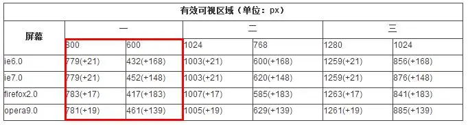

# 项目2 企业网站的首页设计

企业网站的首页设计在网页设计领域中属于企业展示类项目，其设计目的是让目标网页成为用户进入企业网站时的门户，以便向用户展示该企业的品牌信息，并为他们后续访问动作提供进一步的导航功能。在此类项目中，程序员们一方面会充分利用色彩、图片等最为直接的视觉元素来迅速建立企业的品牌形象，另一方面也会通过合理的页面布局设计来有效地展示当前网站所能提供给用户的主要信息，并引导他们快速找到自己所希望了解的内容。因此，企业网站的首页设计也被认为是程序员们在进入到网页设计领域时首先要学会做的基础项目之一。

## 【学习目标】

在本章，笔者将会以一家名为“凌雪冰熊”的连锁饮料店的需求为例为读者演示如何为企业网站的首页，以便展示该饮料店的品牌信息，以便建立起人们对这家连锁饮料店的第一印象。同时，该项目也会为该企业网站后续要设计的新闻活动、产品展示、加盟咨询、留言板等页面设置好统一的外观样式，并预留整合这些页面的导航链接。通过本章项目的实践，读者将会初步了解设计一个企业展示类网页所要执行的基本步骤，以及执行这些步骤所需的基本技术。总而言之，在阅读完本章之后，我们希望读者能够：

- 了解网页设计过程中所能使用的布局方案；
- 掌握如何基于Bootstrap框架来设计网页；
- 了解网站导航栏的作用并掌握其设计方法；

## 【学习场景描述】

现在你是一位刚刚入职到一家名为“凌雪冰熊”连锁饮料店的网页设计师。该饮料店的领导层决定为企业开发一个官方网站，以便向大众更好地展示自己的品牌形象，企业最新的活动，并为潜在的合作伙伴提供咨询信息，以便进一步扩展线下实体店的加盟规模。在这个网页设计项目中，你的主要任务有两个：首先是为该企业网站完成首页部分的设计，以便为该连锁饮料店建立良好的品牌印象。其次，你需要为该网站设计统一的外观样式和导航栏，为后续要进行的新闻活动、加盟咨询、留言板等网页的设计项目打好基础。

## 【任务书】

- **项目名**：凌雪冰熊网站的首页设计
- **委托方**：凌雪冰熊股份有限公司互联网部门
- **项目资料**：
  - 凌雪冰熊官方网站：`http://snowbear.com`；
  - 品牌Logo：如图2-1所示。  
      
    **图1-1**：凌雪冰熊的Logo
- **项目要求**：为凌雪冰熊连锁饮料店的官方网站设计首页，该网页的设计应符合以下要求。
  - 该网页应要呈现凌雪冰熊品牌的Logo并展示该品牌的相关信息；
  - 该网页应立足于整个网站来设计统一的外观样式；
  - 该网页应配备导航栏功能，并为后续网页的设计项目预留位置。
- 时间要求：在3个工作日内完成；

## 【任务拆解】

本章项目的实施过程可以划分为以下三个小任务来进行：

- 创建项目并在项目中引入Bootstrap框架；
- 利用Bootstrap框架完成页面的布局设计；
- 基于Bootstrap框架来设计网站的外观样式；
- 完成导航栏的设计并为后续设计项目预留位置；

## 【工作准备】

在经过了上一章的项目实践之后，读者想必已经对在网页设计工作中会用到的两门计算机标记语言，HTML和CSS有了一个基本的了解。在接下来的项目中，本书将根据要实践的项目场景来分门别类地介绍这两门语言的具体应用。在本章要实践的项目中，我们的任务是完成网页的布局设计，并为整个网站建立统一的导航栏和外观样式。下面就先来介绍一下完成该项目任务所需要掌握的知识点与工具。当然了，如果读者认为自己已经掌握了这部份知识，可自行跳过本节内容，直接进入本章项目的【工作实施与交付】环节。

### 知识点1：HTML5中的布局类标记

和画家在作画时首先要在画布上完成基本的构图作业一样，程序员在接手一个网页设计项目时首先要完成的工作是网页的布局作业。在上一章的项目中，读者用`<div>`标记和CSS中基于`id`属性的选择器在网页中绘制出了一个类似于名片形状的圆角矩形，这个动作就可以被视为网页的布局。在这个动作完成之后，设计师们就可以在这个圆角矩形中填充与名片相关的信息了。在HTML5标准发布之前，网页的布局工作也基本上是依靠`<div>`标记搭配相关的CSS属性选择器来完成的，这种方式在一定程度上给项目代码的可读性带来不良的影响，进而会给项目的维护工作带来麻烦。为了解决这类问题，HTML5标准中新增了许多专用于网页布局的标记，下面是这些标记的基本使用示范。

```HTML
<!DOCTYPE html>
<html lang="zh-cn">
    <head>
        <link rel="stylesheet" href="./styles/main.css">
        <title>布局类标记示例图</title>
    </head>
    <body>
        <header>
            header 标记用于定义网页的头部区域，
            该区域通常用于放置网站的的标题和LOGO。
        </header>
        <nav>nav 标记用于定义网页的导航栏区域。</nav>
        <section>
            <p>标记用于定义网页中的章节区域，
            根据要显示的内容类型，同一网页可被划分为多个章节区域。</p> 
            <aside>aside 标记用于侧边栏区域</aside>
            <article>
                article 标记用于定义一篇文章，
                根据要显示的信息，同一章节中可以有多篇文章。
                <!-- 定义文章标题的标记，h1-h6 -->
                <h1>文章标题</h1>
                <!--定义文章段落的标记 -->
                <p>这是一个段落。</p>
            </article>
        </section>            
        <footer>
            footer 标记用于定义网页的页脚部分，
            该区域通常用于放置与网站的合作方、版权相关的信息。
        </footer>
    </body>
</html>
```

在将上述HTML代码保存为网页文件之后，读者只需要用上一章中介绍过的、最简单的CSS标记选择器给该网页配上一些可让布局效果可视化的外观样式（具体可参考本书附带源码包中的`00_demo/layoutCase`目录中的示例），就可以在用网页浏览器中打开这个网页时看到如图2-2所示的布局效果。


图2-2：HTML5中的布局类标记

在对HTML5的布局类标记有了一个直观的了解之后，下面就可以来具体介绍一下这些标记的作用了。

- `<header>`标记：该标记不仅可用于定义一个网页的头部区域，也可用于定义网页中某个局部区域的头部；
- `<aside>`标记：该标记不仅可用于定义一个页面的侧边栏区域，也可用于定义网页中某个局部区域的侧边栏；
- `<footer>`标记：该标记不仅可用于定义一个网页的页脚区域，也可用于定义网页中某个局部区域的底部；
- `<nav>`标记：该标记主要用于定义网站的导航栏，通常被放置在由`<header>`标记所定义的头部区域下方，或者`<aside>`标记所定义的侧边栏区域中，功能是为网站中的各个主要页面提供导航链接。
- `<section>`标记：该标记通常用于定义一个页面的信息展示区，就像一本书可以有多个章节一样，同一页面中也可以包含多个信息展示区；
- `<article>`标记：该标记通常用于定义一个具体的主题单元，该单元可以是一篇文章，也可以是一个视频/音频播放器或小程序。通常情况下，这些主题单元会被放置在由`<section>`标记所定义的内容展示区中，且同一内容展示区内可以有多个主题单元。

从本质上来说，HTML5中新增的这些布局类标记都可被视为`<div>`标记的别名，它们只不过是语义化了该标记的一些特定应用场景。这样做不仅有利于提高HTML代码的可读性，以便降低网页设计项目的维护难度，还能提升网页对搜索引擎的友好度，使得相关信息更容易被找到。

### 知识点2：网页设计中的尺寸问题

在完成了网页的基本布局工作之后，程序员们接下来的工作就是要为网页设置外观样式了。而在为网页编写CSS样式代码的过程中，程序员们的很大一部分工作都与尺寸问题有关，因为它涉及到如何呈现内容、用户界面元素和整体布局。以下是在网页设计中涉及的尺寸问题的详细介绍：

1. **设备分辨率**：设备分辨率这一概念主要用于量化显示设备（如计算机显示屏、手机屏幕等）能够呈现的图像或视频的清晰度和细节水平。它通常会两个以像素为单位的数字相乘来表示，具体形式是`[水平分辨率]x[垂直分辨率]`。其中，`[水平分辨率]`指的是显示设备在水平方向上可显示的像素单位，而`[垂直分辨率]`指的则是它在垂直方向上可显示的像素单位。例如，如果某个显示设备在水平方向上可显示1920个像素单位，在垂直方向上可显示1080个像素单位，那么该设备的分辨率就可以被表示为`1920x1080`。根据水平和垂直分辨率之间的比例关系。目前市场上常见的、PC显示器的分辨率主要有以下三大类：
   - `16:9`：这一比例的常见分辨率包括`1280×720`、`1366×768`、`1360×768`、`1600×900`、`1920×1080`；
   - `16:10`：这一比例的常见分辨率包括`1280×800`、`1440×900`、`1680×1050`、`1920×1200`；
   - `4:3`：这一比例的常见分辨率包括`800×600`、`1024×768`、`1280×960`、`1400×1050`、`1600×1200`、`1920×1440`、`2048×1536`；

2. **视口尺寸**：视口这一概念主要指的是用户在网页浏览器中看到的有效可视区域，即浏览器窗口中刨除菜单栏、工具栏、侧边栏等软件本身的界面元素之外，真正用于显示网页内容的那个区域。每个浏览器都有自己不同的有效可视区域，例如图2-3中所示的是一些常见浏览器的视口尺寸（单位是`px`，即像素），设计师需要根据这些不同的视口尺寸来进行网页设计工作，以确保网页中显示的内容在各种视口尺寸上都能适应良好。

    

    图2-3：常见浏览器的视口尺寸

3. **布局尺寸**：这一尺寸概念主要用于确定网页中各个元素的相对尺寸和位置，其中的设置对象包括标题、文本、图像、按钮等。通常使用相对单位（如百分比）来确保元素在不同屏幕尺寸上的适应性。

4. **字体尺寸**：指定字体的大小对于网页的可读性和外观非常重要。设计师需要选择适当的字体大小，以确保文字易于阅读，并考虑不同屏幕尺寸上的可读性。

5. **图像尺寸和分辨率**：确保图像的尺寸和分辨率适应不同的屏幕是至关重要的。响应式图像可以用来适应不同屏幕尺寸，减少加载时间和带宽使用。

6. **边距和填充**：边距和填充是指元素周围的空白区域。设计师需要确保合适的边距和填充，以改善页面布局和可读性。

综合考虑这些尺寸问题，网页设计师可以创建适应不同设备和屏幕尺寸的网页，提供出色的用户体验，并确保网页在多种设备与网页浏览器上都能够呈现出符合设计意图的视觉效果，

### 知识点3：Bootstrap框架简介

（介绍<a>标记能创建的各种超链接类型及其在网页中起到的导航作用）

## 【工作实施和交付】

1. 创建侧边导航栏
2. 完成长篇文章排版
3. 统一网页外观样式

## 【拓展知识】

## 【作业】

按照本章设计的线上书籍风格将自己的文章集结成册，创建一个可以网页形式发布的个人文集，例如模仿下面网页进行设计：

## 【作业评价】
