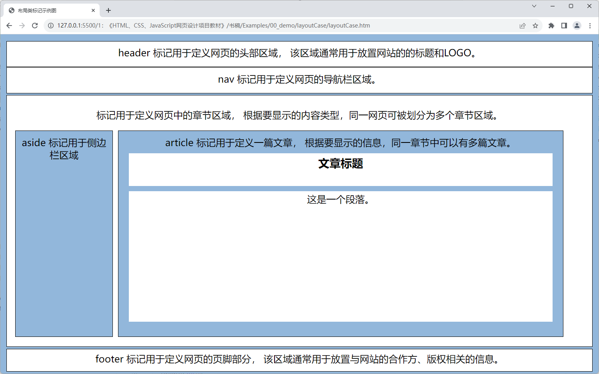

# 项目2 企业网站的首页设计

企业网站的首页设计在网页设计领域中属于企业展示类项目，其设计目的是让目标网页成为用户进入企业网站时的门户，以便向用户展示该企业的品牌信息，并为他们后续访问动作提供进一步的导航功能。在此类项目中，程序员们一方面会充分利用色彩、图片等最为直接的视觉元素来迅速建立企业的品牌形象，另一方面也会通过合理的页面布局设计来有效地展示当前网站所能提供给用户的主要信息，并引导他们快速找到自己所希望了解的内容。因此，企业网站的首页设计也被认为是程序员们在进入到网页设计领域时首先要学会做的基础项目之一。

## 【学习目标】

在本章，笔者将会以一家名为“凌雪冰熊”的连锁饮料店的需求为例为读者演示如何为企业网站的首页，以便展示该饮料店的品牌信息，以便建立起人们对这家连锁饮料店的第一印象。同时，该项目也会为该企业网站后续要设计的新闻活动、产品展示、加盟咨询、留言板等页面设置好统一的外观样式，并预留整合这些页面的导航链接。通过本章项目的实践，读者将会初步了解设计一个企业展示类网页所要执行的基本步骤，以及执行这些步骤所需的基本技术。总而言之，在阅读完本章之后，我们希望读者能够：

- 了解网页设计过程中所能使用的布局方案；
- 掌握如何基于Bootstrap框架来设计网页；
- 了解网站导航栏的作用并掌握其设计方法；

## 【学习场景描述】

现在你是一位刚刚入职到一家名为“凌雪冰熊”连锁饮料店的网页设计师。该饮料店的领导层决定为企业开发一个官方网站，以便向大众更好地展示自己的品牌形象，企业最新的活动，并为潜在的合作伙伴提供咨询信息，以便进一步扩展线下实体店的加盟规模。在这个网页设计项目中，你的主要任务有两个：首先是为该企业网站完成首页部分的设计，以便为该连锁饮料店建立良好的品牌印象。其次，你需要为该网站设计统一的外观样式和导航栏，为后续要进行的新闻活动、加盟咨询、留言板等网页的设计项目打好基础。

## 【任务书】

- **项目名**：凌雪冰熊网站的首页设计
- **委托方**：凌雪冰熊股份有限公司互联网部门
- **项目资料**：
  - 凌雪冰熊官方网站：`http://snowbear.com`；
  - 品牌Logo：如图2-1所示。  
      
    **图1-1**：凌雪冰熊的Logo
- **项目要求**：为凌雪冰熊连锁饮料店的官方网站设计首页，该网页的设计应符合以下要求。
  - 该网页应要呈现凌雪冰熊品牌的Logo并展示该品牌的相关信息；
  - 该网页应立足于整个网站来设计统一的外观样式；
  - 该网页应配备导航栏功能，并为后续网页的设计项目预留位置。
- 时间要求：在3个工作日内完成；

## 【任务拆解】

本章项目的实施过程可以划分为以下三个小任务来进行：

- 创建项目并在项目中引入Bootstrap框架；
- 利用Bootstrap框架完成页面的布局设计；
- 基于Bootstrap框架来设计网站的外观样式；
- 完成导航栏的设计并为后续设计项目预留位置；

## 【工作准备】

在经过了上一章的项目实践之后，读者想必已经对在网页设计工作中会用到的两门计算机标记语言，HTML和CSS有了一个基本的了解。在接下来的项目中，本书将根据要实践的项目场景来分门别类地介绍这两门语言的具体应用。在本章要实践的项目中，我们的任务是完成网页的布局设计，并为整个网站建立统一的导航栏和外观样式。下面就先来介绍一下完成该项目任务所需要掌握的知识点与工具。当然了，如果读者认为自己已经掌握了这部份知识，可自行跳过本节内容，直接进入本章项目的【工作实施与交付】环节。

### 知识点1：HTML5中的布局类标记

和画家在作画时首先要在画布上完成基本的构图作业一样，程序员在接手一个网页设计项目时首先要完成的工作是网页的布局作业。在上一章的项目中，读者用`<div>`标记和CSS中基于`id`属性的选择器在网页中绘制出了一个类似于名片形状的圆角矩形，这个动作就可以被视为网页的布局。在这个动作完成之后，设计师们就可以在这个圆角矩形中填充与名片相关的信息了。在HTML5标准发布之前，网页的布局工作也基本上是依靠`<div>`标记搭配相关的CSS属性选择器来完成的，这种方式在一定程度上给项目代码的可读性带来不良的影响，进而会给项目的维护工作带来麻烦。为了解决这类问题，HTML5标准中新增了许多专用于网页布局的标记，下面是这些标记的基本使用示范。

```HTML
<!DOCTYPE html>
<html lang="zh-cn">
    <head>
        <link rel="stylesheet" href="./styles/main.css">
        <title>布局类标记示例图</title>
    </head>
    <body>
        <header>
            header 标记用于定义网页的头部区域，
            该区域通常用于放置网站的的标题和LOGO。
        </header>
        <nav>nav 标记用于定义网页的导航栏区域。</nav>
        <section>
            <p>标记用于定义网页中的章节区域，
            根据要显示的内容类型，同一网页可被划分为多个章节区域。</p> 
            <aside>aside 标记用于侧边栏区域</aside>
            <article>
                article 标记用于定义一篇文章，
                根据要显示的信息，同一章节中可以有多篇文章。
                <!-- 定义文章标题的标记，h1-h6 -->
                <h1>文章标题</h1>
                <!--定义文章段落的标记 -->
                <p>这是一个段落。</p>
            </article>
        </section>            
        <footer>
            footer 标记用于定义网页的页脚部分，
            该区域通常用于放置与网站的合作方、版权相关的信息。
        </footer>
    </body>
</html>
```

在将上述HTML代码保存为网页文件之后，读者只需要用上一章中介绍过的、最简单的CSS标记选择器给该网页配上一些可让布局效果可视化的外观样式（具体可参考本书附带源码包中的`00_demo/layoutCase`目录中的示例），就可以在用网页浏览器中打开这个网页时看到如图2-2所示的布局效果。



图2-2：HTML5中的布局类标记

在对HTML5的布局类标记有了一个直观的了解之后，下面就可以来具体介绍一下这些标记的作用了。

- `<header>`标记：该标记不仅可用于定义一个网页的头部区域，也可用于定义网页中某个局部区域的头部；
- `<aside>`标记：该标记不仅可用于定义一个页面的侧边栏区域，也可用于定义网页中某个局部区域的侧边栏；
- `<footer>`标记：该标记不仅可用于定义一个网页的页脚区域，也可用于定义网页中某个局部区域的底部；
- `<nav>`标记：该标记主要用于定义网站的导航栏，通常被放置在由`<header>`标记所定义的头部区域下方，或者`<aside>`标记所定义的侧边栏区域中，功能是为网站中的各个主要页面提供导航链接。
- `<section>`标记：该标记通常用于定义一个页面的信息展示区，就像一本书可以有多个章节一样，同一页面中也可以包含多个信息展示区；
- `<article>`标记：该标记通常用于定义一个具体的主题单元，该单元可以是一篇文章，也可以是一个视频/音频播放器或小程序。通常情况下，这些主题单元会被放置在由`<section>`标记所定义的内容展示区中，且同一内容展示区内可以有多个主题单元。

从本质上来说，HTML5中新增的这些布局类标记都可被视为`<div>`标记的别名，它们只不过是语义化了该标记的一些特定应用场景。这样做不仅有利于提高HTML代码的可读性，以便降低网页设计项目的维护难度，还能提升网页对搜索引擎的友好度，使得相关信息更容易被找到。

### 知识点2：尺寸问题与颜色设置

在完成了网页的基本布局工作之后，程序员们接下来的工作就是要为网页设置外观样式了。而在为网页编写CSS样式代码的过程中，网页设计师们很大一部分的工作都与尺寸问题有关，因为它涉及到如何在网页中呈现整体布局设计、图文信息以及用户交互界面等元素。下面先来介绍在网页设计工作中会涉及到的尺寸概念：

1. **设备分辨率**：这一尺寸概念主要用于量化显示设备（如计算机显示屏、手机屏幕等）所显示图像的精细程度，它的具体表达形式是`[水平分辨率]x[垂直分辨率]`。其中，`[水平分辨率]`是显示设备在水平方向上可显示的像素单位，而`[垂直分辨率]`则是它在垂直方向上可显示的像素单位。例如，如果某个显示设备在水平方向上可显示1920个像素单位，在垂直方向上可显示1080个像素单位，那么该设备的分辨率就可以被表示为`1920x1080`。

2. **视口尺寸**：视口这一概念主要指的是用户在网页浏览器中看到的有效可视区域，即浏览器窗口中刨除菜单栏、工具栏、侧边栏等软件本身的界面元素之外，真正用于显示网页内容的那个区域。每个浏览器都有自己不同的有效可视区域。在网页设计工作中，设计师们需要根据这些不同的视口尺寸来进行网页设计工作，以确保网页中显示的内容在各种视口尺寸上都能适应良好。

3. **布局尺寸**：这一尺寸概念主要用于确定网页中各个元素的相对尺寸和位置，其中的设置对象包括布局元素、文本标题与段落、图像、视频播放器等。在CSS代码中，设计师们通常会使用相对长度单位来设置这些元素在不同设备屏幕上的尺寸，以提高它们的适应性。

4. **字体尺寸**：这一尺寸概念主要用于确定字体在网页中的大小。在CSS代码中，设计师们通常使用相对长度单位来设置合适的字体大小，以确保网在不同设备屏幕上的可读性。

5. **内外边距尺寸**：这一尺寸概念主要用于设置网页中各元素内侧与外围的空白区域。在网页设计工作中，设计师们通常需要确保网页中存在着一些合理的空白区域，以提升网页的布局效果及其可读性。

6. **图像的尺寸及分辨率**：这一尺寸概念对于确保网页中的图像能适应不同的设备屏幕是至关重要的。在网页设计工作中，设计师们通常会使用响应式图像完成网页中与图像有关的设计，本书将会在下一章的项目中具体演示这部分知识的应用。

只要能综合利用好上述尺寸概念，网页设计师们就可以创建适应不同显示设备的网页，确保网页在多种设备与网页浏览器上都能够呈现出符合设计意图的视觉效果。为了更好地实现这一目的，本书在这里会建议读者尽可能使用以下相对长度单位来设置网页中的尺寸。

- `px`：这是CSS代码中使用的像素单位，它既不是一个确定的物理量，也不是一个点或者小方块，而是一个抽象概念，因此在CSS代码中使用像素概念时务必要考它具体的运行环境。默认情况下，一个CSS像素应该是等于一个物理像素的宽度。但在一些像素密度较高的显示设备上，一个CSS像素单位也有可能相当于多个物理像素的尺寸；
- `em`: 这是CSS代码中基于网页浏览器中默认字体高度的相对尺寸单位，由于目前主流网页浏览器的默认字体高度为`16px`，所以通常可以认为`1em`等于`16px`；
- `rem`：这是CSS代码中基于当前网页根元素（即`<html>`标记对应的元素）的字体高度来使用的相对尺寸单位。当然，在使用该尺寸单位之前，设计师们必须先确当前网页的根元素对字体高度做了明确的设置；
- `%`：这是CSS代码中当前元素相对于其外层元素的尺度单位，通常用于设置网页中布局尺寸的设计，当然了，在对当前元素使用这个尺度单位之前，设计师们必须先确保其外层元素的相关尺寸已经得到了明确的设置；
- `vm`：这是CSS代码中相对于浏览器视窗宽度的尺度单位，换而言之，`1vw`等于浏览器视窗宽度的`1%`;
- `vh`：这是CSS代码中相对于浏览器视窗高度的尺度单位，换而言之，`1vw`等于浏览器视窗高度的`1%`;

接下来，本书将继续带领读者来了解另一个在网页设计工作中要解决的核心问题：网页的颜色设置问题， 毕竟网页设计师在网页配色方面的能力对于网站的用户体验和品牌标识具有着非常重要的影响。因此，在启动一个网页设计项目时，设计师们首先要做的通常就是要为网站设计一个符合其所在企业及其品牌的整体配色方案，合适的配色方案会增强用户对网站的认知和记忆。为了更好达成这一目的，读者在设计网站的配色方案时通常需要选择好其网页要使用的主要颜色、辅助颜色和背景颜色，而关于颜色的选择，设计师们通常会基于以下因素来完成他们的工作。

1. **品牌标识**：网站的颜色选择应与品牌标识保持一致。这有助于建立品牌的视觉一致性和识别度。

2. **色彩心理学**：不同颜色可以激发不同的情感和反应。设计师需要考虑色彩心理学，以确保所选颜色与网站的目标和内容一致。例如，蓝色通常与冷静和信任相关，红色可能传达激情和警戒。

3. **对比度和可读性**：文本和背景之间的对比度对于文字的可读性至关重要。设计师需要确保文本颜色与背景颜色形成足够的对比，以使文本易于阅读。

4. **无障碍性**：为了确保网站对所有用户都友好，设计师需要考虑颜色对于视力受损人士的可访问性。这包括选择对比度较大的颜色，以便视力受损用户也能轻松阅读和浏览内容。

5. **颜色命名和文档**：为了便于团队合作和维护，设计师通常会为所使用的颜色进行命名，并记录它们的代码值（如Hex或RGB）。这些信息可以记录在设计文档中。


### 知识点3：Bootstrap框架简介

## 【工作实施和交付】

1. 创建侧边导航栏
2. 完成长篇文章排版
3. 统一网页外观样式

## 【拓展知识】

## 【作业】

按照本章设计的线上书籍风格将自己的文章集结成册，创建一个可以网页形式发布的个人文集，例如模仿下面网页进行设计：

## 【作业评价】
