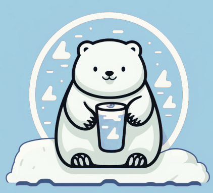
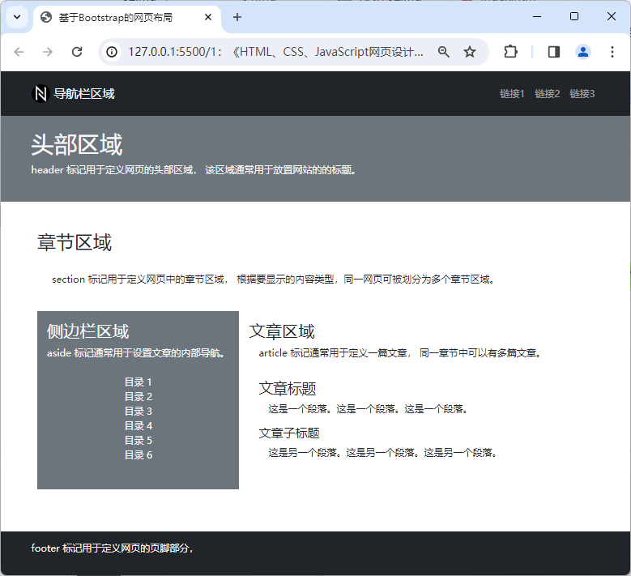
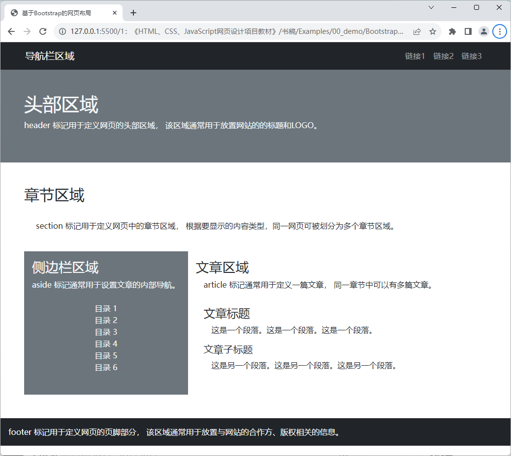

# 项目2 企业网站的首页设计

企业网站的首页设计在网页设计领域中属于企业展示类项目，其设计目的是让目标网页成为用户进入企业网站时的门户，以便向用户展示该企业的品牌信息，并为他们后续访问动作提供进一步的导航功能。在此类项目中，程序员们一方面会充分利用色彩、图片等最为直接的视觉元素来迅速建立企业的品牌形象，另一方面也会通过合理的页面布局设计来有效地展示当前网站所能提供给用户的主要信息，并引导他们快速找到自己所希望了解的内容。因此，企业网站的首页设计也被认为是程序员们在进入到网页设计领域时首先要学会做的基础项目之一。

## 【学习目标】

在本章，笔者将会以一家名为“凌雪冰熊”的连锁饮料店的需求为例为读者演示如何为企业网站的首页，以便展示该饮料店的品牌信息，以便建立起人们对这家连锁饮料店的第一印象。同时，该项目也会为该企业网站后续要设计的新闻活动、产品展示、加盟咨询、留言板等页面设置好统一的外观样式，并预留整合这些页面的导航链接。通过本章项目的实践，读者将会初步了解设计一个企业展示类网页所要执行的基本步骤，以及执行这些步骤所需的基本技术。总而言之，在阅读完本章之后，我们希望读者能够：

- 了解网页设计过程中所能使用的布局方案；
- 掌握如何基于Bootstrap框架来设计网页；
- 了解网站导航栏的作用并掌握其设计方法；

## 【学习场景描述】

现在你是一位刚刚入职到一家名为“凌雪冰熊”连锁饮料店的网页设计师。该饮料店的领导层决定为企业开发一个官方网站，以便向大众更好地展示自己的品牌形象，企业最新的活动，并为潜在的合作伙伴提供咨询信息，以便进一步扩展线下实体店的加盟规模。在这个网页设计项目中，你的主要任务有两个：首先是为该企业网站完成首页部分的设计，以便为该连锁饮料店建立良好的品牌印象。其次，你需要为该网站设计统一的外观样式和导航栏，为后续要进行的新闻活动、加盟咨询、留言板等网页的设计项目打好基础。

## 【任务书】

- **项目名**：凌雪冰熊网站的首页设计
- **委托方**：凌雪冰熊股份有限公司互联网部门
- **项目资料**：
  - 凌雪冰熊官方网站：`http://snowbear.com`；
  - 品牌Logo：如图2-1所示。  
      
    **图1-1**：凌雪冰熊的Logo
- **项目要求**：为凌雪冰熊连锁饮料店的官方网站设计首页，该网页的设计应符合以下要求。
  - 该网页应要呈现凌雪冰熊品牌的Logo并展示该品牌的相关信息；
  - 该网页应立足于整个网站来设计统一的外观样式；
  - 该网页应配备导航栏功能，并为后续网页的设计项目预留位置。
- 时间要求：在3个工作日内完成；

## 【任务拆解】

本章项目的实施过程可以划分为以下三个小任务来进行：

- 创建项目并在项目中引入Bootstrap框架；
- 利用Bootstrap框架完成页面的布局设计；
- 基于Bootstrap框架来设计网站的外观样式；
- 完成导航栏的设计并为后续设计项目预留位置；

## 【工作准备】

在经过了上一章的项目实践之后，读者想必已经对在网页设计工作中会用到的两门计算机标记语言，HTML和CSS有了一个基本的了解。在接下来的项目中，本书将根据要实践的项目场景来分门别类地介绍这两门语言的具体应用。在本章要实践的项目中，我们的任务是完成网页的布局设计，并为整个网站建立统一的导航栏和外观样式。下面就先来介绍一下完成该项目任务所需要掌握的知识点与工具。当然了，如果读者认为自己已经掌握了这部份知识，可自行跳过本节内容，直接进入本章项目的【工作实施与交付】环节。

### 知识点1：HTML5中的布局类标记

和画家在作画时首先要在画布上完成基本的构图作业一样，程序员在接手一个网页设计项目时首先要完成的工作是网页的布局作业。在上一章的项目中，读者用`<div>`标记和CSS中基于`id`属性的选择器在网页中绘制出了一个类似于名片形状的圆角矩形，这个动作就可以被视为网页的布局。在这个动作完成之后，设计师们就可以在这个圆角矩形中填充与名片相关的信息了。在HTML5标准发布之前，网页的布局工作也基本上是依靠`<div>`标记搭配相关的CSS属性选择器来完成的，这种方式在一定程度上给项目代码的可读性带来不良的影响，进而会给项目的维护工作带来麻烦。为了解决这类问题，HTML5标准中新增了许多专用于网页布局的标记，下面是这些标记的基本使用示范。

```HTML
<!DOCTYPE html>
<html lang="zh-CN">
    <head>
        <link rel="stylesheet" href="./styles/main.css">
        <title>布局类标记示例图</title>
    </head>
    <body>
        <header>
            header 标记用于定义网页的头部区域，
            该区域通常用于放置网站的的标题和LOGO。
        </header>
        <nav>nav 标记用于定义网页的导航栏区域。</nav>
        <section>
            <p>标记用于定义网页中的章节区域，
            根据要显示的内容类型，同一网页可被划分为多个章节区域。</p> 
            <aside>aside 标记用于侧边栏区域</aside>
            <article>
                article 标记用于定义一篇文章，
                根据要显示的信息，同一章节中可以有多篇文章。
                <!-- 定义文章标题的标记，h1-h6 -->
                <h1>文章标题</h1>
                <!--定义文章段落的标记 -->
                <p>这是一个段落。</p>
            </article>
        </section>            
        <footer>
            footer 标记用于定义网页的页脚部分，
            该区域通常用于放置与网站的合作方、版权相关的信息。
        </footer>
    </body>
</html>
```

在将上述HTML代码保存为网页文件之后，读者只需要用上一章中介绍过的、最简单的CSS标记选择器给该网页配上一些可让布局效果可视化的外观样式（具体可参考本书附带源码包中的`00_demo/layoutCase`目录中的示例），就可以在用网页浏览器中打开这个网页时看到如图2-2所示的布局效果。


图2-2：HTML5中的布局类标记

在对HTML5的布局类标记有了一个直观的了解之后，下面就可以来具体介绍一下这些标记的作用了。

- `<header>`标记：该标记不仅可用于定义一个网页的头部区域，也可用于定义网页中某个局部区域的头部；
- `<aside>`标记：该标记不仅可用于定义一个页面的侧边栏区域，也可用于定义网页中某个局部区域的侧边栏；
- `<footer>`标记：该标记不仅可用于定义一个网页的页脚区域，也可用于定义网页中某个局部区域的底部；
- `<nav>`标记：该标记主要用于定义网站的导航栏，通常被放置在由`<header>`标记所定义的头部区域下方，或者`<aside>`标记所定义的侧边栏区域中，功能是为网站中的各个主要页面提供导航链接。
- `<section>`标记：该标记通常用于定义一个页面的信息展示区，就像一本书可以有多个章节一样，同一页面中也可以包含多个信息展示区；
- `<article>`标记：该标记通常用于定义一个具体的主题单元，该单元可以是一篇文章，也可以是一个视频/音频播放器或小程序。通常情况下，这些主题单元会被放置在由`<section>`标记所定义的内容展示区中，且同一内容展示区内可以有多个主题单元。

从本质上来说，HTML5中新增的这些布局类标记都可被视为`<div>`标记的别名，它们只不过是语义化了该标记的一些特定应用场景。这样做不仅有利于提高HTML代码的可读性，以便降低网页设计项目的维护难度，还能提升网页对搜索引擎的友好度，使得相关信息更容易被找到。

### 知识点2：尺寸设置与配色方案

在完成了网页的基本布局之后，接下来的工作就是要为网页设计外观样式了。在使用CSS定义外观样式的过程中，网页设计师们很大一部分的工作都与尺寸和配色问题有关，因为这两个问题涉及到如何在网页中呈现整体页面布局、图文信息以及用户交互界面等元素。下面先来介绍在网页设计工作中会涉及到的尺寸问题。

#### 网页设计中的尺寸问题

在网页设计工作中，页面中各元素的尺寸设置是设计师们要解决的一个关键问题，因为这直接关系到布局类元素、图文类元素、用户交互类元素在网页上的位置与呈现范围，以及这些元素彼此之间的距离。为了解决好这个关键问题，设计师们在设置网页中各元素的尺寸时需要了解以下概念：

1. **设备分辨率**：这一尺寸概念主要用于量化显示设备（如计算机显示屏、手机屏幕等）所显示图像的精细程度，它的具体表达形式是`[水平分辨率]x[垂直分辨率]`。其中，`[水平分辨率]`是显示设备在水平方向上可显示的像素单位，而`[垂直分辨率]`则是它在垂直方向上可显示的像素单位。例如，如果某个显示设备在水平方向上可显示1920个像素单位，在垂直方向上可显示1080个像素单位，那么该设备的分辨率就可以被表示为`1920x1080`。
2. **视口尺寸**：视口这一概念主要指的是用户在网页浏览器中看到的有效可视区域，即浏览器窗口中刨除菜单栏、工具栏、侧边栏等软件本身的界面元素之外，真正用于显示网页内容的那个区域。每个浏览器都有自己不同的有效可视区域。在网页设计工作中，设计师们需要根据这些不同的视口尺寸来进行网页设计工作，以确保网页中显示的内容在各种视口尺寸上都能适应良好。
3. **布局尺寸**：这一尺寸概念主要用于确定网页中各个元素的相对尺寸和位置，其中的设置对象包括布局元素、文本标题与段落、图像、视频播放器等。在CSS代码中，设计师们通常会使用相对长度单位来设置这些元素在不同设备屏幕上的尺寸，以提高它们的适应性。
4. **字体尺寸**：这一尺寸概念主要用于确定字体在网页中的大小。在CSS代码中，设计师们通常使用相对长度单位来设置合适的字体大小，以确保网在不同设备屏幕上的可读性。
5. **内外边距尺寸**：这一尺寸概念主要用于设置网页中各元素内侧与外围的空白区域。在网页设计工作中，设计师们通常需要确保网页中存在着一些合理的空白区域，以提升网页的布局效果及其可读性。
6. **图像的尺寸及分辨率**：这一尺寸概念对于确保网页中的图像能适应不同的设备屏幕是至关重要的。在网页设计工作中，设计师们通常会使用响应式图像完成网页中与图像有关的设计，本书将会在下一章的项目中具体演示这部分知识的应用。

只要能综合利用好上述尺寸概念，网页设计师们就可以设计出能适应不同显示设备的网页，确保这些网页在多种设备与网页浏览器上都能够呈现出符合设计意图的视觉效果。为了能更好地实现这一目的，本书在这里建议读者尽可能使用以下相对长度单位来设置网页中的尺寸。

- `px`：这是CSS代码中使用的像素单位，它既不是一个确定的物理量，也不是一个点或者小方块，而是一个抽象概念，因此在CSS代码中使用像素概念时务必要考它具体的运行环境。默认情况下，一个CSS像素应该是等于一个物理像素的宽度。但在一些像素密度较高的显示设备上，一个CSS像素单位也有可能相当于多个物理像素的尺寸；
- `em`: 这是CSS代码中基于网页浏览器中默认字体高度的相对尺寸单位，由于目前主流网页浏览器的默认字体高度为`16px`，所以通常可以认为`1em`等于`16px`；
- `rem`：这是CSS代码中基于当前网页根元素（即`<html>`标记对应的元素）的字体高度来使用的相对尺寸单位。当然，在使用该尺寸单位之前，设计师们必须先确当前网页的根元素对字体高度做了明确的设置；
- `%`：这是CSS代码中当前元素相对于其外层元素的尺度单位，通常用于设置网页中布局尺寸的设计，当然了，在对当前元素使用这个尺度单位之前，设计师们必须先确保其外层元素的相关尺寸已经得到了明确的设置；
- `vm`：这是CSS代码中相对于浏览器视窗宽度的尺度单位，换而言之，`1vw`等于浏览器视窗宽度的`1%`;
- `vh`：这是CSS代码中相对于浏览器视窗高度的尺度单位，换而言之，`1vw`等于浏览器视窗高度的`1%`;

#### 网页设计中的配色问题

下面来继续介绍另一个网页设计师们在网页设计工作中要解决的关键问题：设计网页的配色方案，该问题对于网站的用户体验和品牌标识具有着非常重要的影响。因此，在启动一个网页设计项目时，设计师们首要任务之一就是要为网站设计一个符合其所属企业或个人的配色方案，以便增强用户对相关品牌标识的认知和记忆。例如，如今的人看到黄底黑字的配色很容易联想到美团外卖，看到红加白的配色可能就会联想到蜜雪冰城等。为了能更好达成这一目的，读者在设计网站的配色方案时通常需要选择好其网页要使用的主要颜色、辅助颜色和背景颜色，而关于颜色的选择，设计师们通常会基于以下因素来完成他们的工作。

1. **品牌标识**：设计师们在为网站选择配色方案时通常都要与该网站所属企业或个人的品牌标识保持一致，这样做将有助于建立品牌的视觉一致性和识别度。
2. **色彩心理学**：设计师们需要了解不同颜色可以激发不同的情感和反应，以确保自己所选的配色方案与网站所要传递的信息内容在目标上保持一致。例如，蓝色通常与冷静和信任相关，红色可能传达激情和警戒。
3. **对比度和可读性**：在网页中，文本和背景之间的对比度对于文字的可读性至关重要。因此，设计师们在设计配色方案时需要让文本在颜色上与其背景之间形成足够的对比，以使提高文本的可读性。
4. **无障碍性**：为了确保网站对所有用户都友好，设计师们在设计配色方案时需要充分考虑颜色对于视力受损人士的可访问性。例如，选择对比度较大的颜色，以便视力受损用户也能轻松阅读和浏览内容。

在选择好配色方案之后，设计师们的下一个任务是将该配色方案编写成CSS样式代码。在这个任务中，设计师们首先需要将配色方案中的每个颜色进行编码，以便能被计算机及其软件识别并渲染在显示设备中。下面是几种在CSS样式代码中常用的颜色编码方式：

1. **RGB**：RGB是一种将红色、绿色和蓝色组合在一起来表示颜色的方法。每个颜色通道的取值范围是0到255，其中0表示没有颜色，255表示最大强度的颜色。通过调整三个通道的数值，可以创建各种不同的颜色。例如，纯红色可以表示为RGB(255, 0, 0)。
2. **Hex**：即十六进制颜色代码，这是一种使用六个字符（0-9和A-F）来表示颜色的方法。每个字符对应于RGB通道的强度值。前两个字符表示红色通道，中间两个字符表示绿色通道，最后两个字符表示蓝色通道。例如，纯红色可以表示为#FF0000。
3. **HSL**：HSL是一种使用色相、饱和度和亮度三个参数来表示颜色的方法。色相表示颜色在色轮上的位置，取值范围是0到360度。饱和度表示颜色的纯度或灰度程度，取值范围是0%到100%。亮度表示颜色的明亮程度，取值范围是0%到100%。通过调整这三个参数的值，可以创建各种不同的颜色。
4. **RGBA**：RGBA是一种与RGB类似的表示颜色的方法，但多了一个透明度通道。透明度通道的取值范围是0到1，其中0表示完全透明，1表示完全不透明。RGBA可以用于创建具有不同透明度的颜色，使得网页元素可以显示出层次感和透明效果。

在颜色在计算机中的编码方式之后，读者接下来要做的是将颜色编码定义成可在CSS样式代码中重复使用的变量（这在维护和修改样式时非常有用）。这个任务可以利用CSS提供的自定义属性来实现。在这里，本书会建议读者按照以下步骤来完成这个任务。

1. 首先定义一个名为`:root`的伪根类选择器，并将要使用的颜色编码设置成该选择器的自定义属性（只有`:root`伪类选择器的自定义属性可被全局使用，一般选择器的自定义属性只能在与之匹配的页面元素中被使用）。按照约定俗成，设计师们通常会使用`--`前缀来表示这些自定义颜色的名称。例如，读者可以先像下面这样在`:root`伪类选择器中定义了一个名为`--primary-bg-color`的自定义属性，并用RGB的编码方式将它的值设置成`rgb(164, 205, 223)`。

    ```css
    :root {
        --primary-bg-color: rgb(164, 205, 223);
    }
    ```

2. 接下来，读者就可以在整个CSS样式表中通过`var( --primary-bg-color)`的方式来使用这个自定义颜色了。通过这种方式，设计师们就可以轻松地在整个CSS样式文件中引用相同的颜色值，而不必多次输入Hex或RGB编码。如果需要更改颜色，只需在`:root`伪类中更新自定义属性的值即可，而不必在整个样式文件中查找并替换颜色值。例如，读者可以选择像下面这样将一系列页面元素的背景色（即这些元素的`background-color`）设置成这个自定义颜色。之后如果想修改这些页面元素的背景色，就只需要修改`:root`伪类的`--primary-bg-color`属性值即可。

    ```css
    body {
        /* 设置网页主体部分的背景色 */        
        background-color: var(--primary-bg-color);
    }

    #box {
         /* 设置网页中id=“box”的元素所使用的背景色 */
        background-color: var(--primary-bg-color);
    }

    .button {
         /* 设置网页中class="button"的元素所使用的背景色 */
        background-color: var(--primary-bg-color);
    }
    ```

当然了，考虑到CSS本身也为用户提供了一系列预定义的颜色名称，本书在这里会建议读者在对自己使用的颜色编码进行命名之前，最好先查看一下该颜色编码是否已经存在于CSS的预定义颜色表中（参考表2-1），以避免重复发明轮子，浪费了自己宝贵的时间。

| 颜色名称   | 颜色值       | 颜色名称   | 颜色值       | 颜色名称   | 颜色值       |
| ----------- | ------------ | ----------- | ------------ | ----------- | ------------ |
| AliceBlue   | #F0F8FF      | AntiqueWhite| #FAEBD7      | Aqua        | #00FFFF      |
| Aquamarine  | #7FFFD4      | Azure       | #F0FFFF      | Beige       | #F5F5DC      |
| Bisque      | #FFE4C4      | Black       | #000000      | BlanchedAlmond | #FFEBCD   |
| Blue        | #0000FF      | BlueViolet  | #8A2BE2      | Brown       | #A52A2A      |
| BurlyWood   | #DEB887      | CadetBlue   | #5F9EA0      | Chartreuse  | #7FFF00      |
| Chocolate   | #D2691E      | Coral       | #FF7F50      | CornflowerBlue | #6495ED   |
| Cornsilk    | #FFF8DC      | Crimson     | #DC143C      | Cyan        | #00FFFF      |
| DarkBlue    | #00008B      | DarkCyan    | #008B8B      | DarkGoldenRod | #B8860B   |
| DarkGray    | #A9A9A9      | DarkGreen   | #006400      | DarkKhaki   | #BDB76B      |
| DarkMagenta | #8B008B      | DarkOliveGreen | #556B2F   | DarkOrange  | #FF8C00      |
| DarkOrchid  | #9932CC      | DarkRed     | #8B0000      | DarkSalmon  | #E9967A      |
| DarkSeaGreen | #8FBC8F    | DarkSlateBlue | #483D8B    | DarkSlateGray | #2F4F4F    |
| DarkTurquoise | #00CED1    | DarkViolet  | #9400D3      | DeepPink    | #FF1493      |
| DeepSkyBlue | #00BFFF      | DimGray     | #696969      | DodgerBlue  | #1E90FF      |
| FireBrick   | #B22222      | FloralWhite | #FFFAF0      | ForestGreen | #228B22      |
| Fuchsia     | #FF00FF      | Gainsboro   | #DCDCDC      | GhostWhite  | #F8F8FF      |
| Gold        | #FFD700      | GoldenRod   | #DAA520      | Gray        | #808080      |
| Green       | #008000      | GreenYellow | #ADFF2F      | HoneyDew    | #F0FFF0      |
| HotPink     | #FF69B4      | IndianRed   | #CD5C5C      | Indigo      | #4B0082      |
| Ivory       | #FFFFF0      | Khaki       | #F0E68C      | Lavender    | #E6E6FA      |
| LavenderBlush | #FFF0F5    | LawnGreen   | #7CFC00      | LemonChiffon | #FFFACD    |
| LightBlue   | #ADD8E6      | LightCoral  | #F08080      | LightCyan   | #E0FFFF      |
| LightGoldenRodYellow | #FAFAD2 | LightGray   | #D3D3D3      | LightGreen  | #90EE90      |
| LightPink   | #FFB6C1      | LightSalmon | #FFA07A      | LightSeaGreen | #20B2AA    |
| LightSkyBlue | #87CEFA     | LightSlateGray | #778899   | LightSteelBlue | #B0C4DE   |
| LightYellow | #FFFFE0      | Lime        | #00FF00      | LimeGreen   | #32CD32      |
| Linen       | #FAF0E6      | Magenta     | #FF00FF      | Maroon      | #800000      |
| MediumAquaMarine | #66CDAA | MediumBlue  | #0000CD      | MediumOrchid | #BA55D3    |
| MediumPurple | #9370DB     | MediumSeaGreen | #3CB371   | MediumSlateBlue | #7B68EE   |
| MediumSpringGreen | #00FA9A | MediumTurquoise | #48D1CC  | MediumVioletRed | #C71585  |
| MidnightBlue | #191970    | MintCream   | #F5FFFA      | MistyRose   | #FFE4E1      |
| Moccasin    | #FFE4B5      | NavajoWhite | #FFDEAD      | Navy        | #000080      |
| OldLace     | #FDF5E6      | Olive       | #808000      | OliveDrab   | #6B8E23      |
| Orange      | #FFA500      | OrangeRed   | #FF4500      | Orchid      | #DA70D6      |
| PaleGoldenRod | #EEE8AA   | PaleGreen   | #98FB98      | PaleTurquoise | #AFEEEE    |
| PaleVioletRed | #DB7093   | PapayaWhip  | #FFEFD5      | PeachPuff   | #FFDAB9      |
| Peru        | #CD853F      | Pink        | #FFC0CB      | Plum        | #DDA0DD      |
| PowderBlue  | #B0E0E6      | Purple      | #800080      | RebeccaPurple | #663399    |
| Red         | #FF0000      | RosyBrown   | #BC8F8F      | RoyalBlue   | #4169E1      |
| SaddleBrown | #8B4513      | Salmon      | #FA8072      | SandyBrown  | #F4A460      |
| SeaGreen    | #2E8B57      | SeaShell    | #FFF5EE      | Sienna      | #A0522D      |
| Silver      | #C0C0C0      | SkyBlue     | #87CEEB      | SlateBlue   | #6A5ACD      |
| SlateGray   | #708090      | Snow        | #FFFAFA      | SpringGreen | #00FF7F      |
| SteelBlue   | #4682B4      | Tan         |

表2-1：CSS中的预定义颜色

在实际项目实践中，设计师常常会根据自己的偏好和项目的具体需求来搭配使用上面这些颜色表述方法，以便设计出可文档化的网页配色方案，比如使用RGB或Hex代码来表示颜色，同时使用HSL来调整颜色的亮度和饱和度。

### 知识点3：CSS基本语法

在了解了设计网页外观样式时要做的基本工作内容之后，读者接下来就可以正式开始学习如何编写CSS样式代码了。在CSS3标准制定的规则，一段完整的样式定义通常由选择器、属性名称和属性值三个语法单元，以及在必要时才会添加的代码注释组成，其基本语法如下：

```css
[选择器1] {
    [属性名称1]: [属性值1];
    [属性名称]2: [属性值2];
    [属性名称3]: [属性值3];
    /* 注释：同一段样式定义中可设置多个属性 */    .
    [属性名称n]: [属性值n];
}
[选择器2] {
    [属性名称1]: [属性值1];
    [属性名称]2: [属性值2];
    [属性名称3]: [属性值3];
    [属性名称n]: [属性值n];
}
/* 注释：同一CSS文件中可包含多段样式定义 */
[选择器n] {
    [属性名称1]: [属性值1];
    [属性名称]2: [属性值2];
    [属性名称3]: [属性值3];
    [属性名称n]: [属性值n];
}
```

下面，让我们来详细介绍一下上述基本语法中使用到的语法单元及其各自的编写方式。

- **选择器**：`[选择器]`的作用是匹配指定的页面元素，以便将样式应用于它们。选择器可以基于页面元素所对应的HTML标签名，及该标签的`class`、`id`等属性名等来进行匹配。关于这些选择器类型及其匹配元素的具体方式，本书已经在第1章中做了详细地介绍，这里就不再重复了：

- **属性名称**：`[属性名称]`的作用是指定被设置样式的具体项。在CSS代码中，一段样式定义可以指定的具体项取决于`[选择器]`单元所匹配的页面元素，例如，对于`<header>`、`<nav>`这一类页面元素来说，设计师们可以设置的常见具体样式项主要包括：
  - `height`：设置页面元素的垂直高度；
  - `width`：设置页面元素的水平宽度；
  - `margin`：设置页面元素的外边距；
  - `padding`：设置页面元素的内边距；
  - `font-size`：设置页面元素中文本的字体大小；
  - `border`：设置页面元素的边框；
  - `color`：设置页面元素中文本的字体颜色；
  - `background-color`：设置页面元素的背景颜色；

- **属性值**：`[属性值]`的作用是为`[属性名称]`所指定的样式项目设置具体的值，它的取值类型和范围取决于它要设置的`[属性名称]`，例如：
  - 对于`height`、`margin`之类的、与尺寸问题相关的`[属性名称]`，它的取值就是以`px`、`em`或`%`为单位的数字；
  - 对于`background-color`这种与颜色相关的`[属性名称]`，它的取值就是Hex、RGB之类的颜色编码，或者CSS预定义的颜色名称；
  - 对于`background-image`这种与多媒体文件相关的`[属性名称]`，它的取值就是用于表示该文件所在位置的字符串；

- **代码注释**：在CSS代码中，注释单元通常CSS注释以`/*`开始，以`*/`结束。它主要用于在某一段CSS代码隐晦不明时对其进行文字说明，以便增强代码的可读性，并不会被网页浏览器渲染。例如，对于之前那个用于示范布局类标记的示例（具体可参考本书附带源码包中的`00_demo/layoutCase`目录），我们基于教学目的将它的CSS样式代码注释如下：
  
     ```css
    /* 只有`:root`伪类选择器的自定义属性可被全局使用，
    * 一般选择器的自定义属性只能在被其匹配的元素中使用
    */
    :root {
        --primary-bg-color: rgb(164, 205, 223);
    }

    /* 为了在后续代码中顺利使用相对尺寸单位，
    *  在这里必须要先利用html根标记的选择器建立一个基准
    */
    html {
        /* 将网页的基准高度设置为浏览器的视口高度*/
        height: 100%; 
        /* 将网页的基准宽度设置为浏览器的视口宽度 */
        width: 100%;
        /* 设置网页使用的默认字体大小为16个像素单位*/
        font-size: 16px;
    }

    /* 匹配body标签，用于定义整个网页所在区域的样式 */
    body {
        /* 设置被匹配标签所在元素的高度：为网页基准高度的90% */
        height: 90%;
        /* 设置被匹配标签所在元素的背景色 */
        background-color: var(--primary-bg-color);
        /* 设置被匹配标签所在元素的内边距 */
        padding: 1vh 0.5vw;
    }

    /* 匹配header标签，用于定义网页头部区域的样式 */
    header {
        height: 5%;
        background-color: white;
        padding: 1.5vh;
        font-size: 1.5rem;
        text-align: center;
        border: 1px solid;
    }

    /* 匹配nav标签，用于定义网页导航栏区域的样式 */
    nav {
        height: 5%;
        background-color: white;
        padding: 1.5vh;
        border: 1px solid;
        font-size: 1.5rem;
        text-align: center;
    }

    /* 匹配section标签，用于定义网页主体区域的样式 */
    section {
        height: 80%;
        background-color: white;
        margin: 0.5vh 0;
        padding: 1vh 0.5vw;
        font-size: 1.5em;
        border: 1px solid;
        text-align: center;
    }

    /* 匹配aside标签，用于定义网页侧边栏区域的样式 */
    aside {
        float: left;
        height: 80%;
        width: 15%;
        background-color: var(--primary-bg-color);
        margin-left: 1.5vh;
        padding: 1.5vh;
        border: 1px solid;
        font-size: 1.5rem;
        text-align: center;
    }

    /* 匹配article标签，用于网页中某一特定内容区域的样式 */
    article {
        float: left;
        height: 80%;
        width: 75%;
        background-color: var(--primary-bg-color);
        margin-left: 1.5vh;
        padding: 1.5vh;
        border: 1px solid;
        font-size: 1.5rem;
        text-align: center;
    }
    /* 匹配article标签下的h1标签 */
    article h1 {
        height: 15%;
        background-color: white;
        margin: 1.5vh;
        padding: 0.5vh;
    }
    /* 匹配article标签下的p标签 */
    article p {
        height: 65%;
        background-color: white;
        margin: 1.5vh;
        padding: 0.5vh;
    }

    /* 匹配footer标签，用于定义网页底部区域的样式 */
    footer {
        height: 5%;
        background-color: white;
        padding: 1vh 0.5vw;
        border: 1px solid;
        font-size: 1.5rem;
        text-align: center;
    }
     ```

以上就是CSS的基本语法，读者可以利用这套语法来创建一系列样式规则，以便完成对页面元素的外观设计。除此之外，CSS的强大之处还在于它的层叠性，这意味着网页设计师们可以使用不同的、可相互叠加的CSS样式规则来控制元素的外观，从而实现复杂而精致的网页设计效果。

## 【工作实施和交付】

在完成了上述知识准备之后，读者现在就可以根据之前【任务书】中的要求来着手实施“凌雪冰熊”网站的首页项目了，该项目的实施过程可以分为以下步骤来进行。

### 第1步：建立项目并将其纳入源码管理机制

1. 首先，读者需要在Powershell或Bash Shell这类命令行终端环境中打开之前在上一章中创建的、约定用于存放示例项目的`Examples`目录，并在其中创建一个名为`02_HomePage`的文件夹，以充当本章示例项目的根目录。

2. 然后，读者需要使用VS Code编辑器打开这个刚刚创建的`02_HomePage`目录，并在该目录下创建一个名为`index.htm`的空文件。

3. 接下来，读者需要继续在项目的根目录下创建两个子目录：第一个名子目录为`styles`，并在其中创建一个名为`main.css`的CSS文件这将是网页的主样式文件；第二个子目录名为`img`，将用于存放网页中将会用到图片文件。如此以来，整个项目的目录结构如下。

    ```bash
    02_HomePage
    ├──index.html
    ├──img
    │   ├──logo.png
    └──styles
         ├──main.css
    ```

4. 最后，读者就只需要回到之前的命令行终端环境中，并在`Examples`目录中执行以下命令即可完成本章项目的第一次版本提交。

    ```bash
    git add .
    git commit -m "项目2：网站首页"
    ```

### 第2步：完成网页布局与外观设计

1. 首先，读者需要使用VS Code编辑器打开之前创建的`index.htm`文件并使用HTML布局类标记完成网页的布局设计，这需要在其中输入以下代码。

    ```html
    <!DOCTYPE html>
    <html lang="zh-CN">
        <head>
            <meta charset="UTF-8">
            <title>凌雪冰熊</title>
            <link rel="stylesheet" href="styles/main.css">
        </head>
        <body>
            <header>
                    <div id="logo">
                        
                    </div>
                    <h1>欢迎来到凌雪冰熊的世界！</h1>
                    <nav>
                        <ul>
                            <li><a href="index.htm">首页</a></li>
                            <li><a href="">新闻活动</a></li>
                            <li><a href="">产品展示</a></li>
                            <li><a href="">加盟咨询</a></li>
                            <li><a href="">留言板</a></li>
                        </ul>
                    </nav>
                </header>
            <section id="main">
                <article id="about">
                    <h2>品牌介绍：</h2>
                    
                    <div>
                            <h3>凌雪冰熊，您的高品质饮品与冰激淋专家！</h3>
                            <p>自2010年成立以来，凌雪冰熊一直是您休闲时光的最佳选择。我们引以为豪的团队致力于为您提供无与伦比的高品质饮品和冰激淋，让您的口腔和心灵都沉浸在美味的享受中。我们的连锁饮料店已经遍布全国多个城市，数十家门店为您提供便利。无论您身在何处，都能轻松找到我们的店铺，品尝到我们独特的口味和精心调配的饮品。</p>
                            <p>凌雪冰熊以创新和品质为核心价值观。我们的饮品和冰激淋都由经验丰富的调酒师和烹饪师精心制作，确保每一杯都是独一无二的美味。我们只选用新鲜的、优质的原材料，以确保您享受到最纯正的口感和最高的营养价值。无论您是喜欢清新果味、浓郁巧克力还是奶茶的爱好者，我们都有适合您的选择。我们的饮品菜单涵盖了各种经典和创新口味，满足您对口感和口味的不同需求。此外，我们还提供多种口感丰富的冰激淋，让您在炎炎夏日中尽情享受冰凉的快乐。</p>
                            <p>凌雪冰熊的目标是不断拓展，为更多用户提供服务。我们将继续开设新的门店，让更多的人品尝到我们的美味。我们的团队将不断努力，为您带来更多惊喜和愉悦的体验。无论是与朋友聚会、与家人共度时光，还是独自一人享受宁静时刻，凌雪冰熊都是您的理想之选。让我们一起来品味高品质的饮品和冰激淋，让每一次的味蕾之旅都成为难忘的回忆。</p>
                            <p>凌雪冰熊，您的味蕾的幸福之家！快来我们的门店，尽情享受美味吧！</p>
                    </div>
                </article>   
                <article id="products">
                    <h2>我们的产品：</h2>
                    <ul>
                        <li>
                            
                            <h3>产品1</h3>
                            <p>这是我们的第一个产品，口感独特，受到广大消费者的喜爱。</p>
                        </li>
                        <li>
                            
                            <h3>产品2</h3>
                            <p>这是我们的另一个产品，口感香甜，适合各种年龄段的消费者。</p>
                        </li>
                        <li>
                            
                            <h3>产品3</h3>
                            <p>这是我们的第三个产品，口感冰凉，适合在炎热的夏天饮用。</p>
                        </li>
                    </ul>
                </article>
                <article id="stores">
                    <h2>我们的门店：</h2>
                    <ul>
                        <li>
                            
                            <h3>北京门店</h3>
                            <p>地址：北京市朝阳区XXX</p>
                            <p>电话：123-456-7890</p>
                            <p>联系人：陈经理</p>
                            </li>
                        <li>
                            
                            <h3>上海门店</h3>
                            <p>地址：上海市浦东新区XXX</p>
                            <p>电话：234-567-8901</p>
                            <p>联系人：林经理</p>
                            </li>
                        <li>
                                
                                <h3>广州门店</h3>
                                <p>地址：广州市天河区XXX</p>
                                <p>电话：345-678-9012</p>
                                <p>联系人：王经理</p>
                                <div>
                                </div>
                        </li>
                    </ul>
                </article>
                <article id="contact">
                    <h2>联系我们：</h2>
                    <ul>
                        <li>
                                
                            <h3>邮箱</h3>
                            <p>邮箱：info@lingxuebingxiong.com</p>
                        </li>
                        <li>
                                
                                <h3>微信</h3>
                            <p>微信：lingxuebingxiong</p>
                        </li>
                        <li>
                                
                                <h3>微博</h3>
                            <p>微博：@Lingxuebingxiong</p>
                        </li>
                    </ul>
                </article>
            </section>
        </body>
    </html>
    ```

2. 继续在VS Code编辑器中打开之前创建的`main.css`文件使用CSS代码完成网页的样式设计，这需要在其中输入以下代码。

    ```css
    /* 定义一些全局设定 */
    :root {
        /* 这里根据任务书提供的图标来设置主背景色 */
        --main-color: rgb(164, 205, 223);
    }
    html {
        /* 设置网页的默认字体大小为16个像素单位 */
        font-size: 16px;
    }
    body {
        /* 设置整个网页的背景色 */
        background-color: var(--main-color);
    }

    /* 设置头部样式 */
    header {
        margin: 0.5vh 1.5vw;
        height: 14vh;
    }
    header #logo {
        float: left;
        height: 12vh;
        width: 8vw;
        margin: 0.2vh 0.2vw;
        text-align: center;
    }
    #logo img {
        margin: 0;
        height: 12vh;
    }
    header h1 {
        margin: 2vh;
        font-size: 2rem;
        font-weight: bold;
        color: white;
    }

    /* 设置导航栏样式 */
    header nav {
        width: 83vw;
        background-color: white;
        padding: 1vh 0.8vw;
        margin-top: 4vh;
        margin-left: 8vw;
        border-radius: 15px;
        font-size: 1.3rem;
    }
    header nav ul {
        list-style-type: none;
        margin: 0;
        padding: 0;
        display: flex;
        justify-content: space-around;
    }
    header nav ul li {
        display: inline;
    }
    header nav ul li a {
        text-decoration: none;
        color: black;
        padding: 5px;
    }

    /* 设置主区域样式 */
    #main {
        width: 90vw;
        background-color: white;
        border-radius: 15px;
        margin: 0.5vh 2vw;
        padding: 0.5vh 1vw;
    }
    #main h2 {
        border-radius: 15px;
        background-color: var(--main-color);
        color: white;
        font-size: 2rem;
        padding: 0.5vw;
        margin-bottom: 1vw;
    }
    #main h3 {
        font-size: 1.5rem;
        margin-bottom: 1vh;
    }

    /* 设置“品牌介绍”区域的样式 */
    #about img {
        float: left;
        width: 20vw;
        margin: 0.2vh 1vw;
        border-radius: 15px;
    }
    #about div {
        padding: 0.2vh 1vw;
        margin-top: 3vh;
        margin-bottom: 0.2vh;
    }
    #about p {
        margin: 0.3vh 1.5vw;
        margin-left: 21vw;
        font-size: 1.3rem;
    }

    /* 设置产品列表样式 */
    #products ul {
        display: flex;
        justify-content: space-around;
        list-style-type: none;
        padding: 0;
    }
    
    #products li {
        text-align: center;
        width: 22%;
        margin-bottom: 1vh;
    }

    #products li img {
        width: 80%;
        height: auto;
        border-radius: 15px;
        margin-bottom: 1vh;
    }

    /* 设置门店列表样式 */
    #stores ul {
        display: flex;
        justify-content: space-around;
        list-style-type: none;
        padding: 0;
    }
    
    #stores li {
        width: 30%;
        margin: 0.5vh 1vw;
        margin-bottom: 1vh;
    }
    #stores li img {
        width: 12vw;
        float: left;
        border-radius: 15px;
        margin-bottom: 1vh;
    }
    #stores li h3 {
        margin-top: 5vh;
        margin-left: 13vw;
    }
    #stores li p {
        margin-left: 13vw;
        font-size: 1.2rem;
    }

    /* 设置联系方式样式 */
    #contact ul {
        display: flex;
        justify-content: space-around;
        list-style-type: none;
        padding: 0;
    }
    #contact li {
        width: 30%;
        margin: 0.5vh 1vw;
        margin-bottom: 1vh;
    }
    #contact li img {
        width: 8vw;
        float: left;
        border-radius: 15px;
        margin-bottom: 1vh;
    }
    #contact li h3 {
        margin-top: 5vh;
        margin-left: 9vw;
    }
    #contact li p {
        margin-left: 9vw;
        font-size: 1.2rem;
    }
    ```

3. 在保存上述代码之后，再次使用网页浏览器打开`index.htm`文件查看当前网页设计的结果，其外观样式在Google Chrome浏览器中的效果如图2-3所示。

    

    图2-3：网页设计的效果图

4. 最后，读者需要回到之前的命令行终端环境中，并在`Examples`目录中完成对本章项目的版本提交。

    ```bash
    git add .
    git commit -m "项目2：完成"
    ```

## 【拓展知识】

在本章项目的实践中，读者学习的主要是基于PC端网页浏览器的页面布局设计，但在如今这个时代，以智能手机为代表的移动设备已经成为了人们使用互联网的主要途径。然而，与基于PC端网的页浏览器相比，基于移动端的页面布局在设计方法上还是存在着一定差异的。因此在本章的【拓展知识】部分，我们将就对HTML+CSS在移动端的网页布局设计方面的解决方案进行一些简单介绍。

### 知识点1：移动端的屏幕适配

在为移动端设计网页时，设计师们首先要考虑的是如何让网页动态适配各种大小不一的显示设备。正如读者所知，Apple、Google、三星以及华为等各大移动设备制造商如今在设备屏幕上的设计方案可谓是八仙过海、各显神通，且不说不同设备制造商之间产品的屏幕参数各不相同，就连出自同一设备制造商在每一年推出同品牌同系列的产品时的屏幕设计方案也都会存在些许差异。例如在下表中，我们可以看到当前一些主流品牌系列的手机屏幕情况：[^1]

| 设备名称                       | 操作系统 | 尺寸 (英寸) | 纵横比   | 分辨率（px）    |
| ------------------------------ | -------- | ----------- | -------- | -------------- |
| iPhone 12 Pro Max              | iOS      | 6.7         | 19 : 9   | 1284 x 2778    |
| iPhone 12 Pro                  | iOS      | 6.1         | 19 : 9   | 1170 x 2532    |
| iPhone 12 Mini                 | iOS      | 5.4         | 19 : 9   | 1080 x 2340    |
| iPhone 11 Pro                  | iOS      | 5.8         | 19 : 9   | 1125 x 2436    |
| iPhone 11 Pro Max              | iOS      | 6.5         | 19 : 9   | 1242 x 2688    |
| iPhone 11                      | iOS      | 6.1         | 19 : 9   | 828 x 1792     |
| iPhone SE（SE, 5S, 5C）        | iOS      | 4.0         | 16 : 9   | 640 x 1136     |
| Google Pixel 3,Lite            | Android  | 5.5         | 2:1      | 1080 x 2160    |
| Google Pixel                   | Android  | 5.0         | 16 : 9   | 1080 x 1920    |
| Samsung Galaxy A70，A80        | Android  | 6.7         | 20 : 9   | 1080 x 2400    |
| Samsung Galaxy A60             | Android  | 6.3         | 19.5 : 9 | 1080 x 2340    |
| Huawei P40 Pro+                | 鸿蒙 OS  | 6.58        | 11 : 5   | 1200 x 2640    |
| Huawei P40 Pro                 | 鸿蒙 OS  | 6.58        | 11 : 5   | 1200 x 2640    |

**表2-2**：当前主流手机屏幕的情况

因此，设计师们在设计网页时首先做的就是让网页在被载入时自动获取当前网页浏览器的视口尺寸。为了完成好这项工作，我们在这里会推荐读者使用Google Chrome浏览器的调试工具来模拟各种移动端设备，具体方法是通过单击调试工具界面顶部工具栏中的移动设备图标（如图2-4所示）来打开该调试工具的移动端模式：


**图2-4**：Google Chrome调试工具的移动端模式

在启动调试工具的移动端模式之后，设计师们就可以通过上述图中移动端视图顶部的屏幕参数控制栏中具体调整自己所需要的视口尺寸。而关于对视口尺寸的自动感知问题，当今市面上流行着几种面向不同平台的解决方案，鉴于本书要讨论的是基于HTML5+CSS3的解决方案，所以下面还是来重点介绍一下这个解决方案的基本思路吧。

在基于HTML5+CSS3技术的解决方案中，让网页在各种移动设备上自动适配屏幕的工作通常被称作*响应式设计（Responsive Web Design，简称 RWD）*。RWD是由美国著名的网页设计师Ethan Marcotte在2010年5月首度提出的一种面向移动端应用的用户界面设计方式，这种设计方式致力于让基于HTML5来定义的网页自动检测移动端设备的视口尺寸，并根据该尺寸来调整网页中各界面元素的外观、大小以及布局方式。总体而言，这一设计方案大致上可以被视为是以下三种不同的技术搭配使用：

- **流体网格**：这项技术概念的核心是要求设计师们在进行网页设计时尽可能使用百分比、`rpx`或`rem`这样的相对单位，而不要使用像素点（即`px`）这样的绝对单位。
- **响应式图片**：这种图片应该可以使用百分比等相对单位来调整大小（最大到100%），这样做可以防止图片元素显示于它们的上层元素外。
- **媒体查询**：这项技术可以让应用程序的用户界面自动获取其当前所在的屏幕情况，并采用不同CSS规则定义其外观样式。

需要特别强调的是， RWD不是一项被Ethan Marcotte发明出来的、独立存在的全新技术，它本质上只是对现有技术的一种灵活运用，是一种从实践经验中总结的方法论。例如在设计页面的CSS样式时，读者可以像下面这样来定义该页面分别在窄屏和宽屏情况下的外观样式：

```CSS
/* 假设以下CSS代码已经关联到某一HTML文档上,
 * 并且该文档中存在着一个由<nav>标签定义的导航栏元素
 */
nav {
    float: right;
}

nav ul {
    padding: 0;
    margin: 0;
    list-style: none;
}

nav ul li {
    color: #a2a0a0;
    float: left;
    text-transform: uppercase;
    transition: background 0.5s ease;
}

nav ul li:hover {
    color: white;
    background: #aaa;
}

nav ul li.active {
    color: white;
    background: #343831;
}

nav ul li a {
    display: block;
    padding: 0 40rpx;
    line-height: 100rpx;
    color: inherit;
    cursor: pointer;
    transition: all 0.3s ease;
}

@media screen and (max-width: 768px) {
    nav {
        width: 100%;
        padding: 100rpx 0 30rpx;
    }

    nav ul li {
        float: none;
        border-bottom: 1rpx solid lightgray;
    }
}
```

在上述代码中，`@media`是CSS中的媒体查询指令，该指令可以让指定HTML文档中的导航栏元素在浏览器视口小于768个像素时采用面向移动端屏幕的布局方式。现如今，市面上主流的网页布局方式都基本是响应式的，而且如今的各种网页浏览器中也内置了一些新的机制，这些机制也进一步使得网页对移动端视口感知变得更加容易。例如在HTML5文档中，设计师们往往还会选择通过在`<head>`标签中加入`<meta name="viewport">`标签的方式来加强网页对视口尺寸的感知功能，例如像这样：

```HTML
<meta name="viewport" content="width=device-width,initial-scale=1">
```

在上述`<meta>`标签中，我们利用HTML5提供的`device-width`关键字将应用程序的视口宽度设定为当前设备的屏幕宽度，同时也将文档放大到其预期大小的100%，当然了，之所以要设置这个标签，主要是因为移动端的浏览器会倾向于在它们的视口宽度上说谎。众所周知，自从iPhone横空出世以来，人们开始在手机屏幕上查看网络信息。而由于在相当长的一段时间里，大多数网页并未对移动端做针对性优化的关系，移动端的浏览器通常选择默认的视口宽度设置960像素，并基于这个宽度来渲染网页，其渲染的效果就变成了其在PC端浏览器上的缩放版本，这种情况带来的用户体验是非常糟糕的。

更糟糕的是，如果是在网页的初始化阶段，上述基于媒体查询等技术所做的响应式设计在某些移动端浏览器中可能无法正常地发挥作用。在这种情况下，设计师们只需要在`<meta>`标签中加入`width=device-width`这样的设定，就可以让网页在初始化阶段自动获取到所在设备的实际视口尺寸，并用它覆写移动端浏览器默认的视口尺寸。这样一来，网页的初始化问题就可以得到很好的解决了。

### 知识点2：基于Bootstrap框架的网页布局

到目前为止，本书所演示的都是基于手工编码的方式来进行网页设计的。这种从零开始编写HTML+CSS代码的做法对于网页设计教学来说是必要的，它能让初学者以“在做中学，学中做”的方式来实现快速入门，但在实际项目实践中，它就不见得是最佳选择了，因为它不仅工作量巨大，极易出错，而且对网页设计师的要求也相对较高。毕竟，如果读者平常只是一个前端程序员，并没有经历过专业的美术训练，那么大概率会在用户界面设计、配色方案设计上遇到较大的挑战。因此，在实际生产环境中，设计师们往往更倾向于使用成熟的第三方框架来辅助进行网页设计的工作。下面，本章就将以Bootstrap框架为例，来为读者介绍一下如何基于第三方库来快速完成网页的布局设计。

Bootstrap框架是Twitter公司推出的一个用于开发响应式布局网页的框架，它基于HTML5和CSS3技术，能够帮助网页设计师快速实现响应式布局的网页设计。具体来说，Bootstrap框架在网页布局设计方面可以提供的便利主要如下：

- 它提供了大量的预定义样式，能够帮助网页设计师快速实现网页的布局设计。
- 它提供了大量的预定义模板，能够帮助网页设计师快速选择网页的配色方案。
- 它提供了大量的预定义组件，能够帮助网页设计师快速实现网页的用户交互界面设计。
- 它采用了基于移动设备优先的策略，能够帮助网页设计师快速实现移动端网页的布局设计。

在使用Bootstrap框架时，读者使用该框架提供的一系列CSS类和组件来完成网页设计工作。例如，读者在使用Bootstrap框架时可以采用以下几种常见的方式来完成网页的布局工作：

1. **固定宽度布局**：如果要采用这种布局方式，设计师需要使用`container`类来为网页内容提供了一个中心对齐且具有固定宽度的容器。这种容器会随着屏幕或视口尺寸的改变而调整其宽度。

2. **流体宽度布局**：如果要采用这种布局方式，设计师需要使用`container-fluid`类来为网页元素提供一个宽度为100%的容器，意味着它会占据其父元素或视口的整个宽度。

3. **响应式栅格布局**：如果要采用这种布局方式，设计师需要使用`container`和`row`这两个类来组织内容，然后在每个`row`类定义的页面元素中使用`col`类来安排更具体的网页内容。Bootstrap框架的栅格系统是一个强大的布局工具，它是响应式的，可以让网页自行适应不同视口尺寸。

4. **Flexbox布局**：Flexbox是一个独立的CSS布局模型，但Bootstrap框架已经整合了这种布局方式，提供了一系列与Flexbox相关的实用类（如`d-flex`, `justify-content-*`, `align-items-*`等）。这种布局方式可以让设计师在一个容器内以更灵活的方式排列、对齐和分配子元素。与传统的浮动或定位方法相比，Flexbox提供了更多的控制和更简单的解决方案，特别是对于复杂的布局和对齐问题。

5. **组件布局**： Bootstrap框架还提供了许多组件，如导航栏、卡片、警报框等，读者可以使用这些组件来构建特定类型的布局。例如，你可以使用导航栏组件来创建一个具有导航功能的网站头部。

另外，读者还可以根据项目的具体需求灵活地混合使用上述布局方式，以便创建各种具有复杂布局的网页。总而言之，Bootstrap框架的灵活性，及其提供的丰富文档资源使读者能够轻松实现各种布局。接下来，本章将先通过一个简单项目来为读者演示如何在项目中引入Bootstrap框架，并基于该框架来实现网页的响应式布局（关于该框架在其他方面的使用，本书将在后续章节的【拓展知识】部分中进行详细介绍），该项目的具体步骤如下。

1. 首先，在本地计算机中创建一个名为`BootstrapCase`的文件夹，并在其中创建一个名为`index.htm`的网页文件和两个分别名为`styles`和`scripts`的子目录。

2. 打开网页浏览器，使用搜索引擎找到Bootstrap框架的官网，然后进入到如图2-5所示的下载页面，并单击图中的「Download」按钮将编译好的CSS和JavaScript文件下载到本地计算机中。

    

    图2-5：Bootstrap框架官网下载页面

3. 下载完成后，读者会得到一个名为`bootstrap-5.3.2-dist.zip`的压缩包文件，接下来的工作就是要该文件解压并将其中的`css`文件夹中的文件复制到`BootstrapCase`项目的`styles`目录下，而`js`文件夹中的文件则复制到该项目的`scripts`目录下。

4. 接下来，读者需要使用VS Code编辑器中打开`BootstrapCase`项目，并在之前创建的`index.htm`文件的输入如下代码：

    ```html
    <!DOCTYPE html>
    <html lang="zh-CN">
        <head>
            <link rel="stylesheet" href="styles/bootstrap.min.css">
            <title>基于Bootstrap的网页布局</title>
        </head>
        <body>
            <nav class="navbar navbar-expand-lg bg-dark navbar-dark">
                <div class="container">
                    <a class="navbar-brand" href="#">导航栏区域</a>
                    <div>
                        <ul class="navbar-nav ms-auto">
                            <li class="nav-item">
                                <a class="nav-link" href="#">链接1</a>
                            </li>
                            <li class="nav-item">
                                <a class="nav-link" href="#">链接2</a>
                            </li>
                            <li class="nav-item">
                                <a class="nav-link" href="#">链接3</a>
                            </li>
                        </ul>
                    </div>
                </div>
            </nav>
            <header class="p-5 bg-secondary text-light">
                <h1>头部区域</h1>
                <p>header 标记用于定义网页的头部区域，
                    该区域通常用于放置网站的的标题和LOGO。</p>
            </header>
            <section class="p-5">
                <h2>章节区域</h2>
                <p class="p-4">
                    section 标记用于定义网页中的章节区域，
                    根据要显示的内容类型，同一网页可被划分为多个章节区域。
                </p> 
                <div class="d-flex">
                    <aside class="p-3 bg-secondary text-light">
                        <h3>侧边栏区域</h3>
                        <p >aside 标记通常用于设置文章的内部导航。</p>
                        <nav class="navbar flex-column ">
                            <a class="nav-link active" href="#">目录 1</a>
                            <a class="nav-link" href="#">目录 2</a>
                            <a class="nav-link" href="#">目录 3</a>
                            <a class="nav-link" href="#">目录 4</a>
                            <a class="nav-link" href="#">目录 5</a>
                            <a class="nav-link" href="#">目录 6</a>
                        </nav>
                    </aside>
                    <article class="p-3">
                        <h3>文章区域</h3>
                        <p class="mx-3">article 标记通常用于定义一篇文章，
                            同一章节中可以有多篇文章。</p>
                        <div class="p-3">
                            <h4>文章标题</h4>
                            <p class="mx-3">这是一个段落。这是一个段落。这是一个段落。</p>
                            <h5>文章子标题</h5>
                            <p class="mx-3">这是另一个段落。这是另一个段落。这是另一个段落。</p>
                        </div>
                    </article>        
                </div>
            </section>
            <footer class="p-3 bg-dark text-light">
                footer 标记用于定义网页的页脚部分，
                该区域通常用于放置与网站的合作方、版权相关的信息。
            </footer>
            <script src="scripts/bootstrap.bundle.min.js"></script>
        </body>
    </html>
    ```

5. 在保存上述代码之后，读者就可以使用网页浏览器打开`index.htm`文件查看当前网页设计的结果，其外观样式在Google Chrome浏览器中的效果如图2-6所示。

    

    图2-6：基于Bootstrap框架的网页布局示例

在上述代码中，我们首先在项目中引入了Bootstrap框架的CSS样式文件和JavaScript文件（以便能该框架提供的外观样式及其相关的功能），然后使用了Bootstrap框架中的CSS类来定义网页的不同区域及其中的界面元素。正如读者所见，我们在这里主要采用了组件布局和Flexbox布局两种方式，其中的组件布局主要运用于导航栏区域，而在作为网页主要区域的章节区域中采用的则是Flexbox布局，其具体说明如下：

- 在导航栏区域，我们使用了`navbar`和`navbar-expand-lg`类来创建一个响应式的导航栏。`navbar-brand`类用于定义导航栏的品牌标识。`navbar-nav`类和`nav-item`类用于创建导航栏的链接列表。
- 在头部区域，我们使用了`bg-secondary`和`text-light`类来定义背景颜色和文字颜色。
- 在章节区域，我们使用了`p-5`类来定义内边距。侧边栏区域（`<aside>`）使用了`bg-secondary`和`text-light`类来定义背景颜色和文字颜色。文章区域（`<article>`）使用了`p-3`类来定义内边距。
- 在页脚区域，我们使用了`bg-dark`和`text-light`类来定义背景颜色和文字颜色。

从与`<section>`标记相关的那段代码中可以看到，我们先使用`d-flex`类创建了一个`<div>`标记以作为弹性容器，然后用于排列和分布该容器内的页面元素，使网页布局更加灵活和响应式。下面是关于`d-flex`类的详细说明：

1. **Flex容器**：`d-flex`类被应用于一个HTML元素（通常是`<div>`），将其定义为Flex容器。这意味着该元素的子元素将遵循Flexbox规则进行排列和布局。

2. **子元素排列**：一旦一个元素被定义为Flex容器，它的直接子元素成为Flex项，这些项会在容器内自动排列。你可以使用Bootstrap框架提供的其他类来控制子元素的排列方式，例如`justify-content-*`和`align-items-*`类，用于水平和垂直对齐。

3. **弹性布局**：Flexbox布局提供了一种强大的方式来管理和调整元素之间的空间分配。使用`d-flex`类，你可以轻松实现弹性的网页布局，以适应不同屏幕尺寸和内容需求。

4. **适应性和响应性**：Flexbox是响应式布局的理想选择，因为它可以在不同屏幕尺寸下自动调整元素的排列和大小，无需使用媒体查询。这使得你可以更容易地创建适应各种设备的网页布局。

以下是一个简单的示例，演示了如何使用`d-flex`类创建一个包含三个子元素的Flex容器：

```html
<div class="d-flex">
   <div class="flex-item">项目1</div>
   <div class="flex-item">项目2</div>
   <div class="flex-item">项目3</div>
</div>
```

在上面的示例中，`d-flex`类被应用于包含三个子元素的`<div>`，这使它们成为一个Flex容器。子元素默认将水平排列在一行中，但你可以使用其他Flexbox类来进一步控制它们的排列方式。这种灵活性使得`d-flex`类在创建各种不同类型的网页布局时非常有

## 【作业】

设计：

## 【作业评价】

