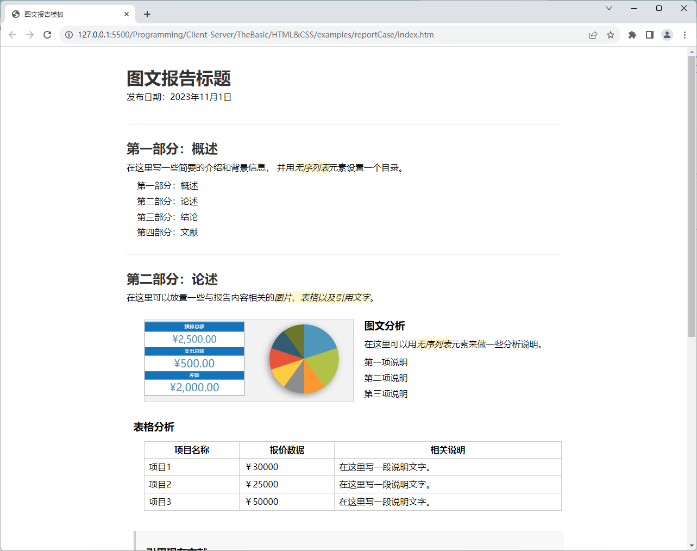
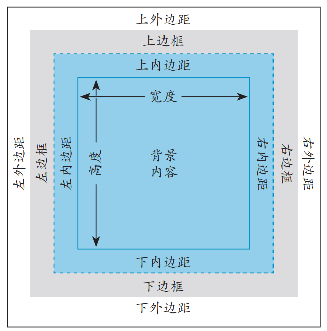
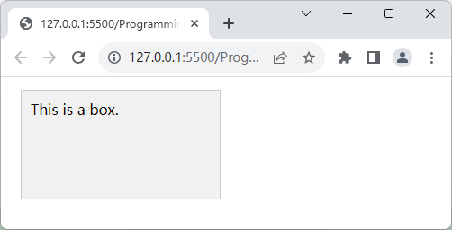
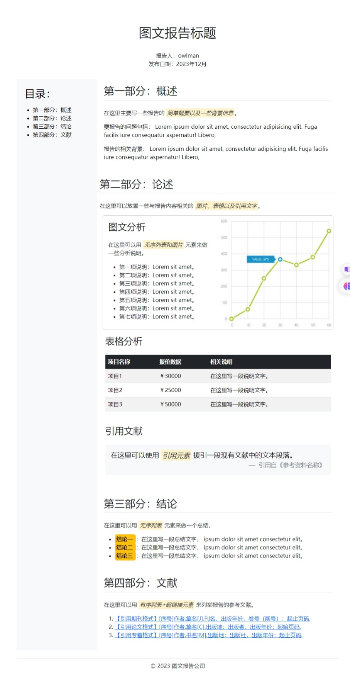
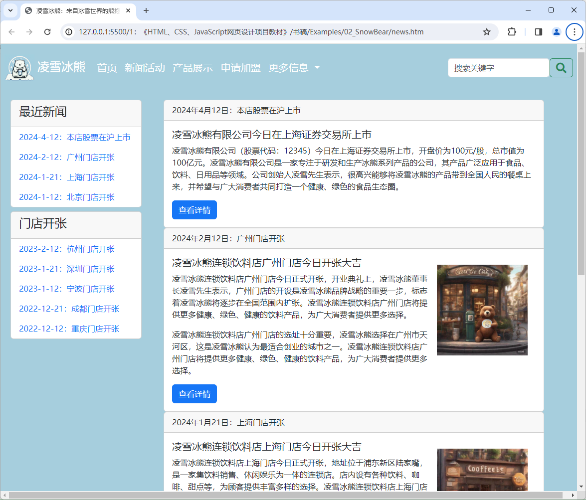

# 项目3 企业网站的新闻动态页设计

企业网站的新闻动态页设计在网页设计领域中属于图文信息类项目，其设计目的是让目标网页成为一份可读性良好的电子刊物，以便向用户展示该企业近期的经营活动与业绩。在此类项目中，网页设计师们通常会充分利用HTML文档中的标题、段落、强调、引用、链接、列表、表格、图片等图文类页面元素来完成对图文信息的排版工作，以便人们能在良好的阅读体验下获取到网站所属企业的最新资讯，从而为该企业吸引到更多潜在的用户。因此，新闻活动页面也被认为是企业网站设计工作中必须要设计的页面之一。

## 【学习目标】

在本章，笔者会继续以凌雪冰熊连锁饮料店的需求为例来演示如何为企业网站设计新闻活动页，该演示项目的设计目标是向公众展示企业的最近经营活动以及获得的业绩和社会影响力，以便加强人们对这家连锁饮料店的了解与信心。同时，该网页的设计也必须要延续该网站首页建立起来的布局风格与配色方案，并同样在导航栏中预留跳转到网站首页、产品展示、申请加盟等页面的链接。通过本章项目的实践，读者将会初步了解完成一个图文信息类页面的排版任务所要执行的基本步骤，以及执行这些步骤所需的基本技术与相关工具。总而言之，在阅读完本章之后，我们希望读者能够：

- 了解HTML 5中提供的图文类标记，并掌握这些标记在网页设计工作中的具体使用；
- 了解在网页中进行图文排版工作时要使用的元素盒模型以及相关的元素定位问题；
- 掌握如何在网页设计工作中利用Bootstrap框架来完成针对图文类页面的排版任务；

## 【学习场景描述】

现在，你所加入的网页设计团队已经完成了凌雪冰熊官方网站的首页设计，他们希望你能参照在首页设计工作中制定的整体设计风格，继续为该网站设计一个新闻活动页，以便向公众更好地展示连锁店的最新经营活动与业绩，从而吸引到更多的合作伙伴，进一步扩展线下实体店的加盟规模。在这个网页设计项目中，你的主要任务是为该企业网站完成新闻活动页的设计，为页面中的新闻稿提供可读性良好的排版设计。其次，你需要确保该页面采用与首页一致的布局风格与配色方案，并配置相同的网站导航栏组件。

## 【任务书】

- **项目名**：凌雪冰熊网站的新闻活动页设计
- **委托方**：凌雪冰熊股份有限公司互联网部门
- **项目资料**：
  - **代码资料**：凌雪冰熊官方网站现有的设计源码；
  - **文献资料**：反应凌雪冰熊连锁店最近经营活动及其业绩的新闻稿与图表；
- **项目要求**：为凌雪冰熊连锁饮料店的官方网站设计首页，该网页的设计应符合以下要求。
  - 该网页需要为自己要呈现的图文类信息提供可读性良好的排版设计；
  - 该网页在外观样式上需要采用与网站首页一致的布局风格与配色方案；
  - 该网页同样应配备导航栏，以便用户自由能切换到网站首页以及后续要设计的网页。
- 时间要求：在3个工作日内完成；

## 【任务拆解】

本章项目的实施过程可以划分为以下三个小任务来进行：

- 分析凌雪冰熊官方网站的现有源码，并从中提取出能用于统一样式的网页设计模版；
- 利用页面模板为凌雪冰熊网站创建新闻活动页，并用HTML标记完成页面的内容布局；
- 利用Bootstrap框架提供的样式类和组件来填充新闻活动页中的图文信息并完成排版；

## 【工作准备】

在经过了上一章的项目实践之后，读者想必已经对如何安排网页的整体布局，并制定统一风格的配色方案有了一个基本的了解。接下来，本书将根据项目中具体的设计需求来介绍如何安排网页中的HTML元素及其外观样式。在本章要实践的项目中，读者的主要任务是为企业网站创建新闻活动页，目的是为该网站设计一个排版精美的电子刊物，以便向公众展示企业近期的经营活动与业绩数据。下面先来介绍一下完成该项目任务所需要掌握的知识点与工具，同样的，如果读者自认为已经掌握了这部份知识，也可以选择跳过本节内容，直接进入本章项目的【工作实施与交付】环节。

### 知识点1：HTML 5中的图文类标记

在完成了网页布局部分的工作之后，设计师们接下来的工作就是安排要显示在网页浏览器中的具体内容了。而在网页可显示的诸多元素中，最基本的就是图文类元素了，这类元素主要包括标题、段落。引用、列表、表格、链接、图片等，下面就先来介绍一些常用于在网页中显示这类元素的HTML标记。

- `<h1>……<h6>`标记：该标记的作用是在网页中显示文本标题。根据HTML的语法规则，标题元素可以有六个级别，其中，`<h1>`标记定义的标题是最高级别的标题，而`<h6>`标记定义的标题是最低级别的标题。
- `<p>`标记：该标记的作用是在网页中定义一个文本段落元素。
- `<strong>`标记：该标记的作用是在网页中定义一个具有强调语义的文本元素，默认情况下会使用粗体字来显示该标记所包含的文本内容。
- `<em>`标记：该标记的作用也是在网页中定义一个具有强调语义的文本元素，区别是它在默认情况下会使用斜体字来显示该标记所包含的文本内容。
- `<span>`标记：该标记的作用也是在网页中定义一个具有强调语义的文本元素，区别是它在默认情况下并没有特定的样式，需要设计师们特别定义它的样式。
- `<q>`标记：该标记的作用是在网页中定义一个具有引用语义的文本元素，默认情况下会使用单引号来包围该标记所包含的文本内容。
- `<blockquote>`标记：该标记的作用是在网页中定义一个引用文本框元素，它会让浏览器将引用文本中的所有空格、换行符、制表符等原样显示出来，而不会将它们转换为HTML代码中的空格、换行符等。
- `<cite>`标记：该标记的作用是定义一个表示参考资料标题或名称的文本元素，通常是书籍、文章、报纸、电影、音乐等作品的标题。
- `<pre>`标记：该标记的作用是在网页中定义一个预格式文本元素，换而言之，该标记的作用是让浏览器将预格式文本中的所有空格、换行符、制表符等原样显示出来，而不会将它们转换为HTML代码中的空格、换行符等。
- `<br>`标记：该标记的作用是在网页中定义一个换行元素，换而言之，该标记的作用是让浏览器在网页中显示一个换行符。
- `<hr>`标记：该标记的作用是在网页中定义一条水平分割线，通常用于分隔网页中的多个章节区域。
- `<ul>`+`<li>`标记：这两个标记的作用是在网页中定义一个无序列表元素。
- `<ol>`+`<li>`标记：这两个标记的作用是在网页中定义一个有序列表元素。
- `<table>`标记：该标记的作用是在网页中定义一个表格元素，换而言之，网页中关于表格元素的所有定义代码都必须从一个`<table>`开始，并以一个`</table>`标记结束，其他用于描述表格行、单元格的HTML标记都必须被放在这两个标记之间。
- `<tr>`标记：该标记必须放在`<table>`和`</table>`这两个标记之间才能有效发挥作用。它的作用是定义表格的“行”元素，换而言之，表格中每一行的定义代码都必须从一个`<tr>`开始，并以一个`</tr>`标记结束，其中用于描述单元格的HTML标记都必须被放在这两个标记之间。
- `<th>`标记：该标记必须放在`<tr>`和`</tr>`这两个标记之间才能有效发挥作用。它的作用是定义表格标题行中的“单元格”元素，换而言之，表格标题行中每个单元格元素的定义代码都必须从一个`<th>`开始，并以一个`</th>`标记结束，其中用于显示具体信息的HTML标记都必须被放在这两个标记之间。
- `<td>`标记：该标记必须放在`<tr>`和`</tr>`这两个标记之间才能有效发挥作用。它的作用是定义表格中除标题行之外的“单元格”元素，换而言之，表格中除标题行之外的每个单元格元素的定义代码都必须从一个`<td>`开始，并以一个`</td>`标记结束，其中用于显示具体信息的HTML标记都必须被放在这两个标记之间。
- `<a>`标记：该标记的作用是在网页中定义一个超链接元素，换而言之，该标记的作用是让浏览器在网页中显示一个指向其他网页的超链接文本。
- ``标记：该标记的作用是在网页中定义一个图像元素，换而言之，该标记的作用是让浏览器在网页中显示一个图像。

下面，本书将通过模拟设计一个网页版的图文报告模板来演示一下上述HTML标记的使用方法，该示例会被保存在本书源码包的`Examples/00_demo/reportCase`目录中，笔者在该目录中创建了一个名为`index.htm`的HTML文件，并在其中输入了如下代码。

```html
<!DOCTYPE html>
<html lang="zh-CN">
    <head>
        <meta charset="UTF-8">
        <link rel="stylesheet" href="./styles/main.css">
        <title>图文报告模板</title>
    </head>
    <body>
        <header>
            <h1>图文报告标题</h1>
            <p>发布日期：2023年11月1日</p>
        </header>
        <main>
            <section>
                <h2>第一部分：概述</h2>
                <p>在这里写一些简要的介绍和背景信息，
                    并用<em>无序列表</em>元素设置一个目录。
                </p>
                <ul>
                    <li>第一部分：概述</li>
                    <li>第二部分：论述</li>
                    <li>第三部分：结论</li>
                    <li>第四部分：文献</li>
                </ul>    
            </section>
            <section>
                <h2>第二部分：论述</h2>
                <p>
                    在这里可以放置一些与报告内容相关的<em>图片、表格以及引用文字</em>。
                </p>
                <article>
                    
                    <div>
                        <h3>图文分析</h3>
                        <p>在这里可以用<em>无序列表</em>元素来做一些分析说明。</p>
                        <ul>
                            <li>第一项说明</li>
                            <li>第二项说明</li>
                            <li>第三项说明</li>
                        </ul>            
                    </div>
                </article>
                <article>
                    <h3>表格分析</h3>
                    <table>
                        <thead>
                            <tr>
                                <th>项目名称</th>
                                <th>报价数据</th>
                                <th>相关说明</th>
                            </tr>
                        </thead>
                        <tbody>
                            <tr>
                                <td>项目1</td>
                                <td>￥30000</td>
                                <td>在这里写一段说明文字。</td>
                            </tr>
                            <tr>
                                <td>项目2</td>
                                <td>￥25000</td>
                                <td>在这里写一段说明文字。</td>
                            </tr>
                            <tr>
                                <td>项目3</td>
                                <td>￥50000</td>
                                <td>在这里写一段说明文字。</td>
                            </tr>
                        </tbody>
                    </table>
                </article>
                <article>
                    <blockquote>
                        <h3>引用现有文献</h3>
                        <p>在这里可以使用<em>引用元素</em>援引一段现有文献中的文本段落。</p>
                        <cite>— 引用自《参考资料名称》</cite>
                    </blockquote>
                </article>                
            </section>
            <section>
                <h2>第三部分：结论</h2>
                <p>在这里可以用<em>无序列表</em>元素来做一个总结。</p>
                <ul>
                    <li><strong>结论一</strong>：在这里写一段总结文字。</li>
                    <li><strong>结论二</strong>：在这里写一段总结文字。</li>
                    <li><strong>结论三</strong>：在这里写一段总结文字。</li>
                </ul>
            </section>
            <section>
                <h2>第四部分：文献</h2>
                <p>在这里可以用<em>有序列表+超链接元素</em>来列举报告的参考文献。</p>
                <ol>
                    <li><a href="https://www.example.com">参考文献1</a></li>
                    <li><a href="https://www.example.com">参考文献2</a></li>
                    <li><a href="https://www.example.com">参考文献3</a></li>
                </ol> 
            </section>
        </main>
        <footer>
            <p>&copy; 2023 图文报告公司</p>
        </footer>
    </body>
</html>
```

接下来，只需要为上述HTML文档编写一些相应的CSS样式（该样式文件保存在`Examples/00_demo/reportCase/styles`目录中），然后使用网页浏览器打开该文件，就可以看到如图3-1所示的效果。



**图3-1**：图文类标记的使用示例

### 知识点2：CSS中的元素盒模型

在对网页中的具体内容进行样式设置的过程中，除了之前已经介绍过的尺寸设置与配色问题之外，设计师们很大一部分的工作都与HTML元素的内外边距、边框与定位这三个概念有关，因为这三个概念涉及到他们将如何使用CSS这门语言来描述HTML元素在网页中所呈现的外观样式，后者将直接影响到诸如图文信息排版、用户交互界面等具体网页设计问题的解决方案。所以，在正式介绍这些解决方案之前，本书很有必要先详细地向读者介绍一下HTML元素CSS语言中的描述模型。

在使用CSS进行样式设计时，设计师们通常会将HTML文档中的每个元素都描述成一个矩形盒子，这个盒子通常被称为CSS的元素盒模型。该盒模型是CSS样式设计中最重要的概念之一，设计师们需要通过它来定义网页中每个元素的外观样式，包括元素的高度、宽度、内外边距、位置以及与周围其他元素之间的关系。因此，元素的盒模型也被认为是在学习网页设计的过程中必须要掌握的一个基础概念。我们在这里也将先从这个概念开始介绍完成网页样式设计工作所需要掌握的基础知识。下面，先请读者来看一下这个盒模型的示意图：



**图3-2**：元素盒模型示意图

正如读者所见，CSS的元素盒模型主要由内容区、内边距、边框和外边距四个部分组成，它们相互作用，共同决定了元素在HTML文档中最终呈现的外观样式。接下来，让我们来详细地介绍一下这四个部分。

1. **内容区**：这一部分位于盒模型的中央区域，是页面元素中用于显示实际内容的地方，其中通常会保护文本、图像或其他嵌套元素，我们对内容区的样式设置主要包括以下内容：
   - 区域的大小：在CSS中，我们会通过`width`和`height`这两个属性来设置该区域的宽度和高度。
   - 区域的背景：在CSS中，区域背景的样式主要通过`background-color`和`background-image`这两个属性来设置。前者设置的是区域背景的填充颜色，而后者设置的则是区域背景的图片。

    例如，如果我们希望一个`class="box"`的元素有一个宽度为`200px`、高度为`100px`的内容区，并且背景颜色填充为红色，那么就可以为该元素编写如下CSS样式：

   ```css
   .box {
     width: 200px;
     height: 100px;
     background-color: red;
   }
   ``

2. **内边距**：这一部分位于内容区与边框之间，它的主要作用是在元素的内容区与其边框之间填充一定的空白间隔，这样做通常会有助于网页的布局效果和整体美观。在CSS中，我们一般会通过`padding`这个属性来设置元素的内边距，该属性的值通常由4个尺寸值来决定，分别用于指定元素在上、右、下、左四个方向的内边距，例如像这样：

   ```css
   .box {
        padding: 10px 15px 10px 15px;
   }
   ```

   在上述代码中，我们为`class="box"`的元素设置了`10px`的上、下内边距、`15px`的左、右内边距。当然了，如果上下内边距的值相同，左右内边距的值也相同，那么我们也可以将`padding`属性的值简写为两个尺寸值，分别用于指定元素的上下内边距与左右边距，例如在这里，我们可以将上面的代码简写成这样：

   ```css
   .box {
        padding: 10px 15px;
   }
   ```

   同样的，如果一个元素在上、下、左、右四个方向上均设置了相同的内边距，那么我们也可以将`padding`属性的值简写为单个的尺寸值，例如，如果某个元素在每个方向上的内边距都是`10px`，那么我们可以这样编写CSS样式：

   ```css
   .box {
        padding: 10px;
   }
   ```

   另外在某些特定情况下，我们也会通过`padding-top`、`padding-right`、`padding-bottom`和`padding-left`这4个属性单独设置元素的上、右、下、左四个方向的内边距，例如像这样：

   ```css
   .box {
        padding-top: 10px;
        padding-right: 15px;
        padding-bottom: 10px;
        padding-left: 15px;
   }
   ```

   在上述代码中，我们用4个样式属性分别为`class="box"`的元素设置了四个方向的内边距，其中，`padding-top`属性用于设置上内边距，`padding-right`属性用于设置右内边距，`padding-bottom`属性用于设置下内边距，`padding-left`属性用于设置左内边距。需要注意的是，在CSS中，如果某个元素的某个方向的内边距的值设置为`0px`，那么该元素的该方向的内边距将不起作用，也就是说，如果某个元素的上内边距的值设置为`0px`，那么该元素的上内边距将消失，其内容会直接贴着上边框。

3. **边框**：这一部分指的是元素所在区域的边界线。在CSS中，我们可以通过`border`属性来设置边框的样式，该属性的值通常包括四个方向的边框样式、宽度、颜色，例如，如果我们想为元素设置一个宽度为`1px`、线条样式为`solid`、颜色为`#ccc`的边框，那么我们可以这样编写CSS样式：

   ```css
   .box {
        border: 1px solid #ccc;
   }
   ```

   在某些特情况下，我们也可以通过`border-width`、`border-color`和`border-style`这3个属性分别设置边框宽度、颜色和样式，例如对于上述代码，我们也可以将其修改为：

    ```css
    .box {
        border-width: 1px;
        border-color: #ccc;
        border-style: solid;
    }
    ```

    另外，元素的边框样式和内边距一样，也可以分不同的方向来进行分别设置。换而言之，我们也可以通过`border-top`、`border-right`、`border-bottom`和`border-left`这4个属性单独设置元素的上、右、下、左四个方向上的边框，例如，如果我们只想为`class="box"`的元素设置一个宽度为`1px`、线条样式为`solid`、颜色为`#ccc`的上边框，那么我们可以这样编写CSS样式：

    ```css
    .box {
        border-top: 1px solid #ccc;
    }
    ```

    如果我们希望边框的四个角上都带有圆角效果，那么我们可以通过`border-radius`属性来设置，例如，如果我们想为`class="box"`的元素设置一个宽度为`10px`、颜色为`#ccc`的圆角边框，那么我们可以这样编写CSS样式：

    ```css
    .box {
        /*
            border-radius 属性可以接受一个或两个参数，
            如果只设置一个参数，则表示设置四个角的圆角半径，
            如果设置两个参数，则第一个参数表示左上角和右下角，
            第二个参数表示右上角和左下角。
        */
        border-radius: 10px;
        border: 1px solid #ccc;
    }
    ```

    如果希望为边框添加阴影效果，也可以通过`box-shadow`属性来设置，例如，如果我们想为`class="box"`的元素添加一个宽度为`1px`、颜色为`#ccc`的阴影，那么我们可以这样编写CSS样式：

    ```css
    .box {
        /*
            box-shadow 属性可以接受一个或多个参数，每个参数由逗号分隔，
            每个参数由 x-offset、y-offset、blur 和 color 这4个参数组成，
            其中 x-offset 和 y-offset 分别表示阴影的水平偏移量和垂直偏移量，
            blur 表示阴影模糊半径，color 表示阴影的颜色。
        */
        box-shadow: 1px 1px #ccc;
    }
    ```

4. **外边距**：这一部分位于元素的边框与相邻元素边框之间，通常用来控制元素之间的间距。在CSS中，我们可以通过`margin`属性来设置外边距，设置方法与内边距基本相同，该属性的值也由4个尺寸值构成，分别表示上、右、下、左的外边距，例如像这样：

   ```css
   .box {
        margin: 10px 14px 10px 14px;
   }
   ```

   在上述代码中，我们为`class="box"`的元素设置了`10px`的上、下外边距、`14px`的左、右外边距。同样的，如果上下外边距的值相同，左右外边距的值也相同，那么我们也可以将`padding`属性的值简写为两个尺寸值，分别用于指定元素的上下与左右的外边距，例如在这里，我们可以将上面的代码简写成这样：

   ```css
   .box {
        margin: 10px 14px;
   }
   ```

   同样的，如果一个元素在上、下、左、右四个方向上均设置了相同的内边距，那么我们也可以将`margin`属性的值简写为单个的尺寸值，例如，如果某个元素在每个方向上的外边距都是`14px`，那么我们可以这样编写CSS样式：

   ```css
   .box {
        margin: 14px;
   }
   ```

   另外在某些特定情况下，我们也会通过`margin-top`、`margin-right`、`margin-bottom`和`margin-left`这4个属性单独设置元素的上、右、下、左四个方向的外边距，例如像这样：

   ```css
   .box {
        margin-top: 10px;
        margin-right: 14px;
        margin-bottom: 10px;
        margin-left: 14px;
   }
   ```

需要再次强调的是，正确理解元素的盒模型对于网页设计工作来说是非常重要的，因为它们会深度地影响到元素在网页中的具体位置与外观样式。例如，通过调整内边距和外边距的大小，可以控制元素之间的间距和对齐方式。通过设置边框的样式和颜色，可以为元素添加装饰效果。通过设置内容区域的大小，可以控制元素的宽度和高度。下面，我们可以通过一个简单示例来让读者直观地感受一下CSS盒模型在网页中所呈现的样子，为此，我们需要执行以下操作：

1. 创建一个HTML文档，然后在文档中创建一个`<div class="box">`元素，并为其设置宽度、高度、内边距、边框、外边距和背景颜色：

    ```html
    <!DOCTYPE html>
    <html>
        <head>
            <style>
                .box {
                    width: 200px;
                    height: 100px;
                    background-color: #f1f1f1;
                    padding: 10px;
                    border: 1px solid #ccc;
                    margin: 14px;
                }
            </style>
        </head>
        <body>
            <div class="box">
                This is a box.
            </div>
        </body>
    </html>
    ```

2. 打开Google Chrome浏览器，并访问该HTML文档，此时，我们就可以看到一个带有灰色背景的盒子，其宽度为200像素，高度为100像素，内边距为10像素，边框为1像素的实线，外边距为14像素，并显示了“This is a box.”这一文本，如下图所示：

    

    **图3-3**：元素盒模型的使用示例

### 知识点3：基于Bootstrap框架的排版方案

在掌握了上述HTML+CSS基础知识之后，读者就可以来继续了解Bootstrap框架中的样式类和组件了。 本书接下来会先通过设计一个简单的图文报告模板来演示一下该框架在图文信息排版任务中的应用，以便读者能自行去比较相同任务的不同实现方法，并从中体验到Bootstrap框架给网页设计工作带来的便利，该报告模版的构建步骤如下：

1. 在本地计算机中创建一个名为`reportCaseInBootstrap`的演示项目（在这里，我将会将它创建在本书源码包的`Examples/00_demo/reportCaseInBootstrap`目录中），并按照之前演示过的方法将Bootstrap框架引入到该项目中。

2. 在VS Code这样的代码编辑器中打开刚刚创建项目，然后在该项目的根目录下创建一个`index.htm`文件，并在其中输入以下代码：

    ```html
    <!DOCTYPE html>
    <html lang="zh-CN">
        <head>
            <meta charset="UTF-8">
            <meta name="viewport" 
                content="width=device-width, initial-scale=1.0">
            <link rel="stylesheet" href="./styles/bootstrap.min.css">
            <script src="./scripts/bootstrap.min.js" defer></script>
            <title>网页文本排版示例</title>
        </head>
        <body class="p-4 container">
            <header class="p-3 text-center">
                <h1 class="p-3 m-3">图文报告标题</h1>
                <p class="m-0">报告人：owlman</p>
                <p class="m-0">发布日期：2023年12月</p>
            </header>
            <main class="row">
                <aside class="mt-3 p-3 col-3 text-bg-light">
                    <h2 class="p-2">目录：</h2>
                    <ul>
                        <li>第一部分：概述</li>
                        <li>第二部分：论述</li>
                        <li>第三部分：结论</li>
                        <li>第四部分：文献</li>
                <section class="p-2 col-9">
                    <article class="py-2 my-3 container">
                        <h2 class="mb-4 pb-2 border-bottom">第一部分：概述</h2>
                        <p>
                            在这里主要写一些报告的
                            <em class="mark">简单概要以及一些背景信息</em>。
                        </p>
                        <p>
                            要报告的问题包括：
                            Lorem ipsum dolor sit amet, consectetur elit. 
                            Fuga facilis iure consequatur aspernatur! Libero。
                        </p>
                        <p>
                            报告的相关背景：
                            Lorem ipsum dolor sit amet, consectetur elit. 
                            Fuga facilis iure consequatur aspernatur! Libero。
                        </p>
                    </article>
                    <article class="py-2 my-3">
                        <h2 class="mb-4 pb-2 border-bottom">第二部分：论述</h2>
                        <p>
                            在这里可以放置一些与报告内容相关的
                            <em class="mark">图片、表格以及引用文字</em>。
                        </p>
                        <div class="card m-2">
                            <div class="row  g-0">
                                <div class="card-body col-6">
                                    <h3 class="card-title mb-4">图文分析</h3>
                                    <p class="card-text">
                                        在这里可以用
                                        <em class="mark">无序列表和图片</em>
                                        元素来做一些分析说明。
                                    </p>
                                    <ul class="card-text">
                                        <li>第一项说明：Lorem sit amet。</li>
                                        <li>第二项说明：Lorem sit amet。</li>
                                        <li>第三项说明：Lorem sit amet。</li>
                                        <li>第四项说明：Lorem sit amet。</li>
                                        <li>第五项说明：Lorem sit amet。</li>
                                        <li>第六项说明：Lorem sit amet。</li>
                                        <li>第七项说明：Lorem sit amet。</li>
                                    </ul>
                                </div>
                                
                            </div> 
                        </div>
                        <div class="p-2 m-2">
                            <h3 class="mb-4">表格分析</h3>
                            <table class="table table-striped">
                                <thead class="table-dark">
                                    <tr>
                                        <th>项目名称</th>
                                        <th>报价数据</th>
                                        <th>相关说明</th>
                                    </tr>
                                </thead>
                                <tbody>
                                    <tr>
                                        <td>项目1</td>
                                        <td>￥30000</td>
                                        <td>在这里写一段说明文字。</td>
                                    </tr>
                                    <tr>
                                        <td>项目2</td>
                                        <td>￥25000</td>
                                        <td>在这里写一段说明文字。</td>
                                    </tr>
                                    <tr>
                                        <td>项目3</td>
                                        <td>￥50000</td>
                                        <td>在这里写一段说明文字。</td>
                                    </tr>
                                </tbody>
                            </table>
                        </div>
                        <div class="p-2 m-2">
                            <h3 class="mb-4">引用文献</h3>
                            <blockquote class="p-3 blockquote text-bg-light">
                                <p>
                                    在这里可以使用
                                    <em class="mark">引用元素</em>
                                    援引一段现有文献中的文本段落。
                                </p>
                                <p class="blockquote-footer text-end">
                                    引用自《参考资料名称》
                                </p>
                            </blockquote>
                        </div>                
                    </article>
                    <article class="py-2 my-3 container">
                        <h2 class="mb-4 pb-2 border-bottom">第三部分：结论</h2>
                        <p>
                            在这里可以用
                            <em class="mark">无序列表</em>
                            元素来做一个总结。
                        </p>
                        <ul>
                            <li>
                                <strong class="p-1 text-bg-warning rounded ">
                                    结论一
                                </strong>：在这里写一段总结文字，
                                <span>
                                    ipsum dolor sit amet consectetur elit。
                                </span>  
                            </li>
                            <li>
                                <strong  class="p-1 text-bg-warning rounded">
                                    结论二
                                </strong>：在这里写一段总结文字，
                                <span>
                                    ipsum dolor sit amet consectetur elit。
                                </span>
                            </li>
                            <li>
                                <strong class="p-1 text-bg-warning rounded">
                                    结论三
                                </strong>：在这里写一段总结文字，
                                <span>
                                    ipsum dolor sit amet consectetur elit。
                                </span>
                            </li>
                        </ul>
                    </article>
                    <article class="py-2 mt-3 container">
                        <h2 class="mb-4 pb-2 border-bottom">第四部分：文献</h2>
                        <p>
                            在这里可以用
                            <em class="mark">有序列表+超链接元素</em>
                            来列举报告的参考文献。
                        </p>
                        <ol>
                            <li><a href="https://www.example.com">
                            【引用期刊格式】[序号]作者.篇名[J].刊名，出版年份，卷号（期号）：起止页码.
                            </a></li>
                            <li><a href="https://www.example.com">
                            【引用论文格式】[序号]作者.篇名[C].出版地：出版者，出版年份：起始页码. 
                            </a></li>
                            <li><a href="https://www.example.com">
                            【引用专着格式】[序号]作者.书名[M].出版地：出版社，出版年份：起止页码.
                            </a></li>
                        </ol> 
                    </article>
                </section>
            </main>
            <footer class="mt-4 p-2 border-top row text-center">
                <p class="text-muted">&copy; 2023 图文报告公司</p>
            </footer>        
        </body>
    </html>
    ```

3. 在保存上述代码之后，读者就可以使用网页浏览器打开`index.htm`文件查看当前网页设计的结果，其外观样式在Google Chrome浏览器中的效果如下图所示。

    

    **图3-2**：基于Bootstrap框架的图文排版示例

正如读者所见，我们在该演示项目中仅使用Bootstrap框架提供的一系列样式类就实现了之前在`00_demo/reportCase`示例中用上百行CSS代码实现的类似效果，下面，就让我们分门别类地来介绍一下本章项目中将会用到的、Bootstrap框架中与图文信息排版相关的样式及其使用方法。

#### 元素基本设置

正如本书在上一个知识点中所介绍的，HTML/XML文档中的元素在CSS视角下是以“盒模型”的形态呈现在网页浏览器中的，因此设置元素的尺寸大小，以及它们之间的间距是网页设计工作中最基本，最重要的任务之一。为了完成这一任务，设计师们通常会需要亲自编写相应的在CSS代码，先使用选择器匹配要设置样式的元素，然后利用`width`和`height`属性设置该元素的尺寸大小，用`margin`属性来设置该元素与相邻外界元素之间的距离（即外边距），而`padding`属性则用来设置该元素与其内部子元素之间的距离（即内边距）。但如果在项目中引入了Bootstrap框架，设计师们通常只需要直接在HTML/XML文档中使用`w-*`、`h-*`、`m-*`和`p-*`这四组预定义的样式类就可以快速完成这一任务。下面，本书就带读者来具体了解一下这四组样式类。

- `w-*`样式类：以`w-`为前缀的这组样式类主要用于设置元素的宽度尺寸，其可设定的值包括`25`、`50`、`75`、`100`和`auto`五种，其对应的CSS样式值如下表所示：

    | Bootstrap样式类 | CSS样式值 |
    | :--------------- | :--------- |
    | `w-25`            | `{width:25% !important}` |
    | `w-50`            | `{width:50% !important}` |
    | `w-75`            | `{width:75% !important}` |
    | `w-100`          | `{width:100% !important}` |
    | `w-auto`         | `{width:auto !important}` |

- `h-*`样式类：以`h-`为前缀的这组样式类主要用于设置元素的高度尺寸，其可设定的值同样也包括`25`、`50`、`75`、`100`和`auto`这五种，其对应的CSS样式值如下表所示：

    | Bootstrap样式类 | CSS样式值 |
    | :--------------- | :--------- |
    | `h-25`           | `{height:25% !important}` |
    | `h-50`           | `{height:50% !important}` |
    | `h-75`           | `{height:75% !important}` |
    | `h-100`          | `{height:100% !important}` |
    | `h-auto`         | `{height:auto !important}` |

- `m-*`样式类：以`m-`为前缀的这组样式类主要用于设置元素的外边距，其可设置的值主要有`0`、`1`、`2`、`3`、`4`、`5`和`auto`这七种，其对应的CSS样式值如下表所示：

    | Bootstrap样式类 | CSS样式值 |
    | :--------------- | :--------- |
    | `m-0`             | `{margin:0 !important}` |
    | `m-1`             | `{margin:0.25rem !important}` |
    | `m-2`             | `{margin:0.5rem !important}` |
    | `m-3`             | `{margin:1rem !important}` |
    | `m-4`             | `{margin:1.5rem !important}` |
    | `m-5`             | `{margin:3rem !important}` |
    | `m-auto`          | `{margin:auto !important}` |

    当然了，我们也可以在`m`之后加上`l`、`r`、`t`、`b`、`x`、`y`和`a`这七个字母中的任意一个，来分别单独设置元素的外左边距、外右边距、外上边距、外下边距、外左右边距和外上下边距，它们同样可以设置`0`、`1`、`2`、`3`、`4`、`5`和`auto`这七种值，其对应的CSS样式值如下表所示：

    | Bootstrap样式类 | CSS样式值 |
    | :--------------- | :--------- |
    | `ml-0`          | `{margin-left:0 !important}` |
    | `ml-1`          | `{margin-right:0.25 !important}` |
    | `ml-2`          | `{margin-right:0.5 !important}` |
    | `ml-3`          | `{margin-right:1 !important}` |
    | `ml-4`          | `{margin-right:1.5 !important}` |
    | `ml-5`          | `{margin-right:3 !important}` |
    | `ml-auto`       | `{margin-right:auto !important}` |
    | `mr-0`          | `{margin-right:0 !important}` |
    | `mr-1`          | `{margin-right:0.25 !important}` |
    | `mr-2`          | `{margin-right:0.5 !important}` |
    | `mr-3`          | `{margin-right:1 !important}` |
    | `mr-4`          | `{margin-right:1.5 !important}` |
    | `mr-5`          | `{margin-right:3 !important}` |
    | `mr-auto`       | `{margin-right:auto !important}` |
    | `mt-0`          | `{margin-top:0 !important}` |
    | `mt-1`          | `{margin-top:0.25 !important}` |
    | `mt-2`          | `{margin-top:0.5 !important}` |
    | `mt-3`          | `{margin-top:1 !important}` |
    | `mt-4`          | `{margin-top:1.5 !important}` |
    | `mt-5`          | `{margin-top:3 !important}` |
    | `mt-auto`       | `{margin-top:auto !important}` |
    | `mb-0`          | `{margin-bottom:0 !important}` |
    | `mb-1`          | `{margin-bottom:0.25 !important}` |
    | `mb-2`          | `{margin-bottom:0.5 !important}` |
    | `mb-3`          | `{margin-bottom:1 !important}` |
    | `mb-4`          | `{margin-bottom:1.5 !important}` |
    | `mb-5`          | `{margin-bottom:3 !important}` |
    | `mb-auto`       | `{margin-bottom:auto !important}` |
    | `mx-0`          | `{margin-left:0 !important;margin-right:0 !important}` |
    | `mx-1`   | `{margin-left:0.25 !important;margin-right:0.25 !important}` |
    | `mx-2`   | `{margin-left:0.5 !important;margin-right:0.5 !important}` |
    | `mx-3`   | `{margin-left:1 !important;margin-right:1 !important}` |
    | `mx-4`   | `{margin-left:1.5 !important;margin-right:1.5 !important}` |
    | `mx-5`   | `{margin-left:3 !important;margin-right:3 !important}` |
    | `mx-auto`  | `{margin-left:auto !important;margin-right:auto !important}` |
    | `my-0`   | `{margin-top:0 !important;margin-bottom:0 !important}` |
    | `my-1`   | `{margin-top:0.25 !important;margin-bottom:0.25 !important}` |
    | `my-2`   | `{margin-top:0.5 !important;margin-bottom:0.5 !important}` |
    | `my-3`   | `{margin-top:1 !important;margin-bottom:1 !important}` |
    | `my-4`   | `{margin-top:1.5 !important;margin-bottom:1.5 !important}` |
    | `my-5`   | `{margin-top:3 !important;margin-bottom:3 !important}` |
    | `my-auto` | `{margin-top:auto !important;margin-bottom:auto !important}` |

- `p-*`样式类：以`p-`为前缀的这组样式类主要用于设置元素的内边距，其可设置的值也主要有`0`、`1`、`2`、`3`、`4`、`5`和`auto`这七种，其对应的CSS样式值如下表所示：

    | Bootstrap样式类 | CSS样式值 |
    | :--------------- | :--------- |
    | `p-0`             | `{padding:0 !important}` |
    | `p-1`             | `{padding:0.25rem !important}` |
    | `p-2`             | `{padding:0.5rem !important}` |
    | `p-3`             | `{padding:1rem !important}` |
    | `p-4`             | `{padding:1.5rem !important}` |
    | `p-5`             | `{padding:3rem !important}` |
    | `p-auto`          | `{padding:auto !important}` |

    同样的，我们也可以在`p`之后加上`l`、`r`、`t`、`b`、`x`、`y`和`a`这七个字母中的任意一个，来分别单独设置元素的内左边距、内右边距、内上边距、内下边距、内左右边距和内上下边距，它们同样可以设置`0`、`1`、`2`、`3`、`4`、`5`和`auto`这七种值，其对应的CSS样式值如下表所示：

    | Bootstrap样式类 | CSS样式值 |
    | :--------------- | :--------- |
    | `pl-0`   | `{padding-left:0 !important}` |
    | `pl-1`   | `{padding-left:0.25rem !important}` |
    | `pl-2`   | `{padding-left:0.5rem !important}` |
    | `pl-3`   | `{padding-left:1rem !important}` |
    | `pl-4`   | `{padding-left:1.5rem !important}` |
    | `pl-5`   | `{padding-left:3rem !important}` |
    | `pl-auto` | `{padding-left:auto !important}` |
    | `pr-0`      | `{padding-right:0 !important}` |
    | `pr-1`     | `{padding-right:0.25rem !important}` |
    | `pr-2`     | `{padding-right:0.5rem !important}` |
    | `pr-3`     | `{padding-right:1rem !important}` |
    | `pr-4`     | `{padding-right:1.5rem !important}` |
    | `pr-5`     | `{padding-right:3rem !important}` |
    | `pr-auto` | `{padding-right:auto !important}` |
    | `pt-0`       | `{padding-top:0 !important}` |
    | `pt-1`       | `{padding-top:0.25rem !important}` |
    | `pt-2`       | `{padding-top:0.5rem !important}` |
    | `pt-3`       | `{padding-top:1rem !important}` |
    | `pt-4`       | `{padding-top:1.5rem !important}` |
    | `pt-5`       | `{padding-top:3rem !important}` |
    | `pt-auto`  | `{padding-top:auto !important}` |
    | `pb-0`      | `{padding-bottom:0 !important}` |
    | `pb-1`      | `{padding-bottom:0.25rem !important}` |
    | `pb-2`      | `{padding-bottom:0.5rem !important}` |
    | `pb-3`      | `{padding-bottom:1rem !important}` |
    | `pb-4`      | `{padding-bottom:1.5rem !important}` |
    | `pb-5`      | `{padding-bottom:3rem !important}` |
    | `pb-auto` | `{padding-bottom:auto !important}` |
    | `px-0`      | `{padding-left:0 !important; padding-right:0 !important}` |
    |`px-1`|`{padding-left:0.25rem !important; padding-right:0.25rem !important}` |
    |`px-2`| `{padding-left:0.5rem !important; padding-right:0.5rem !important}` |
    |`px-3` |`{padding-left:1rem !important; padding-right:1rem !important}` |
    |`px-4`|`{padding-left:1.5rem !important; padding-right:1.5rem !important}` |
    |`px-5`|`{padding-left:3rem !important; padding-right:3rem !important}` |
    |`px-auto` | `{padding-left:auto !important; padding-right:auto !important}` |
    | `py-0`     | `{padding-top:0 !important; padding-bottom:0 !important}` |
    |`py-1`|`{padding-top:0.25rem !important; padding-bottom:0.25rem !important}` |
    |`py-2`| `{padding-top:0.5rem !important; padding-bottom:0.5rem !important}` |
    | `py-3`| `{padding-top:1rem !important; padding-bottom:1rem !important}` |
    |`py-4`|`{padding-top:1.5rem !important; padding-bottom:1.5rem !important}` |
    |`py-5`| `{padding-top:3rem !important; padding-bottom:3rem !important}` |
    |`py-auto` | `{padding-top:auto !important; padding-bottom:auto !important}` |

正如读者在之前的图文排版示例中所看到的，设计师们可以利用Bootstrap框架提供的这些样式类对页面元素设置相应的宽度和内外边距，以便它们能以更合适的形态呈现在页面中，这些操作都是对网页进行图文信息排版时首先要完成的任务。

#### 文本元素设置

对于网页中可显示的文本类元素，Bootstrap框架首先设置了一些默认的文本样式，然后在此基础上对页面中经常出现的标题、段落、强调、链接等纯文本元素预定义了一系列相应的样式类，并且这些样式类之间还有着一定的相互配合关系。下面来具体介绍一下这部分的内容：

- **默认文本样式**：Bootstrap框架对于网页中显示的文本，做了以下默认设置：
  - `font-family`属性设置为`'Helvetica Neue', Helvetica, Arial, sans-serif`：这是一个常见的字体栈，表示如果用户的设备上有"Helvetica Neue"字体，则使用它，否则依次尝试使用"Helvetica"、"Arial"和"san-serif"字体。
  - `font-size`属性设置为`16px`：这是文本的默认字体大小。在Bootstrap中，`1rem`等于`16px`，因此可以通过设置`rem`单位来快速调整文本的大小。
  - `line-height`属性设置为`1.5`：这是文本行高的默认值。行高指的是文本行与行之间的垂直间距，使用相对单位`1.5`可以确保行高与字体大小的比例关系，使文本更易读。
  - `font-weight`属性设置为`400`：这是文本的默认字体粗细。`400`表示正常的字体粗细，可以通过设置其他值来实现不同的粗细效果，如`bold`表示加粗。

- **标题文本样式**：对于页面中`<h1>`到`<h6>`六个标题元素，Bootstrap框架中预定义了从`h1`到`h6`六个对应的样式类，以便为它们设置更粗的字体属性（即`font-weight`）以及更具有响应能力的字体大小（即`font-size`）。除此之外，该框架还提供了从`display-1`到`display-6`六个样式类，以便设置更大的字体尺寸（即`font-size`）以及更大的行高（即`line-height`）。这些样式类与相应的样式值的对应关系如下表所示：

    | Bootstrap样式类 | CSS样式值 |
    | :--------------- | :--------- |
    | `h1` | `font-size: 3.5rem; line-height: 4rem;` |
    | `h2` | `font-size: 2.5rem; line-height: 3rem;` |
    | `h3` | `font-size: 2rem; line-height: 2.5rem;` |
    | `h4` | `font-size: 1.5rem; line-height: 2rem;` |
    | `h5` | `font-size: 1.25rem; line-height: 1.75rem;` |
    | `h6` | `font-size: 1rem; line-height: 1.5rem;` |
    | `display-1` | `font-size: 6rem; line-height: 1.2;` |
    | `display-2` | `font-size: 5.5rem; line-height: 1.2;` |
    | `display-3` | `font-size: 4.5rem; line-height: 1.2;` |
    | `display-4` | `font-size: 3.5rem; line-height: 1.2;` |
    | `display-5` | `font-size: 2.75rem; line-height: 1.2;` |
    | `display-6` | `font-size: 2rem; line-height: 1.2;` |

    当然了，以上是我根据Bootstrap框架的官方文档所进行的说明，必须要注意的是，这些样式值可能会因为Bootstrap版本的不同而有所变化。建议读者在使用时自行参考该框架的官方文档，以确保信息的准确性。

- **通用文本样式**：对于页面中的文本类元素，Bootstrap框架提供了一系列通用的样式类，以便设计师们可以为页面赋予不同的文本样式，具体如下：
  - `fs-1`到`fs-6`：这组样式类的用法与之前介绍标题文本样式类似，区别是标题文本样式同时包含了对`font-size`和`line-height`这两个属性的设置，而这组样式类只包含对`font-size`属性的设置。
  - `fst-*`：以`fst-`开头的样式类用于设置文本元素的`font-style`属性，其中`*`表示文本元素的字体样式，具体如下：
    - `fst-italic`：该样式类会让其作用的文本以斜体的字体来显示；
    - `fst-normal`：该样式类会让其作用的文本以正常的字体来显示。
  - `fw-*`：以`fw-`开头的样式类用于设置文本元素的`font-weight`属性，其中`*`表示文本元素的字体粗细，具体如下：
    - `fw-light`：该样式类会让其作用的文本以细的字体来显示；
    - `fw-lighter`：该样式类会让其作用的文本以更细的字体来显示；
    - `fw-normal`：该样式类会让其作用的文本以正常的字体来显示；
    - `fw-medium`：该样式类会让其作用的文本以中等粗的字体来显示；
    - `fw-bold`：该样式类会让其作用的文本以粗的字体来显示；
    - `fw-semibold`：该样式类会让其作用的文本以中粗的字体来显示；
    - `fw-bolder`：该样式类会让其作用的文本以更粗的字体来显示；
  - `lh-*`：以`lh-`开头的样式类用于设置文本元素的`line-height`属性，它们的具体作用如下：
    - `lh-base`：该样式类会让其作用的文本以Bootstrap框架默认的行高来显示。
    - `lh-1`：该样式类会让其作用的文本以1倍行高来显示。这意味着文本的行高将与字体大小相等，即每行文本之间没有额外的垂直间距。
    - `lh-sm`：该样式类会让其作用的文本以较小字体大小的行高来显示。具体的行高值会根据具体的字体大小进行调整，以保持一致的比例关系。
    - `lh-lg`：该样式类会让其作用的文本以较大字体大小的行高来显示。同样，具体的行高值会根据字体大小进行调整，以保持一致的比例关系。
  - `text-start`：该样式类会让其作用的段落文本以左对齐的形式来显示；
  - `text-center`：该样式类会让其作用的段落文本以居中对齐的形式来显示；
  - `text-end`：该样式类会让其作用的段落文本以右对齐的形式来显示；
  - `text-truncate`：该样式类会让其作用的段落文本对溢出元素大小的部分呈现带有省略号的截断效果；
  - `text-break`：该样式类会禁止其作用的段落文本对其内容以字母为对象来进行自动换行；
  - `text-wrap`：该样式类会让其作用的文本元素对其内容以单词为对象来进行自动换行；
  - `text-nowrap`：该样式类会禁止其作用的文本元素对其内容进行自动换行；

- **特定文本样式**：对于页面中用`<span>`、`<strong>`、`<em>`、`<small>`、`<abbr>`、`<blockquote>`、`<cite>`、`<code>`、`<sub>`、`<sup>`、`<del>`等标记定义的、具有某种特别语义的文本类元素，Bootstrap框架提供了一系列常用的预定义样式类，以便设计师们赋予它们一些具有凸显效果的样式，具体如下：
  - 颜色样式：如果我们想用颜色来凸显特定文本的外观，可以使用之前介绍过的`text-primary`、`text-secondary`、`text-success`、`text-danger`、`text-warning`、`text-info`、`text-light`、`text-dark`这八个样式类来进行设置，这里就不需要再重复介绍了；
  - `mark`：该样式类会为其作用的文本元素添加类似荧光笔标注的高亮效果；
  - `lead`：该样式类会为其作用的文本元素添加字体放大的强调效果；
  - `small`：该样式类会为其作用的文本元素添加字体放小的注释效果；
  - `text-muted`：该样式类会为其作用的文本元素添加浅灰色字体的注释效果；
  - `text-decoration-line-through`：该样式类会为其作用的文本元素添加删除线的效果；
  - `text-decoration-underline`：该样式类会为其作用的文本元素添加下划线的效果；
  - `text-decoration-none`：该样式类会去除其作用的文本元素中的下划线、删除线等效果；
  - `text-uppercase`：该样式类仅对英文文本有效，效果为文本中所有字母都以大写形式显示；
  - `text-lowercase`：该样式类仅对英文文本有效，样式效果为文本中所有字母都以小写形式；
  - `text-capitalize`：该样式类仅对英文文本有效，样式效果为文本中所有单词的首字母都显示为大写；
  - `blockquote`：该样式类通常会搭配`<blockquote>`标签使用，为其作用的元素添加引用语义的样式；
  - `blockquote-footer`：该样式类通常会搭配`<blockquote>`+`<cite>`标签使用，为其作用的元素添加代表引用出处的样式；

- **链接文本样式**：对于页面中用`<a>`标记的链接文本，Bootstrap框架提供了一系列的预定义样式类，以便设计师们赋予它们一些具有特定效果的样式。下面，我们就逐一来介绍这些样式类：
  - 如果我们想设置链接文本样式中的文本颜色，可以使用`link-primary`、`link-secondary`、`link-success`、`link-danger`、`link-warning`、`link-info`、`link-light`、`link-dark`这八个样式类来进行设置。由于我们在“制定配色方案”一节已经讨论过这些颜色类的用法及其代表的含义，这里就不再赘述了；
  - 如果我们想设置链接文本样式中的文本不透明度，可以使用`link·opacity-*`这组样式类，它们的具体名称及其效果如下：
    - `link-opacity-10`：该样式类会为其作用的链接文本元素设置`10%`的不透明度；
    - `link-opacity-25`：该样式类会为其作用的链接文本元素设置`25%`的不透明度；
    - `link-opacity-50`：该样式类会为其作用的链接文本元素设置`50%`的不透明度；
    - `link-opacity-75`：该样式类会为其作用的链接文本元素设置`75%`的不透明度；
    - `link-opacity-100`：该样式类会为其作用的链接文本元素设置`100%`的不透明度；
  - 如果我们还想设置鼠标悬停在链接之上时的文本透明度，可以使用`link-opacity-*-hover`样式类，这里`*`的取值与`link-opacity-*`相同，效果当然也是相同的，这里就不再复述了。
  - 如果我们想设置的是链接文本样式中下划线的颜色，可以使用`link-underline-primary`、`link-underline-secondary`、`link-underline-success`、`link-underline-danger`、`link-underline-warning`、`link-underline-info`、`link-underline-light`、`link-underline-dark`这八个样式类来进行设置。同样的，由于我们之前在“制定配色方案”一节已经讨论过这些颜色类的用法及其代表的含义，这里就不赘述了；
  - 如果我们还想设置鼠标悬停在链接之上时下划线的颜色，可以考虑使用`link-underline-primary-hover`、`link-underline-secondary-hover`、`link-underline-success-hover`、`link-underline-danger-hover`、`link-underline-warning-hover`、`link-underline-info-hover`、`link-underline-light-hover`、`link-underline-dark-hover`这八个样式类来进行设置。同样的，这里对于颜色类的语法及其代表的含义就不再复述了。
  - 如果我们想设置的是链接文本样式中下划线的不透明度，可以考虑使用`link-underline-opacity-*`这组样式类来进行设置，其中`*`的取值与`link-opacity-*`相同，效果当然也是相同的，这里就不再复述了。
  - 如果我们还想设置鼠标悬停在链接之上时下划线的透明度，可以考虑使用`link-underline-opacity-*-hover`这组样式类来进行设置，其中`*`的取值与`link-opacity-*`相同，效果当然也是相同的，这里就不再复述了。
  - 如果我们想设置的是链接文本样式中下划线与文本之间的距离，可以考虑使用`link-offset-*`这组样式类来进行设置，它们的具体名称及其效果如下：
    - `link-offset-1`：该样式类会在其作用的链接元素的下划线与文本之间设置`1em`的间距；
    - `link-offset-2`：该样式类会在其作用的链接元素的下划线与文本之间设置`2em`的间距；
    - `link-offset-3`：该样式类会在其作用的链接元素的下划线与文本之间设置`3em`的间距；
  - 如果我们还想设置鼠标悬停在链接之上时下划线与文本之间的距离，可以考虑使用`link-offset-*-hover`这组样式类来进行设置，其中`*`的取值与`link-offset-*`相同，效果当然也是相同的，这里就不再复述了。

#### 图表元素设置

除了纯文本类的元素，设计师在网页设计工作中还经常会用到列表、表格、图片等图表类元素，以便用于展示一些特定内容的信息。Bootstrap框架中为这些图表类元素提供了多种样式类和组件。下面，让我们继续介绍这部分的样式类和组件。

- **列表元素样式**：对于页面中用`<ul>+<li>`、`<ol>+<li>`这两组标记定义的无序列表或有序列表元素，Bootstrap框架中提供了`list-*`这组样式类来辅助设计师们定义它们的样式，它们的具体名称及其效果如下：
  - `list-unstyled`：该样式类会去除列表类元素中的默认样式，使得列表类元素中的列表项内容不再带有默认的`1.`、`a.`等样式前缀。需要注意的是，该样式类只对其作用的列表元素的直接列表项起作用，如果该列表元素中还嵌套了其他的列表类元素，则这些嵌套的列表类元素依然会带有它们的默认样式；
  - `list-inline`：该样式类会为列表类元素中的列表项内容设置为内联样式，这会使得列表元素中的列表项内容之间没有换行；

- **列表群组样式**：如果我们想在页面中建立一个更为复杂的列表元素，也可以考虑使用由Bootstrap框架提供的、一个名为“列表群组”的专用组件来进行辅助设计。与该组件相关的样式类及其效果主要如下：
  - `list-group`：该样式类通常作用于由`<ul>`或`<ol>`标记定义的列表元素上，效果是将列表元素设置为一个列表群组，其基本样式是一个带有圆角边框的`<ul>`或`<ol>`列表元素，其中列表群组中的列表项内容会以垂直方向排列。
    - 如果想让列表项以水平方向排列，则需要在`list-group`类的后面再加上`list-group-horizontal`样式类；
    - 如果想去掉元素的圆角边框，则需要在`list-group`类的后面再加上`list-group-flush`样式类；
    - 如果是由`<ol>`标记定义的有序列表，则还可以在`list-group`样式类的后面再加上`list-group-numbered`样式类，以使得列表群组中的列表项内容前面会带有有序编号；
  - `list-group-item`：该样式类通常与`list-group`类搭配使用，主要作用于被定义为列表群组的列表元素中的每一个·`<li>`标记上，效果是为每个列表项设置一个基本样式。其基本样式是`<li>`元素中内容与列表项的边框之间没有间距，同时列表项的边框会与列表群组的边框之间有`1px`的间距。
    - 如果想去掉列表项的边框，可以在该样式类的后面再加上`list-group-item-no-border`样式类。
    - `list-group-item`样式类后面通常还会再加上`active`、`disabled`、`focus`、`hover`这四个样式类，它们分别用于设置列表群组元素中的列表项内容处于激活状态、不可用状态、获得焦点状态、鼠标悬停状态时的样式。

- **表格元素样式**：在使用Bootstrap框架设计表格元素的样式时，`table`基本上是必须要用到的样式类,它会为表格设置一些基本的样式。在这个基本样式的基础上，Bootstrap框架中又提供了`table-*`这组样式类来辅助设计师们设置一些更复杂的表格样式，它们的具体名称及其效果如下：
  - 颜色样式：如果我们想设置表格元素的颜色，可以使用之前介绍过的`table-primary`、`table-secondary`、`table-success`、`table-danger`、`table-warning`、`table-info`、`table-light`、`table-dark`这八个样式类来进行设置，这里就不需要再重复介绍了。唯一需要补充的是，这些样式类不仅可以作用于定义整个表格元素的`<table>`标记（以便定义设置表格的全局样式），也可以作用于定义表格各个局部元素的`<thead>`、`<tbody>`、`<tfoot>`、`<tr>`、`<th>`、`<td>`等子标记（以便设置不过的局部样式）；
  - `table-hover`：该样式类会为其作用的表格元素添加鼠标悬停时的效果，与颜色样式相同，该样式类也可作用于表格的局部元素；
  - `table-active`：该样式类通常只作用于表格中的局部元素，被设置的表格行或单元格会呈现高亮效果；
  - `table-striped`：该样式类会为表格类元素中的奇数行设置为浅色背景，偶数行设置为深色背景；
  - `table-bordered`：该样式类会为表格类元素中的所有单元格设置边框；
  - `table-borderless`：该样式类会为表格类元素中的所有单元格去除边框；
  - `table-condensed`：该样式类会为表格类元素中的所有单元格设置紧凑的间距；
  - `table-responsive`：该样式类会为表格类元素设置响应式表格效果，使得表格类元素在移动设备上也可以正常显示；

- **图片元素样式**：对于页面中用``标记定义的图片元素，Bootstrap框架中提供了`img-*`这组样式类，它们的具体名称及其效果如下：
  - `img-fluid`：该样式类会为图片元素设置响应式布局的效果，以便它能自动适应各种尺寸的屏幕；
  - `img-thumbnail`：该样式类会为图片元素设置宽度为`1px`的圆角边框效果；
  - `float-start`：该样式类会为图片元素设置浮动效果，并将其向左浮动；
  - `float-end`：该样式类会为图片元素设置浮动效果，并将其向右浮动；
  - `mx-auto`：该样式类会为已被设置为块级元素的图片设置居中显示的效果；

## 【工作实施和交付】

在完成了上述知识准备之后，读者现在就可以根据之前【任务书】中的要求来着手实施凌雪冰熊网站的新闻活动页设计了，该项目的实施过程可以分为以下步骤来进行。

### 第1步：分析现有源代码并提取网页模板

在这一步骤中，网页设计师的主要任务是分析凌雪冰熊网站首页的代码，并将其中可以重用的部分保存为一个网页设计模板，以便用于创建该网站的其他网页。为此，读者需要执行以下操作。

1. 先使用Powershell或Bash Shell这类命令行终端环境进入到凌雪冰熊网站项目的根目录下（在本书源码包中，这里指的就是我们之前在第2章中创建的`Examples/02_SnowBear`目录），并通过执行`cp index.htm template.htm`命令，将网站首页的源代码保存为一个网页设计模板文件。

2. 使用VS Code编辑器打开并仔细阅读刚刚创建的`template.htm`文件。然后经过源代码分析，读者应该可以得知该网站首页中的导航栏和页脚部分是可以被重用的。

3. 删除`template.htm`文件中`<main>`标记下所有的子标记，并用`<!-- 在此处填充网页的主体内容 -->`这行注释来充当网页主体内容的占位符，此时该模板文件中的代码应该如下所示：

    ```html
    <!DOCTYPE html>
    <html lang="zh-CN">
        <head>
            <meta charset="UTF-8">
            <meta name="viewport" content="width=device-width, initial-scale=1.0">
            <!-- 引入Bootstrap框架的CSS样式文件 -->
            <link rel="stylesheet" href="./node_modules/bootstrap/dist/css/bootstrap.min.css">
            <!-- 引入Bootstrap框架的JavaScript脚本文件 -->
            <script defer src="./node_modules/bootstrap/dist/js/bootstrap.min.js"></script>
            <!-- 引入FontAwesome图标库定义的样式文件 -->
            <link rel="stylesheet" 
                href="https://use.fontawesome.com/releases/v5.11.2/css/all.css">
            <!-- 引入自定义的CSS样式文件 -->
            <link rel="stylesheet" href="styles/custom.css">
            <title>凌雪冰熊：来自冰雪世界的熊抱！</title>
        </head>
        <body>
            <!-- 导航栏区域开始-->
            <nav class="navbar navbar-expand-lg navbar-dark navbar-text">
                <div class="container-fluid p-2">
                    <a class="navbar-brand" href="#">
                        
                        <span class="fs-4">凌雪冰熊</span>
                    </a>
                    <button class="navbar-toggler" type="button"  data-bs-toggle="collapse" 
                        data-bs-target="#navbarSupportedContent" 
                        aria-controls="navbarSupportedContent" aria-expanded="false" 
                        aria-label="Toggle navigation">
                        <span class="navbar-toggler-icon"></span>
                    </button>
                    <div class="collapse navbar-collapse" id="navbarSupportedContent">
                        <ul class="navbar-nav me-auto mb-2 mb-lg-0 fs-5">
                        <li class="nav-item">
                            <a class="nav-link active" aria-current="page" href="#">
                            首页
                            </a>
                        </li>
                        <li class="nav-item">
                            <a class="nav-link" href="#">新闻活动</a>
                        </li>
                        <li class="nav-item">
                            <a class="nav-link" href="#">产品展示</a>
                        </li>
                        <li class="nav-item">
                            <a class="nav-link" href="#">申请加盟</a>
                        </li>
                        <li class="nav-item dropdown">
                            <a class="nav-link dropdown-toggle"
                                href="#" id="navbarDropdown" 
                                role="button" data-bs-toggle="dropdown" 
                                aria-expanded="false">
                                更多信息
                            </a>
                            <ul class="dropdown-menu" aria-labelledby="navbarDropdown">
                            <li><a class="dropdown-item" href="#">企业文化</a></li>
                            <li><a class="dropdown-item" href="#">企业荣誉</a></li>
                            <li><a class="dropdown-item" href="#">企业历程</a></li>
                            </ul>
                        </li>
                        </ul>
                        <form class="d-flex">
                            <input class="form-control" type="search" 
                                placeholder="搜索关键字" aria-label="Search">
                            <button class="btn btn-outline-success" type="submit">
                                <i class="fa fa-search fa-lg"></i>
                            </button>
                        </form>
                    </div>
                </div>
            </nav>
            <!-- 导航栏区域结束 -->
            <!-- 主体区域开始 -->
            <main class="container-fluid g-0">
                <!-- 在此处填充网页的主体内容 -->
            </main>
            <!-- 主体区域结束 -->
            <!-- 页脚区域开始 -->
            <footer class="p-3 text-light">
                <section id="contact" class="container">
                    <h4>联系我们：</h4>
                    <div class="row m-3">
                        <!-- 使用 <i> 标记的 class 属性插入来自第三方库的图标 -->
                        <ul class="list-unstyled col-5">
                            <li><i class="fa fa-phone"></i> 123-456-7890</li>
                            <li><i class="fa fa-envelope"></i> message@snowbear.com</li>
                            <li><i class="fa fa-map-marker"></i> 上海市浦东新区某某路X号</li>
                        </ul>
                        <ul class="list-unstyled col-4">
                            <li><i class="fab fa-twitter"></i> @SnowBear</li>
                            <li><i class="fab fa-weibo"></i> @SnowBear</li>
                            <li><i class="fab fa-facebook-f"></i> 凌雪冰熊官方主页</li>
                        </ul>
                        <div class="col-3 text-center">
                            <i class="fab fa-weixin fa-3x"></i>
                            <p>关注凌雪冰熊公众号</p>
                        </div>
                    </div>
                </section>
                <section class="container text-center m-3 ">
                    <hr>
                    <span>&copy; 2023 凌雪冰熊有限公司</span>
                </section>
            </footer>
            <!-- 页脚区域结束 -->
        </body>
    </html>
    ```

4. 在保存上述文件之后回到之前的命令行终端环境中，并在项目的根目录中通过执行以下命令来完成本章项目的第一次版本控制操作。

    ```bash
    git init
    git add .
    git commit -m "项目3：创建网站的网页设计模板"
    ```

### 第2步：创建网站的新闻活动页并完成布局

在这一步骤中，网页设计师的主要任务是基于刚刚创建的网页设计模板来创建网站的新闻活动页，并完成该页面主体部分的内容布局。为此，读者需要执行以下操作。

1. 先使用命令行终端环境回到到凌雪冰熊网站项目的根目录下，并通过执行`cp template.htm news.htm`命令来创建该网站的新闻活动页。

2. 使用VS Code编辑器打开刚刚创建的`news.htm`文件，找到页面的导航栏部分并将其当前页有“首页”改为“新闻活动”，具体代码如下。

    ```html
    <nav class="navbar navbar-expand-lg navbar-dark navbar-text">
        <div class="container-fluid p-2">
            <a class="navbar-brand" href="#">
                
                <span class="fs-4">凌雪冰熊</span>
            </a>
            <button class="navbar-toggler" type="button"  data-bs-toggle="collapse" 
                data-bs-target="#navbarSupportedContent" 
                aria-controls="navbarSupportedContent" aria-expanded="false" 
                aria-label="Toggle navigation">
                <span class="navbar-toggler-icon"></span>
            </button>
            <div class="collapse navbar-collapse" id="navbarSupportedContent">
                <ul class="navbar-nav me-auto mb-2 mb-lg-0 fs-5">
                    <li class="nav-item">
                        <a class="nav-link" href="./index.htm">首页</a>
                    </li>
                    <li class="nav-item">
                        <a class="nav-link active" aria-current="page" href="./news.htm">
                            新闻活动
                        </a>
                    </li>
                    <li class="nav-item">
                        <a class="nav-link" href="#">产品展示</a>
                    </li>
                    <li class="nav-item">
                       <a class="nav-link" href="#">申请加盟</a>
                    </li>
                    <li class="nav-item dropdown">
                    <a class="nav-link dropdown-toggle"
                        href="#" id="navbarDropdown" 
                        role="button" data-bs-toggle="dropdown" 
                        aria-expanded="false">
                        更多信息
                    </a>
                    <ul class="dropdown-menu" aria-labelledby="navbarDropdown">
                        <li><a class="dropdown-item" href="#">企业文化</a></li>
                        <li><a class="dropdown-item" href="#">企业荣誉</a></li>
                        <li><a class="dropdown-item" href="#">企业历程</a></li>
                    </ul>
                    </li>
                </ul>
                <form class="d-flex">
                    <input class="form-control" type="search" 
                        placeholder="搜索关键字" aria-label="Search">
                    <button class="btn btn-outline-success" type="submit">
                        <i class="fa fa-search fa-lg"></i>
                    </button>
                </form>
            </div>
        </div>
    </nav>
    ```

3. 继续在`news.htm`文件中找到`<!-- 在此处填充网页的主体内容 -->`这一行注释所在的位置，并将其替换为以下代码。

    ```html
    <div class="row">
        <aside class="m-3 px-3 col-3">
            <!-- 在此处使用列表元素设置新闻活动页的目录 -->
        </aside>
        <section class="p-2 col-8">
            <!-- 在此处填充新闻活动页的新闻稿 -->
        </section>
    </div>
    ```

4. 最后回到之前的命令行终端环境中，并在项目的根目录中通过执行以下命令来完成本章项目的第三次版本控制操作。

    ```bash
    git add .
    git commit -m "项目3：完成新闻活动页的创建"
    ```

### 第3步：对新闻活动页进行内容填充并排版

在这一步骤中，网页设计师的主要任务是使用HTML中的图文类标记填充委托方提供的图文信息，并利用Bootstrap框架提供的样式类完成对这些信息的排版工作。为此，读者需要执行以下操作。

1. 使用VS Code编辑器重新回到`news.htm`文件中，找到`<!-- 在此处使用列表元素设置新闻活动页的目录 -->`这一行注释所在的位置，并将其替换为以下代码。

    ```html
    <div class="card">
        <div class="card-header">
            <h4>最近新闻</h4>
        </div>
        <ul class="nav flex-column">
            <li class="nav-item">
                <a class="nav-link" href="#news-1">
                    2024-4-12：本店股票在沪上市
                </a>
            </li>
            <li class="nav-item">
                <a class="nav-link" href="#news-2">
                    2024-2-12：广州门店开张
                </a>
            </li>
            <li class="nav-item">
                <a class="nav-link" href="#news-3">
                    2024-1-21：上海门店开张
                </a>
            </li>
            <li class="nav-item">
                <a class="nav-link" href="#news-4">
                    2024-1-12：北京门店开张
                </a>
            </li>
        </ul>
    </div>
    <div class="card mt-2">
        <div class="card-header">
            <h4>门店开张</h4>
        </div>
        <ul class="nav flex-column">
            <li class="nav-item">
                <a class="nav-link" href="#hotnews-1">
                    2023-2-12：杭州门店开张
                </a>
            </li>
            <li class="nav-item">
                <a class="nav-link" href="#hotnews-2">
                    2023-1-21：深圳门店开张
                </a>
            </li>
            <li class="nav-item">
                <a class="nav-link" href="#hotnews-3">
                    2023-1-12：宁波门店开张
                </a>
            </li>
            <li class="nav-item">
                <a class="nav-link" href="#hotnews-4">
                    2022-12-21：成都门店开张
                </a>
            </li>
            <li class="nav-item">
                <a class="nav-link" href="#hotnews-5">
                    2022-12-12：重庆门店开张
                </a>
            </li>
        </ul>
    </div>
    ```

2. 继续在`news.htm`文件中找到`<!-- 在此处填充新闻活动页的新闻稿 -->`这一行注释所在的位置，并将其替换为以下代码。

    ```html
    <article id="news-1">
        <div class="card">
            <div class="card-header">
                2024年4月12日：本店股票在沪上市
            </div>
            <div class="card-body">
            <h5 class="card-title">
                凌雪冰熊有限公司今日在上海证券交易所上市
            </h5>
            <p class="card-text">
                凌雪冰熊有限公司（股票代码：12345）今日在上海证券交易所上市，开盘价为100元/股，总市值为100亿元。凌雪冰熊有限公司是一家专注于研发和生产冰熊系列产品的公司，其产品广泛应用于食品、饮料、日用品等领域。公司创始人凌雪先生表示，很高兴能够将凌雪冰熊的产品带到全国人民的餐桌上来，并希望与广大消费者共同打造一个健康、绿色的食品生态圈。
            </p>
            <a href="#" class="btn btn-primary">查看详情</a>
            </div>
            </div>
    </article>
    <article id="news-2">
        <div class="card">
            <div class="card-header">
                2024年2月12日：广州门店开张
            </div>
            <div class="card-body">
                
                <h5 class="card-title">
                    凌雪冰熊连锁饮料店广州门店今日开张大吉
                </h5>
                <p class="card-text">
                    凌雪冰熊连锁饮料店广州门店今日正式开张，开业典礼上，凌雪冰熊董事长凌雪先生表示，广州门店的开设是凌雪冰熊品牌战略的重要一步，标志着凌雪冰熊将逐步在全国范围内扩张。凌雪冰熊连锁饮料店广州门店将提供更多健康、绿色、健康的饮料产品，为广大消费者提供更多选择。
                </p>
                <p class="card-text">
                    凌雪冰熊连锁饮料店广州门店的选址十分重要，凌雪冰熊选择在广州市天河区，这是凌雪冰熊认为最适合创业的城市之一。凌雪冰熊连锁饮料店广州门店将提供更多健康、绿色、健康的饮料产品，为广大消费者提供更多选择。
                </p>
                <a href="#" class="btn btn-primary">查看详情</a>
            </div>
        </div>
    </article>
    <article id="news-3">
        <div class="card">
            <div class="card-header">
                2024年1月21日：上海门店开张
            </div>
            <div class="card-body">
                
                <h5 class="card-title">
                    凌雪冰熊连锁饮料店上海门店今日开张大吉
                </h5>
                <p class="card-text">
                    凌雪冰熊连锁饮料店上海门店今日正式开张，地址位于浦东新区陆家嘴，是一家集饮料销售、休闲娱乐为一体的连锁店。店内设有各种饮料、咖啡、甜点等，为顾客提供丰富多样的选择。凌雪冰熊连锁饮料店上海门店期待您的光临！    
                </p>
                <p class="card-text">
                    在开业典礼上，凌雪冰熊连锁饮料店总经理表示，上海门店的开设，标志着凌雪冰熊连锁饮料店在华东地区的进一步发展。凌雪冰熊连锁饮料店将继续以创新、优质的服务，为消费者提供更多健康、绿色、健康的饮料产品。
                </p>
                <a href="#" class="btn btn-primary">查看详情</a>
            </div>
        </div>
    </article>
    <article id="news-4">
        <div class="card">
            <div class="card-header">
                2024年1月12日：北京门店开张
            </div>
            <div class="card-body">
                
                <h5 class="card-title">
                    凌雪冰熊连锁饮料店北京门店今日开张大吉
                </h5>
                <p class="card-text">
                    凌雪冰熊连锁饮料店北京门店今日正式开张，地址位于朝阳区，是一家集饮料销售、休闲娱乐为一体的连锁店。店内设有各种饮料、咖啡、甜点等，为顾客提供.丰富多样的选择。凌雪冰熊连锁饮料店北京门店期待您的光临！
                </p>
                <p class="card-text">
                    在开业典礼上，凌雪冰熊连锁饮料店总经理表示，北京门店的开设，标志着凌雪冰熊连锁饮料店在华东地区的进一步发展。凌雪冰熊连锁饮料店将继续以创新、优质的服务，为消费者提供更多健康、绿色、健康的饮料产品。
                </p>
                <a href="#" class="btn btn-primary">查看详情</a>
            </div>
        </div>
    </article>
    ```

3. 在保存上述代码之后，使用网页浏览器打开`news.htm`文件查看当前网页设计的结果，其外观在Google Chrome浏览器中的效果如图3-5所示。

    

    **图3-5**：新闻活动页的图文排版

4. 最后回到之前的命令行终端环境中，并在项目的根目录中通过执行以下命令来完成本章项目的第三次版本控制操作。

    ```bash
    git add .
    git commit -m "项目3：完成新闻活动页的图文排版"
    ```

## 【拓展知识】

到目前为止，读者学习的是针对图文类网页的基本排版工作，然而在实际生产环境中，网页设计师们面对的图文排版任务往往都要比本章项目复杂得多。这些任务可能需要他们对页面元素进行更为精确的控制，或者使用更多结构更为复杂的Bootstrap组件来组织页面中的图文信息。因此在这一章的【拓展知识】部分，本书将就对读者在执行图文排版类的网页设计工作时所需要掌握的知识做一些拓展。

### 知识点1：CSS中的元素定位方式

在图文类网页的设计任务中，HTML元素在网页中的具体定位也是一个时常需要解决的问题，这个关系到设计师们对页面元素的精确控制能力。通常情况下，设计师们需要掌握相对定位、绝对定位和固定定位这三种常用的定位方式。接下来，本书将为读者详细介绍这三种定位方式及其使用场景，以便将来可以应对更为复杂的、针对图文类信息的排版任务。

1. **相对定位**：相对定位是CSS中最常用的定位方式之一。它能够使元素相对于其正常位置进行偏移，但不会改变元素在网页中的位置。在CSS中，如果需要对元素进行相对定位，必须要先在该元素的样式规则的开头使用`position: relative`语句做个声明，然后再通过设置`top`、`right`、`bottom`和`left`属性来控制元素的偏移量，例如像下面这样：

    ```css
    /* 声明元素采用相对定位，
    并令其相对于正常位置向右偏移20像素 */
    position: relative;
    right: 20px;
    ```

    需要注意的是，相对定位通常主要用于微调元素的位置，例如在网页布局中，设计师们可以使用相对定位的方式让指定的元素相对于其正常位置向下或向右偏移一定的距离。

2. **绝对定位**：绝对定位是CSS中的另一种常用定位方式。它能够使元素相对于其包含块进行偏移，但不会改变元素在网页中的位置。在CSS中，如果需要对元素进行相对定位，必须要先在该元素的样式规则的开头使用`position: absolute`语句做个声明，然后再通过设置`top`、`right`、`bottom`和`left`属性来控制元素的偏移量，例如像下面这样：

    ```css
    /* 声明元素采用绝对定位，
    并令其相对于包含块向右偏移50像素 */
    position: absolute;
    left: 50px;
    ```

    需要注意的是，采用绝对定位的元素会脱离文档流，因此其正常位置会被改变。通常情况下，绝对定位主要用于在网页中创建浮动元素、实现图像轮播等特殊效果。总而言之，设计师们可以通过绝对定位的方式将指定的元素放置在网页的任意位置，不受其他元素的影响。

3. **固定定位**：固定定位是CSS中的另一种常用定位方式。它能够使元素相对于浏览器视窗进行偏移，但不会改变元素在网页中的位置。在CSS中，如果需要对元素进行相对定位，必须要先在该元素的样式规则的开头使用`position: fixed`语句做个声明，然后再通过设置`top`、`right`、`bottom`和`left`属性来控制元素的偏移量，例如：

    ```css
    /* 声明元素采用固定定位，
    并令其相对于浏览器窗口向下偏移100像素 */
    position: fixed;
    top: 100px;
    ```

    需要注意的是。采用固定定位的元素会脱离文档流，因此其正常位置会被改变。通常情况下，固定定位主要用于在网页中创建悬浮菜单、回到顶部按钮等需要始终显示在浏览器窗口特定位置的元素。

另外，在对元素的位置进行设置时，还需要了解元素网页上的层叠顺序，这一概念决定了相同位置的元素在网页中的显示顺序，具有较高层叠顺序的元素会覆盖具有较低层叠顺序的元素。默认情况下，后面出现的元素会覆盖前面出现的元素。但是，设计师们可以通过设置`z-index`属性来改变元素的层叠顺序。`z-index`属性的值越大，元素的层叠顺序越高。例如像下面这样：

```css
/* 设置元素的层叠顺序为2 */
z-index: 2;
```

总而言之，通过合理设置`z-index`属性，设计师们可以控制不同元素在网页相同位置上的重叠顺序，从而实现更复杂的布局效果。

### 知识点2：Bootstrap框架的图文类组件

正如本书在上一章中所介绍的，对于一些较为复杂的网页设计任务，Bootstrap框架提供了大量可复用的组件，以便帮助设计师们更快速地构建出美观、易用的网页。具体到图文类信息的排版任务，除了上一章已经介绍过的轮播组件和卡片组件之外，Bootstrap框架还提供了以下几个常用的组件：

- **徽章组件**：对于表单元素或页面其他元素中放置的标签元素，我们可以考虑使用Bootstrap框架提供的徽组件来进行辅助设计，下面是该组件的一个简单示例：

    ```html
    <h1>Example heading <span class="badge bg-primary">New</span></h1>
    <h2>Example heading <span class="badge bg-secondary">New</span></h2>
    <h3>Example heading <span class="badge bg-success">New</span></h3>
    <h4>Example heading <span class="badge bg-danger">New</span></h4>
    <h5>Example heading <span class="badge bg-warning">New</span></h5>
    <h6>Example heading <span class="badge bg-info">New</span></h6>
    <h6>Example heading <span class="badge bg-light text-dark">New</span></h6>
    <h6>Example heading <span class="badge bg-dark">New</span></h6>
    ```

  接下来，让我们根据上述示例来介绍一下与徽章组件相关的样式类及其使用方法，具体如下：

  - `badge`：该样式类通常作用于`<span>`或其他用于表示强调的文本类标记，效果是将该标记定义的元素设置为徽章组件，并赋予其默认样式。
  - 如果想改变徽章组件的背景色，则需要在`badge`样式类后面添加`bg-primary`、`bg-secondary`、`bg-success`、`bg-danger`、`bg-warning`、`bg-info`、`bg-light`或`bg-dark`这八个样式类中的一个。关于这些配色及其代表的含义，我们之前已经做过介绍，整理就不再重复了；
  - 如果想让徽章组件呈现出更圆的边角、更大的边界半径，则需要在`badge`样式类后面添加一个`rounded-pill`样式类；

- **折叠组件**：如果我们想让在页面中设置一个用于控制单个元素显示的开关，也可以考虑使用由Bootstrap框架提供的折叠组件来进行辅助设计，下面是该组件的一个简单示例：

    ```html
    <div id="collapseDemo">
        <a class="btn btn-primary" data-bs-toggle="collapse" 
            href="#collapseExample" role="button" aria-expanded="false" 
            aria-controls="collapseExample">
            使用链接控制
        </a>
        <button class="btn btn-primary" type="button" 
            data-bs-toggle="collapse" data-bs-target="#collapseExample" 
            aria-expanded="false" aria-controls="collapseExample">
            使用按钮控制
        </button>
        <div class="collapse show" id="collapseExample">
            <div class="card card-body">
                这里是一个卡片组件。
            </div>
        </div>
    </div>
    ```

  接下来，我们根据上述示例来介绍一下折叠组件的使用方法以及相关的样式类，具体如下：
  - `collapse`：该样式类通常作用于`<div>`或其他布局类的标记，效果是将该标记定义的元素设置为一个折叠组件，以便用于放置要被控制显示的内容。在使用该样式类设置折叠组件时，读者需要注意以下事项：
  - `show`：折叠组件所控制的元素在默认情况下是被隐藏的，如果我们想让该元素在页面加载时默认显示，则需要为折叠组件的`<div>`标记添加`show`样式类；
    - 如果想让折叠组件真正发挥作用，我们就必须要为它设置一个具有唯一性的`[id属性值]`。然后，如果控制按钮是由`<a>`标记定义的，那么就需要将`<a>`标记的`herf`属性值设置为`#[id属性值]`；如果控制按钮是由`<button>`标记定义的，则需将`<button>`标记的`data-bs-target`属性值设置为`#[id属性值]`；

- **手风琴组件**：如果我们想在页面中设置一个用于控制多个元素显示的折叠面板，可以考虑使用Bootstrap框架中提供的手风琴组件来进行辅助设计，下面是该组件的一个简单示例：
  
    ```html
    <div class="accordion" id="accordionExample">
        <div class="accordion-item">
            <h2 class="accordion-header" id="headingOne">
                <button class="accordion-button" type="button" 
                    data-bs-toggle="collapse" data-bs-target="#collapseOne" 
                    aria-expanded="true" aria-controls="collapseOne">
                    标题1
                </button>
            </h2>
            <div id="collapseOne" class="accordion-collapse collapse show"
                aria-labelledby="headingOne" 
                data-bs-parent="#accordionExample">
                <div class="accordion-body">
                    第一个元素。
                </div>
            </div>
        </div>
        <div class="accordion-item">
            <h2 class="accordion-header" id="headingTwo">
                <button class="accordion-button collapsed" type="button" 
                    data-bs-toggle="collapse" data-bs-target="#collapseTwo" 
                    aria-expanded="false" aria-controls="collapseTwo">
                    标题2
                </button>
            </h2>
            <div id="collapseTwo" class="accordion-collapse collapse"
                aria-labelledby="headingTwo" 
                data-bs-parent="#accordionExample">
                <div class="accordion-body">
                    第二个元素。
                </div>
            </div>
        </div>
        <div class="accordion-item">
            <h2 class="accordion-header" id="headingThree">
                <button class="accordion-button collapsed" type="button" 
                    data-bs-toggle="collapse" data-bs-target="#collapseThree" 
                    aria-expanded="false" aria-controls="collapseThree">
                    标题3
                </button>
            </h2>
            <div id="collapseThree" class="accordion-collapse collapse"
                aria-labelledby="headingThree" 
                data-bs-parent="#accordionExample">
                <div class="accordion-body">
                    第三个元素。
                </div>
            </div>
        </div>
    </div>
    ```

  接下来，我们根据上述示例来介绍一下手风琴组件的使用方法以及相关的样式类，具体如下：
  - `accordion`：该样式类通常作用于`<div>`或其他布局类标记，效果是将该标记定义的元素设置为一个手风琴组件，以便用于放置手风琴组件中的各个子项。
  - `accordion-item`：该样式类是`accordion`类的次级样式类，通常作用于手风琴组件内第一级的`<div>`或其他布局类标记，效果是将该标记定义的元素设置为一个手风琴组件中各个子项的容器，以便具体放置构成这些子项的元素。
  - `accordion-header`：该样式类是`accordion-item`类的次级样式类，通常作用于手风琴组件内各子项中的标题类标记（从`<h1>`到`<h6>`），效果是将该标记定义的元素设置为一个手风琴组件中各子项的标题，同时用于放置这些子项的控制按钮。默认为显示状态，如果想将其设置为默认隐藏，则需要在该样式类后面添加`collapsed`样式类。
  - `accordion-button`：该样式类是`accordion-header`类的次级样式类，通常作用于手风琴组件中各子项标题内的`<button>`或`<a>`标记，效果是将该标记定义的元素设置为一个手风琴组件中各子项的控制按钮，以便用于控制该子项主体部分的显示与隐藏。
  - `accordion-collapse`：该样式类是`accordion-item`类的次级样式类，通常作用于手风琴组件内各子项标题部分的后面，用于充当其主体部分容器的`<div>`或其他布局类标记，以便用于放置手风琴组件中各子项主体部分的显示内容。
  - `accordion-body`：该样式类是`accordion-collapse`类的次级样式类，通常作用于被设置了`accordion-collapse`类的元素内部的第一级`<div>`或其他布局类标记，以便用于放置手风琴组件中各子项主体部分的具体内容。

## 【作业】

有一家名为“白熊前端”的程序员培训机构，刚刚完成了其官方网站的首页设计，现在希望你能根据首页制定的网页设计风格，继续为该网站设计一个新闻活动页，以便向公众更好地展示该培训机构最近的活动与业绩，例如最近推出的课程、招收的学员规模、出版的教材等，以便吸引到更多的潜在客户和合作伙伴。

- **项目名**：白熊前端网站的新闻活动页设计
- **委托方**：白熊前端的创始人：林宇一
- **项目资料**：
  - **代码资料**：白熊前端官方网站现有的设计源码；
  - **文献资料**：反映白熊前端这家培训机构近况的新闻稿与图表；
- **项目要求**：为白熊前端的官方网站设计新闻活动页，该网页的设计应符合以下要求。
  - 该网页需要为新闻稿提供可读性良好的排版设计；
  - 该网页需要采用与网站首页一致的布局风格与配色方案；
  - 该网页同样应配备导航栏，以便用户自由能跳转到网站首页以及后续要设计的网页。
- 时间要求：在3个工作日内完成；

## 【作业评价】

| 序号 | 评测内容 | 评分标准 | 分值 | 自评 | 互评 | 师评 | 综合得分 |
| ----- | --------- | ------------ | --- | ------ | ------ | ---- | --------- |
| 01 | 图文信息呈现 | 网页中是否呈现了甲方提供的图文信息？| 20 |   |   |   |   |  
| 02 | 图文信息排版 | 网页中的图文信息是否实现了可读性良好的排版？| 20 |    |   |   |   |
| 03 |  PC端浏览器呈现 | 图文信息的排版效果在Chrome和Firefox这两款主流网页浏览器中是否一致？| 30   |   |   |   |
| 04 |  移动端浏览器呈现 | 图文信息的排版效果在iOS和Android的各型主流设备中是否一致？| 30   |   |   |   |
