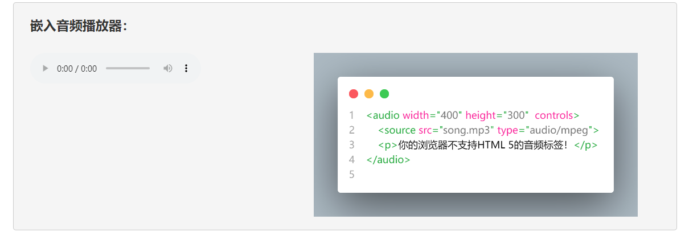
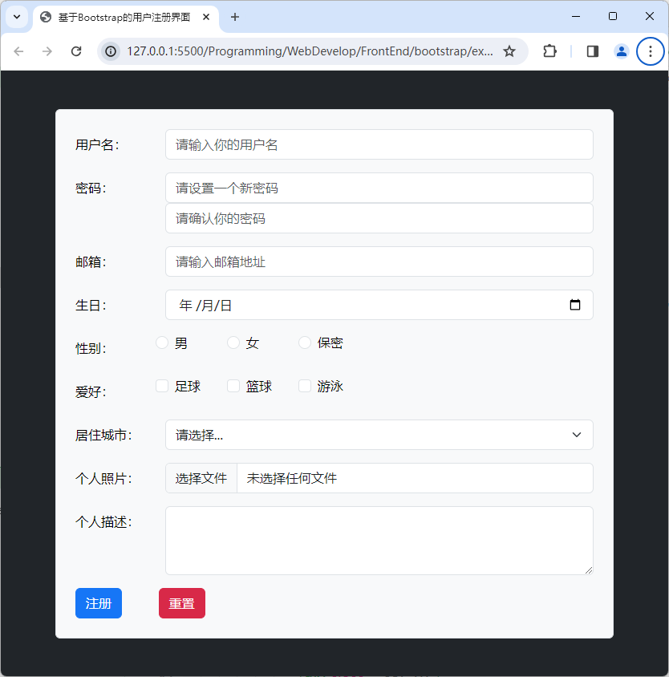
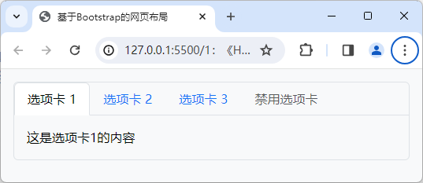
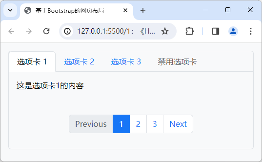
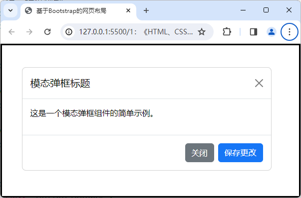

# 项目4 企业网站的申请表单设计

企业网站的申请表单页设计在网页设计领域中属于输入性的用户界面设计项目，其设计目的是让目标网页成为一个用户体验良好的、用于输入数据的人机交互界面，以便Web应用程序的用户能按照其用户界面所指定的规则输入数据，并将其提交给它的后端服务器。在此类项目中，网页设计师们通常会充分利用HTML文档中的按钮、标签、输入框、单选扭、复选框、下拉列表等交互类页面元素来完成对输入性用户界面的设计，以便人们能在良好的操作体验下安全地输入数据并将其提交给服务器，从而为该企业吸引到更多潜在的客户。因此，企业网站中的表单设计也被认为是企业网站设计工作中绕不开的重点任务之一。

## 【学习目标】

在本章，笔者会继续以凌雪冰熊网站中“申请加盟”页的设计为例来演示如何为企业网站设计申请表单。该演示项目的设计目标是为潜在的客户提供提交加盟申请的用户界面，以便简化凌雪冰熊这家连锁饮料店的加盟流程，增加潜在客户加盟的意愿。同样的，该网页的设计也必须要延续该网站首页建立起来的布局风格与配色方案，并同样在导航栏中预留跳转到网站首页、申请加盟、留言板等页面的链接。通过本章项目的实践，读者将会初步了解设计一个用于输入性的用户界面所要执行的基本步骤，以及执行这些步骤所需的基本技术与相关工具。总而言之，在阅读完本章之后，我们希望读者能够：

- 了解HTML 5中提供的交互类标记，并掌握这些标记在网页设计工作中的具体使用；
- 了解如何基于HTML+CSS+JavaScript技术来实现针对交互类元素的用户界面设计；
- 掌握如何在网页设计工作中利用Bootstrap框架来完成针对用户输入界面的设计任务；

## 【学习场景描述】

凌雪冰熊连锁店的网页设计团队如今已经完成了其官方网站的首页设计，并基于该设计进一步创建了该网站的网页模板。现在，他们希望你能基于该模板继续为该网站设计用于提交加盟申请的页面，目的是简化凌雪冰熊这家连锁店的加盟流程，从而吸引到更多的合作伙伴，并进一步扩展该连锁店的规模。在这个网页设计项目中，你的主要任务是为该申请加盟页设计一个操作体验良好的申请表单，以便充当用于潜在客户提交加盟申请的用户界面。当然了，你同样需要确保该页面采用与首页一致的布局风格与配色方案。

## 【任务书】

- **项目名**：凌雪冰熊网站的申请加盟页设计
- **委托方**：凌雪冰熊股份有限公司互联网部门
- **项目资料**：
  - **代码资料**：凌雪冰熊官方网站现有的设计源码；
  - **文献资料**：一份题为“凌雪冰熊加盟申请须知”文件；
- **项目要求**：为凌雪冰熊连锁饮料店的官方网站设计首页，该网页的设计应符合以下要求。
  - 该网页需要为潜在的客户提供用户体验良好的、输入性的用户界面；
  - 该网页在外观样式上需要采用与网站首页一致的布局风格与配色方案；
- 时间要求：在3个工作日内完成；

## 【任务拆解】

本章项目的实施过程可以划分为以下三个小任务来进行：

- 基于凌雪冰熊官方网站提供的网页设计模版来创建该网站的申请加盟页
- 利用HTML标记在网页中创建用于让潜在客户提交加盟申请的表单元素；
- 利用Bootstrap框架提供的样式类和组件来设计专用于输入数据的用户界面；

## 【工作准备】

在本章要实践的项目中，读者的主要任务是为凌雪冰熊网站创建用于提交加盟申请的用户界面，目的是通过一个操作体验良好的用户输入界面来简化该连锁饮料店的加盟流程，以便吸引到更多合作伙伴的加盟。下面先来介绍一下完成该项目任务所需要掌握的知识点与工具，同样的，如果读者自认为已经掌握了这部份知识，也可以选择跳过本节内容，直接进入本章项目的【工作实施与交付】环节。

### 知识点1：HTML 5中的交互类标记

自从以AJAX为代表的Web2.0技术崛起以来，网页的功能日益被扩展成了一种应用程序的用户界面（因此它们有时也被称为应用程序的前端）。因此，学习*如何构建Web应用程序的用户界面，并赋予它良好的操作体验*也就日益成为了网页设计工作中的重要任务之一。为了帮助设计师们更好地完成这一部分的工作，HTML 5中提供了一系列用于构建人机交互界面的标记。下面，本书就带读者来详细了解一下这些标记以及它们的使用方法。

#### 可独立使用的标记

本着从简单到复杂，逐步深入的学习原则，笔者会先从一些可独立设置的交互类元素开始当前知识点内容的介绍，下面是用于创建这类元素的HTML标记及其使用示例。

- `<button>`标记：该标记可用于在网页中创建一个独立的按钮元素，该元素可独立响应用户的鼠标点击操作，其基本使用方法如下所示：

    ```html
    <button type="button" onclick="alert('Hello World!')">
        <!-- 这里可以设置按钮上要显示的文字或图形 -->
        <p>普通按钮</p>
    </button>
    <button type="submit" onclick="alert('Hello World!')">
        <!-- 这里可以设置按钮上要显示的文字或图形 -->
        <p>提交按钮</p>
    </button>
    <button type="reset" onclick="alert('Hello World!')">
        <!-- 这里可以设置按钮上要显示的文字或图形 -->
        <p>重置按钮</p>
    </button>
    ```

    在上述示例中，`type`属性用于指定按钮的类型，其取值可以是`button`、`submit`或`reset`，分别表示普通按钮、提交按钮和重置按钮，默认值为`button`。而`onclick`属性则用于指定按钮在被点击时所要执行的JavaScript脚本，其值既可以是JavaScript代码，也可以是JavaScript代码所在的URL。在这里，笔者让它弹出一个带有“Hello World!”字样的信息提示框。最后，在`<button>`和`</button>`标记之间，设计师们可以设置用于显示在按钮上的提示信息，该信息可以是一段文本，也可以是一个图形，但必须要能说明该按钮元素的功能。

- `<input>`标记：该标记可用于在网页中创建一个输入性质的元素，主要包括分别可用于创建文本输入框、密码输入框、单选框、复选框、文件上传控件等元素，其基本使用方法如下所示：

    ```html
    <!-- 以下定义一个文本输入框 -->
    <input type="text" value="文本输入框" />

    <!-- 以下定义一个密码输入框 -->
    <input type="password" value="密码输入框" />

    <!-- 以下定义一组单选框，其中只有一个选项被选中 -->
    <input type="radio" name="gender" value="male" checked="checked" />男
    <input type="radio" name="gender" value="female" />女

    <!-- 以下定义一组复选框，其中有两个选项被选中 -->
    <input type="checkbox" name="hobby" value="basketball" checked="checked" />篮球
    <input type="checkbox" name="hobby" value="football" />足球
    <input type="checkbox" name="hobby" value="swimming" />游泳
    
    <!-- 以下创建一个文件上传控件，用于上传图片 -->
    <input type="file" name="file" />

    <!-- 以下创建一个日期选择控件，用于选择生日 -->
    <input type="date" name="birthday" />

    <!-- 以下定义一个滑块，其中滑块的当前值是50 -->
    <input type="range" min="0" max="100" value="50" />
    ```

    在上述示例中，`type`属性用于指定输入框的类型，其值可以是`text`、`password`、`radio`、`checkbox`、`range`、`file`、`date`、`button`等。需要特别提醒的是，虽然`<input>`标记也可用于创建按钮元素，但与`<button>`标记相比，`<input>`标记的语义更偏向于用户输入的具体信息，笔者原则上并不鼓励用它来设置按钮元素。

- `<textarea>`标记：该标记用于在网页中创建一个支持多行输入的文本输入框，其基本使用方法如下所示：

    ```html
    <textarea rows="3" cols="20">文本区域</textarea>
    ```

    在上述示例中，`rows`属性用于指定该多行文本输入框元素中可以显示的行数，`cols`属性则用于指定该元素中可以显示的列数。

- `<output>`标记：该标记用于在网页中创建一个输出区域，通常需要配合输入性质的元素一起使用，其基本使用方法如下所示：

    ```html
    <!--
        for属性用于指定该输出区域与哪个输入性质的元素相关联，
        在本例中，该输出区域与range元素相关联
    -->
    <output for="range">0</output>    
    <input type="range" id="range"
        min="0" max="100"
        oninput="output.value = range.value"
    />
    ```

    在上述示例中，笔者首先用`<output>`标记创建了一个输出区域，然后用`<input>`标记创建了一个滑块，并为其设置了`oninput`事件，当滑块的值发生变化时，会自动更新输出区域中的值。

- `<progress>`标记：该标记可用于在网页中创建一个独立的进度条元素，该元素的主要功能是根据用户的操作或某个预定义的JavaScript脚本来显示某一指定任务的执行进度，其基本使用方法如下所示：

   ```html
   <progress id="task" value="0" max="100"></progress>
   <script>
       document.getElementById('task').value = 50;
   </script>
   ```

    在上述示例中，`value`属性用于指定进度条当前的进度值，而`max`属性则用于指定进度条的最大值。在这里，该标记会根据`<script>`标记中预定义的JavaScript脚本来显示进度条的进度值。

- `<meter>`标记：该标记可用于在网页中创建一个独立的度量值元素，其基本使用方法如下所示：

   ```html
   <meter value="75" min="0" max="100">75%</meter>
   ```

    在上述示例中，`value`属性用于指定度量值元素的当前值，而`min`和`max`属性则用于指定度量值元素的最大值和最小值。

#### 需组合使用的标记

为了帮助设计师们设计出功能更为复杂的用户界面，HTML 5中还提供了一系列需要使用多个标记来创建的人机交互元素，下面就继续来介绍这部分HTML标记及其使用方法。

- `<select>`和`<option>`标记：这两个标记可用于在网页中创建一个独立的下拉列表元素，其基本使用方法如下所示：

    ```html
    <select>
        <option value="1">选项1</option>
        <option value="2">选项2</option>
        <option value="3">选项3</option>
    </select>
    ```

    在上述示例中，`<select>`标记用于创建下拉列表本身，而其`<option>`子标记则用于设置下拉列表中的选项，其`value`属性用于指定选项的值。

- `<details>`和`<summary>`标记：这两个标记可用于在网页中创建一个可折叠的内容块元素，该元素允许用户通过单击其标题部分来隐藏或显示它要显示的具体内容，其基本使用方法如下所示：

    ```html
    <details>
        <summary>内容块的标题</summary>
        <!-- 在这里放置要在内容块中显示的内容 -->
        <p>内容块中的一个段落。</p>
    </details>
    ```

    在上述示例中，`<details>`标记则于创建可折叠的内容块元素本身，其`<summary>`子标记则用于设置该块元素的标题部分，而内容块元素要显示或隐藏的具体内容则需要被放置在`<summary>`标记之后到`</details>`标记之前的那个区域中，例如我们在这里放置的是一个`<p>`标记。

- `<datalist>`和`<option>`标记：这两个标记可用于在网页中创建面向`<input>`标记的自动完成列表，其基本使用方法如下所示：
  
    ```html
    <!DOCTYPE html>
    <html>
        <head>
            <title>自动完成列表</title>
        </head>
        <body>
            <input type="text" list="fruits">
            <datalist id="fruits">
                <option value="Apple">
                <option value="Banana">
                <option value="Orange">
            </datalist>
        </body>
    </html>
    ```

    在上述示例中，笔者先用`<input>`标记创建了一个文本输入框，然后再用`<datalist>`标记为该文本输入框创建一个自动完成列表元素，并利用其`<option>`子标记为该元素设置了`Apple`、`Banana`和`Orange`三个可选项。  

- `<form>`标记及其子标记：该标记用于在网页中创建一个表单元素，在基于HTML的用户界面设计中，表单元素的作用是收集用户输入的数据。在该元素下，设计师们可以使用一系列子标签来让用户输入数据，这些标记主要包括：
  - `<label>`子标记：该子标记用于在表单中创建一个标签元素，其`for`属性则用于指定该标签所对应的输入框的ID；
  - `<input>`子标记：该子标记用于在表单中创建一个输入性质的元素，其使用方法与该标签独立使用时相同；
  - `<textarea>`子标记：该子标记用于在表单中创建一个多行的文本输入框，其使用方法与该标签独立使用时相同；
  - `<button>`子标记：该子标记用于在表单中创建一个按钮元素，其使用方法与该标签独立使用时相同；
  - `<select>`子标记：该子标记用于在表单中创建一个下拉列表元素，其使用方法与该标签独立使用时相同；
  - `<optgroup>`子标记：该子标记用于在表单的下拉列表中创建一个选项组元素；
  - `<datalist>`子标记：该子标记用于在表单中创建一个自动完成列表元素，其使用方法与该标签独立使用时相同；
  - `<keygen>`子标记：该子标记用于在表单中创建一个密钥对生成器元素。
  - `<output>`子标记：该子标记用于在表单中创建一个输出元素，其使用方法与该标签独立使用时相同。
  - `<fieldset>`子标记：该子标记用于在表单中创建一个表单元素的分组，该分组会设置有一个专属边框；
  - `<legend>`子标记：该子标记用于在表单的分组中创建一个标题，其`for`属性则用于指定该标题所对应的输入框的ID；

    下面，笔者将通过创建一个简单的、用于用户注册的表单来具体演示一下这些标记的使用方法：

    ```html
    <form method="post" action="https://www.example.com/register">
        <label for="username">用户名：</label>
        <input type="text" name="username" id="username" placeholder="请输入用户名">
        <br>
        <label for="password">密码：</label>
        <input type="password" name="password" id="password" placeholder="请输入密码">
        <br>
        <label for="email">邮箱：</label>
        <input type="email" name="email" id="email" placeholder="请输入邮箱">
        <br>
        <label for="birthday">生日：</label>
        <input type="date" name="birthday" id="birthday">
        <br>
        <label for="gender">性别：</label>
        <input type="radio" name="gender" id="male" value="male">
        <label for="male" class="radio-label">男性</label>
        <input type="radio" name="gender" id="female" value="female">
        <label for="female" class="radio-label">女性</label>
        <input type="radio" name="gender" id="secret" value="secret">
        <label for="secret" class="radio-label">保密</label>
        <br>
        <label for="hobby">爱好：</label>
        <input type="checkbox" name="hobby" id="football" value="football">
        <label for="football" class="checkbox-label">足球</label>
        <input type="checkbox" name="hobby" id="basketball" value="basketball">
        <label for="basketball" class="checkbox-label">篮球</label>
        <input type="checkbox" name="hobby" id="swimming" value="swimming">
        <label for="swimming" class="checkbox-label">游泳</label>
        <br>
        <label for="address">居住城市：</label>
        <select name="address" id="address">
            <option value="beijing">北京</option>
            <option value="shanghai">上海</option>
            <option value="guangzhou">广州</option>
            <option value="shenzhen">深圳</option>
        </select>
        <br>
        <label for="file">个人照片：</label>
        <input type="file" name="file" id="file">
        <br>
        <label for="textarea">个人描述：</label>
        <textarea name="textarea" id="textarea" cols="30" rows="10"></textarea>
        <br>
        <button type="submit"
                onclick="alert('提交成功')">提交</button>
        <button type="reset">重置</button>
    </form>
    ```

    在上述示例中，笔者主要做了以下动作：

    1. 先使用`<form>`标记创建了表单元素。在此过程中，笔者用`method`属性指定了表单提交的方式为`post`，用`action`属性指定了表单提交的目的地（即应用程序后端的某个URL）。
    2. 然后用`<form>`标记的各种子标记创建了该表单元素的各个输入字段，并为其设置了对应的`id` 属性，这样在提交表单时，这些输入字段的值会以键值对的形式被提交到服务端。
    3. 最后使用`<button>`创建了该表单元素的提交按钮和重置按钮，并为其添加了点击事件。

### 知识点2：基于CSS的表单样式设计

在使用HTML标记创建好用户界面中的交互类元素之后，接下来要做的就是利用CSS来设置用户界面的外观样式了。通常情况下，设计师们在设计Web应用程序的用户界面时，原则上都会倾向于让它在外观样式上无限接近于传统的桌面应用程序，这有助于人们在使用Web应用程序时能延续传统的计算机操作习惯，从而降低Web应用程序的使用门槛。下面，笔者将以上面刚刚创建的用户注册表单为例来为读者演示如何基于CSS来完成用户界面的设计任务，其具体步骤如下。

1. 首先要做的是将上一节中创建的这个用户注册表单元素放置到一个结构完整的HTML文档中（在这里，该文档将被保存在本书源码包的`Examples/00_demo/formCase`目录中，文件名为`index.htm`），其具体代码如下。

    ```html
    <!DOCTYPE html>
    <html lang="zh-CN">
        <head>
            <meta charset="UTF-8">
            <title>交互类元素示例：用户注册</title>
            <lInk rel="stylesheet" href="./styles/main.css">
        </head>
        <body>
            <form method="post" action="https://www.example.com/register">
                <label for="username">用户名：</label>
                <input type="text" name="username" id="username"
                        placeholder="请输入用户名">
                <br>
                <label for="password">密码：</label>
                <input type="password" name="password" id="password"
                        placeholder="请输入密码">
                <br>
                <label for="email">邮箱：</label>
                <input type="email" name="email" id="email"
                        placeholder="请输入邮箱">
                <br>
                <label for="birthday">生日：</label>
                <input type="date" name="birthday" id="birthday">
                <br>
                <label for="gender">性别：</label>
                <input type="radio" name="gender" id="male" value="male">
                <label for="male" class="radio-label">男性</label>
                <input type="radio" name="gender" id="female" value="female">
                <label for="female" class="radio-label">女性</label>
                <input type="radio" name="gender" id="secret" value="secret">
                <label for="secret" class="radio-label">保密</label>
                <br>
                <label for="hobby">爱好：</label>
                <input type="checkbox" name="hobby" id="football" value="football">
                <label for="football" class="checkbox-label">足球</label>
                <input type="checkbox" name="hobby" id="basketball" value="basketball">
                <label for="basketball" class="checkbox-label">篮球</label>
                <input type="checkbox" name="hobby" id="swimming" value="swimming">
                <label for="swimming" class="checkbox-label">游泳</label>
                <br>
                <label for="address">居住城市：</label>
                <select name="address" id="address">
                    <option value="beijing">北京</option>
                    <option value="shanghai">上海</option>
                    <option value="guangzhou">广州</option>
                    <option value="shenzhen">深圳</option>
                </select>
                <br>
                <label for="file">个人照片：</label>
                <input type="file" name="file" id="file">
                <br>
                <label for="textarea">个人描述：</label>
                <textarea name="textarea" id="textarea" cols="30" rows="10"></textarea>
                <br>
                <button type="submit"
                        onclick="alert('提交成功')">提交</button>
                <button type="reset">重置</button>
            </form>    
        </body>
    </html>
    ```

2. 接下来要做的是创建相应的CSS文件。具体来说就是，先按照上述HTML文档中`<link>`标记指定的相对路径创建一个名为`main.css`的文件，然后用代码编辑器打开该文件就开始编写样式代码了。在这里，笔者将先从整个页面全局样式开始着手，主要设置一下需要全局使用的字体及其大小、背景色等，例如像这样:

    ```css
    /* 设置全局样式 */
    body {
        font-family: "Microsoft Yahei" Arial, sans-serif;
        font-size: 16px;
        background-color: #f2f2f2;
    }
    ```

3. 接下来就可以开始正式设置用户界面的样式了。先从表单元素及其一般性的标签与输入性元素开始，这部分的外观样式设计通常只与元素的内外边距和边框相关，例如像这样：
  
   ```css
    /* 设置表单元素的样式 */
    form {
        width: 45vw;
        margin: 0 auto;    
        padding: 0.5vh 1.5vw;
        background-color: #fff;
        border-radius: 5px;
        box-shadow: 0 0 10px rgba(0, 0, 0, 0.1);
    }

    /* 设置一般性标签元素的样式 */
    label {
        display: block;
        margin: 0.5vh 0;
        font-weight: bold;
    }

    /* 设置一般性输入元素的样式 */
    input[type="text"],
    input[type="password"],
    input[type="email"],
    input[type="date"],
    input[type="file"],
    textarea {
        width: 100%;
        padding: 1.5vh 1.5vw;
        border: 1px solid #ccc;
        border-radius: 3px;
        box-sizing: border-box;
        margin-bottom: 0.5vh;
    }
    ```

4. 接着来设置一下用户中带有特殊样式的输入性元素，这些特殊样式包括单选框与复选框元素需要设置为横向排列、多行输入框元素需要设置行数和列数、按钮需要设置制定的背景色等，例如像这样：

    ```css
    /* 设置单选框和复选框元素的特定样式 */
    input[type="radio"],
    input[type="checkbox"] {
        margin-right: 0.1vw;
    }
    label.radio-label,
    label.checkbox-label {
        display: inline-block;
        margin-right: 1vw;
    }

    /* 设置下拉列表元素的特定样式 */
    select {
        width: 100%;
        padding: 0.5vh 0.5vw;
        border: 1px solid #ccc;
        border-radius: 3px;
        box-sizing: border-box;
        margin-bottom: 0.5vh;
    }

    /* 设置文本区域元素的特定样式 */
    textarea {
        width: 100%;
        padding: 1vh 1.5vw;
        border: 1px solid #ccc;
        border-radius: 3px;
        box-sizing: border-box;
        margin-bottom: 0.5vh;
    }

    /* 设置按钮元素的特定样式 */
    button {
        padding: 1vh 2vw;
        background-color: #4CAF50;
        color: #fff;
        border: none;
        border-radius: 3px;
        cursor: pointer;
        margin: 0.5vh 1vw;
    }
    button[type="reset"] {
        background-color: #f44336;
    }
    ```

5. 最后在将上述HTML+CSS代码保存为相应类型的文件之后，就可以在用网页浏览器中打开这个网页时看到如图4-1所示的布局效果。

    

    **图4-1**：基于HTML+CSS设计的用户注册界面

### 知识点3：基于Bootstrap框架的用户界面设计

正如之前所说，自从以AJAX为代表的Web2.0技术问世以来，基于HTML+CSS+JavaScript技术的用户界面设计日益成为了网页设计工作中至关重要的一环，一个精心设计的用户界面可以提供直观、易用和愉悦的用户体验。换而言之，只要设计师们为应用程序的前端设计了布局合理，简单直观的用户界面，用户就可以轻松地实现与应用程序后端的交互，这对于该应用的推广是至关重要的。在这一知识点中，本书就来为读者介绍一下Bootstrap框架在用户界面设计方面的应用，先从网页中最常用的用户界面组件：表单元素的样式设置开始。

### 表单样式设置

在具体介绍Bootstrap框架为表单元素提供的样式类之前，本书在这里也会在和上一章中所做的一样，先参照之前基于HTML+CSS实现的用户注册表单，来演示一下Bootstrap框架在完成相同界面设计任务时的应用，以便读者能自行去比较这两种对于相同任务的不同实现方法，从而了解到Bootstrap框架给网页设计工作带来的便利，该示例的构建步骤如下：

1. 在本地计算机中创建一个名为`formCase`的项目（在这里，我将会将它创建在本笔记文件所在的目录下的`examples`目录中），并按照之前示例中演示的方法将Bootstrap框架引入到当前项目中。

2. 在VS Code这样的代码编辑器中打开刚刚创建项目，然后在该项目的根目录下创建一个`index.htm`文件，并在其中输入以下代码：

    ```html
    <!DOCTYPE html>
    <html lang="zh-CN">
        <head>
            <meta charset="UTF-8">
            <meta name="viewport" content="width=device-width, initial-scale=1.0">
            <link rel="stylesheet" href="./styles/bootstrap.min.css">
            <script src="./scripts/bootstrap.min.js" defer></script>
            <title>基于Bootstrap的用户注册界面</title>
        </head>
        <body class="text-bg-dark">
            <main class="container">
                <form method="post" action="http://example.com/user-register"
                    class="text-bg-light border rounded p-4 mt-5 mx-auto" >
                    <div class="row mb-3">
                        <label for="username" class="col-form-label col-2">
                            用户名：
                        </label>
                        <div class="col-10">
                            <input type="text" class="form-control"
                                id="username" name="username"
                                placeholder="请输入你的用户名">
                        </div>    
                    </div>
                    <div class="row mb-3">
                        <label for="password" class="col-form-label col-2">
                            密码：
                        </label>
                        <div class="col-10">
                            <input type="password" class="form-control"
                                id="password" name="password"
                                placeholder="请设置一个新密码">
                            <input type="password" class="form-control"
                                id="repassword" name="repassword"
                                placeholder="请确认你的密码">
                        </div>    
                    </div>
                    <div class="row mb-3">
                        <label for="email" class="col-form-label col-2">
                            邮箱：
                        </label>
                        <div class="col-10">
                            <input type="email" class="form-control"
                                id="email" name="email"
                                placeholder="请输入邮箱地址">
                        </div>    
                    </div>
                    <div class="row mb-3">
                        <label for="birthday" class="col-form-label col-2">
                            生日：
                        </label>
                        <div class="col-10">
                            <input type="date" class="form-control"
                                id="birthday" name="birthday">
                        </div>
                    </div>
                    <div class="row mb-3">
                        <label for="gender" class="col-form-label col-2">
                            性别：
                        </label>
                        <div class="col-10 row">
                            <div class="form-check col-2">
                                <input type="radio" class="form-check-input"
                                    name="gender" id="male" value="male">
                                <label class="form-check-label" for="male">
                                    男
                                </label>
                            </div>
                            <div class="form-check col-2">
                                <input type="radio"  class="form-check-input"
                                    name="gender"  id="female" value="female">
                                <label class="form-check-label" for="female">
                                    女
                                </label>
                            </div>
                            <div class="form-check col-2">
                                <input type="radio"  class="form-check-input"
                                    name="gender"  id="secret" value="secret">
                                <label class="form-check-label" for="secret">
                                    保密
                                </label>
                            </div>
                        </div>
                    </div>
                    <div class="row mb-3">
                        <label for="hobby" class=" col-form-label col-2">
                            爱好：
                        </label>
                        <div class="col-10 row">
                            <div class="form-check col-2">
                                <input type="checkbox" class="form-check-input"
                                    id="hobby" name="hobby" value="football">
                                <label for="hobby" class="form-check-label">
                                    足球
                                </label>
                            </div>
                            <div class="form-check  col-2">
                                <input type="checkbox" class="form-check-input"
                                    id="hobby" name="hobby" value="basketball">
                                <label for="hobby" class="form-check-label">
                                    篮球
                                </label>
                            </div>
                            <div class="form-check col-2">
                                <input type="checkbox" class="form-check-input"
                                    id="hobby" name="hobby" value="swimming">
                                <label for="hobby" class="form-check-label">
                                    游泳
                                </label>
                            </div>
                        </div>
                    </div>
                    <div class="row mb-3">
                        <label for="address" class="col-form-label col-2">
                            居住城市：
                        </label>
                        <div class="col-10">
                            <select class="form-select" name="address" 
                                id="address">
                                <option selected>请选择...</option>
                                <option value="beijing">北京</option>
                                <option value="shanghai">上海</option>
                                <option value="guangzhou">广州</option>
                                <option value="shenzhen">深圳</option>
                            </select>
                        </div>
                    </div>
                    <div class="row mb-3">
                        <label for="file" class="col-form-label col-2">
                            个人照片：
                        </label>
                        <div class="col-10">
                            <input type="file" class="form-control"
                                id="file" name="file">
                        </div>
                    </div>
                    <div class="row mb-3">
                        <label for="textarea" class="col-form-label col-2">
                            个人描述：
                        </label>
                        <div class="col-10">
                            <textarea class="form-control"
                                id="textarea" name="textarea" rows="3"></textarea>
                        </div>
                    </div>
                    <div class="w-25 d-flex justify-content-between">
                        <button type="submit" class="btn btn-primary">
                            注册
                        </button>
                        <button type="reset" class="btn btn-danger">
                            重置
                        </button>
                </form>
            </main>
        </body>
    </html>
    ```

3. 在保存上述代码之后，读者就可以使用网页浏览器打开`index.htm`文件查看当前网页设计的结果，其外观样式在Google Chrome浏览器中的效果如图4-2所示。

   

    **图4-2**：基于Bootstrap框架的用户注册界面

同样的，上述示例也只使用Bootstrap框架提供的一系列样式类就实现了笔者之前在上一知识点中用上百行CSS代码实现的效果，下面来介绍一下相关样式类的使用方法。

#### 表单整体布局

默认情况下，表单中的元素是纵向排列的，设计师们通常只需要使用`<div>`将它们分组并设置好一定的间距即可实现基本的布局，例如下面是一个使用了默认布局的用户登录界面：

```html
<form class="border rounded p-3 m-5"
    method="post" action="http://example.com/api">
    <div class="mb-3">
        <label for="username" class="form-label">用户名</label>
        <input type="text" class="form-control" id="username" name="username"
            placeholder="请输入用户名">
    </div>
    <div class="mb-3">
        <label for="password" class="form-label">密码</label>
        <input type="password" class="form-control" id="password" name="password"
            placeholder="请输入密码">
    </div>
    <div class="mb-3">
        <button type="submit" class="btn btn-primary">登录</button>
        <button type="reset" class="btn btn-danger">重置</button>
    </div>
</form>
```

正如读者所见，上述代码使用`<div>`元素将表单中的元素进行了分组，并使用`class="mb-3"`设置了它们之间的间距。另外，由于`<form>`标记本身也可以被视为一个用于组织用户界面元素的布局类元素，所以笔者在这里同样也为它设置了长宽度、边框以及内外边距等样式，其效果如图4-3所示：



**图4-3**：采用垂直布局的用户登录界面

如果读者想采用水平布局的表单设计，只需要将`<form>`标记的`class`属性值设置为`row`，然后将分组交互元素的`<div>`的`class`属性设置为`col-*`即可，例如下面是一个使用了水平布局的用户登录界面：

```html
<form method="post" action="http://example.com/api"
    class="row border rounded p-3 m-5">
    <div class="col-4">
        <input type="" class="form-control" 
            placeholder="请输入你的用户名">
    </div>
    <div class="col-4">
        <input type="password" class="form-control" 
            placeholder="请输入你的密码">
    </div>
    <div class="col-4">
        <button type="submit" class="btn btn-primary">登录</button>
        <button type="reset" class="btn btn-danger">重置</button>
    </div>
</form>
```

上述代码的显示效果如图4-4所示：



**图4-4**：采用水平布局的用户登录界面

当然了，由`row`和`col-*`搭配的栅格布局方式也可以用于设计多行多列的表格元素，例如下面这个用于填写用户信息的表单：

```html
<form method="post" action="http://example.com/api"
    class="border rounded p-3 m-5">
    <div class="row p-1">
        <div class="col-6">
            <input type="text" class="form-control"
                name="firstname" id="firstname"
                placeholder="姓">
        </div>
        <div class="col-6">
            <input type="text" class="form-control"
                name="lastname" id="lastname"
                placeholder="名">
        </div>
    </div>
    <div class="row p-1">
        <label for="address" class="col-form-label col-12">
            具体地址：
        </label>
        <div class="col-12">
            <input type="text" class="form-control"
                name="address" id="address"
                placeholder="请输入详细街道地址">
        </div>
    </div>
    <div class="row p-1">
        <div class="col-6">
            <label for="city" class="form-label">城市：</label>
            <input type="text" class="form-control" 
                name="city" id="city">
        </div>
        <div class="col-4">
            <label for="state" class="form-label">国家：</label>
            <input type="text" class="form-control"
                name="state" id="state">
        </div>
        <div class="col-2">
            <label for="zipcode" class="form-label">邮编：</label>
            <input type="text" class="form-control"
                name="zipcode" id="zipcode">
        </div>
    </div>
    <div class="d-flex gap-3 m-2">
        <button type="submit" class="btn btn-primary">提交</button>
        <button type="reset" class="btn btn-danger">重置</button>
    </div>
</form>
```

上述代码的显示效果如图4-5所示：



**图4-5**：采用多行多列布局的表单示例

#### 表单元素样式

在完成了表单的整体布局之后，接下来就是设置表单中的交互元素了。在Bootstrap框架中，用于设置表单中交互元素的样式类和组件主要有如下几个：

- `form-text`：该样式类主要作用于表单元素中的文本类标记，设置的是提示文本的样式。
- `form-label`：该样式类主要作用于表单元素中的`<label>`标记，设置的是表单标签的样式。
- `form-check`：该样式类主要作用于表单中用来设置单选钮或复选框的`<div>`标记，设置的是表单中一组单选钮或复选框的样式。
- `form-check-inline`：该样式类主要作用于表单元素中用来设置单选钮或复选框的`<div>`标记，通常需要与`form-check`样式类配合使用，效果是将表单中的一组单选钮或复选框设置为水平排列。
- `form-switch`：该样式类主要作用于表单中用来给复选框分组的`<div>`标记，通常需要与`form-check`样式类配合使用，效果是将表单中的一组复选框设置为开关样式。
- `form-check-input`：该样式类主要作用于表单元素中的`<input type="radio">`或`<input type="checkbox">`标记，这两个标记通常会被放置在`class="form-check"`的`<div>`标记内部，设置的是表单中特定单选钮或复选框的样式。
- `form-check-label`：该样式类主要作用于表单中被放置在`class="form-check"`的`<div>`标记内部的`<label>`标记，设置的是表单中特定单选钮或复选框的标签样式。
- `form-file`：该样式类主要作用于表单中的`<input type="file">`标记，设置的是表单中文件上传元素的样式。
- `form-range`：该样式类主要作用于表单中的`<input type="range">`标记，设置的是表单中滑块的样式。
- `form-control`：该样式类主要作用于表单中用`<input>`或`<textarea>`标记定义的元素（上面已经列出的特定元素除外），设置的是表单中一般输入性元素的样式。
- `form-select`：该样式类主要作用于表单中的`<select>`标记，设置的是表单中下拉列表的样式。
- `form-group`：该样式类主要作用于表单中用来给交互元素分组的`<div>`标记，设置的是表单中某一组交互元素的样式。

#### 表单验证设置

在使用表单为应用程序构建用户界面的过程中，设计师们通常还需要为界面中的交互元素设计一些用于在发生操作错误时显示出相关提示的验证类元素，以保证用户输入的内容符合预期。在Bootstrap框架中，用于设置表单中验证类元素的样式类主要有如下几个：

- `is-invalid`：该样式类主要用于表示交互元素的无效状态。该类通常需要与表单中的`<input>`、`<select>`或`<textarea>`等交互元素搭配使用，当这些交互元素得到的用户输入不符合制定验证规则时，可通过相应的JavaScript脚本激活这个类，使其显示为红色边框和红色文字。
- `is-valid`：该样式类主要用于表示交互元素的合法状态。该类通常需要与表单中的`<input>`、`<select>`或`<textarea>`等交互元素搭配使用，当这些交互元素得到的用户输入符合制定验证规则时，可通过相应的JavaScript脚本激活这个类，使其显示为绿色边框和绿色文字。
- `was-validated`：该样式类主要用于表示表单已经通过验证。当表单中的所有必填字段都通过验证时，可以添加这个类，以便显示成功的样式。这个类通常添加在`<form>`元素上。
- `invalid-feedback`：用于显示验证错误的消息。当表单元素的值不符合验证规则时，可以添加这个类，并在其后添加相应的错误提示信息。这个类通常与`<div>`元素一起使用。

除了上述常用的样式类之外，Bootstrap框架中还提供了一些专用的表单验证组件，这些组件可以利用强大的JavaScript脚本来处理表单的验证逻辑，读者可以自行查看官方文档中对于这些组件的相关介绍，这些信息可以帮助你在用户输入不符合预期时显示错误消息，并在表单提交时进行验证。

## 【工作实施和交付】

在完成了上述知识准备之后，读者现在就可以根据之前【任务书】中的要求来着手设计凌雪冰熊网站的申请加盟页了，该项目的实施过程可以分为以下步骤来进行。

### 第1步：基于网页模板来创建目标页面

在这一步骤中，网页设计师的主要任务是基于刚刚创建的网页设计模板来创建网站的申请加盟页，并完成该页面主体部分的内容布局。为此，读者需要执行以下操作。

1. 最后回到之前的命令行终端环境中，并在项目的根目录中通过执行以下命令来完成本章项目的第三次版本控制操作。

    ```bash
    git init
    git add .
    git commit -m "项目4：完成申请加盟页的创建"
    ```

### 第2步：完成新页面的设计并填充内容

在这一步骤中，网页设计师的主要任务是使用HTML中的图文类标记填充委托方提供的“凌雪冰熊加盟须知”文稿，并对这些图文信息进行排版，然后再为潜在合作伙伴提供申请加盟的入口，以便用于打开提交申请的用户界面。为此，读者需要执行以下操作。

1. 最后回到之前的命令行终端环境中，并在项目的根目录中通过执行以下命令来完成本章项目的第三次版本控制操作。

    ```bash
    git add .
    git commit -m "项目4：完成申请加盟页的图文排版"
    ```

### 第3步：设计用于提交加盟申请的界面

在这一步骤中，网页设计师的主要任务是使用HTML中的交互类标记来创建用于提交加盟申请的用户界面，并利用Bootstrap框架提供的样式类完成该用户界面的设计工作。为此，读者需要执行以下操作。

4. 最后回到之前的命令行终端环境中，并在项目的根目录中通过执行以下命令来完成本章项目的第三次版本控制操作。

    ```bash
    git add .
    git commit -m "项目4：完成用户界面的设计"
    ```

## 【拓展知识】

### 知识点1：Bootstrap框架中的交互类组件

除了表单元素之外，Bootstrap还提供了一些具有专用功能的交互组件，这些组件可以用来构建更加复杂的用户界面，这些组件主要包括：

- **按钮组件**：对于表单元素或页面其他元素中放置的按钮元素，设计师们可以考虑使用Bootstrap框架提供的按钮组件来进行辅助设计，下面是该组件的一个简单示例：

    ```html
    <button type="button" class="btn btn-primary">Primary</button>
    <button type="button" class="btn btn-secondary">Secondary</button>
    <button type="button" class="btn btn-success">Success</button>
    <button type="button" class="btn btn-danger">Danger</button>
    <button type="button" class="btn btn-warning">Warning</button>
    <button type="button" class="btn btn-info">Info</button>
    <button type="button" class="btn btn-light">Light</button>
    <button type="button" class="btn btn-dark">Dark</button>
    <button type="button" class="btn btn-link">Link</button>
    ```

  接下来，笔者将根据上述示例来介绍一下与按钮组件相关的样式类及其使用方法，具体如下：
  - `btn`：该样式类通常作用于`<button>`或`<a>`标记，效果是将该标记定义的元素设置为按钮组件，并赋予其默认样式。在设置按钮组件时，读者还需要注意以下事项：
    - 如果想改变按钮组件的默认配色，则需要在`btn`样式类后面添加`btn-primary`、`btn-secondary`、`btn-success`、`btn-danger`、`btn-warning`、`btn-info`、`btn-light`或`btn-dark`这八个样式类中的一个。关于这些配色及其代表的含义，本书在之前的章节中已经做过介绍，这里就不再重复了；
    - 如果想将组件设置为链接样式，则需要在`btn`样式类后面添加一个`btn-link`样式类；

- **下拉菜单组件**：如果读者想在页面中设置一个类似于桌面应用程序中的下拉菜单，则可以使用Bootstrap框架提供的下拉菜单组件来进行辅助设计。下面是该组件的一个简单示例：

    ```html
    <div class="dropdown">
        <button class="btn btn-secondary dropdown-toggle" type="button" 
            id="dropdownMenuButton1" data-bs-toggle="dropdown" 
            aria-expanded="false">
            下拉菜单的按钮元素
        </button>
        <ul class="dropdown-menu" aria-labelledby="dropdownMenuButton1">
            <li><a class="dropdown-item" href="#">菜单项 1</a></li>
            <li><a class="dropdown-item" href="#">菜单项 2</a></li>
            <li><a class="dropdown-item" href="#">菜单项 3</a></li>
        </ul>
    </div>
    ```

  接下来，笔者将根据上述示例来介绍一下手风琴组件的使用方法以及相关的样式类，具体如下：
  - `dropdown`：该样式类通常作用于一个`<div>`标记，效果是将该标记定义的元素设置为一个下拉菜单组件；
  - `dropdown-toggle`：该样式类是`dropdown`类的次级样式类，通常作用于被设置了`dropdown`类的`<div>`标记内的`<button>`或`<a>`标记，效果是将该标记定义的元素设置为一个下拉菜单组件的控制按钮，以便用于控制下拉菜单组件的显示与隐藏；
  - `dropdown-menu`：该样式类是`dropdown`类的次级样式类，通常作用于被设置了`dropdown`类的`<div>`标记内的`<ul>`标记，效果是将该标记定义的元素设置为一个下拉菜单组件的菜单部分，以便用于放置该组件中的具体菜单项；
  - `dropdown-item`：该样式类是`dropdown-menu`类的次级样式类，通常作用于被设置了`dropdown-menu`类的`<ul>`标记内的`<li>`标记，效果是将该标记定义的元素设置为一个下拉菜单组件中的菜单项，以便用于放置这些菜单项中的具体链接；

- **模态对话框组件**：如果读者想在页面中设置一个类似于桌面应用程序中的弹出式对话框，则可以使用Bootstrap框架提供的模态对话框组件来进行辅助设计。下面是该组件的一个简单示例：

    ```html
    <button type="button" class="btn btn-primary"
        data-bs-toggle="modal" data-bs-target="#modalExample">
        显示模态弹框
    </button>
    <dialog class="modal fade" id="modalExample" tabindex="-1"
        aria-labelledby="modalExampleLabel" aria-hidden="true">
        <div class="modal-dialog">
            <div class="modal-content">
                <div class="modal-header">
                    <h5 class="modal-title" 
                        id="modalExampleLabel">
                        模态弹框标题
                    </h5>
                    <button type="button" class="btn-close"
                        data-bs-dismiss="modal" 
                        aria-label="Close">
                    </button>
                </div>
                <div class="modal-body">
                    <p>这是一个模态弹框组件的简单示例。</p>
                </div>
                <div class="modal-footer">
                    <button type="button" 
                        class="btn btn-secondary"
                        data-bs-dismiss="modal">关闭</button>
                    <button type="button" 
                        class="btn btn-primary">
                        保存更改
                    </button>
                </div>
            </div>
        </div>
    </dialog>
    ```

  接下来，笔者将根据上述示例来介绍一下该组件的使用方法以及相关的样式类，具体如下：
  - `modal`：该样式类通常作用于一个`<div>`或`<dialog>`标记，效果是将该标记定义的元素设置为一个模态对话框组件。在设置该组件时，读者需要注意以下事项：
    - 由于该组件是一个弹出式对话框，所以我们需要设置一个按钮元素来触发该对话框的弹出。在定义该按钮元素的`<button>`标记中，`data-bs-toggle`属性的值应设置为`modal`，`data-bs-target`属性的值则应为`#[id属性值]`（在这里，`[id属性值]`为模态对话框组件的`id`属性值）。
    - 如果我们想赋予该模态对话框淡入淡出的效果，就需要在`modal`样式类后面再添加一个`fade`样式类； 
  - `modal-dialog`：该样式类是`modal`类的次级样式类，通常作用于被设置了`modal`类的`<div>`标记内第一级的`<div>`标记，效果是将该标记定义的元素设置为模态对话框组件的对话框部分。在设置这部分样式时，读者需要注意以下事项：
    - 如果读者想在对话框中使用滚动条元素，就需要在`modal-dialog`样式类后面再添加一个`modal-dialog-scrollable`样式类；
    - 如果读者想在对话框中使用居中布局，就需要在`modal-dialog`样式类后面再添加一个`modal-dialog-centered`样式类；
  - `modal-content`：该样式类是`modal-dialog`类的次级样式类，通常作用于被设置了`modal-dialog`类的`<div>`标记内第一级的`<div>`标记，效果是将该标记定义的元素设置为一个用于放置对话框内部元素的容器；
  - `modal-header`：该样式类是`modal-content`类的次级样式类，通常作用于被设置了`modal-content`类的`<div>`标记内第一级的`<div>`标记，效果是将该标记定义的元素设置为一个模态对话框组件的头部部分。
  - `modal-title`：该样式类是`modal-header`类的次级样式类，通常作用于被设置了`modal-header`类的`<div>`标记内的标题类标记，效果是将该标记定义的元素设置为一个模态对话框组件的标题文本。
  - `modal-body`：该样式类是`modal-content`类的次级样式类，通常作用于被设置了`modal-content`类的`<div>`标记内第一级的`<div>`标记，效果是将该标记定义的元素设置为一个模态对话框组件的身体部分。
  - `modal-footer`：该样式类是`modal-content`类的次级样式类，通常作用于被设置了`modal-content`类的`<div>`标记内第一级的`<div>`标记，效果是将该标记定义的元素设置为一个模态对话框组件的底部部分；

- **进度条组件**：如果读者想在页面中设置一个显示某个操作过程的进度条，就可以使用Bootstrap框架提供的进度条组件来进行辅助设计。下面是该组件的一个简单示例：

    ```html
    <div class="progress">
        <div class="progress-bar" role="progressbar" aria-valuemin="0" 
            aria-valuemax="100" style="width: 25%;">
            25%
        </div>
    </div>
    ```

  接下来，笔者将根据上述示例来介绍一下该组件的使用方法以及相关的样式类，具体如下：
  - `progress`：该样式类通常作用于一个`<div>`标记，效果是将该标记定义的元素设置为一个进度条组件；
  - `progress-bar`：该样式类是`progress`类的次级样式类，通常作用于被设置了`progress`类的`<div>`标记内第一级的`<div>`，效果是将该标记定义的元素设置为一个该组件的进度条本体部分。在设置这部分样式，我们需要将该`<div>`的`role`属性设置为`progressbar`，将`aria-valuemin`属性设置为`0`，将`aria-valuemax`属性设置为`100`，并将`style`属性设置为`width: 25%;`，以实现进度条的25%进度效果。
  
需要注意的是，本书在这里所介绍的只是笔者在个人实践中常用到的Bootstrap组件及其基本使用方法，如果读者想知道更为详细的资料，可以访问Bootstrap中文网来查看相关文档。

## 【作业】

## 【作业评价】
