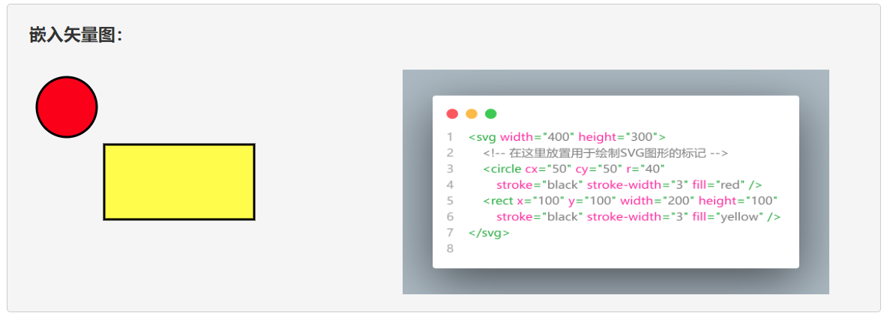
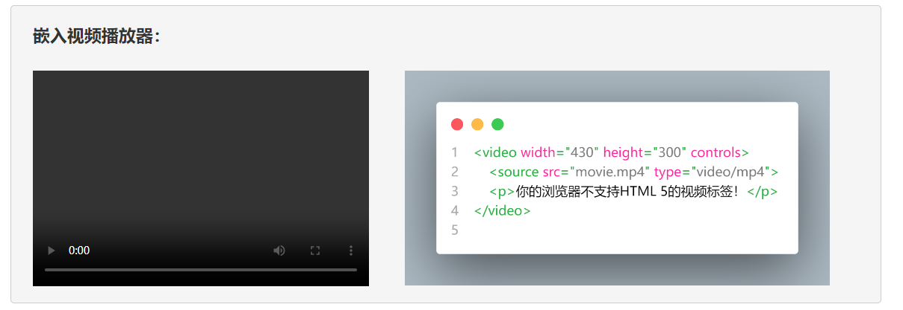

# 项目4 企业网站的产品展示页设计

企业网站的产品展示页设计在网页设计领域中属于多媒体页面设计项目，其设计目的是将目标网页打造成一个类似于Bilibili的多媒体播放界面，以便利用音频、视频、动画等多媒体的形式向公众展示网站所需企业的主打产品与经营近况。在此类项目中，网页设计师们除了需要利用本书在上一章中介绍的方法来对网页中的图文信息进行排版之外，通常还需要充分利用HTML中的多媒体类标记以及Bootstrap框架提供的相关组件来构建基于浏览器的多媒体播放界面。由于多媒体形式的宣传也将有助于为企业网站吸引到更多潜在的客户或合作伙伴，所以此类项目也被认为是网页设计师们在实际工作中最常接到的任务之一。

## 【学习目标】

在本章，笔者会继续以凌雪冰熊网站中“产品展示”页的设计为例来演示如何为企业网站设计出类似于Bilibili的多媒体播放界面。该项目的设计目标是为凌雪冰熊网站提供音频、视频等多媒体资料的发布页面，以便更好地展示这家连锁店最近的主打产品与新加盟的门店，从而吸引到更多潜在的合作伙伴。同样的，该网页在外观设计上也必须要延续该网站首页建立起来的布局风格与配色方案，并同样在导航栏中提供跳转到网站首页、申请加盟等页面的链接。通过本章项目的实践，读者将会初步了解设计一个多媒体播放类页面所要执行的基本步骤，以及执行这些步骤所需的基本技术与相关工具。总而言之，在阅读完本章之后，我们希望读者能够：

- 了解HTML 5中提供的多媒体类标记，并掌握这些标记在网页设计工作中的具体使用；
- 掌握如何在网页设计工作中利用Bootstrap框架来完成针对多媒体类页面的组织任务；

## 【学习场景描述】

凌雪冰熊连锁店的网页设计团队如今已经完成了其官方网站的首页设计，并基于该设计进一步创建了该网站的网页模板。现在，他们希望你能基于该模板继续为该网站设计用于播放多媒体资料的页面，目的是更好地宣传凌雪冰熊这家连锁店最近的主打产品，以及在全国各地新加盟的门店，从而进一步展现企业品牌的竞争力。在这个网页设计项目中，你的主要任务是为网站的“产品展示”页设计一个类似于Bilibili的多媒体播放页面，以便网站的用户可以在良好的用户体验下观看凌雪冰熊网站发布的多媒体信息。当然了，你同样需要确保该页面采用与首页一致的布局风格与配色方案。

## 【任务书】

- **项目名**：凌雪冰熊网站的产品展示页设计
- **委托方**：凌雪冰熊股份有限公司互联网部门
- **项目资料**：
  - **代码资料**：凌雪冰熊官方网站现有的设计源码；
  - **多媒体资料**：凌雪冰熊官方提供的音频、视频等多媒体资料；
- **项目要求**：为凌雪冰熊连锁饮料店的官方网站设计首页，该网页的设计应符合以下要求。
  - 该网页需要为网站的客户提供用户体验良好的、多媒体播放界面；
  - 该网页在外观样式上需要采用与网站首页一致的布局风格与配色方案；
- 时间要求：在3个工作日内完成；

## 【任务拆解】

本章项目的实施过程可以划分为以下三个小任务来进行：

- 基于凌雪冰熊官方网站提供的网页设计模版来创建该网站的产品展示页；
- 利用Bootstrap框架创建多媒体播放界面，包括媒体列表与媒体播放区域；
- 利用HTML标记将凌雪冰熊官方提供的多媒体资料填充到刚刚创建的界面中；

## 【工作准备】

### 知识点1：Bootstrap框架的容器类组件

- **选项卡组件**：如果我们想以选项卡的方式来组织页面中的图文内容，可以考虑使用Bootstrap框架中提供的选项卡组件来进行辅助设计，下面是该组件的一个简单示例：

    ```html
    <div id="tabdemo">
        <ul class="nav nav-tabs" role="tablist">
            <li class="nav-item" role="presentation">
                <button class="nav-link active" id="tab1-tab" 
                    data-bs-toggle="tab" data-bs-target="#tab1" 
                    aria-controls="tab1" aria-selected="true">
                    选项卡 1
                </button>
            </li>
            <li class="nav-item" role="presentation">
                <button class="nav-link" id="tab2-tab"
                    data-bs-toggle="tab" data-bs-target="#tab2"
                    aria-controls="tab2" aria-selected="false">
                    选项卡 2
                </button>
            </li>
            <li class="nav-item" role="presentation">
                <button class="nav-link" id="tab3-tab"
                    data-bs-toggle="tab" data-bs-target="#tab3"
                    aria-controls="tab3" aria-selected="false">
                    选项卡 3
                </button>
            </li>
            <li class="nav-item" role="presentation">
                <button class="nav-link disabled" id="tab4-tab"
                    data-bs-toggle="tab" data-bs-target="#tab4"
                    aria-controls="tab4" aria-selected="false">
                    禁用选项卡
                </button>
            </li>
        </ul>
        <div class="tab-content container p-3">
            <div class="tab-pane fade show active" id="tab1"
                    role="tabpanel" aria-labelledby="tab1-tab">
                这是选项卡1的内容
            </div>
            <div class="tab-pane fade" id="tab2" role="tabpanel"
                aria-labelledby="tab2-tab">
                这是选项卡2的内容
            </div>
            <div class="tab-pane fade" id="tab3" role="tabpanel" 
                aria-labelledby="tab3-tab">
                这是选项卡3的内容
            </div>
            <div class="tab-pane fade" id="tab4" role="tabpanel" 
                aria-labelledby="tab4-tab">
                这是禁用选项卡的内容
            </div>
        </div>
    </div>
    ```

  接下来，让我们根据上面的示例来简单介绍一下与该组件相关的样式类及其使用方法，具体如下：

- `nav-tabs`：该样式类通常作用于设置了`nav`样式类的`<ul>`标记，效果是将该无序列表定义为选项卡组件的导航栏部分。另外，如果想让选项卡组件正常工作，我们还需为该`<ul>`标记设置`role`属性，并将该属性的值设置为`tablist`；
- `nav-item`：该样式类是和`nav`和`nav-tabs`这两个类的次级样式类，通常作用于设置了`nav-tabs`样式类的`<ul>`标记内部的各`<li>`标记，效果是将这些列表项设置为选项卡组件中导航栏部分的各个子项。同样，如果想让这些导航项正常工作，我们还需为这些`<li>`标记设置`role`属性，并将该属性的值设置为`presentation`；
- `nav-link`：该样式类用于设置选项卡组件中导航项的样式，通常作用于设置了`nav-item`样式类的`<li>`内部的`<a>`或`<button>`标记，效果是将该标记设置为链接样式；在设置这些导航项的样式时，读者需要注意以下事项：
  - 如果想让当前导航项处于默认被激活的状态，就需要在`nav-link`类后面再加上`active`样式类；
  - 如果想让当前导航项处于禁用状态，就需要在`nav-link`类后面再加上`disabled`样式类；
- `tab-content`：该样式类通常作用于选项卡组件中紧跟着导航栏部分后面的`<div>`标记，效果是将该标记定义的元素设置为充当组件中各选项卡元素的容器；
- `tab-pane`：该样式类通常作用于设置了`tab-content`样式类的`<div>`标记内第一级的各个`<div>`标记，效果是将这些标记设置为选项卡组件中的各个选项卡；在设置这些选项卡元素时，读者需要注意以下事项：
  - 每个`<div>`标记都应该有一个`id`属性，该属性的值应该与被设置了`nav-link`类的标记中`aria-controls`属性的值相同；
  - 如果想让组件中的各个选项卡都能正常发挥作用，我们就需要为这些`<div>`标记设置`role`属性，并将该属性的值设置为`tabpanel`；
  - 如果想赋予组件中的各选项卡元素在被切换时有淡入淡出的效果，我们就需要在`tab-pane`类后面再加上`fade`样式类；
  - 如果想让组件中的某个选项卡在页面载入时默认显示，我们就需要回到该选项卡所在的`<>`标记的`class`属性中，在`tab-pane`类后面再加上`show`样式类；
  - 如果想让组件中的某个选项卡默认处于激活状态，我们就需要回到该选项卡所在的`<>`标记的`class`属性中，在`tab-pane`类后面再加上`active`样式类；

- **分页导航组件**：如果我们想让页面中的内容分页显示，可以考虑使用Bootstrap框架中提供的分页组件来进行辅助设计，下面是该组件的一个简单示例：
  
    ```html
    <nav id="paginationExample" aria-label="Page navigation example">
        <ul class="pagination">
            <li class="page-item disabled">
                <a class="page-link" href="#" tabindex="-1" 
                    aria-disabled="true">Previous</a>
            </li>
            <li class="page-item active" aria-current="page">
                <a class="page-link" href="#">1</a>
            </li>
            <li class="page-item">
                <a class="page-link" href="#">2</a>
            </li>
            <li class="page-item">
                <a class="page-link" href="#">3</a>
            </li>
            <li class="page-item">
                <a class="page-link" href="#">Next</a>
            </li>
        </ul>
    </nav>
    ```

  接下来，让我们根据上面的示例来简单介绍一下与该组件相关的样式类及其使用方法，具体如下：  

  - `pagination`：该样式类通常作用于`<nav>`标记下面的`<ul>`标记，效果是将该无序列表元素设置为分页组件，并赋予其该组件的基本样式；
  - `page-item`：该样式类是`pagination`类的次级样式类，通常作用于分页组件中的每个`<li>`标记，效果是将这些列表项设置为该组件中跳转按钮的样式。在设置这些跳转按钮元素时，读者还需要注意以下事项：
    - 如果想让某个跳转按钮处于禁用状态，则需要在`page-item`类后面再添加一个`disabled`样式类；
    - 如果想将某个跳转按钮设置为默认激活状态，则需要在`page-item`类后面再添加一个`active`样式类；
  - `page-link`：该样式类是`page-item`类的次级样式类，通常被放置在被设置了`page-item`样式类的`<li>`标记的内部，作用是具体设置组件中各个分页所在的链接；

### 知识点2：HTML 5提供的多媒体类标记

在网页设计工作中，除了最基本的图文类元素之外，我们通常还会在当前网页中嵌入矢量图、音频、视频、小程序等特定媒体类型的元素。这些元素也都有对应的HTML标记。下面，我们就分别来介绍一下这些HTML标记，以便读者可以根据项目需求自行选择适当的标记来丰富网页的功能。

#### 插入矢量图

在HTML 5中，设计师们可以使用 `<svg>` 标记来在网页中嵌入矢量图元素。SVG是一套基于XML来实现的、用于描述矢量图形的标记语言，我们们可以利用这套标记语言在网页中创建复杂的图形元素。例如，如果读者想在网页中绘制一个绘制有红色圆形+黄色矩形的图案，就可以这样做：

```xml
<!DOCTYPE html>
<html lang="zh-CN">
    <head>
        <meta charset="UTF-8">
        <title>嵌入矢量图</title>
    </head>
    <body>
        <svg width="400" height="300">
            <!-- 在这里放置用于绘制SVG图形的标记 -->
            <circle cx="50" cy="50" r="40" 
                stroke="black" stroke-width="3" fill="red" />
            <rect x="100" y="100" width="200" height="100"
                stroke="black" stroke-width="3" fill="yellow" />
        </svg>
    </body>
</html>
```

上述代码示例被保存在本笔记所在目录下的`examples/embedCase`目录中，读者可以使用网页浏览器打开该文件，就可以看到如图3所示的效果。



下面，我们来详细介绍一下`<svg>` 标记的使用方法：

- `<svg>` 标记具有开始标记 `<svg>` 和结束标记 `</svg>`，在这两个标记之间的内容将被渲染为SVG图形。设计师们可以使用该标记的 `width` 和 `height` 属性来指定图形的宽度和高度。这决定了SVG画布的尺寸，所有的图形元素将在这个画布上绘制。

- SVG拥有一个独立的坐标系，其中 `(0,0)` 通常位于左上角。设计师们可以在SVG中使用坐标来放置和定位图形元素。`<svg>` 标记内的坐标系统是相对的，它们与 `width` 和 `height` 属性的值相关联。在 `<svg>` 标记内，设计师们可以使用一系列子标记来绘制不同的SVG图形元素，例如 `<circle>`、`<rect>`、`<line>`、`<path>` 等，这些子标记有各自的属性，可用于控制图形的外观和行为。

- 设计师们可以使用CSS样式来控制SVG图形元素的颜色、填充、描边等外观属性。这些样式可以通过在网页中嵌入内联样式或者引用外部CSS文件来进行定义。

- SVG 图形中也可以包含交互性功能，例如添加鼠标事件处理程序，使用户能够与图形进行互动。另外，SVG支持动画，设计师们可以使用 `<animate>` 标记或 JavaScript 来为图形元素添加动画效果。

- 设计师们可以将SVG图形嵌入到网页中，也可以通过外部文件引入 SVG 图形。这使得图形的重用和维护变得更加容易。

总而言之，`<svg>` 标记是一个可用于在网页中创建矢量图形和图表的强大工具，它提供了丰富的功能，包括绘制、样式、交互性和动画等。而且，SVG图形还可以在不失真的情况下缩放，适合多种不同的屏幕尺寸和分辨率。

#### 音频与视频

在HTML 5中，设计师们可以使用 `<video>`、`<audio>`这两个标记来实现在网页中嵌入视频/音频元素，如今我们所熟悉的哔哩哔哩、喜马拉雅等视频/音频网站，就是基于这两个标记来实现的。下面，我们来分别介绍一下它们的使用方法：

- **`<video>`** 标记：该标记用于在网页文档中嵌入一个视频播放器，我们可以利用其`<source>`子标记的`src`属性来指定要播放的视频文件，例如像这样：

    ```html
    <!DOCTYPE html>
    <html>
        <head>
            <title>嵌入视频播放器</title>
        </head>
        <body>
            <video width="320" height="240" controls>
                <source src="movie.mp4" type="video/mp4">
                <p>你的浏览器不支持HTML 5的视频标签！</p>
            </video>
        </body>
    </html>
    ```

    在上述代码中，我们首先使用 `<video>` 标记定义了一个视频播放器，然后使用其 `width` 和 `height` 属性来指定视频播放器在网页中所要显示的高度和宽度，接着使用其 `<source>` 子标记的 `src` 属性来指定要播放的视频文件，最后使用其 `<p>` 子标记来指定当浏览器不支持HTML 5的视频标签时显示的文本信息。其效果如下所示：

    

- **`<audio>`** 标记：该标记用于在网页文档中嵌入一个音频播放器，我们可以利用其`<source>`子标记的`src`属性来指定要播放的音频文件，例如像这样：

    ```html
    <!DOCTYPE html>
    <html>
        <head>
            <title>嵌入音频播放器</title>
        </head>
        <body>
            <audio width="400" height="300" controls>
                <source src="horse.mp3" type="audio/mpeg">
                <p>你的浏览器不支持HTML 5的音频标签！</p>
            </audio>
        </body>
    </html>
    ```

    在上述代码中，我们首先使用 `<audio>` 标记定义了一个音频播放器，然后使用其 `width` 和 `height` 属性来指定音频播放器在网页中所要显示的高度和宽度，接着使用其 `<source>` 子标记的 `src` 属性来指定要播放的音频文件，最后使用其 `<p>` 子标记来指定当浏览器不支持HTML 5的音频标签时显示的文本信息。其效果如下所示：

    

#### 嵌入其他元素

- `<iframe>`标记：该标记用于在网页文档中嵌入另一个网页，我们可以使用该标签的`src`属性来指定要嵌入网页的URL。例如：

    ```html
    <!DOCTYPE html>
    <html>
        <head>
            <title>嵌入另一个网页</title>
        </head>
        <body>
            <iframe src="res/html/example.htm" 
                        width="320" height="240">
            </iframe>
        </body>
    </html>
    ```

 - `<canvas>`标记：该标记用于在网页文档中嵌入可用于绘画的画布元素。在使用该元素时，我们通常会先使用该标签的`width`和`height`属性来设置画布的宽度和高度，然后使用JavaScript脚本进行绘画，例如像下面这样：

    ```html
    <!DOCTYPE html>
    <html>
        <head>
            <title>嵌入画布元素</title>
        </head>
        <body>
            <canvas id="canvas" width="320" height="240"></canvas>
            <script>
                const canvas = document.getElementById('canvas');
                const context = canvas.getContext('2d');
                context.fillStyle = '#FF0000';
                context.fillRect(0, 0, 150, 100);
            </script>
        </body>
    </html>
    ```

    上述代码在网页中的显示效果如下所示：

    

    请注意，`<canvas>`标记需要使用JavaScript来进行绘制，因此对于不熟悉JavaScript的开发者来说，可能需要学习一些基本的Canvas API知识。同时，不同的浏览器可能对Canvas API的支持程度有所不同，因此在使用时需要保持谨慎的态度，事前必须进行充分的兼容性测试。
   
## 【工作实施和交付】

## 【拓展知识】

## 【作业】

## 【作业评价】
