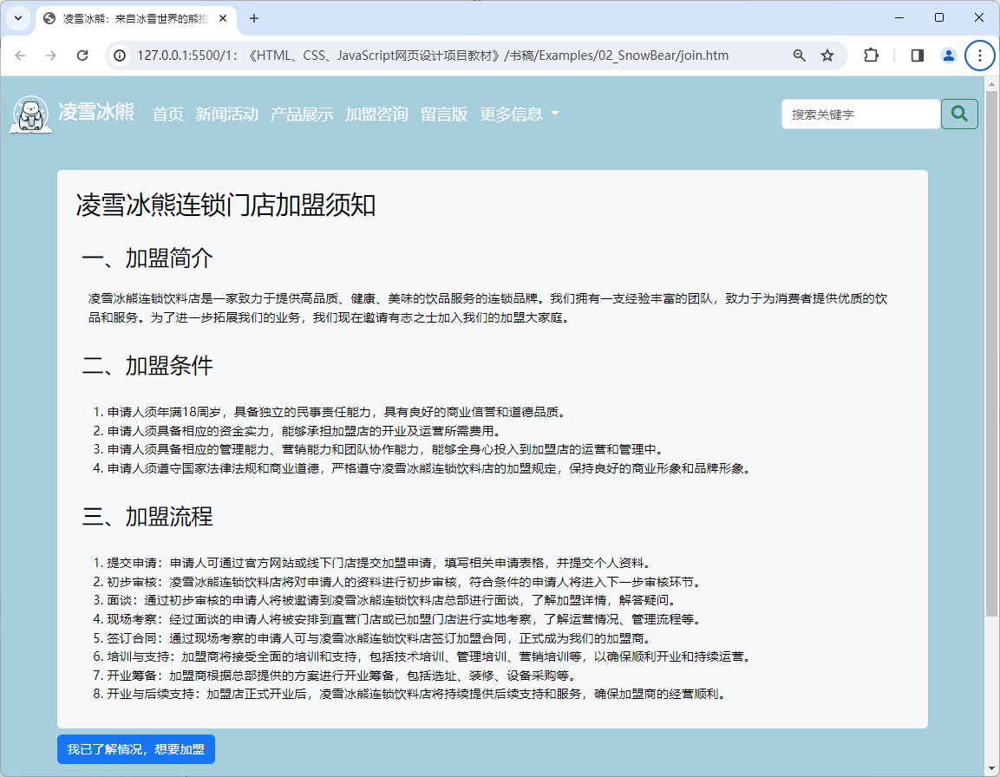
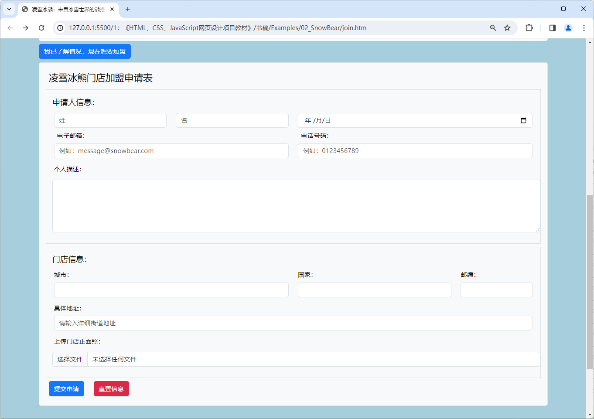

# 项目4 企业网站的申请表单设计

企业网站的申请表单页设计在网页设计领域中属于输入性的用户界面设计项目，其设计目的是让目标网页成为一个用户体验良好的、用于输入数据的人机交互界面，以便Web应用程序的用户能按照其用户界面所指定的规则输入数据，并将其提交给它的后端服务器。在此类项目中，网页设计师们通常会充分利用HTML文档中的按钮、标签、输入框、单选扭、复选框、下拉列表等交互类页面元素来完成对输入性用户界面的设计，以便人们能在良好的操作体验下安全地输入数据并将其提交给服务器，从而为该企业吸引到更多潜在的客户。因此，企业网站中的表单设计也被认为是企业网站设计工作中绕不开的重点任务之一。

## 【学习目标】

在本章，笔者会继续以凌雪冰熊网站中“申请加盟”页的设计为例来演示如何为企业网站设计申请表单。该演示项目的设计目标是为潜在的客户提供提交加盟申请的用户界面，以便简化凌雪冰熊这家连锁饮料店的加盟流程，增加潜在客户加盟的意愿。同样的，该网页的设计也必须要延续该网站首页建立起来的布局风格与配色方案，并同样在导航栏中预留跳转到网站首页、申请加盟、留言板等页面的链接。通过本章项目的实践，读者将会初步了解设计一个用于输入性的用户界面所要执行的基本步骤，以及执行这些步骤所需的基本技术与相关工具。总而言之，在阅读完本章之后，我们希望读者能够：

- 了解HTML 5中提供的交互类标记，并掌握这些标记在网页设计工作中的具体使用；
- 了解如何基于HTML+CSS+JavaScript技术来实现针对交互类元素的用户界面设计；
- 掌握如何在网页设计工作中利用Bootstrap框架来完成针对用户输入界面的设计任务；

## 【学习场景描述】

凌雪冰熊连锁店的网页设计团队如今已经完成了其官方网站的首页设计，并基于该设计进一步创建了该网站的网页模板。现在，他们希望你能基于该模板继续为该网站设计用于提交加盟申请的页面，目的是简化凌雪冰熊这家连锁店的加盟流程，从而吸引到更多的合作伙伴，并进一步扩展该连锁店的规模。在这个网页设计项目中，你的主要任务是为该申请加盟页设计一个操作体验良好的申请表单，以便充当用于潜在客户提交加盟申请的用户界面。当然了，你同样需要确保该页面采用与首页一致的布局风格与配色方案。

## 【任务书】

- **项目名**：凌雪冰熊网站的申请加盟页设计
- **委托方**：凌雪冰熊股份有限公司互联网部门
- **项目资料**：
  - **代码资料**：凌雪冰熊官方网站现有的设计源码；
  - **文献资料**：一份题为“凌雪冰熊加盟申请须知”文件；
- **项目要求**：为凌雪冰熊连锁饮料店的官方网站设计首页，该网页的设计应符合以下要求。
  - 该网页需要为潜在的客户提供用户体验良好的、输入性的用户界面；
  - 该网页在外观样式上需要采用与网站首页一致的布局风格与配色方案；
- 时间要求：在3个工作日内完成；

## 【任务拆解】

本章项目的实施过程可以划分为以下三个小任务来进行：

- 基于凌雪冰熊官方网站提供的网页设计模版来创建该网站的申请加盟页
- 利用HTML标记在网页中创建用于让潜在客户提交加盟申请的表单元素；
- 利用Bootstrap框架提供的样式类和组件来设计专用于输入数据的用户界面；

## 【工作准备】

在本章要实践的项目中，读者的主要任务是为凌雪冰熊网站创建用于提交加盟申请的用户界面，目的是通过一个操作体验良好的用户输入界面来简化该连锁饮料店的加盟流程，以便吸引到更多合作伙伴的加盟。下面先来介绍一下完成该项目任务所需要掌握的知识点与工具，同样的，如果读者自认为已经掌握了这部份知识，也可以选择跳过本节内容，直接进入本章项目的【工作实施与交付】环节。

### 知识点1：HTML 5中的交互类标记

自从以AJAX为代表的Web2.0技术崛起以来，网页的功能日益被扩展成了一种应用程序的用户界面（因此它们有时也被称为应用程序的前端）。因此，学习*如何构建Web应用程序的用户界面，并赋予它良好的操作体验*也就日益成为了网页设计工作中的重要任务之一。为了帮助设计师们更好地完成这一部分的工作，HTML 5中提供了一系列用于构建人机交互界面的标记。下面，本书就带读者来详细了解一下这些标记以及它们的使用方法。

#### 可独立使用的标记

本着从简单到复杂，逐步深入的学习原则，笔者会先从一些可独立设置的交互类元素开始当前知识点内容的介绍，下面是用于创建这类元素的HTML标记及其使用示例。

- `<button>`标记：该标记可用于在网页中创建一个独立的按钮元素，该元素可独立响应用户的鼠标点击操作，其基本使用方法如下所示：

    ```html
    <button type="button" onclick="alert('Hello World!')">
        <!-- 这里可以设置按钮上要显示的文字或图形 -->
        <p>普通按钮</p>
    </button>
    <button type="submit" onclick="alert('Hello World!')">
        <!-- 这里可以设置按钮上要显示的文字或图形 -->
        <p>提交按钮</p>
    </button>
    <button type="reset" onclick="alert('Hello World!')">
        <!-- 这里可以设置按钮上要显示的文字或图形 -->
        <p>重置按钮</p>
    </button>
    ```

    在上述示例中，`type`属性用于指定按钮的类型，其取值可以是`button`、`submit`或`reset`，分别表示普通按钮、提交按钮和重置按钮，默认值为`button`。而`onclick`属性则用于指定按钮在被点击时所要执行的JavaScript脚本，其值既可以是JavaScript代码，也可以是JavaScript代码所在的URL。在这里，笔者让它弹出一个带有“Hello World!”字样的信息提示框。最后，在`<button>`和`</button>`标记之间，设计师们可以设置用于显示在按钮上的提示信息，该信息可以是一段文本，也可以是一个图形，但必须要能说明该按钮元素的功能。

- `<input>`标记：该标记可用于在网页中创建一个输入性质的元素，主要包括分别可用于创建文本输入框、密码输入框、单选框、复选框、文件上传控件等元素，其基本使用方法如下所示：

    ```html
    <!-- 以下定义一个文本输入框 -->
    <input type="text" value="文本输入框" />

    <!-- 以下定义一个密码输入框 -->
    <input type="password" value="密码输入框" />

    <!-- 以下定义一组单选框，其中只有一个选项被选中 -->
    <input type="radio" name="gender" value="male" checked="checked" />男
    <input type="radio" name="gender" value="female" />女

    <!-- 以下定义一组复选框，其中有两个选项被选中 -->
    <input type="checkbox" name="hobby" value="basketball" checked="checked" />篮球
    <input type="checkbox" name="hobby" value="football" />足球
    <input type="checkbox" name="hobby" value="swimming" />游泳
    
    <!-- 以下创建一个文件上传控件，用于上传图片 -->
    <input type="file" name="file" />

    <!-- 以下创建一个日期选择控件，用于选择生日 -->
    <input type="date" name="birthday" />

    <!-- 以下定义一个滑块，其中滑块的当前值是50 -->
    <input type="range" min="0" max="100" value="50" />
    ```

    在上述示例中，`type`属性用于指定输入框的类型，其值可以是`text`、`password`、`radio`、`checkbox`、`range`、`file`、`date`、`button`等。需要特别提醒的是，虽然`<input>`标记也可用于创建按钮元素，但与`<button>`标记相比，`<input>`标记的语义更偏向于用户输入的具体信息，笔者原则上并不鼓励用它来设置按钮元素。

- `<textarea>`标记：该标记用于在网页中创建一个支持多行输入的文本输入框，其基本使用方法如下所示：

    ```html
    <textarea rows="3" cols="20">文本区域</textarea>
    ```

    在上述示例中，`rows`属性用于指定该多行文本输入框元素中可以显示的行数，`cols`属性则用于指定该元素中可以显示的列数。

- `<output>`标记：该标记用于在网页中创建一个输出区域，通常需要配合输入性质的元素一起使用，其基本使用方法如下所示：

    ```html
    <!--
        for属性用于指定该输出区域与哪个输入性质的元素相关联，
        在本例中，该输出区域与range元素相关联
    -->
    <output for="range">0</output>    
    <input type="range" id="range"
        min="0" max="100"
        oninput="output.value = range.value"
    />
    ```

    在上述示例中，笔者首先用`<output>`标记创建了一个输出区域，然后用`<input>`标记创建了一个滑块，并为其设置了`oninput`事件，当滑块的值发生变化时，会自动更新输出区域中的值。

- `<progress>`标记：该标记可用于在网页中创建一个独立的进度条元素，该元素的主要功能是根据用户的操作或某个预定义的JavaScript脚本来显示某一指定任务的执行进度，其基本使用方法如下所示：

   ```html
   <progress id="task" value="0" max="100"></progress>
   <script>
       document.getElementById('task').value = 50;
   </script>
   ```

    在上述示例中，`value`属性用于指定进度条当前的进度值，而`max`属性则用于指定进度条的最大值。在这里，该标记会根据`<script>`标记中预定义的JavaScript脚本来显示进度条的进度值。

- `<meter>`标记：该标记可用于在网页中创建一个独立的度量值元素，其基本使用方法如下所示：

   ```html
   <meter value="75" min="0" max="100">75%</meter>
   ```

    在上述示例中，`value`属性用于指定度量值元素的当前值，而`min`和`max`属性则用于指定度量值元素的最大值和最小值。

#### 需组合使用的标记

为了帮助设计师们设计出功能更为复杂的用户界面，HTML 5中还提供了一系列需要使用多个标记来创建的人机交互元素，下面就继续来介绍这部分HTML标记及其使用方法。

- `<select>`和`<option>`标记：这两个标记可用于在网页中创建一个独立的下拉列表元素，其基本使用方法如下所示：

    ```html
    <select>
        <option value="1">选项1</option>
        <option value="2">选项2</option>
        <option value="3">选项3</option>
    </select>
    ```

    在上述示例中，`<select>`标记用于创建下拉列表本身，而其`<option>`子标记则用于设置下拉列表中的选项，其`value`属性用于指定选项的值。

- `<details>`和`<summary>`标记：这两个标记可用于在网页中创建一个可折叠的内容块元素，该元素允许用户通过单击其标题部分来隐藏或显示它要显示的具体内容，其基本使用方法如下所示：

    ```html
    <details>
        <summary>内容块的标题</summary>
        <!-- 在这里放置要在内容块中显示的内容 -->
        <p>内容块中的一个段落。</p>
    </details>
    ```

    在上述示例中，`<details>`标记则于创建可折叠的内容块元素本身，其`<summary>`子标记则用于设置该块元素的标题部分，而内容块元素要显示或隐藏的具体内容则需要被放置在`<summary>`标记之后到`</details>`标记之前的那个区域中，例如我们在这里放置的是一个`<p>`标记。

- `<datalist>`和`<option>`标记：这两个标记可用于在网页中创建面向`<input>`标记的自动完成列表，其基本使用方法如下所示：
  
    ```html
    <!DOCTYPE html>
    <html>
        <head>
            <title>自动完成列表</title>
        </head>
        <body>
            <input type="text" list="fruits">
            <datalist id="fruits">
                <option value="Apple">
                <option value="Banana">
                <option value="Orange">
            </datalist>
        </body>
    </html>
    ```

    在上述示例中，笔者先用`<input>`标记创建了一个文本输入框，然后再用`<datalist>`标记为该文本输入框创建一个自动完成列表元素，并利用其`<option>`子标记为该元素设置了`Apple`、`Banana`和`Orange`三个可选项。  

- `<form>`标记及其子标记：该标记用于在网页中创建一个表单元素，在基于HTML的用户界面设计中，表单元素的作用是收集用户输入的数据。在该元素下，设计师们可以使用一系列子标签来让用户输入数据，这些标记主要包括：
  - `<label>`子标记：该子标记用于在表单中创建一个标签元素，其`for`属性则用于指定该标签所对应的输入框的ID；
  - `<input>`子标记：该子标记用于在表单中创建一个输入性质的元素，其使用方法与该标签独立使用时相同；
  - `<textarea>`子标记：该子标记用于在表单中创建一个多行的文本输入框，其使用方法与该标签独立使用时相同；
  - `<button>`子标记：该子标记用于在表单中创建一个按钮元素，其使用方法与该标签独立使用时相同；
  - `<select>`子标记：该子标记用于在表单中创建一个下拉列表元素，其使用方法与该标签独立使用时相同；
  - `<optgroup>`子标记：该子标记用于在表单的下拉列表中创建一个选项组元素；
  - `<datalist>`子标记：该子标记用于在表单中创建一个自动完成列表元素，其使用方法与该标签独立使用时相同；
  - `<keygen>`子标记：该子标记用于在表单中创建一个密钥对生成器元素。
  - `<output>`子标记：该子标记用于在表单中创建一个输出元素，其使用方法与该标签独立使用时相同。
  - `<fieldset>`子标记：该子标记用于在表单中创建一个表单元素的分组，该分组会设置有一个专属边框；
  - `<legend>`子标记：该子标记用于在表单的分组中创建一个标题，其`for`属性则用于指定该标题所对应的输入框的ID；

    下面，笔者将通过创建一个简单的、用于用户注册的表单来具体演示一下这些标记的使用方法：

    ```html
    <form method="post" action="https://www.example.com/register">
        <label for="username">用户名：</label>
        <input type="text" name="username" id="username" placeholder="请输入用户名">
        <br>
        <label for="password">密码：</label>
        <input type="password" name="password" id="password" placeholder="请输入密码">
        <br>
        <label for="email">邮箱：</label>
        <input type="email" name="email" id="email" placeholder="请输入邮箱">
        <br>
        <label for="birthday">生日：</label>
        <input type="date" name="birthday" id="birthday">
        <br>
        <label for="gender">性别：</label>
        <input type="radio" name="gender" id="male" value="male">
        <label for="male" class="radio-label">男性</label>
        <input type="radio" name="gender" id="female" value="female">
        <label for="female" class="radio-label">女性</label>
        <input type="radio" name="gender" id="secret" value="secret">
        <label for="secret" class="radio-label">保密</label>
        <br>
        <label for="hobby">爱好：</label>
        <input type="checkbox" name="hobby" id="football" value="football">
        <label for="football" class="checkbox-label">足球</label>
        <input type="checkbox" name="hobby" id="basketball" value="basketball">
        <label for="basketball" class="checkbox-label">篮球</label>
        <input type="checkbox" name="hobby" id="swimming" value="swimming">
        <label for="swimming" class="checkbox-label">游泳</label>
        <br>
        <label for="address">居住城市：</label>
        <select name="address" id="address">
            <option value="beijing">北京</option>
            <option value="shanghai">上海</option>
            <option value="guangzhou">广州</option>
            <option value="shenzhen">深圳</option>
        </select>
        <br>
        <label for="file">个人照片：</label>
        <input type="file" name="file" id="file">
        <br>
        <label for="textarea">个人描述：</label>
        <textarea name="textarea" id="textarea" cols="30" rows="10"></textarea>
        <br>
        <button type="submit"
                onclick="alert('提交成功')">提交</button>
        <button type="reset">重置</button>
    </form>
    ```

    在上述示例中，笔者主要做了以下动作：

    1. 先使用`<form>`标记创建了表单元素。在此过程中，笔者用`method`属性指定了表单提交的方式为`post`，用`action`属性指定了表单提交的目的地（即应用程序后端的某个URL）。
    2. 然后用`<form>`标记的各种子标记创建了该表单元素的各个输入字段，并为其设置了对应的`id` 属性，这样在提交表单时，这些输入字段的值会以键值对的形式被提交到服务端。
    3. 最后使用`<button>`创建了该表单元素的提交按钮和重置按钮，并为其添加了点击事件。

### 知识点2：基于CSS的表单样式设计

在使用HTML标记创建好用户界面中的交互类元素之后，接下来要做的就是利用CSS来设置用户界面的外观样式了。通常情况下，设计师们在设计Web应用程序的用户界面时，原则上都会倾向于让它在外观样式上无限接近于传统的桌面应用程序，这有助于人们在使用Web应用程序时能延续传统的计算机操作习惯，从而降低Web应用程序的使用门槛。下面，笔者将以上面刚刚创建的用户注册表单为例来为读者演示如何基于CSS来完成用户界面的设计任务，其具体步骤如下。

1. 首先要做的是将上一节中创建的这个用户注册表单元素放置到一个结构完整的HTML文档中（在这里，该文档将被保存在本书源码包的`Examples/00_demo/formCase`目录中，文件名为`index.htm`），其具体代码如下。

    ```html
    <!DOCTYPE html>
    <html lang="zh-CN">
        <head>
            <meta charset="UTF-8">
            <title>交互类元素示例：用户注册</title>
            <lInk rel="stylesheet" href="./styles/main.css">
        </head>
        <body>
            <form method="post" action="https://www.example.com/register">
                <label for="username">用户名：</label>
                <input type="text" name="username" id="username"
                        placeholder="请输入用户名">
                <br>
                <label for="password">密码：</label>
                <input type="password" name="password" id="password"
                        placeholder="请输入密码">
                <br>
                <label for="email">邮箱：</label>
                <input type="email" name="email" id="email"
                        placeholder="请输入邮箱">
                <br>
                <label for="birthday">生日：</label>
                <input type="date" name="birthday" id="birthday">
                <br>
                <label for="gender">性别：</label>
                <input type="radio" name="gender" id="male" value="male">
                <label for="male" class="radio-label">男性</label>
                <input type="radio" name="gender" id="female" value="female">
                <label for="female" class="radio-label">女性</label>
                <input type="radio" name="gender" id="secret" value="secret">
                <label for="secret" class="radio-label">保密</label>
                <br>
                <label for="hobby">爱好：</label>
                <input type="checkbox" name="hobby" id="football" value="football">
                <label for="football" class="checkbox-label">足球</label>
                <input type="checkbox" name="hobby" id="basketball" value="basketball">
                <label for="basketball" class="checkbox-label">篮球</label>
                <input type="checkbox" name="hobby" id="swimming" value="swimming">
                <label for="swimming" class="checkbox-label">游泳</label>
                <br>
                <label for="address">居住城市：</label>
                <select name="address" id="address">
                    <option value="beijing">北京</option>
                    <option value="shanghai">上海</option>
                    <option value="guangzhou">广州</option>
                    <option value="shenzhen">深圳</option>
                </select>
                <br>
                <label for="file">个人照片：</label>
                <input type="file" name="file" id="file">
                <br>
                <label for="textarea">个人描述：</label>
                <textarea name="textarea" id="textarea" cols="30" rows="10"></textarea>
                <br>
                <button type="submit"
                        onclick="alert('提交成功')">提交</button>
                <button type="reset">重置</button>
            </form>    
        </body>
    </html>
    ```

2. 接下来要做的是创建相应的CSS文件。具体来说就是，先按照上述HTML文档中`<link>`标记指定的相对路径创建一个名为`main.css`的文件，然后用代码编辑器打开该文件就开始编写样式代码了。在这里，笔者将先从整个页面全局样式开始着手，主要设置一下需要全局使用的字体及其大小、背景色等，例如像这样:

    ```css
    /* 设置全局样式 */
    body {
        font-family: "Microsoft Yahei" Arial, sans-serif;
        font-size: 16px;
        background-color: #f2f2f2;
    }
    ```

3. 接下来就可以开始正式设置用户界面的样式了。先从表单元素及其一般性的标签与输入性元素开始，这部分的外观样式设计通常只与元素的内外边距和边框相关，例如像这样：
  
   ```css
    /* 设置表单元素的样式 */
    form {
        width: 45vw;
        margin: 0 auto;    
        padding: 0.5vh 1.5vw;
        background-color: #fff;
        border-radius: 5px;
        box-shadow: 0 0 10px rgba(0, 0, 0, 0.1);
    }

    /* 设置一般性标签元素的样式 */
    label {
        display: block;
        margin: 0.5vh 0;
        font-weight: bold;
    }

    /* 设置一般性输入元素的样式 */
    input[type="text"],
    input[type="password"],
    input[type="email"],
    input[type="date"],
    input[type="file"],
    textarea {
        width: 100%;
        padding: 1.5vh 1.5vw;
        border: 1px solid #ccc;
        border-radius: 3px;
        box-sizing: border-box;
        margin-bottom: 0.5vh;
    }
    ```

4. 接着来设置一下用户中带有特殊样式的输入性元素，这些特殊样式包括单选框与复选框元素需要设置为横向排列、多行输入框元素需要设置行数和列数、按钮需要设置制定的背景色等，例如像这样：

    ```css
    /* 设置单选框和复选框元素的特定样式 */
    input[type="radio"],
    input[type="checkbox"] {
        margin-right: 0.1vw;
    }
    label.radio-label,
    label.checkbox-label {
        display: inline-block;
        margin-right: 1vw;
    }

    /* 设置下拉列表元素的特定样式 */
    select {
        width: 100%;
        padding: 0.5vh 0.5vw;
        border: 1px solid #ccc;
        border-radius: 3px;
        box-sizing: border-box;
        margin-bottom: 0.5vh;
    }

    /* 设置文本区域元素的特定样式 */
    textarea {
        width: 100%;
        padding: 1vh 1.5vw;
        border: 1px solid #ccc;
        border-radius: 3px;
        box-sizing: border-box;
        margin-bottom: 0.5vh;
    }

    /* 设置按钮元素的特定样式 */
    button {
        padding: 1vh 2vw;
        background-color: #4CAF50;
        color: #fff;
        border: none;
        border-radius: 3px;
        cursor: pointer;
        margin: 0.5vh 1vw;
    }
    button[type="reset"] {
        background-color: #f44336;
    }
    ```

5. 最后在将上述HTML+CSS代码保存为相应类型的文件之后，就可以在用网页浏览器中打开这个网页时看到如图4-1所示的布局效果。

    

    **图4-1**：基于HTML+CSS设计的用户注册界面

### 知识点3：基于Bootstrap框架的表单样式设计

在具体介绍Bootstrap框架为表单元素提供的样式类之前，本书在这里也会在和上一章中所做的一样，先参照之前基于HTML+CSS实现的用户注册表单，来演示一下Bootstrap框架在完成相同界面设计任务时的应用，以便读者能自行去比较这两种对于相同任务的不同实现方法，从而了解到Bootstrap框架给网页设计工作带来的便利，该示例的构建步骤如下：

1. 在本地计算机中创建一个名为`formCase`的项目（在这里，我将会将它创建在本笔记文件所在的目录下的`examples`目录中），并按照之前示例中演示的方法将Bootstrap框架引入到当前项目中。

2. 在VS Code这样的代码编辑器中打开刚刚创建项目，然后在该项目的根目录下创建一个`index.htm`文件，并在其中输入以下代码：

    ```html
    <!DOCTYPE html>
    <html lang="zh-CN">
        <head>
            <meta charset="UTF-8">
            <meta name="viewport" content="width=device-width, initial-scale=1.0">
            <link rel="stylesheet" href="./styles/bootstrap.min.css">
            <script src="./scripts/bootstrap.min.js" defer></script>
            <title>基于Bootstrap的用户注册界面</title>
        </head>
        <body class="text-bg-dark">
            <main class="container">
                <form method="post" action="http://example.com/user-register"
                    class="text-bg-light border rounded p-4 mt-5 mx-auto" >
                    <div class="row mb-3">
                        <label for="username" class="col-form-label col-2">
                            用户名：
                        </label>
                        <div class="col-10">
                            <input type="text" class="form-control"
                                id="username" name="username"
                                placeholder="请输入你的用户名">
                        </div>    
                    </div>
                    <div class="row mb-3">
                        <label for="password" class="col-form-label col-2">
                            密码：
                        </label>
                        <div class="col-10">
                            <input type="password" class="form-control"
                                id="password" name="password"
                                placeholder="请设置一个新密码">
                            <input type="password" class="form-control"
                                id="repassword" name="repassword"
                                placeholder="请确认你的密码">
                        </div>    
                    </div>
                    <div class="row mb-3">
                        <label for="email" class="col-form-label col-2">
                            邮箱：
                        </label>
                        <div class="col-10">
                            <input type="email" class="form-control"
                                id="email" name="email"
                                placeholder="请输入邮箱地址">
                        </div>    
                    </div>
                    <div class="row mb-3">
                        <label for="birthday" class="col-form-label col-2">
                            生日：
                        </label>
                        <div class="col-10">
                            <input type="date" class="form-control"
                                id="birthday" name="birthday">
                        </div>
                    </div>
                    <div class="row mb-3">
                        <label for="gender" class="col-form-label col-2">
                            性别：
                        </label>
                        <div class="col-10 row">
                            <div class="form-check col-2">
                                <input type="radio" class="form-check-input"
                                    name="gender" id="male" value="male">
                                <label class="form-check-label" for="male">
                                    男
                                </label>
                            </div>
                            <div class="form-check col-2">
                                <input type="radio"  class="form-check-input"
                                    name="gender"  id="female" value="female">
                                <label class="form-check-label" for="female">
                                    女
                                </label>
                            </div>
                            <div class="form-check col-2">
                                <input type="radio"  class="form-check-input"
                                    name="gender"  id="secret" value="secret">
                                <label class="form-check-label" for="secret">
                                    保密
                                </label>
                            </div>
                        </div>
                    </div>
                    <div class="row mb-3">
                        <label for="hobby" class=" col-form-label col-2">
                            爱好：
                        </label>
                        <div class="col-10 row">
                            <div class="form-check col-2">
                                <input type="checkbox" class="form-check-input"
                                    id="hobby" name="hobby" value="football">
                                <label for="hobby" class="form-check-label">
                                    足球
                                </label>
                            </div>
                            <div class="form-check  col-2">
                                <input type="checkbox" class="form-check-input"
                                    id="hobby" name="hobby" value="basketball">
                                <label for="hobby" class="form-check-label">
                                    篮球
                                </label>
                            </div>
                            <div class="form-check col-2">
                                <input type="checkbox" class="form-check-input"
                                    id="hobby" name="hobby" value="swimming">
                                <label for="hobby" class="form-check-label">
                                    游泳
                                </label>
                            </div>
                        </div>
                    </div>
                    <div class="row mb-3">
                        <label for="address" class="col-form-label col-2">
                            居住城市：
                        </label>
                        <div class="col-10">
                            <select class="form-select" name="address" 
                                id="address">
                                <option selected>请选择...</option>
                                <option value="beijing">北京</option>
                                <option value="shanghai">上海</option>
                                <option value="guangzhou">广州</option>
                                <option value="shenzhen">深圳</option>
                            </select>
                        </div>
                    </div>
                    <div class="row mb-3">
                        <label for="file" class="col-form-label col-2">
                            个人照片：
                        </label>
                        <div class="col-10">
                            <input type="file" class="form-control"
                                id="file" name="file">
                        </div>
                    </div>
                    <div class="row mb-3">
                        <label for="textarea" class="col-form-label col-2">
                            个人描述：
                        </label>
                        <div class="col-10">
                            <textarea class="form-control"
                                id="textarea" name="textarea" rows="3"></textarea>
                        </div>
                    </div>
                    <div class="w-25 d-flex justify-content-between">
                        <button type="submit" class="btn btn-primary">
                            注册
                        </button>
                        <button type="reset" class="btn btn-danger">
                            重置
                        </button>
                </form>
            </main>
        </body>
    </html>
    ```

3. 在保存上述代码之后，读者就可以使用网页浏览器打开`index.htm`文件查看当前网页设计的结果，其外观样式在Google Chrome浏览器中的效果如图4-2所示。

   

    **图4-2**：基于Bootstrap框架的用户注册界面

同样的，上述示例也只使用Bootstrap框架提供的一系列样式类就实现了笔者之前在上一知识点中用上百行CSS代码实现的效果，下面来介绍一下相关样式类的使用方法。

#### 表单整体布局

默认情况下，表单中的元素是纵向排列的，设计师们通常只需要使用`<div>`将它们分组并设置好一定的间距即可实现基本的布局，例如下面是一个使用了默认布局的用户登录界面：

```html
<form class="border rounded p-3 m-5"
    method="post" action="http://example.com/api">
    <div class="mb-3">
        <label for="username" class="form-label">用户名</label>
        <input type="text" class="form-control" id="username" name="username"
            placeholder="请输入用户名">
    </div>
    <div class="mb-3">
        <label for="password" class="form-label">密码</label>
        <input type="password" class="form-control" id="password" name="password"
            placeholder="请输入密码">
    </div>
    <div class="mb-3">
        <button type="submit" class="btn btn-primary">登录</button>
        <button type="reset" class="btn btn-danger">重置</button>
    </div>
</form>
```

正如读者所见，上述代码使用`<div>`元素将表单中的元素进行了分组，并使用`class="mb-3"`设置了它们之间的间距。另外，由于`<form>`标记本身也可以被视为一个用于组织用户界面元素的布局类元素，所以笔者在这里同样也为它设置了长宽度、边框以及内外边距等样式，其效果如图4-3所示：


**图4-3**：采用垂直布局的用户登录界面

如果读者想采用水平布局的表单设计，只需要将`<form>`标记的`class`属性值设置为`row`，然后将分组交互元素的`<div>`的`class`属性设置为`col-*`即可，例如下面是一个使用了水平布局的用户登录界面：

```html
<form method="post" action="http://example.com/api"
    class="row border rounded p-3 m-5">
    <div class="col-4">
        <input type="" class="form-control" 
            placeholder="请输入你的用户名">
    </div>
    <div class="col-4">
        <input type="password" class="form-control" 
            placeholder="请输入你的密码">
    </div>
    <div class="col-4">
        <button type="submit" class="btn btn-primary">登录</button>
        <button type="reset" class="btn btn-danger">重置</button>
    </div>
</form>
```

上述代码的显示效果如图4-4所示：


**图4-4**：采用水平布局的用户登录界面

当然了，由`row`和`col-*`搭配的栅格布局方式也可以用于设计多行多列的表格元素，例如下面这个用于填写用户信息的表单：

```html
<form method="post" action="http://example.com/api"
    class="border rounded p-3 m-5">
    <div class="row p-1">
        <div class="col-6">
            <input type="text" class="form-control"
                name="firstname" id="firstname"
                placeholder="姓">
        </div>
        <div class="col-6">
            <input type="text" class="form-control"
                name="lastname" id="lastname"
                placeholder="名">
        </div>
    </div>
    <div class="row p-1">
        <label for="address" class="col-form-label col-12">
            具体地址：
        </label>
        <div class="col-12">
            <input type="text" class="form-control"
                name="address" id="address"
                placeholder="请输入详细街道地址">
        </div>
    </div>
    <div class="row p-1">
        <div class="col-6">
            <label for="city" class="form-label">城市：</label>
            <input type="text" class="form-control" 
                name="city" id="city">
        </div>
        <div class="col-4">
            <label for="state" class="form-label">国家：</label>
            <input type="text" class="form-control"
                name="state" id="state">
        </div>
        <div class="col-2">
            <label for="zipcode" class="form-label">邮编：</label>
            <input type="text" class="form-control"
                name="zipcode" id="zipcode">
        </div>
    </div>
    <div class="d-flex gap-3 m-2">
        <button type="submit" class="btn btn-primary">提交</button>
        <button type="reset" class="btn btn-danger">重置</button>
    </div>
</form>
```

上述代码的显示效果如图4-5所示：


**图4-5**：采用多行多列布局的表单示例

#### 表单元素样式

在完成了表单的整体布局之后，接下来就是设置表单中的交互元素了。在Bootstrap框架中，用于设置表单中交互元素的样式类和组件主要有如下几个：

- `form-text`：该样式类主要作用于表单元素中的文本类标记，设置的是提示文本的样式。
- `form-label`：该样式类主要作用于表单元素中的`<label>`标记，设置的是表单标签的样式。
- `form-check`：该样式类主要作用于表单中用来设置单选钮或复选框的`<div>`标记，设置的是表单中一组单选钮或复选框的样式。
- `form-check-inline`：该样式类主要作用于表单元素中用来设置单选钮或复选框的`<div>`标记，通常需要与`form-check`样式类配合使用，效果是将表单中的一组单选钮或复选框设置为水平排列。
- `form-switch`：该样式类主要作用于表单中用来给复选框分组的`<div>`标记，通常需要与`form-check`样式类配合使用，效果是将表单中的一组复选框设置为开关样式。
- `form-check-input`：该样式类主要作用于表单元素中的`<input type="radio">`或`<input type="checkbox">`标记，这两个标记通常会被放置在`class="form-check"`的`<div>`标记内部，设置的是表单中特定单选钮或复选框的样式。
- `form-check-label`：该样式类主要作用于表单中被放置在`class="form-check"`的`<div>`标记内部的`<label>`标记，设置的是表单中特定单选钮或复选框的标签样式。
- `form-file`：该样式类主要作用于表单中的`<input type="file">`标记，设置的是表单中文件上传元素的样式。
- `form-range`：该样式类主要作用于表单中的`<input type="range">`标记，设置的是表单中滑块的样式。
- `form-control`：该样式类主要作用于表单中用`<input>`或`<textarea>`标记定义的元素（上面已经列出的特定元素除外），设置的是表单中一般输入性元素的样式。
- `form-select`：该样式类主要作用于表单中的`<select>`标记，设置的是表单中下拉列表的样式。
- `form-group`：该样式类主要作用于表单中用来给交互元素分组的`<div>`标记，设置的是表单中某一组交互元素的样式。

#### 表单验证设置

在使用表单为应用程序构建用户界面的过程中，设计师们通常还需要为界面中的交互元素设计一些用于在发生操作错误时显示出相关提示的验证类元素，以保证用户输入的内容符合预期。在Bootstrap框架中，用于设置表单中验证类元素的样式类主要有如下几个：

- `is-invalid`：该样式类主要用于表示交互元素的无效状态。该类通常需要与表单中的`<input>`、`<select>`或`<textarea>`等交互元素搭配使用，当这些交互元素得到的用户输入不符合制定验证规则时，可通过相应的JavaScript脚本激活这个类，使其显示为红色边框和红色文字。
- `is-valid`：该样式类主要用于表示交互元素的合法状态。该类通常需要与表单中的`<input>`、`<select>`或`<textarea>`等交互元素搭配使用，当这些交互元素得到的用户输入符合制定验证规则时，可通过相应的JavaScript脚本激活这个类，使其显示为绿色边框和绿色文字。
- `was-validated`：该样式类主要用于表示表单已经通过验证。当表单中的所有必填字段都通过验证时，可以添加这个类，以便显示成功的样式。这个类通常添加在`<form>`元素上。
- `invalid-feedback`：用于显示验证错误的消息。当表单元素的值不符合验证规则时，可以添加这个类，并在其后添加相应的错误提示信息。这个类通常与`<div>`元素一起使用。

除了上述常用的样式类之外，Bootstrap框架中还提供了一些专用的表单验证组件，这些组件可以利用强大的JavaScript脚本来处理表单的验证逻辑，读者可以自行查看官方文档中对于这些组件的相关介绍，这些信息可以帮助你在用户输入不符合预期时显示错误消息，并在表单提交时进行验证。

## 【工作实施和交付】

在完成了上述知识准备之后，读者现在就可以根据之前【任务书】中的要求来着手设计凌雪冰熊网站的申请加盟页了，该项目的实施过程可以分为以下步骤来进行。

### 第1步：基于网页模板来创建目标页面

在这一步骤中，网页设计师的主要任务是基于刚刚创建的网页设计模板来创建网站的申请加盟页，并完成该页面主体部分的内容布局。为此，读者需要执行以下操作。

1. 先使用命令行终端环境回到到凌雪冰熊网站项目的根目录下，并通过执行`cp template.htm join.htm`命令来创建该网站的申请加盟页。

2. 使用VS Code编辑器打开刚刚创建的`join.htm`文件，找到页面的导航栏部分并将其当前页有“首页”改为“申请加盟”，并将之前创建的网站首页、新闻活动页所在的URL添加到该导航栏相应的链接标记中，具体代码如下。

    ```html
    <nav class="navbar navbar-expand-lg navbar-dark navbar-text">
        <div class="container-fluid p-2">
            <a class="navbar-brand" href="#">
                
                <span class="fs-4">凌雪冰熊</span>
            </a>
            <button class="navbar-toggler" type="button"  data-bs-toggle="collapse" 
                data-bs-target="#navbarSupportedContent" 
                aria-controls="navbarSupportedContent" aria-expanded="false" 
                aria-label="Toggle navigation">
                <span class="navbar-toggler-icon"></span>
            </button>
            <div class="collapse navbar-collapse" id="navbarSupportedContent">
                <ul class="navbar-nav me-auto mb-2 mb-lg-0 fs-5">
                    <li class="nav-item">
                        <a class="nav-link" href="./index.htm">首页</a>
                    </li>
                    <li class="nav-item">
                        <a class="nav-link" href="./news.htm">
                            新闻活动
                        </a>
                    </li>
                    <li class="nav-item">
                        <a class="nav-link active" aria-current="page" href="./join.htm">申请加盟</a>
                    </li>
                    <li class="nav-item">
                       <a class="nav-link" href="#">留言版</a>
                    </li>
                    <li class="nav-item dropdown">
                    <a class="nav-link dropdown-toggle"
                        href="#" id="navbarDropdown" 
                        role="button" data-bs-toggle="dropdown" 
                        aria-expanded="false">
                        更多信息
                    </a>
                    <ul class="dropdown-menu" aria-labelledby="navbarDropdown">
                        <li><a class="dropdown-item" href="#">企业文化</a></li>
                        <li><a class="dropdown-item" href="#">企业荣誉</a></li>
                        <li><a class="dropdown-item" href="#">企业历程</a></li>
                    </ul>
                    </li>
                </ul>
                <form class="d-flex">
                    <input class="form-control" type="search" 
                        placeholder="搜索关键字" aria-label="Search">
                    <button class="btn btn-outline-success" type="submit">
                        <i class="fa fa-search fa-lg"></i>
                    </button>
                </form>
            </div>
        </div>
    </nav>
    ```

3. 最后回到之前的命令行终端环境中，并在项目的根目录中通过执行以下命令来完成本章项目的第一次版本控制操作。

    ```bash
    git init
    git add .
    git commit -m "项目4：完成申请加盟页的创建"
    ```

### 第2步：完成新页面的图文排版

在这一步骤中，网页设计师的主要任务是：先使用HTML中的图文类标记填充委托方提供的“凌雪冰熊加盟须知”文稿并对其进行排版，然后再为潜在合作伙伴提供申请加盟的入口，以便用于打开提交申请的用户界面。为此，读者需要执行以下操作。

1. 继续使用VS Code编辑器回到`join.htm`文件中，并找到`<!-- 在此处填充网页的主体内容 -->`这一行注释所在的位置，并将其替换为以下代码。

    ```html
    <section class="container">
        <div class="text-bg-light p-3 rounded">
            <h2 class="p-2">凌雪冰熊连锁门店加盟须知</h2>
            <h3 class="p-3">一、加盟简介</h3>
            <p  class="px-4">
                凌雪冰熊连锁饮料店是一家致力于提供高品质、健康、美味的饮品服务的连锁品牌。我们拥有一支经验丰富的团队，致力于为消费者提供优质的饮品和服务。为了进一步拓展我们的业务，我们现在邀请有志之士加入我们的加盟大家庭。
            </p>
            <h3  class="p-3">二、加盟条件</h3>
            <ol class="m-3">
                <li>
                    申请人须年满18周岁，具备独立的民事责任能力，具有良好的商业信誉和道德品质。
                </li>
                <li>
                    申请人须具备相应的资金实力，能够承担加盟店的开业及运营所需费用。
                </li>
                <li>
                    申请人须具备相应的管理能力、营销能力和团队协作能力，能够全身心投入到加盟店的运营和管理中。
                </li>
                <li>
                    申请人须遵守国家法律法规和商业道德，严格遵守凌雪冰熊连锁饮料店的加盟规定，保持良好的商业形象和品牌形象。
                </li>
            </ol>
            <h3 class="p-3">三、加盟流程</h3>
            <ol  class="m-3">
                <li>
                    提交申请：申请人可通过官方网站或线下门店提交加盟申请，填写相关申请表格，并提交个人资料。
                </li>
                <li>
                    初步审核：凌雪冰熊连锁饮料店将对申请人的资料进行初步审核，符合条件的申请人将进入下一步审核环节。
                </li>
                <li>
                    面谈：通过初步审核的申请人将被邀请到凌雪冰熊连锁饮料店总部进行面谈，了解加盟详情，解答疑问。
                </li>
                <li>
                    现场考察：经过面谈的申请人将被安排到直营门店或已加盟门店进行实地考察，了解运营情况、管理流程等。
                </li>
                <li>
                    签订合同：通过现场考察的申请人可与凌雪冰熊连锁饮料店签订加盟合同，正式成为我们的加盟商。
                </li>
                <li>
                    培训与支持：加盟商将接受全面的培训和支持，包括技术培训、管理培训、营销培训等，以确保顺利开业和持续运营。
                </li>
                <li>
                    开业筹备：加盟商根据总部提供的方案进行开业筹备，包括选址、装修、设备采购等。
                </li>
                <li>
                    开业与后续支持：加盟店正式开业后，凌雪冰熊连锁饮料店将持续提供后续支持和服务，确保加盟商的经营顺利。
                </li>
            </ol>
        </div>
        <div id="joinWebUI" class="mt-2">
            <a class="btn btn-primary" data-bs-toggle="collapse" 
                href="#joinForm" role="button" aria-expanded="false" 
                aria-controls="collapseExample">
                我已了解情况，现在想要加盟
            </a>
            <div class="collapse" id="joinForm">
                <!-- 在此处填充表单元素 -->
            </div>
        </div>                            
    </section>        
    ```

2. 在保存上述代码之后，使用网页浏览器打开`join.htm`文件查看当前网页设计的结果，其外观在Google Chrome浏览器中的效果如图4-6所示。

    

    **图4-6**：申请加盟页的图文排版

3. 最后回到之前的命令行终端环境中，并在项目的根目录中通过执行以下命令来完成本章项目的第二次版本控制操作。

    ```bash
    git add .
    git commit -m "项目4：完成申请加盟页的图文排版"
    ```

### 第3步：添加用于提交申请的界面

在这一步骤中，网页设计师的主要任务是使用HTML中的表单及其子标记来创建用于提交申请的用户界面，并利用Bootstrap框架提供的样式类完成该用户界面的设计工作。为此，读者需要执行以下操作。

1. 继续使用VS Code编辑器回到`join.htm`文件中，并找到`<!-- 在此处填充表单元素 -->`这一行注释所在的位置，并将其替换为以下代码。

    ```html
    <form method="post" action="http://example.com/api"
        class="text-bg-light border rounded p-3 mt-2">
        <h4 class="p-2">凌雪冰熊门店加盟申请表</h4>
        <fieldset class="form-group border border-1 my-2 p-3">
            <legend class="w-auto fs-5">
                申请人信息：
            </legend>
            <div class="row p-1">
                <div class="col-3">
                    <input type="text" class="form-control"
                        name="firstname" id="firstname"
                        placeholder="姓">
                </div>
                <div class="col-3">
                    <input type="text" class="form-control"
                        name="lastname" id="lastname"
                        placeholder="名">
                </div>
                <div class="col-6">
                    <input type="date" name="birthday" class="form-control">
                </div>
            </div>
            <div class="row p-1">
                <div class="col-6">
                    <label for="email" class="form-label mx-2">
                        电子邮箱：
                    </label>
                    <input type="email" name="email" class="form-control"
                        placeholder="例如：message@snowbear.com">
                </div>
                <div class="col-6">
                    <label for="phone" class="form-label mx-2">
                        电话号码：
                    </label>
                    <input type="text" name="phone" class="form-control"
                        placeholder="例如：0123456789">
                </div>
            </div>
            <div class="row p-1">
                <label for="textarea" class="col-form-label col-12">
                    个人描述：
                </label>
                <textarea name="textarea" class="form-control m-2"
                    rows="5"></textarea>
            </div>
        </fieldset>
        <fieldset class="form-group border border-1 my-2 p-3">
            <legend class="w-auto fs-5">
                门店信息：
            </legend>
            <div class="row p-1">
                <div class="col-6">
                    <label for="city" class="form-label">城市：</label>
                    <input type="text" class="form-control" 
                        name="city" id="city">
                </div>
                <div class="col-4">
                    <label for="state" class="form-label">国家：</label>
                    <input type="text" class="form-control"
                        name="state" id="state">
                </div>
                <div class="col-2">
                    <label for="zipcode" class="form-label">邮编：</label>
                    <input type="text" class="form-control"
                        name="zipcode" id="zipcode">
                </div>
            </div>
            <div class="row p-1">
                <label for="address" class="col-form-label col-12">
                    具体地址：
                </label>
                <div class="col-12">
                    <input type="text" class="form-control"
                        name="address" id="address"
                        placeholder="请输入详细街道地址">
                </div>
            </div>
            <div class="row p-1">
                <label for="file" class="col-form-label col-12">
                    上传门店正面照：
                </label>
                <input type="file" name="file" class="form-control m-2">
            </div>
        </fieldset>
        <div class="d-flex gap-4 m-2">
            <button type="submit" class="btn btn-primary">提交申请</button>
            <button type="reset" class="btn btn-danger">重置信息</button>
        </div>
    </form>    
    ```

2. 在保存上述代码之后，使用网页浏览器打开`join.htm`文件，并单击页面中带有“我已了解情况，现在想要加盟”字样的按钮，然后就可以查看当前网页设计的结果了，其外观在Google Chrome浏览器中的效果如图4-7所示。

    

    **图4-7**：申请加盟页的表单设计

3. 最后回到之前的命令行终端环境中，并在项目的根目录中通过执行以下命令来完成本章项目的第三次版本控制操作。

    ```bash
    git add .
    git commit -m "项目4：完成用户界面的设计"
    ```

## 【拓展知识】

到目前为止，本书项目中所演示的都是以HTML+CSS这两门计算机标记语言为主要工具的静态网页设计技术，这些技术在传统的网页设计领域中是足够的，但如果读者要设计的是Web应用程序的用户界面，那就必须要赋予网页更多的交互能力（例如本章项目中没有实现的表单验证功能），这就需要用到Bootstrap框架中的专用交互组件，以及像JavaScript这样的计算机编程语言了。因此在本章的【拓展知识】部分，笔者除了介绍更多相关的Bootstrap组件之外，还将会初步介绍一些在网页设计工作中使用JavaScript脚本的基本方法，以便读者能更好地完成与本章项目相似的网页设计任务，同时也为下一章要实践的项目任务打下一个基础。

### 知识点1：Bootstrap框架中的交互组件

除了表单元素之外，Bootstrap还提供了一些具有专用功能的交互组件，这些组件可以用来构建更加复杂的用户界面，这些组件主要包括：

- **按钮组件**：对于表单元素或页面其他元素中放置的按钮元素，设计师们可以考虑使用Bootstrap框架提供的按钮组件来进行辅助设计，下面是该组件的一个简单示例：

    ```html
    <button type="button" class="btn btn-primary">Primary</button>
    <button type="button" class="btn btn-secondary">Secondary</button>
    <button type="button" class="btn btn-success">Success</button>
    <button type="button" class="btn btn-danger">Danger</button>
    <button type="button" class="btn btn-warning">Warning</button>
    <button type="button" class="btn btn-info">Info</button>
    <button type="button" class="btn btn-light">Light</button>
    <button type="button" class="btn btn-dark">Dark</button>
    <button type="button" class="btn btn-link">Link</button>
    ```

  接下来，笔者将根据上述示例来介绍一下与按钮组件相关的样式类及其使用方法，具体如下：
  - `btn`：该样式类通常作用于`<button>`或`<a>`标记，效果是将该标记定义的元素设置为按钮组件，并赋予其默认样式。在设置按钮组件时，读者还需要注意以下事项：
    - 如果想改变按钮组件的默认配色，则需要在`btn`样式类后面添加`btn-primary`、`btn-secondary`、`btn-success`、`btn-danger`、`btn-warning`、`btn-info`、`btn-light`或`btn-dark`这八个样式类中的一个。关于这些配色及其代表的含义，本书在之前的章节中已经做过介绍，这里就不再重复了；
    - 如果想将组件设置为链接样式，则需要在`btn`样式类后面添加一个`btn-link`样式类；

- **下拉菜单组件**：如果读者想在页面中设置一个类似于桌面应用程序中的下拉菜单，则可以使用Bootstrap框架提供的下拉菜单组件来进行辅助设计。下面是该组件的一个简单示例：

    ```html
    <div class="dropdown">
        <button class="btn btn-secondary dropdown-toggle" type="button" 
            id="dropdownMenuButton1" data-bs-toggle="dropdown" 
            aria-expanded="false">
            下拉菜单的按钮元素
        </button>
        <ul class="dropdown-menu" aria-labelledby="dropdownMenuButton1">
            <li><a class="dropdown-item" href="#">菜单项 1</a></li>
            <li><a class="dropdown-item" href="#">菜单项 2</a></li>
            <li><a class="dropdown-item" href="#">菜单项 3</a></li>
        </ul>
    </div>
    ```

  接下来，笔者将根据上述示例来介绍一下手风琴组件的使用方法以及相关的样式类，具体如下：
  - `dropdown`：该样式类通常作用于一个`<div>`标记，效果是将该标记定义的元素设置为一个下拉菜单组件；
  - `dropdown-toggle`：该样式类是`dropdown`类的次级样式类，通常作用于被设置了`dropdown`类的`<div>`标记内的`<button>`或`<a>`标记，效果是将该标记定义的元素设置为一个下拉菜单组件的控制按钮，以便用于控制下拉菜单组件的显示与隐藏；
  - `dropdown-menu`：该样式类是`dropdown`类的次级样式类，通常作用于被设置了`dropdown`类的`<div>`标记内的`<ul>`标记，效果是将该标记定义的元素设置为一个下拉菜单组件的菜单部分，以便用于放置该组件中的具体菜单项；
  - `dropdown-item`：该样式类是`dropdown-menu`类的次级样式类，通常作用于被设置了`dropdown-menu`类的`<ul>`标记内的`<li>`标记，效果是将该标记定义的元素设置为一个下拉菜单组件中的菜单项，以便用于放置这些菜单项中的具体链接；

- **模态对话框组件**：如果读者想在页面中设置一个类似于桌面应用程序中的弹出式对话框，则可以使用Bootstrap框架提供的模态对话框组件来进行辅助设计。下面是该组件的一个简单示例：

    ```html
    <button type="button" class="btn btn-primary"
        data-bs-toggle="modal" data-bs-target="#modalExample">
        显示模态弹框
    </button>
    <dialog class="modal fade" id="modalExample" tabindex="-1"
        aria-labelledby="modalExampleLabel" aria-hidden="true">
        <div class="modal-dialog">
            <div class="modal-content">
                <div class="modal-header">
                    <h5 class="modal-title" 
                        id="modalExampleLabel">
                        模态弹框标题
                    </h5>
                    <button type="button" class="btn-close"
                        data-bs-dismiss="modal" 
                        aria-label="Close">
                    </button>
                </div>
                <div class="modal-body">
                    <p>这是一个模态弹框组件的简单示例。</p>
                </div>
                <div class="modal-footer">
                    <button type="button" 
                        class="btn btn-secondary"
                        data-bs-dismiss="modal">关闭</button>
                    <button type="button" 
                        class="btn btn-primary">
                        保存更改
                    </button>
                </div>
            </div>
        </div>
    </dialog>
    ```

  接下来，笔者将根据上述示例来介绍一下该组件的使用方法以及相关的样式类，具体如下：
  - `modal`：该样式类通常作用于一个`<div>`或`<dialog>`标记，效果是将该标记定义的元素设置为一个模态对话框组件。在设置该组件时，读者需要注意以下事项：
    - 由于该组件是一个弹出式对话框，所以我们需要设置一个按钮元素来触发该对话框的弹出。在定义该按钮元素的`<button>`标记中，`data-bs-toggle`属性的值应设置为`modal`，`data-bs-target`属性的值则应为`#[id属性值]`（在这里，`[id属性值]`为模态对话框组件的`id`属性值）。
    - 如果我们想赋予该模态对话框淡入淡出的效果，就需要在`modal`样式类后面再添加一个`fade`样式类； 
  - `modal-dialog`：该样式类是`modal`类的次级样式类，通常作用于被设置了`modal`类的`<div>`标记内第一级的`<div>`标记，效果是将该标记定义的元素设置为模态对话框组件的对话框部分。在设置这部分样式时，读者需要注意以下事项：
    - 如果读者想在对话框中使用滚动条元素，就需要在`modal-dialog`样式类后面再添加一个`modal-dialog-scrollable`样式类；
    - 如果读者想在对话框中使用居中布局，就需要在`modal-dialog`样式类后面再添加一个`modal-dialog-centered`样式类；
  - `modal-content`：该样式类是`modal-dialog`类的次级样式类，通常作用于被设置了`modal-dialog`类的`<div>`标记内第一级的`<div>`标记，效果是将该标记定义的元素设置为一个用于放置对话框内部元素的容器；
  - `modal-header`：该样式类是`modal-content`类的次级样式类，通常作用于被设置了`modal-content`类的`<div>`标记内第一级的`<div>`标记，效果是将该标记定义的元素设置为一个模态对话框组件的头部部分。
  - `modal-title`：该样式类是`modal-header`类的次级样式类，通常作用于被设置了`modal-header`类的`<div>`标记内的标题类标记，效果是将该标记定义的元素设置为一个模态对话框组件的标题文本。
  - `modal-body`：该样式类是`modal-content`类的次级样式类，通常作用于被设置了`modal-content`类的`<div>`标记内第一级的`<div>`标记，效果是将该标记定义的元素设置为一个模态对话框组件的身体部分。
  - `modal-footer`：该样式类是`modal-content`类的次级样式类，通常作用于被设置了`modal-content`类的`<div>`标记内第一级的`<div>`标记，效果是将该标记定义的元素设置为一个模态对话框组件的底部部分；

- **进度条组件**：如果读者想在页面中设置一个显示某个操作过程的进度条，就可以使用Bootstrap框架提供的进度条组件来进行辅助设计。下面是该组件的一个简单示例：

    ```html
    <div class="progress">
        <div class="progress-bar" role="progressbar" aria-valuemin="0" 
            aria-valuemax="100" style="width: 25%;">
            25%
        </div>
    </div>
    ```

  接下来，笔者将根据上述示例来介绍一下该组件的使用方法以及相关的样式类，具体如下：
  - `progress`：该样式类通常作用于一个`<div>`标记，效果是将该标记定义的元素设置为一个进度条组件；
  - `progress-bar`：该样式类是`progress`类的次级样式类，通常作用于被设置了`progress`类的`<div>`标记内第一级的`<div>`，效果是将该标记定义的元素设置为一个该组件的进度条本体部分。在设置这部分样式，我们需要将该`<div>`的`role`属性设置为`progressbar`，将`aria-valuemin`属性设置为`0`，将`aria-valuemax`属性设置为`100`，并将`style`属性设置为`width: 25%;`，以实现进度条的25%进度效果。
  
需要注意的是，本书在这里所介绍的只是笔者在个人实践中常用到的Bootstrap组件及其基本使用方法，如果读者想知道更为详细的资料，可以访问Bootstrap中文网来查看相关文档。

### 知识点2：JavaScript语言及其脚本的加载

如果仔细观察一下如今在国内外受欢迎的那些Web应用程序，譬如Facebook 、YouTube、哔哩哔哩、新浪微博、淘宝等，就会发现它们能获得如此大的成功，主要是因为它们首先在浏览器端实现了与传统的桌面应用程序相似的人机交互体验，然后又在移动端也实现了同样良好的用户体验。但众所周知的是，在过去相当长的一段时间里，人们所知道的“网站”都只不过是一组依靠超链接简单串联在一起的HTML文档而已（就像本书到目前为止所设计的这些网页）。这些文档既无数据处理能力，也无法响应用户的操作，简单到甚至都不能被称之为“应用程序”，充其量不过是一本被放在互联网上供人浏览的“书”罢了。大概正是因为如此，如今用来阅读网页的软件才会被叫做“网页浏览器”吧。然而，随着网站在应用程序方向上的业务需求与日俱增（例如电子商务、线上交友、视频分享等），网站的开发者们越来越希望自己所创建的网页能具有更强大的数据交互功能，并能即时响应用户的操作。于是，JavaScrip语言就应运而生了。

#### 前世与今生

当然，罗马不是一天建成的，JavaScript这门语言也不是生来就如此全能的，它最初的设计目标只是想在网页浏览器中运行一些嵌入式脚本而已。JavaScript 的历史开始于1995年，当时世界上最成功的浏览器提供商 —— 网景公司聘请了一个名叫布兰登·艾克（Brendan Elch）的人，希望他研发一个能与Java语言搭配使用，语法上也与其相似的浏览器端脚本语言。后者也没有辜负网景公司的重托，本着速战速决的态度，仅用了十天就完成了该语言的原型设计，并在Netscape Navigator 2.0的Beta版中发布了它，当时这门语言的名称还是LiveScript。等到同年的12月，网景公司在Netscape Navigator 2.0 Beta 3版发布时又将它重新名为JavaScript，相传这样做的目的主要是想让这门新生的编程语言蹭一下Java的“热度”，相信他们当时可能也没有想到，这个名字反而在日后成为了大众对该语言的诸多误解之一，因为在事实上，Java和JavaScript之间就像印度和印度尼西亚一样，并没有任何从属关系。

之后的事情大家就都耳熟能详了，网景公司凭借着JavaScript在浏览器市场上大获成功，这最终引起了微软公司的注意。为了与之竞争，微软公司随后在Internet Explorer 3.0浏览器上提供了自家的JavaScript实现，即JScript。如果这能带来良性竞争，倒也不失为一件好事，但让人非常遗憾的是，当时微软公司在自己的版本中加入了很多Internet Explorer（IE）浏览器的专属特性。这些举措让不少基于IE浏览器设计的网页无法在非IE的浏览器中正常显示，结果就导致了它与网景公司之间的竞争，最终引燃了一场非常惨烈，且影响深远的浏览器大战（时间大约是在1996年到2001年间）。站在今天的角度回顾那段历史，我们会发现那场大战不只开启了开源运动的时代，也让JavaScript这门语言的标准化问题被提上了议事议程。

1996年11月，为了反制微软的恶性竞争，同时也是为了使JavaScript语言的实现趋于标准化，网景公司正式向ECMA（欧洲计算机制造商协会）提交语言标准。然后在次年的6月，ECMA就以当下的JavaScript语言实现为基础制定了ECMA-262标准规范。自此之后，JavaScript核心部分的实现也被称为ECMAScript。截止到2019年5月，ECMA一共更新了以下9个版本的标准规范：

| 版本 | 发表日期 | 相关说明 |
| ---- | -------- | -------- |
| 1    | 1997年6月 | 随着第1版标准规范的发布，JavaScript语言进入了标准化的时代。 |
| 2    | 1998年6月 | 这一版修正了语言的编码格式，使其形式与ISO/IEC16262国际标准一致。 |
| 3    | 1999年12月 | 这一版增加了新的控制指令、异常处理以及功能强大的正则表达式，优化了词法作用域链、错误定义，数据输出格式等特性。 |
| 4    | 2008年7月（放弃） | 由于草案的目标过于激进，相关各方对于标准的方案出现了严重分歧，争论过于激烈，ECMA最终决议放弃发布第4版的标准规范。 |
| 5    | 2009年12月 | 这一版新增了“严格模式（strict mode）”，提供更彻底的错误检查，以避免结构出错。澄清了许多第 3 版标准中的模糊之处，并适应了与规范不一致的真实世界实现的行为。除此之外，这一版的ECMAScript中还增加了部分新的功能，譬如：getters及setters，支持JSON的解析和序列化等。 |
| 5.1  | 2011年6月 | ECMAScript的5.1版所做的修改主要为了与国际标准ISO/IEC 16262:2011保持一致。 |
| 6    | 2015年6月 | ECMAScript 2015（ES2015），这一版最早被称作是ECMAScript 6（ES6），这一版本的ECMAScript新增了类和模块的语法，以及包括迭代器，Python风格的生成器和生成器表达式，箭头函数，二进制数据，静态类型数组，集合（maps，sets和weak maps），promise，reflection和proxies在内的其他特性。 |
| 7    | 2016年6月 | 即ECMAScript 2016（ES2016），这一版小幅度地新增了一些新的语言特性。 |
| 8    | 2017年6月 | 即ECMAScript 2017（ES2017），这一版小幅度地新增了一些新的语言特性。 |
| 9    | 2018年6月 | 即ECMAScript 2018（ES2018），这一版新增了异步循环、生成器、新的正则表达式特性和rest/spread语法。 |

与所有编程语言的标准化工作一样，标准规范的制定与实际生产过程中的实现或多或少还是会存在着一些落差。目前市场上所使用的ECMAScript基本以ES5、ES6为主，下面我们就再通过一张表格来了解一下目前主流的JavaScript脚本引擎对这些不同版本标准规范的兼容性：

| 脚本引擎              | 代表性浏览器          | ES5  | ES6  | ES7  | ES7之后 |
| --------------------- | --------------------- | ---- | ---- | ---- | -------- |
| Chakra                | Microsoft Edge 18     | 100% | 96%  | 100% | 58%      |
| SpiderMonkey          | Firefox 63            | 100% | 98%  | 100% | 78%      |
| Chrome V8             | Google Chrome 70      | 100% | 98%  | 100% | 100%     |
| JavaScriptCore（Nitro） | Safari 12             | 99%  | 99%  | 100% | 90%      |

正是基于这样的现实，本书的内容也将会主要会以ES5/ES6为标准来展开。这样做既有助于读者理解JavaScript发展至今所形成的设计理念与编程思想，也有助于这门语言的初学者们快速上手并实验本书中所呈现的示例，而不必因为相关执行环境对标准的兼容度而发愁。

#### 关于宿主环境

虽然，JavaScript语言最初只是一门依附于网页浏览器来执行的脚本语言，但随着Node.js这一类运行平台的出现，它如今已经发展成了横跨Web应用程序的前后端、移动设备端以及桌面应用端的全能型编程语言。所以，当读者在讨论JavaScript这门语言的时候，必须要先了解该语言除了核心部分的语法规范之外，还包含了其所在的宿主环境。

譬如，当我们在讨论基于浏览器的JavaScript的时候，就应该知道这时候的讨论内容除了ECMAScript标准所规定的语法和基本对象之外，通常还会涉及到用于处理网页内容的文档对象模型（简称DOM），和用于处理浏览器事务的浏览器对象模型（简称BOM）。但到了Node.js这样的运行平台中，DOM和BOM就不存在了，这时候，我们需要关心的就是Node.js所提供的核心模块，以及各种特定用途的三方模块了。

总而言之，JavaScript这个术语所代表的已经不只是ECMAScript标准所规范的一门脚本语言了，它还会涉及到这门语言所在的宿主环境与应用框架，在之后学习JavaScript的过程中，读者会越来越意识到这一点的重要性，这种意识将有助于大家理解JavaScript在Web应用程序的前后端开发中扮演的不同角色，而不至于会产生混淆。

#### 在网页中加载脚本

在这本书中，我们主要讨论的是以浏览器为宿主环境的JavaScript语言，因此读者在使用JavaScript语言编写网页脚本时，首先要掌握的是如何将JavaScript脚本嵌入到HTML文档中，并让浏览器按照自己希望的方式加载它。而在HTML 5中，人们通常可以使用 `<script>` 标记来在网页中嵌入JavaScript脚本，例如读者可以选择将只适用于当前网页的JavaScript代码直接写在`<script>`和`</script>`这对标记之间，让它们以网页内联脚本的形式来执行，例如像下面这样：

```html
<!DOCTYPE html>
<html>
    <head>
        <title>嵌入脚本代码</title>
        <script>
            function changeText() {
                document.getElementById("targetID").innerHTML = "Hello World!";
            }
        </script>
    </head>
    <body>
        <h1>嵌入 JavaScript 脚本代码.</h1>
        <button type="button" onclick="changeText()">打个招呼！</button>
        <p>点击上面的按钮将会在下面显示“Hello World!”。</p>
        <div id="targetID"></div>
    </body>
</html>
```

在上述代码中，笔者首先使用 `<script>` 标记定义了一个JavaScript函数，然后在`<button>`标记内部将该函数注册为鼠标点击事件的处理函数，这样一来，当页面中的按钮被鼠标点击时，该函数就将会在`id="targetID"`的`<div>`元素中显示出“Hello World!”字样的文本。当然了，上面这种内联形式的脚本通常只适合编写少量的代码，如果设计师们将大量的脚本代码与HTML标签混在一起，可能会严重影响代码的的可读性与可维护性。因此在更多时候，我们会选择使用`<script>`标签的`src`属性来嵌入外部的脚本文件，例如像这样：

```html
<!DOCTYPE html>
<html lang="zh-CN">
    <head>
        <meta charset="UTF-8">
        <title>嵌入外部脚本文件</title>
    </head>
    <body>
        <h1>嵌入外部脚本文件</h1>
        <button type="button" onclick="changeText()">打个招呼！</button>
        <p>点击上面的按钮将会在下面显示“Hello World!”.</p>
        <div id="targetID"></div>
        <script src="test.js"></script>
    </body>
</html>
```

然而，这样做会带来一个问题：由于浏览器在默认情况下采用的是同步嵌入模式，即它在读取到`<script>`标记时会先下载完外链的脚本文件，再继续读取后面的HTML标记，这其中造成的延时会影响整个网页的读取效率。为了解决这个问题，设计师们通常会在使用嵌入外部脚本时选择激活`<script>`标记的`async`属性，令浏览器改用异步载入模式，例如像这样：

```html
<!DOCTYPE html>
<html lang="zh-CN">
    <head>
        <meta charset="UTF-8">
        <title>异步嵌入外部脚本文件</title>
    </head>
    <body>
        <h1>异步嵌入外部脚本文件</h1>
        <button type="button" onclick="changeText()">打个招呼！</button>
        <p>点击上面的按钮将会在下面显示“Hello World!”.</p>
        <div id="targetID"></div>
        <script src="test.js" async="async"></script>
    </body>
</html>
```

这样一来，脚本文件的下载过程就不会影响到后面“其他页面元素”的载入了。然后，设计师们就只需要在`test.js`文件中编写相应的脚本代码即可。

当然了，`<script>`标签的上述使用方式还存在着另一个问题：由于在异步嵌入模式下，浏览器一旦下载完脚本文件就会立即执行，开发者无法确保脚本被执行的具体时间，所以它在上述代码中依然得被放在`id="targetID"`的`<div>`元素的后面。很显然，更理想的选择是将该标签与引用CSS文件的`<link>`标签一样放在`<head>`标签中。如果想做到这一点，设计师们就得要求浏览器采用延后执行模式，即让浏览器在在载入所有HTML标签之后再执行脚本，这就需要激活`<script>`标签的`defer`属性，例如像这样：

```html
<!DOCTYPE html>
<html lang="zh-cn">
    <head>
        <meta charset="UTF-8">
        <title>嵌入延后执行的外部脚本文件</title>
        <script src="test.js" defer="defer"></script>
    </head>
    <body>
        <h1>嵌入延后执行的外部脚本文件</h1>
        <button type="button" onclick="changeText()">打个招呼！</button>
        <p>点击上面的按钮将会在下面显示“Hello World!”.</p>
        <div id="targetID"></div>
    </body>
</html>
```

除此之外，设计师们通常还会用`<script>`标签的`type`属性来指定其载入脚本的文本类型，以明确其引用的是哪一种脚本。在HTML 5的标准规范中，`<script>`标签的默认`type`属性值是`type="text/javascript"`，笔者之前使用的都是这种文本类型，它不用特别声明。在默认情况下，浏览器会将该标签载入的代码当做普通的JavaScript脚本来执行，但当读者想使用模块，即`type="module"`时，浏览器就会将该标签载入的代码当做JavaScript模块来执行。

最后，设计师们还必须得考虑一下`<script>`标签不起作用时的情况。出于安全等原因，如今依然存在着一些特定的浏览器或用户会选择禁用脚本功能，这会让许多应用程序的用户界面就会无法正常工作。在脚本功能被禁用的情况下，浏览器会忽略`<script>`标签的存在，这时我们就需要用`<noscript>`标签来建议用户打开浏览器的脚本功能或者改用支持脚本的浏览器，该标签的具体用法如下：

```html
<!DOCTYPE html>
<html lang="zh-CN">
    <head>
        <meta charset="UTF-8">
        <title>浏览器端脚本支持测试</title>
        <script type="module" src="test.js"></script>
    </head>
    <body>
        <noscript>
            <p>本页面需要浏览器支持或启用脚本功能。</p>
        </noscript>
        <h1>浏览器端脚本支持测试</h1>
        <button type="button" onclick="changeText()">打个招呼！</button>
        <p>点击上面的按钮将会在下面显示“Hello World!”.</p>
        <div id="targetID"></div>
    </body>
</html>
```

这样一来，上述网页就会在脚本功能被禁用时显示一条提示信息，虽然在如今的主流网页浏览器中，它已经很少有机会发挥作用了。

## 【作业】

有一家名为“白熊前端”的程序员培训机构，刚刚完成了其官方网站的首页设计，现在希望你能根据首页制定的网页设计风格，继续为该网站设计一个"课程报名"页，以便用户可以摘线上报名指定的课程培训，并购买与课程相关的教材。

- **项目名**：白熊前端网站的课程报名页设计
- **委托方**：白熊前端的创始人：林宇一
- **项目资料**：
  - **代码资料**：白熊前端官方网站现有的设计源码；
  - **文献资料**：白熊前端的“课程报名须知”文稿；
- **项目要求**：为白熊前端的官方网站设计课程报名页，该网页的设计应符合以下要求。
  - 该网页需要为“课程报名须知”文稿提供可读性良好的排版设计；
  - 该网页需要为用户提供操作体验良好的、用于提交课程报名申请的用户界面；
  - 该网页同样需要采用与网站首页一致的布局风格与配色方案；
  - 该网页同样应配备导航栏，以便用户自由能跳转到已经完成了的，以及后续要设计的网页。
- 时间要求：在3个工作日内完成；

## 【作业评价】

| 序号 | 评测内容 | 评分标准 | 分值 | 自评 | 互评 | 师评 | 综合得分 |
| ----- | --------- | ------------ | --- | ------ | ------ | ---- | --------- |
| 01 | 图文信息呈现 | 网页中是否呈现了甲方提供的图文信息？| 20 |   |   |   |   |  
| 02 | 图文信息排版 | 网页中的图文信息是否实现了可读性良好的排版？| 20 |    |   |   |   |
| 03 |  用户界面设计| 网页中是否提供了用于提交课程报名申请的用户界面？ | 30   |   |   |   |
| 04 |  用户界面体验 |网页中提供的用户界面是否在各大主流浏览器中都有良好的操作体验？ | 30   |   |   |   |
