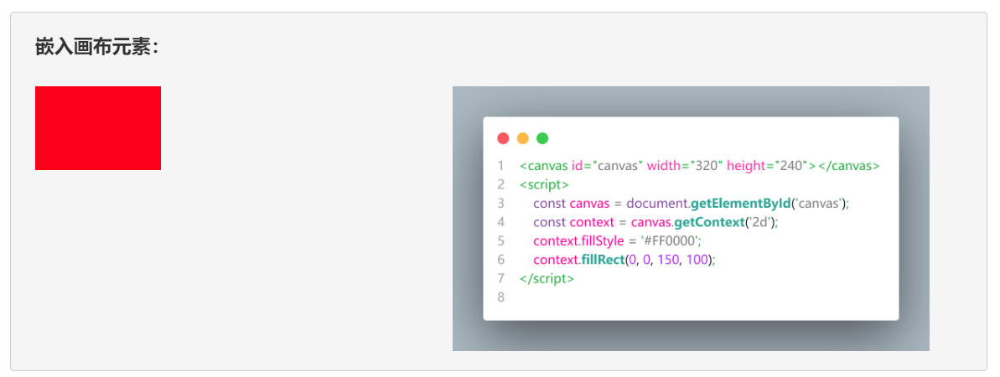

# 项目4： 企业网站的产品展示页设计

企业网站的产品展示页设计在网页设计领域中属于多媒体播放类页面的设计项目，其设计目的是将目标网页打造成一个类似于哔哩哔哩的多媒体播放界面，以便利用视频、动画等多媒体资料更直观地向公众展示网站所属企业的主打产品与经营近况。在此类项目中，网页设计师们除了需要利用本书在上一章中介绍的方法来对网页中的图文信息进行排版之外，通常还需要充分利用HTML中的多媒体类标记以及Bootstrap框架提供的相关组件来构建基于浏览器的多媒体播放界面。由于多媒体形式的宣传具有更为直观的传播能力，这将有助于为企业网站吸引到更多潜在的客户或合作伙伴，所以此类项目也被认为是网页设计师们在实际工作中最常接到的任务之一。

## 【学习目标】

在本章，笔者会继续以凌雪冰熊网站中“产品展示”页的设计为例来演示如何为企业网站设计出类似于哔哩哔哩的多媒体播放界面。该项目的设计目标是为凌雪冰熊网站提供视频、动画等多媒体资料的播放页面，以便更直观地展示这家连锁店最近的主打产品与新加盟的门店，从而吸引到更多潜在的合作伙伴。同样的，该网页在外观设计上也必须要延续该网站首页建立起来的布局风格与配色方案，并同样在导航栏中提供跳转到网站首页、新闻活动、申请加盟等页面的链接。通过本章项目的实践，读者将会初步了解设计一个多媒体播放类页面所要执行的基本步骤，以及执行这些步骤所需的基本技术与相关工具。总而言之，在阅读完本章之后，我们希望读者能够：

- 掌握如何利用Bootstrap框架提供的组件来完成针对多媒播放体类页面的布局任务；
- 掌握HTML 5中提供的多媒体类标记，并将这些标记具体运用到网页设计项目中；

## 【学习场景描述】

凌雪冰熊连锁店的网页设计团队如今已经完成了其官方网站的首页设计，并基于该设计进一步创建了该网站的网页模板。现在，他们希望你能基于该模板继续为该网站设计用于播放多媒体资料的页面，目的是更好地宣传凌雪冰熊这家连锁店最近的主打产品，以及在全国各地新加盟的门店，从而进一步展现企业品牌的竞争力。在这个网页设计项目中，你的主要任务是为网站的“产品展示”页设计一个类似于哔哩哔哩的多媒体播放页面，以便凌雪冰熊官方团队可以利用该页面发布多媒体形式的宣传资料。当然了，你同样需要确保该页面采用与首页一致的布局风格与配色方案。

## 【任务书】

- **项目名**：凌雪冰熊网站的产品展示页设计
- **委托方**：凌雪冰熊股份有限公司互联网部门
- **项目资料**：
  - **代码资料**：凌雪冰熊官方网站现有的设计源码；
  - **多媒体资料**：凌雪冰熊官方提供的音频、视频等多媒体资料；
- **项目要求**：为凌雪冰熊连锁饮料店的官方网站设计首页，该网页的设计应符合以下要求。
  - 该网页需要为网站的客户提供用户体验良好的、多媒体播放界面；
  - 该网页在外观样式上需要采用与网站首页一致的布局风格与配色方案；
- 时间要求：在3个工作日内完成；

## 【任务拆解】

本章项目的实施过程可以划分为以下三个小任务来进行：

- 基于凌雪冰熊官方网站提供的网页设计模版来创建该网站的产品展示页；
- 利用Bootstrap框架创建多媒体播放界面，包括媒体列表与媒体播放区域；
- 利用HTML标记将凌雪冰熊官方提供的多媒体资料填充到刚刚创建的界面中；

## 【工作准备】

在经过了上一章的项目实践之后，读者想必已经对如何安排网页中的图文类信息有了一个基本的了解。在本章接下来要实践的这一类项目中，设计师们将要在页面中设置的是更为复杂的多媒体元素及其外观样式，这需要读者学习更多的HTML标记与相关的Bootstrap组件。下面，笔者将根据本章项目的任务需求来继续为大家介绍相关的知识点和工具，同样的，如果读者自认为已经掌握了这部份知识，也可以选择跳过本节内容，直接进入本章项目的【工作实施与交付】环节。

### 知识点1：在网页中嵌入媒体播放器

在网页设计工作中，除了最基本的图文类元素之外，设计师们通常还会根据任务的需求在网页中嵌入音频、视频等页面元素，以便在网页中呈现以多媒体形态输出的内容。这些元素也都有对应的HTML标记，例如设计师们可以使用HTML 5提供的`<video>`、`<audio>`这两个标记来实现在网页中嵌入视频/音频的播放器元素，如今人们所熟悉的哔哩哔哩、喜马拉雅等视频/音频网站，就是基于这两个标记来实现的，下面来分别介绍一下它们的使用方法：

- `<audio>`标记：该标记用于在网页文档中嵌入一个音频播放器元素，设计师们可以利用其`<source>`子标记的`src`属性来指定要播放的音频文件，例如像这样：

    ```html
    <!DOCTYPE html>
    <html>
        <head>
            <title>嵌入音频播放器</title>
        </head>
        <body>
            <audio width="400" height="300" controls>
                <source src="horse.mp3" type="audio/mpeg">
                <p>你的浏览器不支持HTML 5的音频标签！</p>
            </audio>
        </body>
    </html>
    ```

  上述示例被保存在本书源码包中的`Examples/00_demo/embedCase`目录下的`index.htm`文件中，读者可以使用网页浏览器打开该文件，就可以看到如图4-1所示的效果：

  

  **图4-1**：嵌入音频播放器

  接下来，让我们根据上述示例来简单介绍一下在网页中嵌入音频播放器元素的基本步骤，具体如下：
  - 首先要做的是使用 `<audio>` 标记来在网页中创建一个音频播放器元素，并设置该元素的位置、高度、宽度以及其他与播放器相关的属性。在此过程中，设计师们主要会使用到该标记的以下属性：
    - `width` 和 `height`属性：这两个属性主要用于设置音频播放器元素在网页中所要显示的高度和宽度。当然在这里，笔者更倾向于建议大家用CSS样式来设置这部分内容，而不是直接在HTML文档中使用这两个属性。
    - `autoplay`属性：该属性用于指定是否要在网页加载完毕之后自动开始播放音频。
    - `controls`属性：该属性用于指定是否要在网页中显示音频播放器的控制按钮。
    - `loop`属性：该属性用于指定是否要在网页中循环播放音频。
    - `preload`属性：该属性用于指定是否要在网页加载完毕之后预先加载音频文件。
    - `muted`属性：该属性用于指定是否要在网页中默认将音频静音。
  - 在定义好音频播放器元素之后，接下来要做的是使用其 `<source>` 子标记来指定该播放器元素具体要播放的媒体文件，该子标记的常用属性如下：
    - `src` 属性：该属性用于指定要媒体文件所在的位置，通常以URL的形式来表示。
    - `type`属性：该属性用于指定要播放的媒体文件的类型。到目前为止，在网页中可以播放的音频格式主要有以下几种：
      - `audio/mpeg`：该属性用于指定要播放的媒体文件为MPEG格式的音频文件。
      - `audio/ogg`：该属性用于指定要播放的媒体文件为Ogg格式的音频文件。
      - `audio/wav`：该属性用于指定要播放的媒体文件为WAV格式的音频文件。
      - `audio/webm`：该属性用于指定要播放的媒体文件为WebM格式的音频文件。
  - 最后，由于考虑到目前市面上各种浏览器对HTML 5的支持程度并不一致，设计师们通常还会在`<audio>`标记内部设置一些文本类标记（例如 `<p>` ），用来指定当浏览器不支持HTML 5的音频标签时页面中要显示的提示信息。

- `<video>`标记：该标记用于在网页文档中嵌入一个视频播放器元素，设计师们可以利用其`<source>`子标记的`src`属性来指定要播放的视频文件，例如像这样：

    ```html
    <!DOCTYPE html>
    <html>
        <head>
            <title>嵌入视频播放器</title>
        </head>
        <body>
            <video width="320" height="240" controls>
                <source src="movie.mp4" type="video/mp4">
                <p>你的浏览器不支持HTML 5的视频标签！</p>
            </video>
        </body>
    </html>
    ```

  同样的，上述示例也被保存在本书源码包中的`Examples/00_demo/embedCase`目录下的`index.htm`文件中，读者可以使用网页浏览器打开该文件，就可以看到如图4-2所示的效果：

  

  **图4-2**：嵌入视频播放器

  接下来，让我们根据上面的示例来简单介绍一下在网页中嵌入视频播放器元素的基本步骤，具体如下：
  - 首先要做的是使用`<video>`标记来在网页中创建一个视频播放器元素，并设置该元素的位置、高度、宽度以及其他与播放器相关的属性。在此过程中，设计师们主要会使用到该标记的以下属性：
    - `width` 和 `height`属性：这两个属性主要用于设置视频播放器元素在网页中所要显示的高度和宽度。当然在这里，笔者更倾向于建议大家用CSS样式来设置这部分内容，而不是直接在HTML文档中使用这两个属性。
    - `autoplay`属性：该属性用于指定是否要在网页加载完毕之后自动开始播放视频。
    - `controls`属性：该属性用于指定是否要在网页中显示视频播放器的控制按钮。
    - `loop`属性：该属性用于指定是否要在网页中循环播放视频。
    - `preload`属性：该属性用于指定是否要在网页加载完毕之后预先加载视频文件。
    - `muted`属性：该属性用于指定是否要在网页中默认将视频静音。
    - `poster`属性：该属性用于指定是否要在网页中默认显示视频的封面图片。
  - 在定义好音频播放器元素之后，接下来要做的是使用其 `<source>` 子标记来指定该播放器元素具体要播放的媒体文件，该子标记的常用属性如下：
    - `src` 属性：该属性用于指定要媒体文件所在的位置，通常以URL的形式来表示。
    - `type`属性：该属性用于指定要播放的媒体文件的类型。到目前为止，在网页中可以播放的视频格式主要有以下几种：
      - `video/mp4`：该格式用于指定要播放的媒体文件为MP4格式。
      - `video/webm`：该格式用于指定要播放的媒体文件为WebM格式。
      - `video/ogg`：该格式用于指定要播放的媒体文件为Ogg格式。
  - 最后，由于考虑到目前市面上各种浏览器对HTML 5的支持程度并不一致，设计师们通常还会在`<video>`标记内部设置一些文本类标记（例如 `<p>` ），用来指定当浏览器不支持HTML 5的音频标签时页面中要显示的提示信息。

### 知识点2：在网页中嵌入JavaScript代码

在本章接下来要完成的项目任务一中，读者在设置多媒体播放器的启动开关时，需要根据开关所在的播放列表来动态指定播放器的播放源，这一功能通常需要通过编写JavaScript代码的方式来实现。虽然在这本书中，读者的主要任务是学习基于HTML+CSS技术的网页设计，基于JavaScript语言的编程议题照理并不在书的讨论范围中，但由于考虑到网页设计工作的实际需求，笔者在整理还是需要简单地为大家介绍一下如何将JavaScript代码嵌入到网页中，并让浏览器按照自己希望的方式加载它。

在HTML 5中，人们通常会使用 `<script>` 标记来在网页中嵌入JavaScript脚本，例如读者可以选择将只适用于当前网页的JavaScript代码直接写在`<script>`和`</script>`这对标记之间，让它们以网页内联脚本的形式来执行，例如像下面这样：

```html
<!DOCTYPE html>
<html>
    <head>
        <title>嵌入脚本代码</title>
        <script>
            function changeText() {
                document.getElementById("targetID").innerHTML = "Hello World!";
            }
        </script>
    </head>
    <body>
        <h1>嵌入 JavaScript 脚本代码.</h1>
        <button type="button" onclick="changeText()">打个招呼！</button>
        <p>点击上面的按钮将会在下面显示“Hello World!”。</p>
        <div id="targetID"></div>
    </body>
</html>
```

在上述代码中，笔者首先使用 `<script>` 标记定义了一个JavaScript函数，然后在`<button>`标记内部将该函数注册为鼠标点击事件的处理函数，这样一来，当页面中的按钮被鼠标点击时，该函数就将会在`id="targetID"`的`<div>`元素中显示出“Hello World!”字样的文本。当然了，上面这种内联形式的脚本通常只适合编写少量的代码，如果设计师们将大量的脚本代码与HTML标签混在一起，可能会严重影响代码的的可读性与可维护性。因此在更多时候，我们会选择使用`<script>`标签的`src`属性来嵌入外部的脚本文件，例如像这样：

```html
<!DOCTYPE html>
<html lang="zh-CN">
    <head>
        <meta charset="UTF-8">
        <title>嵌入外部脚本文件</title>
    </head>
    <body>
        <h1>嵌入外部脚本文件</h1>
        <button type="button" onclick="changeText()">打个招呼！</button>
        <p>点击上面的按钮将会在下面显示“Hello World!”.</p>
        <div id="targetID"></div>
        <script src="test.js"></script>
    </body>
</html>
```

然而，这样做会带来一个问题：由于浏览器在默认情况下采用的是同步嵌入模式，即它在读取到`<script>`标记时会先下载完外链的脚本文件，再继续读取后面的HTML标记，这其中造成的延时会影响整个网页的读取效率。为了解决这个问题，设计师们通常会在使用嵌入外部脚本时选择激活`<script>`标记的`async`属性，令浏览器改用异步载入模式，例如像这样：

```html
<!DOCTYPE html>
<html lang="zh-CN">
    <head>
        <meta charset="UTF-8">
        <title>异步嵌入外部脚本文件</title>
    </head>
    <body>
        <h1>异步嵌入外部脚本文件</h1>
        <button type="button" onclick="changeText()">打个招呼！</button>
        <p>点击上面的按钮将会在下面显示“Hello World!”.</p>
        <div id="targetID"></div>
        <script src="test.js" async="async"></script>
    </body>
</html>
```

这样一来，脚本文件的下载过程就不会影响到后面“其他页面元素”的载入了。然后，设计师们就只需要在`test.js`文件中编写相应的脚本代码即可。

当然了，`<script>`标签的上述使用方式还存在着另一个问题：由于在异步嵌入模式下，浏览器一旦下载完脚本文件就会立即执行，开发者无法确保脚本被执行的具体时间，所以它在上述代码中依然得被放在`id="targetID"`的`<div>`元素的后面。很显然，更理想的选择是将该标签与引用CSS文件的`<link>`标签一样放在`<head>`标签中。如果想做到这一点，设计师们就得要求浏览器采用延后执行模式，即让浏览器在在载入所有HTML标签之后再执行脚本，这就需要激活`<script>`标签的`defer`属性，例如像这样：

```html
<!DOCTYPE html>
<html lang="zh-cn">
    <head>
        <meta charset="UTF-8">
        <title>嵌入延后执行的外部脚本文件</title>
        <script src="test.js" defer="defer"></script>
    </head>
    <body>
        <h1>嵌入延后执行的外部脚本文件</h1>
        <button type="button" onclick="changeText()">打个招呼！</button>
        <p>点击上面的按钮将会在下面显示“Hello World!”.</p>
        <div id="targetID"></div>
    </body>
</html>
```

除此之外，设计师们通常还会用`<script>`标签的`type`属性来指定其载入脚本的文本类型，以明确其引用的是哪一种脚本。在HTML 5的标准规范中，`<script>`标签的默认`type`属性值是`type="text/javascript"`，笔者之前使用的都是这种文本类型，它不用特别声明。在默认情况下，浏览器会将该标签载入的代码当做普通的JavaScript脚本来执行，但当读者想使用模块，即`type="module"`时，浏览器就会将该标签载入的代码当做JavaScript模块来执行。

最后，设计师们还必须得考虑一下`<script>`标签不起作用时的情况。出于安全等原因，如今依然存在着一些特定的浏览器或用户会选择禁用脚本功能，这会让许多应用程序的用户界面就会无法正常工作。在脚本功能被禁用的情况下，浏览器会忽略`<script>`标签的存在，这时我们就需要用`<noscript>`标签来建议用户打开浏览器的脚本功能或者改用支持脚本的浏览器，该标签的具体用法如下：

```html
<!DOCTYPE html>
<html lang="zh-CN">
    <head>
        <meta charset="UTF-8">
        <title>浏览器端脚本支持测试</title>
        <script type="module" src="test.js"></script>
    </head>
    <body>
        <noscript>
            <p>本页面需要浏览器支持或启用脚本功能。</p>
        </noscript>
        <h1>浏览器端脚本支持测试</h1>
        <button type="button" onclick="changeText()">打个招呼！</button>
        <p>点击上面的按钮将会在下面显示“Hello World!”.</p>
        <div id="targetID"></div>
    </body>
</html>
```

这样一来，上述网页就会在脚本功能被禁用时显示一条提示信息，虽然在如今的主流网页浏览器中，它已经很少有机会发挥作用了。

### 知识点3：Bootstrap框架提供的相关组件

在之前的章节中，笔者已经介绍过如何使用轮播、卡片、折叠卡片等由Bootstrap框架提供的专用组件来安排网页中的图文信息类元素，而对于呈现形式更为复杂的多媒体类元素，设计师们需要用到一些结构更为复杂、功能也更为强大的专用组件。在本节中，笔者将继续为大家介绍本章项目在实现过程中会用到的Bootstrap组件。

- **选项卡组件**：如果读者想以选项卡的方式来对页面中所呈现的内容进行分门别类地组织，可以考虑使用Bootstrap框架中提供的选项卡组件来进行辅助设计，下面是该组件的一个简单示例：

    ```html
    <div id="tabdemo" class="border rounded">
        <ul class="nav nav-tabs" role="tablist">
            <li class="nav-item" role="presentation">
                <button class="nav-link active" id="tab1-tab" 
                    data-bs-toggle="tab" data-bs-target="#tab1" 
                    aria-controls="tab1" aria-selected="true">
                    选项卡 1
                </button>
            </li>
            <li class="nav-item" role="presentation">
                <button class="nav-link" id="tab2-tab"
                    data-bs-toggle="tab" data-bs-target="#tab2"
                    aria-controls="tab2" aria-selected="false">
                    选项卡 2
                </button>
            </li>
            <li class="nav-item" role="presentation">
                <button class="nav-link" id="tab3-tab"
                    data-bs-toggle="tab" data-bs-target="#tab3"
                    aria-controls="tab3" aria-selected="false">
                    选项卡 3
                </button>
            </li>
            <li class="nav-item" role="presentation">
                <button class="nav-link disabled" id="tab4-tab"
                    data-bs-toggle="tab" data-bs-target="#tab4"
                    aria-controls="tab4" aria-selected="false">
                    禁用选项卡
                </button>
            </li>
        </ul>
        <div class="tab-content container p-3">
            <div class="tab-pane fade show active" id="tab1"
                    role="tabpanel" aria-labelledby="tab1-tab">
                这是选项卡1的内容
            </div>
            <div class="tab-pane fade" id="tab2" role="tabpanel"
                aria-labelledby="tab2-tab">
                这是选项卡2的内容
            </div>
            <div class="tab-pane fade" id="tab3" role="tabpanel" 
                aria-labelledby="tab3-tab">
                这是选项卡3的内容
            </div>
            <div class="tab-pane fade" id="tab4" role="tabpanel" 
                aria-labelledby="tab4-tab">
                这是禁用选项卡的内容
            </div>
        </div>
    </div>
    ```

    上述代码所定义选项卡组件在浏览器中的显示效果如图4-3所示：

    

  **图4-3**：Bootstrap选项卡组件的效果图

  接下来，让我们根据上面的示例来简单介绍一下与该组件相关的样式类及其使用方法，具体如下：

- `nav-tabs`：该样式类通常作用于设置了`nav`样式类的`<ul>`标记，效果是将该无序列表定义为选项卡组件的导航栏部分。另外，如果想让选项卡组件正常工作，我们还需为该`<ul>`标记设置`role`属性，并将该属性的值设置为`tablist`；
- `nav-item`：该样式类是和`nav`和`nav-tabs`这两个类的次级样式类，通常作用于设置了`nav-tabs`样式类的`<ul>`标记内部的各`<li>`标记，效果是将这些列表项设置为选项卡组件中导航栏部分的各个子项。同样，如果想让这些导航项正常工作，我们还需为这些`<li>`标记设置`role`属性，并将该属性的值设置为`presentation`；
- `nav-link`：该样式类用于设置选项卡组件中导航项的样式，通常作用于设置了`nav-item`样式类的`<li>`内部的`<a>`或`<button>`标记，效果是将该标记设置为链接样式；在设置这些导航项的样式时，读者需要注意以下事项：
  - 如果想让当前导航项处于默认被激活的状态，就需要在`nav-link`类后面再加上`active`样式类；
  - 如果想让当前导航项处于禁用状态，就需要在`nav-link`类后面再加上`disabled`样式类；
- `tab-content`：该样式类通常作用于选项卡组件中紧跟着导航栏部分后面的`<div>`标记，效果是将该标记定义的元素设置为充当组件中各选项卡元素的容器；
- `tab-pane`：该样式类通常作用于设置了`tab-content`样式类的`<div>`标记内第一级的各个`<div>`标记，效果是将这些标记设置为选项卡组件中的各个选项卡；在设置这些选项卡元素时，读者需要注意以下事项：
  - 每个`<div>`标记都应该有一个`id`属性，该属性的值应该与被设置了`nav-link`类的标记中`aria-controls`属性的值相同；
  - 如果想让组件中的各个选项卡都能正常发挥作用，我们就需要为这些`<div>`标记设置`role`属性，并将该属性的值设置为`tabpanel`；
  - 如果想赋予组件中的各选项卡元素在被切换时有淡入淡出的效果，我们就需要在`tab-pane`类后面再加上`fade`样式类；
  - 如果想让组件中的某个选项卡在页面载入时默认显示，我们就需要回到该选项卡所在的`<>`标记的`class`属性中，在`tab-pane`类后面再加上`show`样式类；
  - 如果想让组件中的某个选项卡默认处于激活状态，我们就需要回到该选项卡所在的`<>`标记的`class`属性中，在`tab-pane`类后面再加上`active`样式类；

- **分页导航组件**：如果读者想让页面中的内容分页显示，可以考虑使用Bootstrap框架中提供的分页组件来进行辅助设计，下面是该组件的一个简单示例：
  
    ```html
    <nav id="paginationExample" class="mt-5" 
        aria-label="Page navigation example">
        <ul class="pagination justify-content-center">
            <li class="page-item disabled">
                <a class="page-link" href="#" tabindex="-1" 
                    aria-disabled="true">Previous</a>
            </li>
            <li class="page-item active" aria-current="page">
                <a class="page-link" href="#">1</a>
            </li>
            <li class="page-item">
                <a class="page-link" href="#">2</a>
            </li>
            <li class="page-item">
                <a class="page-link" href="#">3</a>
            </li>
            <li class="page-item">
                <a class="page-link" href="#">Next</a>
            </li>
        </ul>
    </nav>                
    ```

    上述代码所定义分页导航组件在浏览器中的显示效果如图4-4所示：

    

  **图4-4**：Bootstrap分页导航组件的效果图

  接下来，让我们根据上面的示例来简单介绍一下与该组件相关的样式类及其使用方法，具体如下：  

  - `pagination`：该样式类通常作用于`<nav>`标记下面的`<ul>`标记，效果是将该无序列表元素设置为分页组件，并赋予其该组件的基本样式；
  - `page-item`：该样式类是`pagination`类的次级样式类，通常作用于分页组件中的每个`<li>`标记，效果是将这些列表项设置为该组件中跳转按钮的样式。在设置这些跳转按钮元素时，读者还需要注意以下事项：
    - 如果想让某个跳转按钮处于禁用状态，则需要在`page-item`类后面再添加一个`disabled`样式类；
    - 如果想将某个跳转按钮设置为默认激活状态，则需要在`page-item`类后面再添加一个`active`样式类；
  - `page-link`：该样式类是`page-item`类的次级样式类，通常被放置在被设置了`page-item`样式类的`<li>`标记的内部，作用是具体设置组件中各个分页所在的链接；

- **模态对话框组件**：如果读者想在页面中以弹出式对话框的方式来呈现某些内容（例如在本章项目中，笔者将会使用这种对话框的形式来呈现多媒体播放界面），则可以使用Bootstrap框架提供的模态对话框组件来进行辅助设计。下面是该组件的一个简单示例：

    ```html
    <button type="button" class="btn btn-primary"
        data-bs-toggle="modal" data-bs-target="#modalExample">
        显示模态弹框
    </button>
    <dialog class="modal fade" id="modalExample" tabindex="-1"
        aria-labelledby="modalExampleLabel" aria-hidden="true">
        <div class="modal-dialog">
            <div class="modal-content">
                <div class="modal-header">
                    <h5 class="modal-title" 
                        id="modalExampleLabel">
                        模态弹框标题
                    </h5>
                    <button type="button" class="btn-close"
                        data-bs-dismiss="modal" 
                        aria-label="Close">
                    </button>
                </div>
                <div class="modal-body">
                    <p>这是一个模态弹框组件的简单示例。</p>
                </div>
                <div class="modal-footer">
                    <button type="button" 
                        class="btn btn-secondary"
                        data-bs-dismiss="modal">关闭</button>
                    <button type="button" 
                        class="btn btn-primary">
                        保存更改
                    </button>
                </div>
            </div>
        </div>
    </dialog>
    ```

    上述代码所定义模态对话框组件在浏览器中的显示效果如图4-5所示：

    

  **图4-5**：Bootstrap模态对话框组件的效果图

  接下来，笔者将根据上述示例来介绍一下该组件的使用方法以及相关的样式类，具体如下：
  - `modal`：该样式类通常作用于一个`<div>`或`<dialog>`标记，效果是将该标记定义的元素设置为一个模态对话框组件。在设置该组件时，读者需要注意以下事项：
    - 由于该组件是一个弹出式对话框，所以我们需要设置一个按钮元素来触发该对话框的弹出。在定义该按钮元素的`<button>`标记中，`data-bs-toggle`属性的值应设置为`modal`，`data-bs-target`属性的值则应为`#[id属性值]`（在这里，`[id属性值]`为模态对话框组件的`id`属性值）。
    - 如果我们想赋予该模态对话框淡入淡出的效果，就需要在`modal`样式类后面再添加一个`fade`样式类；
  - `modal-dialog`：该样式类是`modal`类的次级样式类，通常作用于被设置了`modal`类的`<div>`标记内第一级的`<div>`标记，效果是将该标记定义的元素设置为模态对话框组件的对话框部分。在设置这部分样式时，读者需要注意以下事项：
    - 如果读者想在对话框中使用滚动条元素，就需要在`modal-dialog`样式类后面再添加一个`modal-dialog-scrollable`样式类；
    - 如果读者想在对话框中使用居中布局，就需要在`modal-dialog`样式类后面再添加一个`modal-dialog-centered`样式类；
  - `modal-content`：该样式类是`modal-dialog`类的次级样式类，通常作用于被设置了`modal-dialog`类的`<div>`标记内第一级的`<div>`标记，效果是将该标记定义的元素设置为一个用于放置对话框内部元素的容器；
  - `modal-header`：该样式类是`modal-content`类的次级样式类，通常作用于被设置了`modal-content`类的`<div>`标记内第一级的`<div>`标记，效果是将该标记定义的元素设置为一个模态对话框组件的头部部分。
  - `modal-title`：该样式类是`modal-header`类的次级样式类，通常作用于被设置了`modal-header`类的`<div>`标记内的标题类标记，效果是将该标记定义的元素设置为一个模态对话框组件的标题文本。
  - `modal-body`：该样式类是`modal-content`类的次级样式类，通常作用于被设置了`modal-content`类的`<div>`标记内第一级的`<div>`标记，效果是将该标记定义的元素设置为一个模态对话框组件的身体部分。
  - `modal-footer`：该样式类是`modal-content`类的次级样式类，通常作用于被设置了`modal-content`类的`<div>`标记内第一级的`<div>`标记，效果是将该标记定义的元素设置为一个模态对话框组件的底部部分；

## 【工作实施和交付】

在完成了上述知识准备之后，读者现在就可以根据之前【任务书】中的要求来着手实施凌雪冰熊网站的“产品展示”页的设计了，该项目的实施过程可以分为以下步骤来进行。

### 第1步：基于网页模板来创建目标页面

在这一步骤中，网页设计师的主要任务是基于凌雪冰熊官方提供的网页设计模板来创建网站的“产品展示”页，并根据项目的具体需求调整网页的导航栏设计。为此，读者需要执行以下操作。

1. 先使用命令行终端环境回到到凌雪冰熊网站项目的根目录下，并通过执行`cp template.htm show.htm`命令来创建该网站的“产品展示”页。

2. 使用VS Code编辑器打开刚刚创建的`show.htm`文件，找到页面的导航栏部分并将其当前页有“首页”改为“产品展示”，并将之前创建的网站首页、新闻活动页所在的URL添加到该导航栏相应的链接标记中，具体代码如下。

    ```html
    <nav class="navbar navbar-expand-lg navbar-dark navbar-text">
        <div class="container-fluid p-2">
            <a class="navbar-brand" href="#">
                
                <span class="fs-4">凌雪冰熊</span>
            </a>
            <button class="navbar-toggler" type="button"  data-bs-toggle="collapse" 
                data-bs-target="#navbarSupportedContent" 
                aria-controls="navbarSupportedContent" aria-expanded="false" 
                aria-label="Toggle navigation">
                <span class="navbar-toggler-icon"></span>
            </button>
            <div class="collapse navbar-collapse" id="navbarSupportedContent">
                <ul class="navbar-nav me-auto mb-2 mb-lg-0 fs-5">
                    <li class="nav-item">
                        <a class="nav-link" href="./index.htm">首页</a>
                    </li>
                    <li class="nav-item">
                        <a class="nav-link" href="./news.htm">新闻活动</a>
                    </li>
                    <li class="nav-item">
                       <a class="nav-link active" aria-current="page" href="./show.htm">
                            产品展示
                        </a>
                    </li>
                    <li class="nav-item">
                        <a class="nav-link" href="#">申请加盟</a>
                    </li>                    
                    <li class="nav-item dropdown">
                        <a class="nav-link dropdown-toggle"
                            href="#" id="navbarDropdown" 
                            role="button" data-bs-toggle="dropdown" 
                            aria-expanded="false">
                            更多信息
                        </a>
                        <ul id="dropdown-menu" 
                            class="dropdown-menu" 
                            aria-labelledby="navbarDropdown">
                            <li><a class="dropdown-item" href="#">企业文化</a></li>
                            <li><a class="dropdown-item" href="#">企业荣誉</a></li>
                            <li><a class="dropdown-item" href="#">企业历程</a></li>
                        </ul>
                    </li>
                </ul>
                <form class="d-flex">
                    <input class="form-control" type="search" 
                        placeholder="搜索关键字" aria-label="Search">
                    <button class="btn btn-outline-success" type="submit">
                        <i class="fa fa-search fa-lg"></i>
                    </button>
                </form>
            </div>
        </div>
    </nav>
    ```

3. 最后回到之前的命令行终端环境中，并在项目的根目录中通过执行以下命令来完成本章项目的第一次版本控制操作。

    ```bash
    git init
    git add .
    git commit -m "项目4：完成产品展示页的创建"
    ```

### 第2步：完成“产品展示”页的设计

在这一步骤中，网页设计师的主要任务是：先使用Bootstrap框架提供的选项卡组件和卡片组件对凌雪冰熊提供的视频资料建立播放列表界面，然后再为该播放列表中的每个视频资料提供播放入口，以便用于打开多媒体播放界面。为此，读者需要执行以下操作。

1. 首先，我们要使用Bootstrap框架提供的选项卡组件将网页中要展示的视频资料划分成“门店展示”和“热门产品”两个播放列表来呈现，为此，读者需要回到之前创建的`show.htm`文件中，并找到`<!-- 在此处填充网页的主体内容 -->`这一行注释所在的位置，并将其替换为以下代码。

    ```html
    <section class="container-fluid">
        <div id="videoList" class="text-bg-light">
            <ul class="nav nav-tabs" role="tablist">
                <li class="nav-item" role="presentation">
                    <button class="nav-link active" id="hotShopTab" 
                        data-bs-toggle="tab" data-bs-target="#hotShop" 
                        aria-controls="hotShop" aria-selected="true">
                        门店展示
                    </button>
                </li>
                <li class="nav-item" role="presentation">
                    <button class="nav-link" id="productTab"
                        data-bs-toggle="tab" data-bs-target="#hotProduct"
                        aria-controls="hotProduct" aria-selected="false">
                        热门产品
                    </button>
                </li>
            </ul>
            <div class="tab-content container g-0">
                <div class="tab-pane fade show active" id="hotShop"
                        role="tabpanel" aria-labelledby="hotShopTab">
                    <!-- 在此处填充与门店相关的视频列表 -->
                </div>
                <div class="tab-pane fade" id="hotProduct" role="tabpanel"
                    aria-labelledby="productTab">
                    <!-- 在此处填充与产品相关的视频列表 -->                    
                </div>
            </div>
        </div>
    </section>
    <!-- 在此处设置视频播放器元素 -->
    ```

2. 接下来，我们需要使用Bootstrap框架提供的网格布局系统、卡片组件和分页导航组件来创建于门店相关的视频列表。为此，读者需要继续回到`show.htm`文件中，并找到`<!-- 在此处填充与门店相关的视频列表 -->`这一行注释所在的位置，并将其替换为以下代码。

    ```html
    <div class="container-fluid p-3">
        <div class="row m-2">
            <div class="col-4">
                <div class="card" style="width: 18rem;">
                    
                    <div class="card-body">
                        <h5 class="card-title">北京门店</h5>
                        <a href="#" class="btn btn-primary">播放视频</a>
                        </div>
                    </div>
            </div>
            <div class="col-4">
                <div class="card" style="width: 18rem;">
                    
                    <div class="card-body">
                        <h5 class="card-title">上海门店</h5>
                        <a href="#" class="btn btn-primary">播放视频</a>
                        </div>
                    </div>
            </div>
            <div class="col-4">
                <div class="card" style="width: 18rem;">
                    
                    <div class="card-body">
                        <h5 class="card-title">广州门店</h5>
                        <a href="#" class="btn btn-primary">播放视频</a>
                        </div>
                    </div>
            </div>
        </div>
        <div class="row m-2">
            <div class="col-4">
                <div class="card" style="width: 18rem;">
                    
                    <div class="card-body">
                        <h5 class="card-title">深圳门店</h5>
                        <a href="#" class="btn btn-primary">播放视频</a>
                        </div>
                    </div>
            </div>
            <div class="col-4">
                <div class="card" style="width: 18rem;">
                    
                    <div class="card-body">
                        <h5 class="card-title">杭州门店</h5>
                        <a href="#" class="btn btn-primary">播放视频</a>
                        </div>
                    </div>
            </div>
            <div class="col-4">
                <div class="card" style="width: 18rem;">
                    
                    <div class="card-body">
                        <h5 class="card-title">南京门店</h5>
                        <a href="#" class="btn btn-primary">播放视频</a>
                    </div>
                </div>
            </div>
        </div>    
        <nav id="paginationLIst" class="bg-light m-3" 
            aria-label="Page navigation">
            <ul class="pagination justify-content-center">
                <li class="page-item disabled">
                    <a class="page-link" href="#" tabindex="-1" 
                        aria-disabled="true">Previous</a>
                </li>
                <li class="page-item active" aria-current="page">
                    <a class="page-link" href="#">1</a>
                </li>
                <li class="page-item">
                    <a class="page-link" href="#">2</a>
                </li>
                <li class="page-item">
                    <a class="page-link" href="#">Next</a>
                </li>
            </ul>
        </nav>
    </div>
    ```

3. 然后，我们还需要用相同的方式来创建与产品相关的视频列表。为此，读者需要继续回到`show.htm`文件中，并找到`<!-- 在此处填充与产品相关的视频列表 -->`这一行注释所在的位置，并将其替换为以下代码。

    ```html
    <div class="container-fluid p-3">
        <div class="row m-2">
            <div class="col-4">
                <div class="card" style="width: 18rem;">
                    
                    <div class="card-body">
                        <h5 class="card-title">咖啡鸡尾酒</h5>
                        <a href="#" class="btn btn-primary">播放视频</a>
                        </div>
                    </div>
            </div>
            <div class="col-4">
                <div class="card" style="width: 18rem;">
                    
                    <div class="card-body">
                        <h5 class="card-title">茉莉花拿铁</h5>
                        <a href="#" class="btn btn-primary">播放视频</a>
                        </div>
                    </div>
            </div>
            <div class="col-4">
                <div class="card" style="width: 18rem;">
                    
                    <div class="card-body">
                        <h5 class="card-title">绿茶玛奇朵</h5>
                        <a href="#" class="btn btn-primary">播放视频</a>
                        </div>
                    </div>
            </div>
        </div>
        <div class="row m-2">
            <div class="col-4">
                <div class="card" style="width: 18rem;">
                    
                    <div class="card-body">
                        <h5 class="card-title">椰果冻奶茶</h5>
                        <a href="#" class="btn btn-primary">播放视频</a>
                        </div>
                    </div>
            </div>
            <div class="col-4">
                <div class="card" style="width: 18rem;">
                    
                    <div class="card-body">
                        <h5 class="card-title">榴莲冰咖啡</h5>
                        <a href="#" class="btn btn-primary">播放视频</a>
                        </div>
                    </div>
            </div>
            <div class="col-4">
                <div class="card" style="width: 18rem;">
                    
                    <div class="card-body">
                        <h5 class="card-title">椰奶冰咖啡</h5>
                        <a href="#" class="btn btn-primary">播放视频</a>
                    </div>
                </div>
            </div>
        </div>    
        <nav id="paginationLIst" class="bg-light m-3" 
            aria-label="Page navigation">
            <ul class="pagination justify-content-center">
                <li class="page-item disabled">
                    <a class="page-link" href="#" tabindex="-1" 
                        aria-disabled="true">Previous</a>
                </li>
                <li class="page-item active" aria-current="page">
                    <a class="page-link" href="#">1</a>
                </li>
                <li class="page-item">
                    <a class="page-link" href="#">2</a>
                </li>
                <li class="page-item">
                    <a class="page-link" href="#">Next</a>
                </li>
            </ul>
        </nav>
    </div>
    ```

4. 在保存上述代码，并使用网页浏览器打开`show.htm`文件之后，读者就可以查看当前网页设计的结果了，其外观在Google Chrome浏览器中的效果如图4-6所示。

    

    **图4-6**：“产品展示”页的设计效果

5. 最后回到之前的命令行终端环境中，并在项目的根目录中通过执行以下命令来完成本章项目的第二次版本控制操作。

    ```bash
    git add .
    git commit -m "项目4：完成产品展示页的布局"
    ```

### 第3步：多媒体播放界面的设计

在这一步骤中，网页设计师的主要任务是使用HTML中的`<video>`标记及其子标记来创建用于播放多媒体资料的用户界面，并利用Bootstrap框架提供的样式类完成该用户界面的设计工作。为此，读者需要执行以下操作。

1. 首先，我们需要定义一个可通过单击按钮来为视频播放器设置播放源的JavaScript函数。为此，读者需要使用VS Code编辑器打开`show.htm`文件，并在文件中的`<head>`标记内部找到`<!-- 引入自定义的JavaScript脚本 -->`这行注释所在的位置，然后再改位置的后面加入如下`<script>`标记。

    ```html
    <script defer>
        function setUrl(url) {
            document.getElementById("videosource").src = url;
        }
    </script>
    ```

2. 我们需要将之前播放列表中的所有“播放视频”按钮设置为启动播放器界面的开关。为此，读者需要回到之前创建的`show.htm`文件中，并找到所有带有“播放视频”标签的`<a>`标记，并将它们全部替换为以下`<button>`标记。

    ```html
    <button type="button" class="btn btn-primary"
        data-bs-toggle="modal" 
        data-bs-target="#videoPlayer"
        onclick="setUrl('[视频文件名].mp4')">
        播放视频
    </button>
    ```

    在上述代码中，读者需要自行将`“[视频文件名].mp4”`替换为与按钮元素所在的卡片所对应的视频文件名。

3. 继续使用VS Code编辑器回到`show.htm`文件中，并找到`<!-- 在此处设置视频播放器元素 -->`这一行注释所在的位置，然后将其替换为以下代码。

    ```html
    <dialog class="modal fade bg-transparent"" id="videoPlayer" tabindex="-1"
        aria-labelledby="videoPlayerLabel" aria-hidden="true">
        <div class="modal-dialog modal-dialog-centered">
            <div class="modal-content">
                <div class="modal-header">
                    <h5 class="modal-title" id="videoPlayerLabel">
                        视频播放器
                    </h5>
                    <button type="button" class="btn-close"
                        data-bs-dismiss="modal" 
                        aria-label="Close">
                    </button>
                </div>
                <div class="modal-body">
                    <video controls class="w-100">
                        <source id="videosource" type="video/mp4">
                        <p>你的浏览器不支持HTML 5的视频标签！</p>
                    </video>
                </div>
                <div class="modal-footer">
                    <button type="button" 
                        class="btn btn-secondary"
                        data-bs-dismiss="modal">关闭</button>
                    <button type="button" 
                        class="btn btn-primary">
                        下载视频
                    </button>
                </div>
            </div>
        </div>
    </dialog>
   ```

4. 在保存上述代码之后，使用网页浏览器打开`show.htm`文件，并在打开的网页中单击任意一张卡片中带有“播放视频”字样的按钮，然后就可以查看当前网页设计的结果了，其外观在Google Chrome浏览器中的效果如图4-7所示。

    

    **图4-7**：多媒体播放界面的设计效果

5. 最后回到之前的命令行终端环境中，并在项目的根目录中通过执行以下命令来完成本章项目的第三次版本控制操作。

    ```bash
    git add .
    git commit -m "项目4：完成多媒体播放界面的设计"
    ```

## 【拓展知识】

到目前为止，读者学习的是针对多媒体类网页的基本设计工作，然而在实际生产环境中，设计师们要创建的多媒体页面往往都要比本章项目复杂得多。这些任务可能需要他们学习更多用于嵌入多媒体元素的HTML标记。因此在这一章的【拓展知识】部分，本书将就对读者在执行多媒体类的网页设计工作时所需要掌握的知识做一些拓展。

### 知识点：在网页中嵌入矢量图与动画

在多媒体类的网页设计任务中，除了音频、视频的播放器元素之外，设计师们有时候还会需要在页面中嵌入一些可定制的矢量图或动画元素，这就需要用到HTML 5提供的`<svg>`标记和`<canvas>`标记，下面来具体介绍一下这两个标记的使用方法。

- `<svg>`标记：该标记用于在网页文档中嵌入矢量图元素。在这里，矢量图是一种用数学公式来绘制的图形格式。由于人们在绘制矢量图时使用的是直线、矩形、圆形等数学几何图形而不是像素点，这使得它在被无限放大或缩小时完全不必担心图像显示会失真，所以矢量图这种图形格式通常要比我们之前使用的位图更适用于响应式网页的设计。
  
  在使用`<svg>`标记定义矢量图元素的过程中，设计师们需要用到一套基于XML实现的、名为SVG的计算机标记语言。例如，如果读者想在网页中嵌入一个绘制有红色圆形+黄色矩形的矢量图，就可以这样做：

    ```html
    <!DOCTYPE html>
    <html lang="zh-CN">
        <head>
            <meta charset="UTF-8">
            <title>嵌入矢量图</title>
        </head>
        <body>
            <svg width="400" height="300">
                <!-- 在这里放置用于绘制SVG图形的标记 -->
                <circle cx="50" cy="50" r="40" 
                    stroke="black" stroke-width="3" fill="red" />
                <rect x="100" y="100" width="200" height="100"
                    stroke="black" stroke-width="3" fill="yellow" />
            </svg>
        </body>
    </html>
    ```

  同样的，上述示例也会被保存在本书源码包中的`Examples/00_demo/embedCase`目录下的`index.htm`文件中，读者可以使用网页浏览器打开该文件，就可以看到如图4-8所示的效果。

  

  **图4-8**：嵌入矢量图元素

  接下来，让我们根据上面的示例简单介绍一下`<svg>`及其子标记的使用要旨：

  - `<svg>`标记具有开始标记 `<svg>` 和结束标记 `</svg>`，在这两个标记之间的内容将被渲染为SVG图形。设计师们可以使用该标记的`width`和`height`属性来指定图形的宽度和高度。这决定了SVG画布的尺寸，所有的图形元素将在这个画布上绘制。
  - SVG拥有一个独立的坐标系，该坐标系的起点（即`(0,0)`）通常位于`<svg>`标记所定义元素的左上角。设计师们可以在SVG中使用该坐标系来放置和定位图形元素。`<svg>`标记内的坐标系统是相对的，它们与`width`和`height`属性的值相关联。在 `<svg>` 标记内，设计师们可以使用一系列子标记来绘制不同的SVG图形元素，例如 `<circle>`、`<rect>`、`<line>`、`<path>` 等，这些子标记有各自的属性，可用于控制图形的外观和行为。
  - 设计师们可以使用CSS样式来控制SVG图形元素的颜色、填充、描边等外观属性。这些样式可以通过在网页中嵌入内联样式或者引用外部CSS文件来进行定义。
  - SVG图形中也可以包含交互性功能，例如添加鼠标事件处理程序，使用户能够与图形进行互动。另外，SVG支持动画，设计师们可以使用 `<animate>` 标记或 JavaScript 来为图形元素添加动画效果。
  - 设计师们可以将SVG图形嵌入到网页中，也可以通过外部文件引入 SVG 图形。这使得图形的重用和维护变得更加容易。

  总而言之，`<svg>`标记是一个可用于在网页中创建矢量图形和图表的强大工具，它提供了丰富的功能，包括绘制、样式、交互性和动画等。而且，SVG图形还可以在不失真的情况下缩放，适合多种不同的屏幕尺寸和分辨率。

- `<canvas>`标记：该标记用于在网页文档中嵌入可用于在运行时进行绘画的画布元素。在使用该标记创建该画布元素时，设计师们通常会先使用该标签的`width`和`height`属性来设置画布的宽度和高度，然后通过执行JavaScript脚本的方式来完成在该元素内部的绘画任务，例如像下面这样：

    ```html
    <!DOCTYPE html>
    <html>
        <head>
            <title>嵌入画布元素</title>
        </head>
        <body>
            <canvas id="canvas" width="320" height="240"></canvas>
            <script>
                const canvas = document.getElementById('canvas');
                const context = canvas.getContext('2d');
                context.fillStyle = '#FF0000';
                context.fillRect(0, 0, 150, 100);
            </script>
        </body>
    </html>
    ```

  同样的，上述示例也会被保存在本书源码包中的`Examples/00_demo/embedCase`目录下的`index.htm`文件中，读者可以使用网页浏览器打开该文件，就可以看到如图4-9所示的效果：

  

  **图4-9**：嵌入画布元素

  请注意，`<canvas>`标记与之前介绍的`<svg>`标记是不同的，`<svg>`标记所显示的是页面在被载入时由浏览器依据SVG语言的描述所绘制的数学几何图形，它通常是预先定义好的矢量图形。而`<canvas>`标记中的图形则是利用JavaScript脚本在其运行过程中依据指定参数来绘制的动态图形，因此它具有很大的可编程性，除了用于绘制静态图形之外，也可以用于制作动画和游戏。当然了，对于不熟悉JavaScript这门编程语言的网页设计师来说，在使用`<canvas>`标记之前可能需要学习一些与Canvas API相关的知识。另外，由于不同的网页浏览器对Canvas API的支持程度也有所不同，因此建议读者在使用时该标记时需要保持谨慎的态度，事前必须进行充分的兼容性测试。

## 【作业】

有一家名为“白熊前端”的程序员培训机构，刚刚完成了其官方网站的首页设计，现在希望你能根据首页制定的网页设计风格，继续为该网站设计一个“课程展示”页，用于以视频的方式向公众更好地展示该培训机构所能提供的服务，例如其明星级的教师团队、最近的热门课程等，以便吸引到更多的潜在客户和合作伙伴。

- **项目名**：白熊前端网站的“课程展示”页设计
- **委托方**：白熊前端的创始人：林宇一
- **项目资料**：
  - **代码资料**：白熊前端官方网站现有的设计源码；
  - **文献资料**：反映白熊前端这家培训机构近况的视频资料；
- **项目要求**：为白熊前端的官方网站设计“课程展示”页，该网页的设计应符合以下要求。
  - 该网页需要为视频资料提供用户体验良好的多媒体播放界面；
  - 该网页通用需要采用与网站首页一致的布局风格与配色方案；
- 时间要求：在3个工作日内完成；

## 【作业评价】

| 序号 | 评测内容 | 评分标准 | 分值 | 自评 | 互评 | 师评 | 综合得分 |
| ----- | --------- | ------------ | --- | ------ | ------ | ---- | --------- |
| 01 | 视频资料的呈现 | 网页中是否呈现了甲方提供的视频资料？| 20 |   |   |   |   |  
| 02 | 多媒体界面的设计 | 网页中的视频播放功能是否实现了用户体验良好的操作界面？| 20 |    |   |   |   |
| 03 |  PC端浏览器呈现 | 网页在Chrome和Firefox这两款主流网页浏览器中的表现是否一致？| 30 |   |   |   |
| 04 |  移动端浏览器呈现 | 网页在iOS和Android的各型主流设备中的表现是否一致？| 30 |   |   |   |
