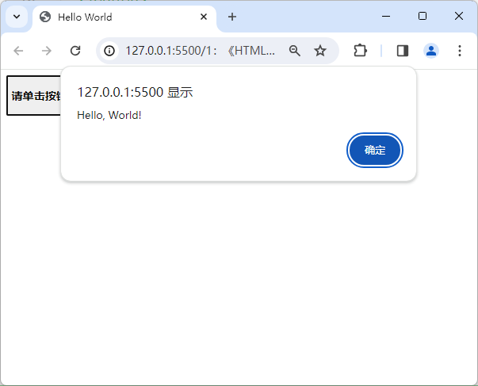
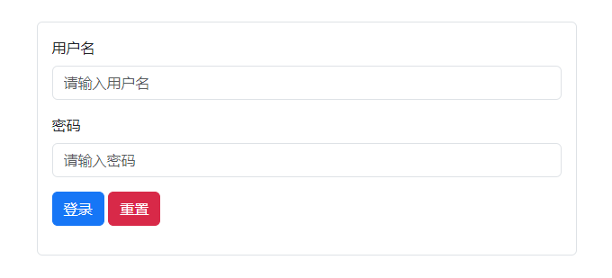
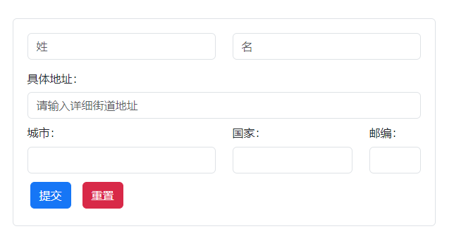

# 项目5 企业网站的留言版页面设计

企业网站的留言版页面设计在网页设计领域中属于双向交互性的用户界面设计项目，其设计目的是让目标网页成为一个用户体验良好的、用于人机双向交互的用户界面，以便人们能利用Web应用程序的前端所提供的用户界面向其后端服务器提交输入数据，并接收来自服务器的响应数据。在此类项目中，网页设计师们除了需要利用本书在上一章中介绍的方法来创建输入性的用户界面之外，通常还需要充分利用AJAX等相关的浏览器端编程技术妥善地解析来自后端服务器的响应数据，并以可视化的方式将解析结果呈现在网页中，以便人们能在使用Web应用程序时获得良好的用户体验，从而为该企业吸引到更多潜在的客户。因此，此类网页设计项目也被认为是网页设计师进阶为前端工程师的敲门砖任务之一。

## 【学习目标】

在本章，笔者会继续以凌雪冰熊网站中“留言板”页的设计为例来演示如何为企业网站设计双向交互性的用户界面。该演示项目的设计目标是为企业网站的用户提供就有留言功能的用户界面，以便增强企业与其潜在客户之间的交互，从而更及时地获取来自市场的反馈信息。同样的，该网页在外观设计上也必须要延续该网站首页建立起来的布局风格与配色方案，并同样在导航栏中提供跳转到网站首页、申请加盟等页面的链接。通过本章项目的实践，读者将会初步了解设计一个用于输入性的用户界面所要执行的基本步骤，以及执行这些步骤所需的基本技术与相关工具。总而言之，在阅读完本章之后，我们希望读者能够：

- 了解JavaScript这门编程语言的基本语法及其函数的基本使用方法
- 了解如今使用JavaScript语言操作HTML文档中的元素及其外观样式；
- 掌握AJAX等相关的前端编程技术及其相关组件接口的基本调用方法；

## 【学习场景描述】

凌雪冰熊连锁店的网页设计团队如今已经完成了其官方网站的首页设计，并基于该设计进一步创建了该网站的网页模板。现在，他们希望你能基于该模板继续为该网站设计用于给用户提交留言的页面，目的是简化凌雪冰熊这家连锁店及时了解来自市场的反馈，从而不断地改善自己的服务质量，进一步提升品牌的竞争力。在这个网页设计项目中，你的主要任务是为网站的“留言板”页面设计一个人机交互体验良好的用户界面，以便网站的用户可以获得类似于桌面应用程序的使用体验。当然了，你同样需要确保该页面采用与首页一致的布局风格与配色方案。

## 【任务书】

- **项目名**：凌雪冰熊网站的留言板页面设计
- **委托方**：凌雪冰熊股份有限公司互联网部门
- **项目资料**：
  - **代码资料**：凌雪冰熊官方网站现有的设计源码；
  - **后端API**：
    - 调用接口：`https://snowbear.com/messages_api`；
    - 后端响应：用于显示历史留言的JSON数据，目前后端服务器中已有数据如下：

        ```json
        [
            {
                "id": 1,
                "name": "张三",
                "content": "草莓味冰淇淋太甜了，很影响口感。"
            },
            {
                "id": 2,
                "name": "李四",
                "content": "我想要拿铁口味的冰淇淋，请安排一下。"
            }
        ]
        ```

- **项目要求**：为凌雪冰熊连锁饮料店的官方网站设计首页，该网页的设计应符合以下要求。
  - 该网页需要为潜在的客户提供用户体验良好的、双向交互性的用户界面；
  - 该网页在外观样式上需要采用与网站首页一致的布局风格与配色方案；
  - 该网页要在不刷新整个网页的情况下，通过AJAX技术实现与后端API的交互；
- 时间要求：在5个工作日内完成；

## 【任务拆解】

本章项目的实施过程可以划分为以下三个小任务来进行：

- 基于凌雪冰熊官方网站提供的网页设计模版来创建该网站的留言板页面；
- 利用HTML标记在网页中创建留言板功能的用户界面，并通过编写JavaScript脚本来实现向后端提交数据；
- 利用AJAX技术实现在不刷新整个网页的情况下获取来自后端API的留言数据，并将其展示在网页上。

## 【工作准备】

### 知识点1：JavaScript基本语法

自《The C Programming Language》这本程序设计领域的经典教程问世以来，在命令行终端环境中输出 “Hello World” 字样的程序已经成为了大多数计算机教材用于引导人们学习编程语言的第一个示例。这样做既可以先让初学者对自己要学习的语言，以及如何执行该语言的程序有一个整体的印象，也可以为接下来关于语法元素的介绍提供一个切入点。所以，接下来就让笔者以在网页中显示 “Hello World”字样的演示程序为切入点来介绍JavaScript语言的基本语法吧。该演示程序的构建步骤具体如下。

1. 在`Examples/00_demo`目录下创建一个名为`sayHelloInWeb`的目录，并在该目录下创建一个`sayHelloInWeb.htm`的HTML文档，然后在其中输入如下代码：

    ```HTML
    <!DOCTYPE html>
    <html lang='zh-CN'>
        <head>
            <meta charset="UTF-8">
            <title>Hello World</title>
            <script>
                // 第一个 JavaScript 程序
                // 作者：林宇一

                function sayHello() {
                    const strMessage = "Hello, World!";
                    alert(strMessage);
                }
            </script>
        </head>
        <body>
            <button onclick='sayHello();'>
                <h3>请单击按钮，向大家打个招呼</h3> 
            </button>
        </body>
    </html>
    ```

2. 在保存上述代码之后，使用网页浏览器打开`sayHelloInWeb.htm`文件，并单击页面中带有“请单击按钮，向大家打个招呼”字样的按钮，然后就可以查看当前设计的结果了，其外观在Google Chrome浏览器中的效果如图5-1所示。

    

    **图5-1**：网页版的Hello World程序

本书在上一章的【拓展知识】部分中已经介绍过如何使用`<script>`标签来嵌入JavaScript代码，所以这里就不再重复了。读者接下来需要将学习的重点放在了解JavaScript的基本语法上，就先从最简单的注释单元开始吧。

#### 为代码编写注释

在上面这段 “Hello World” 程序中，读者首先看到的是两行以`//`开头的注释信息。和所有的编程语言一样，注释也不会被JavaScript解释器视为可执行代码，它主要用于说明相关代码的作用，以此来提高代码的可读性，方便日后的维护工作，譬如在上面这段程序中，笔者用注释说明了这个程序的基本信息。在具体语法上，JavaScript中的注释主要有以下两种形式：

- **`// [注释内容]`形式**：这种形式的注释可以在代码的任意地方以`//`开头来编写注释信息，直至其所在行结束为止，例如：

    ```javascript
    // JavaScript 支持加减法运算
    const a = 100;
    const b = 50;
    const c  = a + b; // 请问 c = ？
    ```

- **`/* [注释内容] */`形式**：这种形式的注释可以在代码的任意地方以`/*`开头编写注释信息，然后以`*/`结束。由于这种形式的注释内容可以包含换行符，因此通常用于编写多行注释，譬如对于之前这段 “Hello World” 程序中的那两行注释，我们还有另一种写法：

    ```javascript
    /*
    * 第一个 JavaScript 脚本
    * 作者：林宇一
    */
    
    function sayHello() {
        const strMessage = "Hello, World!";
        alert(strMessage);
    }
    ```

需要提醒读者的是：JavaScript本身就是一门语言，它的作用除了让机器按照它的意图正确执行之外，也应该让使用这门语言的人类看得懂它的意图，注释只是辅助说明，可不是充当翻译。换而言之，读者应该学习尽量用代码本身来表达自己的意图，而不是处处都借助注释，譬如下面代码中的注释很大程度上是画蛇添足的：

```javascript
const a = 100;    // 变量 a = 100
const b = 50;      // 变量 b = 50
const c = a + b;  // 变量 c = a + b
```

#### 变量及其数据类型

下面继续 “Hello World” 程序的讲解。在看完程序基本信息的注释说明之后，紧接着看到的是`const strMessage = "Hello, World!"`这行代码，它的作用是在程序中定义一个变量。变量这个概念最早源自于数学中的代数运算，而到了计算机程序中，变量的概念得到了进一步扩展，除了是某个数据值的指代外，它还关联着计算机中用于存储该数据的一块内存空间，换而言之，变量现在还是程序用来存储某个数据的容器。当然了，这些容器既然能被称为“变”量，也就说明它们所存储的数据是会随着程序的执行而变化的。由于变量是程序所要操作的基本对象，所以在编写程序时，定义变量往往是我们首先要做的工作。下面，我们就来看看具体该如何定义并使用变量吧！

##### 变量的定义

在JavaScript的语法规范中，定义变量的动作是用定义语句来描述的（关于语句的概念，笔者稍后会做详细介绍），它主要由以下三部分组成：

- **变量的定义指令**：在ES6标准发布之前，人们一直是使用`var`关键字来定义变量的，而ES6中则另外增加了`let`、`const`这两个新的关键字，以便大家能更精确地定义变量的作用。关于这三个关键字之间的差异，笔者将会等到介绍作用域和常量对象时再来分别做详细介绍。
- **变量的名称**： 在JavaScript中，每个变量都必须要有相应的变量名，这些变量名通常应由一个或多个字母、数字、下划线和美元符号`$`组成，并且只能以字母、下划线和`$`符号开头。另外必须要记得的是，这些变量名必须是大小写敏感的。
- **变量的初始值**： 这部分的内容是可选的，但为了避免程序出现各种无意义的操作，程序员们通常都会在定义变量时赋予它一个初始值。

除此之外，每一种编程语言都会有一些特殊用途的保留字（参考表5-1），这些保留字不能被用作变量名。

| 保留字 | 保留字 | 保留字 | 保留字 | 保留字 |
| :--: | :--: | :--: | :--: | :--: |
| abstract | arguments | boolean | break | byte |
| Case | catch | char | class | const |
| continue | debugger | default | delete | do |
| double | else | enum | eval | export |
| extends | false | final | finally | float |
| For | function | goto | if | implements |
| import | in | instanceof | int | interface |
| Let | long | native | new | null |
| package | private | protected | public | return |
| Short | static | super | switch | synchronized |
| This | throw | throws | transient | true |
| Try | typeof | var | void | volatile |
| While | with | yield |  |  |

**表5-1**：JavaScript中的保留字

与此同时，程序员们在原则上还应该避免使用一些 JavaScript 标准库中使用的对象及其属性和方法的名称。下面继续来罗列一下使用时需要注意，不要意外与标准库冲突的变量名：

| 变量名 | 变量名 | 变量名 | 变量名 | 变量名 |
| :--: | :--: | :--: | :--: | :--: |
| Array | Date | eval | function | hasOwnProperty |
| Infinity | isFinite | isNaN | isPrototypeOf | length |
| Math | NaN | name | Number | Object |
| prototype | String | toString | undefined | valueOf |

##### 变量的类型

在计算机中，如果程序想要对某一块内存空间中数据进行存储和操作，首先要明确的是该空间内数据的存储方式和操作方式。譬如，变量中存储的是数据本身还是数据在内存中的位置？这将决定着这些数据的复制方式。再譬如，变量中的数据可以执行什么操作？是算术运算还是逻辑判断，亦或是文本处理？这就需要我们对这些内存空间中的数据，即变量的值进行归类，譬如用来做算术运算的数据归为一类，用于文本处理的数据则归为另一类，在编程术语上，这些归类被人们约定俗成地称之为“类型（type）”。简而言之，就是变量中的值所属的类型决定了该变量的存储形式及其可以执行的操作。具体到JavaScript语言中，人们通常会将变量的数据类型分成基本数据类型和对象类型两种，现在先来看看该语言所支持的五种基本类型：

- **Number**：即数字类型，这一类型的数据包括：
  - 正负整数与浮点数，例如：`0`、`1`、`-1`、`-0.25`、`3.14`等。
  - 八进制数与十六进制数，例如：`0377`、`0xff`等。
  - 指数，即用科学计数法表示的数字，例如：`1e+2`、`10e+3`等。
  - `Infinity`与`NaN`，这是JavaScript中的两个特殊数字。其中，`Infinity`表示的是一个超出JavaScript能接受范围的数字，相当于 JavaScript 世界中的“无穷大”，和数学中有正无穷大和负无穷大一样，这类值也是有`Infinity`和`-Infinity`两种的。而`NaN`则表示的是一种不符合规范但仍属于数字类型的数字，例如当我们让一个数字与一个字符串相乘时，结果就会是一个`NaN`。

- **String**：即字符串类型，这一类型的数据主要指的是被反引号、单引号或双引号所包括起来的、由任意数量字符组成的字符序列，例如：`'a'`、`'123'`、`"one"`、`"one two three"`等。另外，出于代码可读性方面的考虑，笔者个人更倾向于建议读者应在字符串的表示风格上保持一致，不要时而用单引号，时而用双引号。当然，ES6新增的反引号表示的字符串形式比较特殊，它主要用于建立模版字符串，我们通常只有在特定场景中才会用到它。

- **Boolean**：即布尔类型，这一类型的数据只有`true`和`false`两种值，主要用于关系运算和逻辑运算。关于这两种运算，我们稍后会详细说明。

- **`undefined`与`null`**： 这是JavaScript中的两个特殊值，当人们访问一个不存在的变量，或未被初始化的变量时，程序就会得到一个`undefined`值。而`null`着通常是指没有值、空值，不代表任何东西。`null`与`undefined`最大的不同在于，被赋予`null`的变量会被认为是被初始化了的，只不过它是个空值。

在JavaScript中， 任何不属于上述五种基本类型的值都会被视为对象，某些宿主环境甚至将`null`值也视为一个对象。我们在之后的内容中会深入阐述对象的概念，现在还需要再进一步来探讨一下类型与值的关系。作为一种动态类型的脚本语言，JavaScript的数据类型是直接与“值”，而不是与变量相关联的。这也就意味着，在JavaScript代码的执行过程中，变量的类型是可以随着变量的值而变化的，例如，如果我们在代码中定义了一个名为`x`的变量，`x`的值是可以初始值为数字，然后在执行过程中被重新赋予其他类型的值的，JavaScript的宿主环境会负责自动识别变量的类型。

#### 操作符、表达式与语句

在做好变量的定义之后，程序员们就可以对其进行相关的操作了。例如在上面的 “Hello World” 程序中，`alert(strMessage)`这条代码的作用就是将`strMessage`这个字符串显示在弹出的对话框中。笔者在这里调用的是一个函数，在编程过程中，函数是最为常用的语法单元之一，它通常由一系列操作语句组合而成，所以想要理解函数这一概念，读者就首先要了解在JavaScript语言中可以执行的基本操作，以及用于执行者操作的表达式和语句。

##### 操作符及其优先级

和大多数编程语言一样，JavaScript中的大部分基本操作都是通过操作符来完成的。这里所谓的操作符，通常指的是能对一到两个目标执行某种操作，并返回结果的符号。在JavaScript中，人们通常将其支持的基本操作符按其作用分为位运算符、算术运算符、逻辑运算符、关系运算符、字符串操作符与赋值操作符六种，它们主要用于操作一些简单的数据。下面来看看它们分别是哪一些运算符。

- **位运算符**：众所周知，计算机中的所有数据都是以二进制形式存储的，位运算是一种直接对整数底层存储形式进行操作的运算，它主要作用于 32 位的正负整数上。下面，笔者用一张表来罗列一下这些运算符及其使用示例：

    | 运算符 | 中文术语 | 使用示例 | 二进制结果 | 转换成十进制 |
    | :--: | :--: | :--: | :--: | :--: |
    | & | 按位与 | x = 5 & 1 | 0001 | 1 |
    |  \| | 按位或 | x = 5 | 1 | 0101 |
    | ~ | 取反 | x = ~ 5 | 1010 | -6 |
    | ^ | 异或 | x = 5 ^ 1 | 0100 | 4 |
    | << | 左移 | x = 5 << 1 | 1010 | 10 |
    | >> | 右移 | x = 5 >> 1 | 0010 | 2 |

    当然，由于人们很少用JavaScript代码来执行计算机的底层操作，所以位运算在JavaScript应用中并不常见，如果读者对二进制与十进制之间的转换运算并不熟悉，也可以忽略这部分内容。

- **算术运算符**：算术运算符主要用于基于数字的算术运算。笔者在这里同样用一张表来列举JavaScript所支持的算术运算符，并提供相应的使用示例（在这里，变量`x`、`y`的值一律被赋值为`5`）：

    | 运算符 | 中文术语 | 使用示例 | y 的值 | x 的值 |
    | :--: | :--: | :--: | :--: | :--: |
    | + | 加法 | x = y + 2 | 5 | 7 |
    | - | 减法 | x = y - 2 | 5 | 3 |
    | * | 乘法 | x = y * 2 | 5 | 10 |
    | / | 除法 | x = y / 2 | 5 | 2.5 |
    | % | 余数（取模） | x = y % 2 | 5 | 1 |
    | ++（前置） | 自增 | x = ++y | 6 | 6 |
    | ++（后置） | 自增 | x = y++ | 6 | 5 |
    | --（前置） | 自减 | x = --y | 4 | 4 |
    | --（后置） | 自减 | x = y-- | 4 | 5 |

- **逻辑运算符**：逻辑运算符主要用于布尔类型的计算，确定布尔值之间的逻辑关系。下面，笔者继续用一张表来列举 JavaScript 所支持的逻辑运算符，并提供相应的使用说明：

    | 运算符 | 中文术语 | 使用说明 |
    | :--: | :--: | :--: | :--: |
    | && | 逻辑与 | 仅当两边的操作数都为 true 时，结果为 true，否则结果为 false。 |
    | \|\| | 逻辑或 | 仅当两边的操作数都为 false 时，结果为 false，否则结果为 true。 |
    | ! | 逻辑非 | 将 false 转换为 true，true 转换为 false。 |

- **关系运算符**：关系运算符有时也被称之为比较运算符，它主要用于判断相关值之间的关系，常用于流程控制的条件判断中。下面是 JavaScript 中提供的关系运算符，以及它们的使用说明：

    | 运算符 | 中文术语 | 使用说明 |
    | :--: | :--: | :--: |
    | == | 等于 | 符号两边的值相等时为真 |
    | === | 恒等于 | 符号两边的类型和值均相同时为真 |
    | != | 不等于 | 符号两边的值不相等时为真 |
    | !== | 不恒等于 | 符号两边的类型和值均不相同时为真 |
    | > | 大于 | 符号左边的值大于右边时为真 |
    | < | 小于 | 符号左边的值小于右边时为真 |
    | >= | 大于或等于 | 符号左边的值大于或等于右边时为真 |
    | <= | 小于或等于 | 符号左边的值小于或等于右边时为真 |

- **字符操作符**：或许是因为先天就是被设计用来处理HTML文档的关系，基于字符串类型的文本操作在JavaScript中是较为特殊的一种操作。它的特殊之处主要体现在其变量类型上，在大多数编程语言中，字符串类型通常都属于对象数据类型，采用引用方式来存储，但在JavaScript中，字符串属于基本数据类型，它的数据是直接存储在变量中的。其次，字符串操作并没有单独的操作符，它只是改变了一些现有的算术运算符和关系运算符的定义，然后用它们来执行字符串操作。例如，只要有一个操作目标为字符串类型，`+`操作符执行的就是字符串的拼接操作，即使另一个操作目标不是字符串类型，它也被自动转换为字符串类型。再例如，当操作目标为字符串类型时，`>`、`<`、`=`等这些关系运算符比较的就不是数字的大小，而是字符在字母表中的先后顺序了。下面，我们可以在 node 的交互模式下测试一下这些操作符：

    ```javascript
    > '1' + 1
    '11'
    > 1 + '1'
    '11'
    > 1 + '' + 1
    '11'
    > 'a' > 'b'
    false
    > 'bat' > 'owl'
    false
    > 'cd' < 'dvd'
    true
    > '10' < '9'
    true
    > '123' == 123
    true
    > '123' === 123
    false
    > '123' === '123'
    true
    ```

    值得一提的是，从上面所进行的最后三个测试中，我们看到了一个有趣现象，即字符串’123‘和数字 123 进行==比较时，由于只是单纯的值比较，所以数字被转换成字符串之后，该比较操作就返回 true 了。但是当他们进行===比较时，比较的除了值还有类型，比较操作符就得返回 false 了。正因为如此，今后在判断两个字符串变量是否相同时，我们更倾向于建议读者尽可能多地使用===运算符。

- **赋值操作符**：赋值操作符主要用于赋予变量一个指定的值，并让其所在的赋值表达式返回该值（我们会在下一节中介绍赋值表达式的概念）。下面是JavaScript中提供的赋值操作符，以及它们的使用说明（在这里，我们预先设定`x = 10`、`y = 5`）：

    | 运算符 | 使用示例 | 示例说明 |
    | :--: | :--: | :--: |
    | = | x = y | 将x的值赋值给y，结果 x = 5。 |
    | += | x += y | 将x + y的值赋值给x，结果 x = 15。 |
    | -= | x -= y | 将x - y的值赋值给x，结果 x = 5。 |
    | *= | x *= y | 将x * y的值赋值给x，结果 x = 50。 |
    | /= | x /= y | 将x / y的值赋值给x，结果 x = 2。 |
    | %= | x %= y | 将x % y的值赋值给x，结果 x = 0。 |

在习惯上，笔者通常会将基本操作符之外的所有操作符归类为对象操作符。这些操作符往往都对应着一种特定的对象类型，大致上可以分成以下几类：

- **函数操作符**：例如，`function`操作符用于定义函数，`()`操作符用于调用函数。
- **数组操作符**：例如，`[]`操作符用于索引数组元素，`in`操作符用于判断某元素是否存在于数组中。
- **实例操作符**：例如，`.`操作符用于调用对象实例的方法与属性，`new`操作符用于新建对象实例，`delete`用于删除对象实例。
- **类型操作符**：例如，`typeof`操作符用于查看变量值的数据类型，`instanceof`操作符用于判断某个变量值是否是某个类型的实例。

正是由于这些操作符都与某种类型的对象相关，所以我们更倾向于等到具体介绍相关对象时再来说明它们的使用方法，这里就不再做单独介绍了。

当然了，我们在计算机中实际所执行的操作往往都是由几类不同的操作符共同组合而成的。但是，当几种不同的操作符出现在同一条操作指令中时，程序会如何决定这些操作的执行顺序呢？理论上，这个问题可以交由操作符的优先级来解决。如果读者在大学时期有过学习 C/C++、Java 等编程语言的经验，想必都还会记得在学习语言的初期都会把不少时间花在记忆操作符的优先级上。例如，我们经常会看到某些教材出题让读者回答下面这类算术运算的操作顺序：

```javascript
++a * b + c / d ;
```

于是，为了回答这类问题，读者就必须要记得：

- 单目标操作符拥有最高的优先级，所以前置的++会先被执行。
- 乘除法的优先级高于加减法，所以*和/会先于+被执行。

除此之外，为了解决类似的习题，我们可能还必须要记得算术运算符的优先级高于关系运算符、关系运算符的优先级高于逻辑运算符、赋值操作符的优先级低于逻辑运算符等规则。但是，读者最终会发现记住这些规则的最大用处就是解决上面这类教材中的练习题，以及基于这些教材的考试题。在实际编程中，我们通常会极力避免写出上面这种含糊不清的操作指令，这一方面是为了增加代码的可读性，另一方面也是为了减低编写这类复杂指令时的出错率。所以，通常我们会将复杂的操作指令拆分成几条简单的指令，譬如对于上面的操作，我们通常会这样做：

```javascript
++a;
const x = a * b;
const y = c / d;
x + y;
```

即使我们在特定情况下不得不写一些复杂的运算指令，通常也都会使用一对圆括号来辅助表达自己的意图，譬如，如果我们不想额外增加x和y这两个变量，也可以这样做：

```javascript
++a;
(a * b) + (c / d);
```

这样一来，无论操作符优先级是如何规定的，我们都可以确定圆括号中的操作会被优先执行，这就不存在任何表达上或阅读上的歧义了。当然，圆括号也可以用于改变原本的操作顺序，譬如，如果我们想先执行加法再执行乘除法，就可以这样做：

```javascript
a * (b + c) / d;
```

总而言之，我们需要记住，编程语言归根结底是一门语言，如何清晰、正确地表达意图是最重要的，任何有可能让我们的表达含糊不清，让别人产生困惑做法都应该极力避免，切忌华而不实地炫技。

##### 表达式和语句

众所周知，计算机程序本质上就是一组用某一门编程语言编写而成的指令序列，人类用这门语言表达自己的意图，而计算机则利用这门语言的解释器或编译器理解人类的意图，并将该意图转换成机器指令并执行它。所以，我们程序员的任务就是要学会用编程语言来表述自己的意图。在 JavaScript 中，表述意图的基本指令单元通常被称为“语句”。我们在上一节中学习的变量和操作符就相当于人类语言中的“名词”和“动词”，而现在就是要学习如何按照自己的意图将这些“名词”和“动词”组织成“语句”了。

和英文语句通常是由多个短语组成的一样，在 JavaScript 的语句中，表达式就扮演了“短语”的角色。一条语句中通常包含着一个或多个表达式。另外，和我们写完一句话时常用句号来结尾一样，JavaScript 语句也通常会以分号结束。但 JavaScript 的特殊之处在于，即使我们忘了在语句末尾加上分号，解释器在大部分情况下也会自动帮我们加上。这就意味着，在 JavaScript 中，语句末尾的分号是可以省略的。事实上，如今确实也有一些 JavaScript 的编码规范，譬如 JavaScript Standard Style   会建议我们不加分号，他们认为这样做有助于形成一些良好的编码习惯。当然，不加分号也会带来一些麻烦（譬如，如果语句以`(`、`[`符号开头就可能会出现一些不可预料的结果）。总而言之，用不用分号结束语句，完全取决于个人或个人所属团队的喜好。这基本上属于编码风格的问题，我们只需要保持前后一致，确保代码的可读性即可。下面，就让我们从最简单的表达式语句着手，开始学习编写 JavaScript 语句吧！

如前所述，使用语言最根本的目标是要准确而清晰地表达意图。所以编写语句的第一步是要明确自己要表达的内容，可以是执行某个动作，也可以是呈现某个状态。当然，在没有习惯用 JavaScript 语言表达自己意图之前，不妨先用自己熟悉的人类语言将要表达的内容写出来。举个例子，如果想将 100 元人民币的币值换算成美元，通常我们会这样表达：

- 先获取人民币的币值：100。
- 再取得人民币对美元的汇率：0.1404。
- 将人民币的币值乘以汇率，即为美元币值。

下面，我们用 JavaScript 语言来翻译一下上面四个短句（当然，我们在这里首先得假设`CNY`、`exRate`和`USD`这三个变量已经完成了定义）：

```javascript
CNY = 100;
exRate = 0.1404;
USD = CNY * exRate;
```

这里出现了三条 JavaScript 语句。由于这些语句都由一个或两个表达式组成，所以它们所表达的意图是由其中的表达式类型来决定的，而表达式类型则取决于表达式中起最终作用的操作符。例如在这个例子中，前两条语句中只有一个赋值操作符，所以无疑都属于赋值表达式；而第三条语句则由一个乘法运算符和一个赋值操作符共同组成，似乎应该是一个由算术表达式和赋值表达式组合而成的复合表达式，但在习惯上我们是用“起最终作用”的操作符来为表达式归类的，所以它依然属于赋值表达式。

以此类推，我们今后还会遇到算术表达式、关系表达式、逻辑表达式、函数调用表达式或对象操作表达式等执行各类不同操作的表达式，它们都可以直接组成语句。对于这种只包含表达式的语句，我们通常称之为表达式语句，这是 JavaScript 中最简单的一种语句。

##### 复合语句

在 JavaScript 中，更多语句是由表达式和其他语法元素共同组合而成的，这些语句往往被用于表述比表达式更复杂的意图，我们将其统称为复合语句。在作用上，我们可以将复合语句进一步细分为语句块、条件语句和循环语句三种类型。下面，让我们分别来介绍一下它们：

- **语句块**：在某些情况下，我们会发现自己用若干条语句描述了一个独立于程序其它部分的意图，这时候就可以选择用一堆大括号将这些语句包括在一起构成一个语句块。例如，对于上面这个币值换算操作，我们可以这样做：

    ```javascript
    {
        let CNY, exRate, USD;
        CNY = 100;
        exRate = 0.1404;
        USD = CNY * exRate;
    }
    ```

    这样一来，上面的一条定义语句和三条赋值语句就组成了一个语句块，它在 JavaScript 解释器眼里是一条语句。这样做的好处是，我们可以在语句块内部创建一个独立的变量命名空间，在该空间中命名的任何变量名都不会影响到空间外的任何地方，我们通常将该空间称作变量的块级作用域。当然，在这里需要特别说明一件事，读者在阅读一些年代久远的代码时可能会发现，在 ES6 标准发布之前，JavaScript 中的所有变量都是用`var`关键字来定义的，而该关键字所定义的变量只有全局作用域和函数作用域两种，并不支持块级作用域。为了解决这个问题，ES6 标准新增了`let`和`const`这两个关键字，以便我们可以在语句块的作用域中定义局部变量。下面，就让我们来实际体验一下这两者的区别：

  1. 首先请在之前创建的`examples`目录中创建一个`02_console`目录，用于今后存放一些需在命令行终端中执行的程序。

  2. 在`02_console`目录中创建一个名为`test.js`的脚本文件，并输入以下代码：

        ```javascript
        // 测试 JavaScript 的语法
        // 作者：owlman

        {
            var CNY, exRate, USD;
            CNY = 100;
            exRate = 0.1404;
            USD = CNY * exRate;
        }

        console.log(USD);

        {
            let CNY, exRate, USD;
            CNY = 200;
            exRate = 0.1404;
            USD = CNY * exRate;
        }

        console.log(USD);
        ```

  3. 在保存文件退出编辑器之后，打开命令行终端进入到`examples/02_console`目录下，并执行`node test.js`命令，如果一切正常，我们就会看到程序输出结果如下：

        

    如你所见，程序两次输出的都是第一个语句块中用`var`关键字定义的全局变量，第二个语句块中用`let`关键字定义的变量对其不产生任何影响。当然，如果我们不希望某个变量在程序执行过程中被修改，也可以改用`const`关键字来定义它，以表示该变量中存储的值是不可“变”的。例如在这里，如果我们希望人民币对美元的汇率是固定的，就可以将上述代码中的第二个语句块修改成：

    ```javascript
    {
        let CNY, USD;
        const exRate = 0.1404; // 现在，汇率是固定的了。
        CNY = 200;
        USD = CNY * exRate;
    }
    ```

    基于 ES6 标准所带来的以上变化，并且为了更清晰地表述变量的作用，我们今后也会尽量使用`let`和`const`来定义变量。

- **条件语句**：到目前为止，我们所看到的所有程序都是按照语句出现的顺序一路执行到底的，基本没有任何应变能力。如果我们希望自己编写的程序能具备一定的“随机应变”能力，就得让它执行条件判断。在编程语言中，我们用来表述条件判断的语句叫做条件语句。条件语句在编程设计概念中属于流程控制语句中的一种，它的主要作用是根据某一由程序员预先指定的条件来决定是执行还是跳过某部分的语句（这些语句通常被称之为条件分支）。在 JavaScript 中，条件语句主要有`if`语句和`switch`语句两种。下面，就让我们分别来介绍一下它们。

  - **if语句**：`if`语句是编程设计中最常见、最基本的一种流程控制语句，它根据条件分支的多少，可以分为以下三种形式：
    - *单分支形式*： 这种形式的if语句只用于指定在某条件成立时需要执行的条件分支，具体语法如下：

        ```javascript
        if ([条件表达式])
            [分支语句]
        ```

    - *双分支形式*： 这种形式的if语句会同时指定在某条件成立或不成立时需要执行的条件分支，具体语法如下：

        ```javascript
        if ([条件表达式])
            [分支语句]
        else
            [分支语句]
        ```

    - *多分支形式*： 这种形式的if语句会根据多个条件来决定程序需要执行的条件分支，具体语法如下：

        ```javascript
        if ([条件表达式])
            [分支语句]
        else if ([条件表达式])
            [分支语句]
        else if ([条件表达式])
            [分支语句]
        ...
        else
        [分支语句]
        ```

    在这里，`[条件表达式]`主要会是一些返回布尔类型的表达式，譬如关系表达式、逻辑表达式等，个别时候也会使用到一些返回`null`、`undefined`值的表达式，即如果表达式为`null`或`undefined`，则被认为条件成立。而`[分支语句]`的部分则既可以是简单的表达式语句，也可以是一个由多条语句组成的语句块。下面，我们通过一个具体的例子来演示一下if语句的用法。大家都知道，货币的币值通常不会为负数，基于这一点，我们可以对之前币值换算代码做出如下修改：

    ```javascript
    let CNY, USD;
    const exRate = 0.1404;
    CNY = 200;
    if (CNY >= 0) {
        USD = CNY * exRate;
        console.log('换算的美元币值为：', USD);
    }
    ```

    在这种情况下，我们只会在`CNY`的值大于或大于`0` 时才会看到书出结果。但是这种做法有个问题，那就是一旦`CNY`的值为负数，我们在执行这段代码时将看不到任何反馈信息，甚至不确定程序是否运行过。为了解决问题，我们要让代码在条件不成立时也输出一条提示信息：

    ```javascript
    let CNY, USD;
    const exRate = 0.1404;
    CNY = 200;
    if (CNY >= 0) {
        USD = CNY * exRate;
        console.log('换算的美元币值为：', USD);
    } else {
        console.log('人民币的币值不能为负数！');
    }
    ```

    下面就让我们将上述修改更新到之前的`test.js`的脚本文件中，然后查看`CNY`的值分别为 100 和 -100 时执行结果：

    

    当然，如果我们还想确保`exRate`也不是负数，也可以继续将代码修改成一个多分支判断：

    ```javascript
    let CNY, USD;
    const exRate = -0.1404; // 现在汇率为负值。
    CNY = -100;
    if (CNY < 0) {
        console.log('人民币的币值不能为负数！');
    } else if (exRate < 0) {
        console.log('人民币对美元的汇率不能为负数！');
    } else {
        USD = CNY * exRate;
        console.log('换算的美元币值为：', USD);
    }
    ```

    读者可继续将上述修改更新到的`test.js`的脚本文件中，并查看`exRate`和`CNY`这两个变量分别为正负值时的执行结果：

    

  - `switch`语句：我们之前用`if`语句处理多个条件分支时，面对的是不同的条件表达式。但是如果多个条件分支取决于相同的表达式，并且条件分支的数量在三个以上时，就应该要考虑用`switch`语句来替代`if`语句了。下面，我们先来看一下`switch`语句的基本语法：

    ```javascript
    switch ([表达式]) {
    case [预估值 1]:
        [分支语句]
        break;
    case [预估值 2]:
        [分支语句]
        break;
    case [预估值 3]:
        [分支语句]
        break;
    ...
    case [预估值 n]:
        [分支语句]
        break;
    default:
        [分支语句];
        break;
    }
    ```

    在这里，`[表达式]`通常会是一个变量，但也可以是其他任何能提供返回值的东西。然后，从`[预估值 1]`到`[预估值 n]`则都是程序员预测`[表达式]`可能会返回的值。在该语句被执行时，程序会拿这些预估值去一一比对`[表达式]`返回的实际值，如果存在匹配的预估值，就执行该值之后的所有语句。请注意，这里说的是“所有语句”，即匹配预估值后面所有分支中的语句，如果我们只想执行它当前所在分支的`[分支语句]`，就必须要在该[分支语句]后面加上一个`break`跳转语句，跳出`switch`语句的执行。关于跳转语句，我们后面会详细介绍。

    如果程序没有找到任何匹配的预估值，就会执行由关键字`default`所标记的的分支。当然，和`if`语句中的`else`分支一样，这里的`default`分支也是可选的，如果程序员觉得没有必要，也可以不设置这一分支，在这种情况下，如果程序员没有找到匹配的预估值，`switch`语句就会什么也不做。说得更具体一点，整个`switch`语句的执行可细分为以下步骤：

    1. 对`switch`语句`[表达式]`部分进行求值，并记录结果。
    2. 移动到第一个`case`分支中，将其预估值与步骤1的结果进行比对。
    3. 如果步骤2中的比对结果为`true`，则执行该`case`分支后面的“所有代码”。
    4. 在相关`case`分支中的语句执行完成之后，如果遇到`break`语句就直接退出`switch`语句。
    5. 如果步骤2中的比对结果为`false`，就继续进到下一个`case`分支中，重复步骤2到5中的操作。
    6. 如果直到最后一个`case`分支，比对结果依然为`false`，就执行`default`分支后面的代码。
    7. 如果`default`分支不存在，就直接退出`switch`语句。

    下面，我们同样通过一个具体的例子来演示一下`switch`语句的用法。大家都知道，`switch`这个单词的其中一个含义是交换机，这就让人联想到了拨打电话的原理，所以接下来，我们就用`switch`语句来模拟一个简单的只能打电话给四个人的电话交换机：

    ```javascript
    let number = 1002;

    switch (number) {
    case 1001:
        console.log('张三');
        break;
    case 1002:
        console.log('李四');
        break;
    case 1003:
        console.log('王五');
        break;
    case 1004:
        console.log('赵六');
        break;
    default:
        console.log('你拨打的是空号！');
        break;
    }
    ```

    现在，读者可以和之前一样自行将上述代码更新到`test.js`的脚本文件中，然后查看`number`的值分别为 1001、1002、1003、1004和其他任意数字时执行结果，譬如下面是`number`值为 1002 和 1005 时的结果：

    

    除此之外，读者也可以将其中任意一个或几个`break`语句注释掉，看看程序的执行会与之前有何不同。

- **循环语句**：在测试上面这些条件语句时，细心的读者可能已经发现了一个问题，那就是这些条件语句都只能执行一次。而我们如果想测试不同的数据，就得去修改代码本身，这种测试方法不仅操作不方便，而且根本没有办法面对海量的测试数据。如果想要解决这个问题，我们就得想办法让程序能根据我们所指定的条件来重复执行某部分的语句，而这就涉及到了编程语言中另一种流程控制语句：循环语句。在 JavaScript 中，循环语句也主要有两种：for语句和while语句。下面，就让我们分别来介绍一下它们。

  - for语句：从使用习惯上来说，for语句的整个循环过程通常会由某个被指定的变量来驱动，因此通常更适合被用来描述一些执行次数确定的循环。其具体语法如下：

    ```javascript
    for ([定义循环变量]; [循环条件测试]; [更新循环变量])
        [被循环语句]
    ```

    下面，我们来具体解释一下for语句中的语法单元，在这里：

    - 首先，`[定义循环变量]`所在位置应该是一个带初始化动作的变量定义语句（譬如let i = 0），由于这个变量将被用于驱动整个循环的执行，故而被称之为循环变量。
    - 然后，在`[循环条件测试]`处，我们会设置一个用于测试循环变量的、能返回布尔类型的表达式（譬如`i < 10`），只要该表达式测试的结果`true`，循环就会一直执行下去，该表达式是循环是否继续的判断依据。
    - 接下来，在`[更新循环变量]`处，我们要设置好该循环每重复执行一次之后，循环变量所要做的更新操作（譬如`++i`），通常情况下，循环变量每更新一次，`[循环条件测试]`就应该要更趋向于返回`false`，否则就有可能会导致无限循环。
    - 最后，`[被循环语句]`就是该循环要重复执行的语句，它既可以是简单的表达式语句，也可以是一个由多条语句组成的语句块。例如，如果你想在命令行终端中输出从 0 到 9 这十个数字，就可以这样做：

    ```javascript
    for (let i = 0; i < 10; ++i) {
        console.log('数字：', i);
    }
    ```

    除此之外，`for`语句还有`for-of`和`for-in`两种特殊形式。其中，`for-of`形式是 ES6 新增的一种循环，主要用于遍历数组、集合等数据结构，而`for-in`则主要用于枚举对象的属性。这两种形式的具体语法，我们将会等到具体介绍数组和对象时再来具体说明。

    - `while`语句：`while`语句与`for`语句相比，最大的区别在于它并没有为循环变量的初始化和更新预留语法单元，其具体语法如下：

    ```javascript
    while ([循环条件测试])
        [被循环语句]
    ```

    如你所见，`while`语句中的语法单元只有两个：首先，在`[循环条件测试]`处，我们会设置一个能返回布尔类型的表达式，只要该表达式测试的结果`true`，循环就会一直执行下去，该表达式是循环是否继续的判断依据；然后，`[被循环语句]`就是该循环要重复执行的语句，它既可以是简单的表达式语句，也可以是一个由多条语句组成的语句块。这就意味着，`while`语句具有更高的自由度，它允许程序员更灵活地安排循环的执行方式（当然了，也相对更容易出错），因此在习惯上更适合用来描述一些执行次数不确定的循环操作。例如，如果我们有一个用于逐行读取文本的函数`readLine(text)` ，它要读取的文本是不确定的，我们无法事先知道文本中有多少行内容，但可以确定该函数会在读取完文本之后会返回`false`，那么，我们就可以这样做：

    ```javascript
    let line = null;
    let i = 1;
    while (line = readLine(text)) {
        console.log(i + '. ', line);
        i++;
    }
    ```

    当然了，如果我们硬要用`for`循环实现这样的循环，也是可以做到的，而且`while`循环也可以用来执行循环次数确定的操作。这里只是笔者在使用习惯上所做的建议，仅供读者参考。除此之外，`while`语句还有一种特殊的形式，我们称之为`do-while`语句，其具体语法如下：

    ```javascript
    do {
        [被循环语句]  
    } while ([循环条件测试]);
    ```

    该循环与一般`while`循环之间最大的不同之处在于，它即使在`[循环条件测试]`一开始就返回`false`的情况下，`[被循环语句]`也至少会被执行一次。例如，对于上面输出文本的循环，如果我们希望在正式内容输出之前无论如何都要先输出一条提示信息，就可以这样做：

    ```javascript
    let line = '下面是目标文件的内容：';
    let i = 1;
    do {
        console.log(i + '. ', line);
        i++;
    } while (line = readLine(text));
    ```

- **跳转语句**：在程序执行过程中，我们常常会遇到一些需要提前结束当前执行单元（譬如条件语句、循环语句）的特殊情况，这时候就会需要用到一种能让程序直接改变执行位置的语句，我们称之为跳转语句。下面，就让我们来介绍一下 JavaScript 提供的几种跳转语句：

  - `break`语句： 对于这种跳转语句，我们之前在介绍`switch`语句时就已经遇到过了，它的主要作用就是让程序直接跳出当前正在执行的条件语句与循环语句。例如，如果我们希望之前那个读取文本的循环在遇到空行时就停止读取，就可以这样做：

    ```javascript
    let line = '下面是目标文件的内容：';
    let i = 1;
    do {
        if (line === '')
            break;
        console.log(i + '. ', line);
        i++;
    } while (line = readLine(text));
    ```

  - `continue`语句： 这种跳转语句只能被运用在循环语句中，它的作用是停止执行当前这一轮的循环操作，直接进入下一轮循环。例如，如今有很多文本格式是用空行来分割段落的（例如 Markdown）。这时候，如果我们觉得遇到空行就直接停止读取的方式不妥当，程序只需不输出空行就可以了，也可以这样做：

    ```javascript
    let line = '下面是目标文件的内容：';
    let i = 1;
    do {
    if (line === '')
        continue;
    console.log(i + '. ', line);
    i++;
    } while (line = readLine(text));
    ```

  - `return`语句：这种跳转语句主要用于终止函数或整个程序的执行，我们将会在下一章中介绍函数时再来说明它的具体使用方法。

  - `throw`语句：这种跳转语句是异常处理机制的一部分，也主要用于终止函数或整个程序的执行，我们将会在介绍 JavaScript 的异常处理机制时再来说明它的具体使用方法。

在学习了上述知识之后，读者应该已经可以开始编写一些具有简单功能的程序了。接下来，我们将致力于将它们封装成细粒度更大的语法元素，并重复调用它们，以便实现一些功能更为复杂一点的程序。

## 【工作实施和交付】

## 【拓展知识】

## 【作业】

## 【作业评价】
