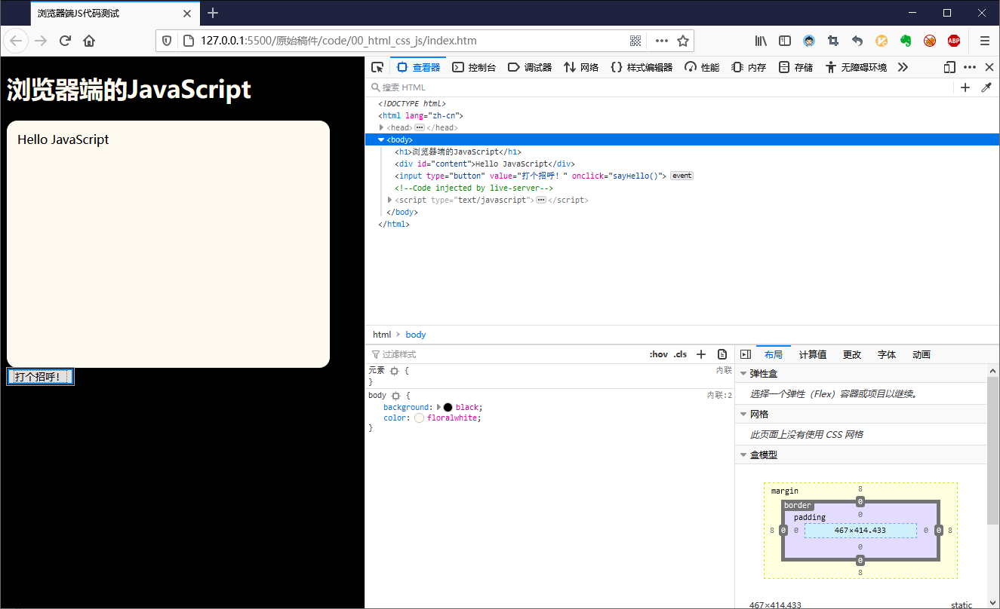
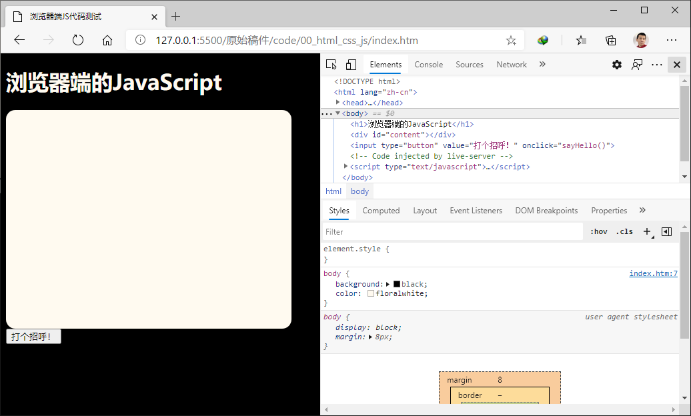
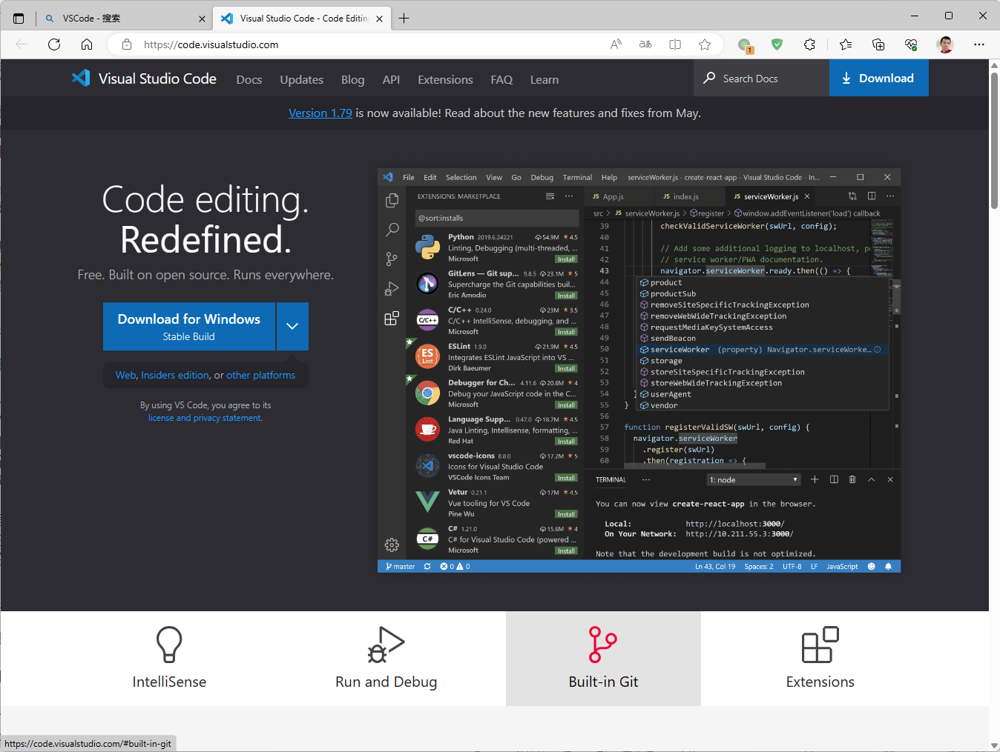
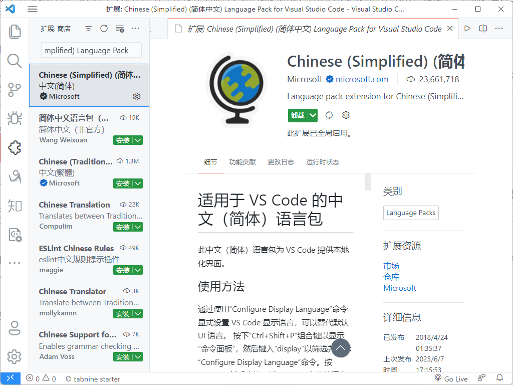
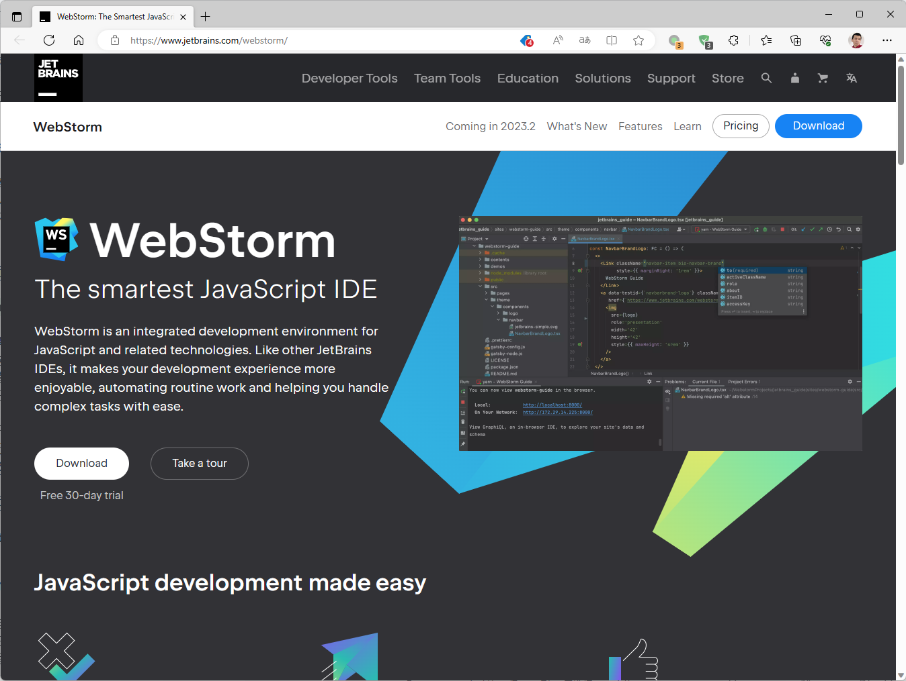
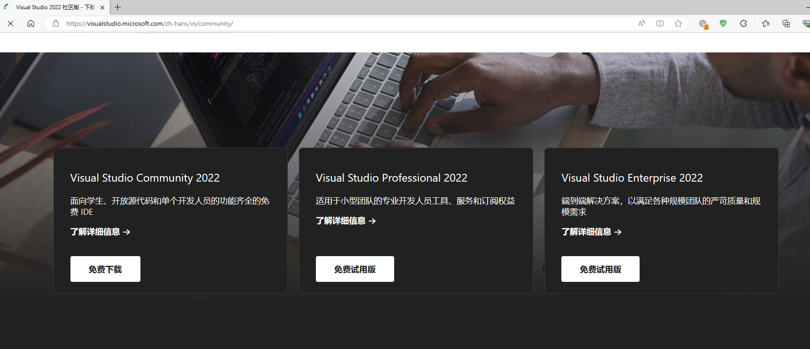
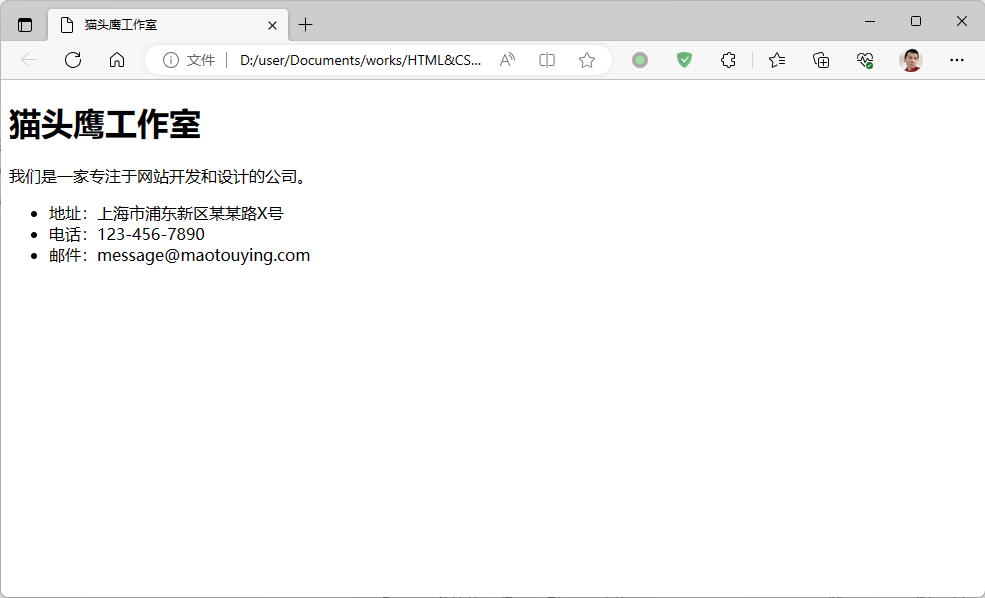

# 第1章 网页设计初体验

正如前言中所说的，这本书将以项目示例的形式来进行网页设计的教学，目的是让读者在具体实践中掌握设计一个网页所需要的基础知识以及相关的技术与工具，并期待读者能从这种教学方法中获得“在学中做，在做中学”的可持续学习能力。为了循序渐进地实现这些目标，本书的第1章将会从一个用于介绍新创企业基本信息的“线上名片”项目示例开始切入，为读者演示设计网页所需要执行的基本步骤，并介绍执行这些操作步骤所需的基本技术。总而言之，在阅读完本章之后，我们希望读者能够：

- 了解在网页设计工作中需要用到的基本技术；
- 构建好进行网页设计工作所需要的开发环境；
- 掌握进行网页设计工作所需要执行的基本步骤；

## 1.1 构建项目开发环境

本着“工欲善其事必先利其器”的指导思想，在进入具体的项目演示之前，我们需要与读者一起先将用于进行这些项目的开发环境搭建起来。就网页设计类的项目来说，其开发环境主要由网页浏览器和代码编辑工具两个部分组成，前者是开发者们用于调试网页、确认设计效果的必要工具，而后者则是设计网页时所要使用的生产力工具。如果没有配置好这两件工具，开发者们可能就会陷入到事倍功半、工作效率低下的困境中，因此接下来就闲话少说，让我们从最简单的网页浏览器开始着手吧。

### 1.1.1 安装网页浏览器

正如之前所说，网页浏览器是开发者们用来调试网页，并确认其设计效果的必要工具，因此选择一款能根据最新的技术标准对网页进行准确渲染的浏览器是非常重要的。这里所谓的“最新技术标准”指的是HTML、CSS和JavaScript这三门语言目前所采用的标准版本，由于这三者都是开发者们在网络设计工作中必然会用到的计算机语言，因此我们认为有必要在具体介绍网页浏览器的安装与启动其调试工具的方法之前，先让读者初步了解一下这三门语言各自的作用，并约定好这本书中所有项目要采用的标准版本。

首先要介绍的是**HTML**（即Hyper Text Markup Language，通常被译为“超文本标记语言”），它是一门用于描述网页的内容及其文档结构的标记语言，因此网页也通常被称作HTML文档。该标记语言的主要作用是网页文档描述成一个树状的数据结构，以便于网页浏览器可以将其解析成可被JavaScript、VBScript等网页脚本语言识别的对象模型，这样人们就可以用编写代码的方式来对网页进行操作了。在这本书中，所有项目中都将按照HTML5的标准来定义网页的内容结构。该标准赋予了HTML在面对富媒体、富应用以及富内容时强大的描述能力，这将有助于我们设计出信息量更为丰富的网页。

接下来是**CSS**（即Cascading Style Sheets，通常被译为“层叠样式表”），它是一门用于定义网页外观样式的计算机语言。人们可以使用这门语言对网页中出现的图片、文本、按钮等元素进行像素级别的精确控制。在这本书中，所有项目都将按照CSS3这一最新标准来定义网页的外观样式。该标准新增了圆角效果、渐变效果、图形化边界、文字阴影、透明度设置、多背景图设置、可定制字体、媒体查询、多列布局以及弹性盒模型布局等诸多更为丰富的新样式特性，这将有助于我们设计出更为丰富多彩的网页。

最后，**JavaScript**是一门可内嵌在网页之中，由网页浏览器解释执行的脚本编程语言，它的主要职责为网页提供交互功能，使其能响应用户的操作，例如对用户输入的信息进行相应的处理并给出反馈信息。在这本书中，所有项目将按照目前主流的ECMAScript6（简称 ES6）标准来定义网页的交互功能。该标准为JavaScript新增了许多过去需要借助jQuery这样的第三方库才能使用到的功能，这将有助于我们设计出具有更多交互能力的网页。

根据目前市场上各种浏览器对上述三门计算机语言的支持情况，开发者们通常都会选择将Google Chrome或Mozilla Firefox设置为自己的常用网页浏览器，因为它们不仅装备了对HTML5、CSS3和ES6提供了良好支持的网页解析引擎，而且都自带了功能非常齐全的网页调试环境。例如，对于Google Chrome浏览器，读者只需通过搜索引擎找到它的官方网站，然后在根据自己所在的操作系统平台来下载并安装它之后，我们就可以打开该浏览器并通过在其主菜单中依次单击「更多工具」→「开发者工具」菜单项来打开网页的调试环境了，具体如图1-1中所示。


**图1-1**：Google Chrome的开发者工具

另外，Mozilla Firefox也是一款对开发者非常友好的网页浏览器，它在Windows、macOS以及各种Linux发行版上也都有相应的版本，读者也只需要根据自身所在的操作系统平台到Mozilla Firefox的官方网站上去下载并安装它即可。在安装完成之后，我们同样也可以通过在该浏览器的主菜单中依次单击「工具」→「Web开发者」→「查看器」菜单项来打开其网页调试环境了，如图1-2中所示。



**图1-2**：Mozilla Firefox的开发者工具

当然，如果读者打算在Windows或macOS系统中使用它们自带的网页浏览器，也是可以找到类似的工具的。例如在Windows10/11系统中,最近用于取代Internet Explorer的Microsoft Edge是一款基于Chromium开源项目来开发的网页浏览器，它的使用方式与Google Chrome浏览器是大同小异的，读者也只需要在它的主菜单中依次单击「更多工具」→「开发人员工具」菜单项就可以打开其网页调试环境了，如图1-3中所示。



**图1-3**：Microsoft Edge的开发人员工具

关于在如何在浏览器中使用这些浏览器的网页调试环境，本书将会在后续的项目演示中做具体介绍，在这里，读者暂时只需知道如何搭建并启动自己将来需要使用的这个调试环境即可。

### 1.1.2 配置项目管理工具

虽然从纯理论的角度上来说，如果想开展网页设计类项目的开发工作，人们通常只需要使用与Windows系统中“记事本”相似的纯文本编辑器就够了。但在实际的生产实践中，人们为了在工作过程中获得更好的编码体验，并能方便地使用各种强大的调试工具和源码管理工具，通常还是会选择使用一款专用的管理工具来完成项目的开发工作，下面来介绍一下配置项目管理工具的两种常见方案。

#### 代码编辑器方案

在这本书中，笔者会更倾向于选择用Visual Studio Code代码编辑器（以下简称VSCode编辑器）来管理所有的项目，这是一款微软公司于2015年推出的现代化代码编辑器。下面就让我们来简单介绍一下这款编辑器的安装方法，以及如何将其打造成一款用于可开发 Vue.js 项目的开发环境吧。首先，这款编辑器的安装步骤非常简单，读者可以过搜索引擎找到它的官方网站，其官方下载页面如图1-4中所示。



**图1-4**：VSCode的官方下载页面

由于这款编辑器在Windows、macOS以及各种Linux发行版上均可使用（这也是本书选择它作为主编辑器的原因之一），所以读者接下来需要根据自己所在的操作系统来下载相应的安装包。待下载完成之后，我们就可以打开安装包来启动它的图形化安装向导了。在安装的开始阶段，安装向导会要求用户设置一些选项，例如选择程序的安装目录，是否添加相应的环境变量（如果读者想从命令行终端中启动 VSCode 编辑器，就需要激活这个选项）等，大多数时候只需采用默认选项，直接一路点击「Next」就可以完成安装了。接下来的任务就是要将其打造成一款可用于开展网页设计工作的项目工具。

VSCode编辑器的最强大之处在于它有一个非常完善的插件生态系统，我们可以通过安装插件的方式将其打造成面向不同计算机语言与开发框架的集成开发环境。在VSCode编辑器中安装插件的方式非常简单，只需要打开该编辑器的主界面，然后在其左侧纵向排列的图标按钮中找到「扩展」按钮并单击它，或直接在键盘上敲击快捷键「Ctrl + Shift + X」，就会看到如图1-5所示的插件安装界面：



**图1-5**：VSCode的插件安装界面

根据网页设计项目的工作需要，本书在这里会推荐读者安装以下插件。

- **HTML Boilerplate**：该插件用于在编写HTML代码时执行一些常见代码片段的自动生成。
- **HTML CSS Support**：该插件用于在编写CSS代码时执行自动补全功能。
- **JavaScript Snippet Pack**：该插件用于在编写JavaScript代码时执行自动补全功能。
- **JavaScript (ES6) Code Snippet**：该插件用于在编写符合ES6标准的代码时执行自动补全功能。
- **ESlint**：该插件用于自动检测JavaScript代码中存在的语法问题与格式问题。
- **Path Intellisense**：该插件用于在编写文件路径时执行自动补全功能。
- **View In Browser**：该插件可用于快速启动系统默认的网页浏览器，以便即时查看当前正在编写的HTML文档。
- **Live Server**：该插件可用于在当前计算机上快速构建一个简单的网页服务器，并自动将当前项目部署到该服务器上。
- **Chinese (Simplified) Language Pack**：简体中文语言包，用于将VSCode编辑器的界面变成中文。
- **vscode-icons**：该插件用于为不同类型的文件加上不同的图标，以方便文件管理。
- **GitLens**：该插件用于查看git对项目源码的提交记录。[^1]

需要特别强调的是，VSCode编辑器的插件浩若繁星，读者也可以根据自己的喜好来安装其他功能类似的插件，只要这些插件后面的项目实践需求即可。除此之外，Atom与Submit Text这两款代码编辑器也有着类似的插件生态系统和使用方式，如果读者喜欢的话，也可以选择基于它们来打造属于自己的项目开发环境。

#### 集成开发环境方案

如果读者更习惯使用传统的集成开发环境（英文缩写为IDE），JetBrains公司旗下的WebStorm无疑也是一个不错的选择，它在Windows、macOS以及各种Linux发行版上均可做到所有的功能都是开箱即用，无需进行多余的配置，已经被广大的开发者誉为是“最智能的JavaScript集成开发环境”。WebStorm的安装方法非常简单，我们在浏览器中打开它的官方下载页面之后，就会看到如图1-6所示的内容。



**图1-6**：WebStorm的官方下载页面

同样地，大家在这里需要根据自己所在的操作系统来下载相应的安装包，待下载完成之后就可以打开安装包来启动它的图形化安装向导了。在安装的开始阶段，安装向导会要求用户设置一些选项，例如选择程序的安装目录，是否添加相应的环境变量、关联的文件类型等，大多数时候只需采用默认选项，直接一路点击「Next」就可以完成安装了。当然了，令人遗憾的是，WebStorm并非是一款免费的软件，考虑到业界面临的当前形势，笔者在这里还是会强烈建议大家尽量选择免费的开源软件。

当然了，类似的集成开发环境还有微软公司旗下的Visual Studio，它的Community版倒是一款完全免费的IDE软件。如果读者确定自己只在Windows系统下进行项目开发，安装Visual Studio Community也是一个很好的选择，至少用它来开发这本书中涉及到的所有项目应该肯定是够用的[^2]，它的官方下载页面如图1-7所示。



**图1-7**：Visual Studio的官方下载页面

### 1.1.3 建立源码管理机制

在配置好网页浏览器与代码编辑工具之后，接下来我们要来完成搭建项目开发环境的最后一步 — 构建源码管理机制。在本书中，我们会将所有项目的源码存放在一个名为`Examples`的目录中（读者自行可以在计算机中任意自己喜欢的位置上创建这一目录），并使用git版本控制工具来进行源码管理，使用git管理项目源码的操作非常简单，具体步骤如下。

1. 先使用Powershell或Bash Shell这类命令行终端环境中打开`Examples`目录，并使用`git init`命令将其初始化为一个本地源码仓库。

2. 接下来就可以在`Examples`目录下创建项目了，例如，读者在这里可以先使用`mkdir 00_BusinessCard`命令为我们在下一节中即将要开始的第一个示例创建一个项目目录。

3. 然后使用VSCode编辑器打开这个刚刚创建的`00_BusinessCard`目录，并在该目录下创建一个名为`index.htm`的空文件。

4. 最后读者只需要回到之前的命令行终端环境中，并在`Examples`目录中执行以下命令即可完成项目源码的第一次版本提交。

   ```bash
   git add .
   git commit -m "项目1：线上名片"
   ```

当然，使用git进行源码管理的操作远不止这些，如果读者对该版本控制工具不熟悉，建议可先通过查看git的官方文档，或者阅读本书附录A中的内容来初步了解git的安装方法与基本使用技巧。当然了，读者也可以选择使用SVN等其他版本控制工具来进行项目源码的管理工作，使用这些工具管理源码的方式与我们在这里演示的步骤在本质上是一样的。

## 1.2 基本网页设计

在完成了构建项目开发环境的任务之后，我们现在可以正式开展关于网页设计的项目任务了。在本章接下来的两个项目示例中，读者将会在具体的实践过程中体验到进行网页设计的基本步骤，并开始学习HTML与CSS的基础应用方法。

### 1.2.1 线上名片项目

在一个企业创立之初，百废待兴，创业者要做的事也是千头万绪不知从何开始，他们在这一时期虽有宣传的急迫需求，但通常既无时间也无资金来创建一个完整且专业的主页型网站来展示自己的企业，在这种情况下，先花十几分钟设计一个只包含简单信息的网页，然后将它作为企业的线上名片发布在互联网上也不失为是一种权宜之计。况且，这样做也可以为将来正式的主页预备服务器、URL等资源。下面，我们就以为“猫头鹰工作室”这家新创公司创建线上名片的项目为例来演示一下设计网页要执行的基本步骤。

#### 第1步：描述网页内容

作为网页设计工作的第一步，我们首先需要使用HTML将网页的内容及其文档结构描述出来，为此读者需要执行如下步骤。

1. 使用VSCode编辑器打开我们之前在本章的1.1.3节中创建的`00_BusinessCard`目录。

2. 在该目录下找到之前创建的，名为`index.htm`的空文件，并在其中输入如下代码。

    ```HTML
    <!DOCTYPE html>
    <html lang="zh-cn">
        <head>
            <meta charset="UTF-8">
            <title>猫头鹰工作室</title>
        </head>
        <body>
            <div id="card">
                <h1>猫头鹰工作室</h1>
                <p>我们是一家专注于网站开发和设计的公司。</p>
                <ul>
                    <li>地址：上海市浦东新区某某路X号</li>
                    <li>电话：123-456-7890</li>
                    <li>邮件：message@maotouying.com</li>
                </ul>
            </div>
        </body>
    </html>
    ```

3. 在保存上述代码之后，使用网页浏览器打开`index.htm`文件查看当前网页设计的结果，其外观在Google Chrome浏览器中的效果如图1-8所示。

    

    **图1-8**：网页的内容及其文档结构

正如读者所见，在使用HTML的过程中，开发者们需要用一系列相互包裹的、用尖括号表示的HTML标记来描述网页的内容及其文档结构，下面来具体介绍一下该网页中用到的HTML标记及其作用。

- **`<html>`标记**：该标记是用于定义网页文档的总标记。换而言之，所有网页的定义代码都必须从一个`<html>`开始，并以一个`</html>`标记结束，其他所有的HTML标记都必须被放在这两个标记之间。

- **`<head>`标记**：该标记是用于定义网页头部信息的标记，网页中与其头部信息相关的定义代码都必须从一个`<head>`开始，并以一个`</head>`标记结束，其他用于描述具体头信息的HTML标记都必须被放在这两个标记之间。在网页文档中，头部信息中主要包含了文档的作者、关键词、字符集等元数据。虽然这些元数据通常不会在网页中直接显示，但由于它们可被搜索引擎、浏览器读取并利用，所以开发者们经常会通过定义元数据的方式来提高网页的可访问性、可读性以及可发现性。

- **`<meta>`标记**：该标记用于定义网页的元数据，例如在上面的代码中，我们用该标签将网页所使用的字符集定义为`UTF-8`。

- **`<title>`标记**：该标记用于定义网页文档的标题，该信息通常会显示在浏览器的标题栏中（参考图1-8中窗口顶部的标题栏）。

- **`<body>`标记**：该标记是用于定义网页主体内容的标记，网页中所有用于定义可显示内容的代码都必须从一个`<body>`开始，并以一个`</body>`标记结束，其他用于表示标题、段落、表格、图片等内容信息的HTML标记都必须被放在这两个标记之间。

- **`<div>`标记**：

- **`<p>`标记**：

- **`<ul>`标记**：

- **`<li>`标记**：

#### 第2步：设置外观样式

接下来，我们需要为网页设置一些外观样式，可以在其中添加一个`<style>`标记，并在标记中添加如下代码：

```CSS
```

接下来，如果我们在 Web 浏览器中打开保存了这段 HTML 代码的文档，就会看到如图 1-2 所示的外观效果：


**图1-9**：CSS 所定义的外观效果

当然，相信有 CSS 使用经验的读者一定知道，将上述 CSS 代码保存为一个单独的`.css`文件，然后在 HTML 代码中使用`<link>`标记来引入它是一个更有利于项目维护的实践方案。我们在这里既然假设读者已经拥有了 HTML 与 CSS 的基本使用经验，就不再纠结于这些细节了。

例如，如果我们想在之前的 HTML 文档中新增一个按钮元素，并且在用户按下该按钮之后，将以后带有“Hello JavaScript”字样的信息显示在`id`值为`content`的`<div>`元素中，就可以这样做：

```HTML
<!DOCTYPE html>
<html lang="zh-cn">
    <head>
        <meta charset="UTF-8">
        <title>浏览器端JS代码测试</title>
        <style>
            body {
                color: floralwhite;
                background: black;
            }

            #content {
                width: 400px;
                height: 300px;
                border-radius: 14px;
                padding: 14px;
                color: black;
                background: floralwhite;
            }
        </style>
        <script>
            function sayHello() {
                const div = document.querySelector('#content');
                div.textContent = 'Hello JavaScript';
            }
        </script>
    </head>
    <body>
        <h1>浏览器端的JavaScript</h1>
        <div id="content"></div>
        <input type="button" value="打个招呼！" onclick="sayHello()">
    </body>
</html>
```

然后，如果我们在 Web 浏览器中打开保存了这段 HTML 代码的文档，并单击带有“打个招呼！”字样的按钮，就会看到如图 1-3 所示的效果：


**图 1-3**：JavaScript 所定义的功能效果

同样地，相信有 JavaScript 使用经验的读者也一定知道，将上述文件中的 JavaScript 代码保存为一个单独的`.js`文件，然后在 HTML 代码中使用`<script>`标记的`src`属性来引入它是一个更有利于项目维护的实践方案。我们在这里也同样不再纠结于这些细节了。

### 1.2.2 通信录项目

## 1.3 本章练习

<!-- 以下为待整理的资料：

### 1.1.2 客户机/服务器架构

从编程方法上来说，无论我们将来基于 Vue.js 框架构建的是 Android/iOS 应用，还是微信/支付宝小程序，亦或是纯 Web 应用程序，它们在理论上都属于客户机/服务器（即 Client/Server，简称 C/S）架构的应用程序[^2]。在这种架构之下，应用程序在部署方式上有了一个全新的选择。开发者们可以将应用程序中需要保障数据安全或者进行高速运算的那一部分部署在服务器上，以便享用服务器的高性能配置以及能就近维护的便利。然后根据客户使用的设备或 Web 浏览器来开发相应的软件，并让它来执行应用程序中需要与用户交互的那一部分任务。这样做既降低了应用程序部署与维护的成本，也在很大程度上减少了应用程序对用户那一侧的软硬件依赖，同时明确了项目开发中的任务分工。

所以我们作为开发者，首先要做就是分清楚应用程序的客户机部分与服务器部分在 C/S 架构下各自所承担的任务分工。虽然在手机、手表上都搭载了多核处理器的今天，各类型计算设备的性能事实上已经日渐趋同，客户机与服务器之间的界线有时候也并非是绝对的，但从项目开发与维护的角度来说，做某种程度上的分工安排还是非常有必要的。以我个人的经验，C/S 架构之下的任务分工通常是这样的：

- 客户机部分在 C/S 架构下所承担的工作主要是与客户进行交互，其角色类似于银行的前台接待员，所以在术语上往往被称之为应用程序的“客户端”或“前端”。在通常情况下，应用程序的前端将负责渲染应用程序的用户操作界面、处理用户的操作、向服务器发送请求数据并接收来自服务器的响应数据、维持应用程序的运行状态，以求提供良好的用户体验。总而言之，这部分的开发与维护还将在很大程度上依赖于用户所在的软硬件环境。

- 服务器部分在 C/S 架构下所承担的工作主要是数据的处理和维护，其角色类似银行金库的管理人员，所以在术语上往往被称之为应用程序的“服务端”或“后端”。在通常情况下，应用程序的后端将为用户提供只有大型计算机才具备的运算能力以及安全可靠的数据库服务，它会负责存储并处理来自应用程序客户端的请求数据，然后把响应数据返回给客户端，一般用于处理较为复杂的业务逻辑，包括执行与天体物理相关的运算任务、存储海量数据等。这部分的开发和维护通常可以不依赖于用户所在的软硬件环境。

当然，所有的事情都是一体两面的，C/S 架构作为一种建构应用程序的解决方案，除了享有上述优势的同时也是存在着一些劣势的。首先，由于服务端与客户端是一对多的关系，这意味着服务端可能会需要同时处理来自成千上万个客户端的请求，这对服务器的负载能力提出了较高的要求，因此维持服务端的稳定性将会成为项目维护阶段的一大难题。其次，采用这种架构的应用程序在运行时也会严重依赖于用户所在的网络环境，一旦网络中的某个节点出了问题，例如发生防火墙屏蔽或域名劫持，整个程序就会立即陷入无法运行的尴尬境地。所以，我们开发者在使用该架构来构建应用程序时必须要想好应对这些劣势的预先安排，例如制定服务器的负载策略、设置备用服务器或备用域名等。

### 1.1.2 HTML、CSS 与 JavaScript

HTML、CSS 与 JavaScript 这三项技术是使用 Vue.js 框架进行开发的基础所在，所以它们的基本使用方法也是阅读这本书的读者必须要具备的基础知识。虽然如前言中所说的，这本书将假设读者已经掌握了这些基本技能，但对于 HTML、CSS 与 JavaScript 各自在接下来的项目中所扮演的角色，

-->

<!-- 以下为注释区 -->

[^1]: 本书将会在附录A中具体介绍git这款工具的安装与使用方法。
[^2]: 该集成开发环境的最新版为2022版。
